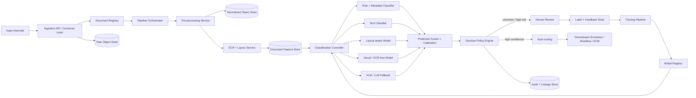
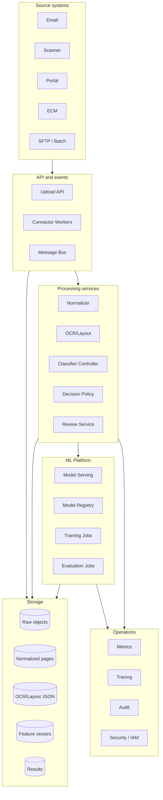

# 01 — Architecture

## 1. Scope

This design covers document classification in an enterprise Intelligent Document Processing system. The system classifies both single documents and multi-document packets. It supports scanned documents, native PDFs, Office files, image files, email bodies, and attachments.

Classification means more than assigning a top-level document type. A modern system should classify at several levels:

| Level | Question | Example |
|---|---|---|
| File level | What kind of input file is this? | PDF packet, image, DOCX, ZIP, EML. |
| Page level | What is this page? | Invoice page, bank statement page, attachment separator, blank page. |
| Segment level | Which pages belong together? | Pages 1–2 = invoice, pages 3–5 = contract. |
| Document level | What is this complete document? | Supplier invoice, purchase order, claim form. |
| Business routing level | What workflow should handle it? | AP automation, HR onboarding, legal review, compliance queue. |
| Risk level | Can it be auto-processed? | Auto-route, human-review, reject, quarantine. |

## 2. High-level architecture

## 3. Logical component groups

### 3.1 Input and ingestion

This layer accepts documents from business systems and ensures that every file becomes a traceable, immutable processing unit.

Typical sources:

- Scanner / MFP output folder
- Email inbox or EML files
- SFTP batch folder
- Web portal upload
- ECM / content repository
- Case management system
- API-based document submission
- Cloud storage bucket events
- RPA bots or legacy batch jobs

Key design choices:

- Assign a globally unique `package_id` as early as possible.
- Store the raw file before any processing.
- Compute cryptographic hash for deduplication and audit.
- Perform malware scanning and file validation before parsing.
- Separate ingestion metadata from document content.

### 3.2 Document registry

The registry is the system of record for processing state. It should not store the full document binary. It stores metadata, object references, state, lineage, and processing events.

Responsibilities:

- Track status: `RECEIVED`, `NORMALIZED`, `OCR_DONE`, `CLASSIFIED`, `REVIEW_REQUIRED`, `ROUTED`, `FAILED`.
- Track source and business context.
- Track tenant, classification policy, retention class, and legal hold.
- Track references to raw, normalized, OCR, feature, and result objects.
- Track version of every model and rule pack used.

### 3.3 Pre-processing and normalization

This stage turns many file formats into a canonical page representation.

Tasks:

- Validate MIME type and file extension.
- Check file size and page count limits.
- Remove unsupported encryption if allowed; otherwise reject to manual queue.
- Split ZIP / email containers into child packages.
- Convert Office files to PDF or page images.
- Render PDFs to page images.
- Detect blank pages, separator pages, skew, rotation, low DPI, bad contrast.
- Normalize page orientation.
- Produce image thumbnails for review UI.

Output:

- Page image references.
- Page metadata.
- Quality metrics.
- Warnings and recoverable errors.

### 3.4 OCR and layout analysis

Even if the final model is visual or OCR-free, OCR and layout are still valuable for audit, search, explainability, and routing.

OCR/layout output should include:

- Text tokens.
- Bounding boxes.
- Confidence per token / line / block.
- Reading order.
- Detected tables.
- Key-value-like regions.
- Headers, footers, stamps, signatures, checkboxes, barcodes when available.
- Language and script detection.

Design rule: **never throw away spatial information**. Store text with geometry.

### 3.5 Feature and representation layer

This layer creates reusable representations for downstream models:

| Representation | Used by |
|---|---|
| Raw page image | visual classifiers, OCR-free models, VLM fallback, review UI |
| OCR text | text classifier, rules, search, explanations |
| OCR tokens + boxes | layout-aware transformer, evidence extraction |
| Layout blocks | packet splitting, rule matching, explanation |
| Page embeddings | duplicate detection, nearest-neighbor search, active learning |
| Document embeddings | routing, class discovery, OOD detection |
| Source metadata | rules, business policy, audit |

### 3.6 Classification controller

The controller coordinates classification strategies. It should not itself be a model. It invokes candidate classifiers, collects their outputs, and sends them to fusion/calibration.

Recommended candidate classifiers:

1. **Rule / metadata classifier** — fast and deterministic.
2. **Text classifier** — strong when OCR text is clean and class semantics are textual.
3. **Layout-aware classifier** — strong for forms, statements, invoices, applications, and structured business documents.
4. **Visual / OCR-free classifier** — useful when visual style matters or OCR is poor.
5. **VLM / LLM fallback classifier** — useful for rare classes, ambiguous samples, and explanation, but should be risk-controlled.
6. **Known-template matcher** — useful for stable forms and government/finance documents.
7. **Nearest-neighbor semantic matcher** — useful for class discovery and active learning.

### 3.7 Prediction fusion and calibration

This stage turns multiple candidate predictions into calibrated probabilities and interpretable uncertainty.

Inputs:

- Candidate labels.
- Scores from each model.
- Model reliability by class.
- Page/document quality metrics.
- Prior probabilities by source/channel.
- Business policy.

Outputs:

- Calibrated class probability.
- Margin between top classes.
- Uncertainty and OOD indicators.
- Evidence list.
- Recommended action.

### 3.8 Decision policy engine

The policy engine decides what the business should do with the prediction.

Example decisions:

| Condition | Action |
|---|---|
| High confidence, low risk | Auto-route. |
| Medium confidence | Human review. |
| High-confidence but sensitive class | Human review or dual control. |
| Unknown / OOD | Novelty queue. |
| Bad quality scan | Rescan request or quality review. |
| Malware / unsupported encrypted file | Quarantine. |
| Conflicting model outputs | Review with model disagreement explanation. |

### 3.9 Human review

Human review is not an afterthought. It is the control surface for reliability.

Review UI requirements:

- Show page thumbnails and full page image.
- Show OCR text and layout overlays.
- Show top predicted classes and confidence.
- Show evidence: matching keywords, visual regions, known template, similar examples.
- Allow class correction, split/merge correction, page reorder/rotation correction.
- Capture reviewer identity, time, reason, and comments.
- Support second review for high-risk classes.

### 3.10 Model training and evaluation

Training is fed by curated human labels, historical labels, synthetic augmentation, and selected production examples.

The model lifecycle should include:

- Dataset versioning.
- Taxonomy versioning.
- Train/validation/test split by source and time.
- Out-of-distribution test set.
- Class imbalance handling.
- Calibration evaluation.
- Bias and error analysis by source, language, quality, scanner, and template.
- Shadow deployment before promotion.

### 3.11 Downstream routing

Classification should hand off to specialized processing:

| Classification result | Typical downstream target |
|---|---|
| Invoice | AP extraction and approval workflow |
| Contract | Contract metadata extraction and legal repository |
| KYC ID | Identity verification workflow |
| Bank statement | Financial extraction processor |
| Claim form | Claims case system |
| HR document | HR onboarding workflow |
| Unknown | Manual triage |

## 4. Physical architecture layers

## 5. Component relationship rules

The cleanest architecture keeps these concerns separate:

- **Document registry** owns lifecycle state.
- **Object storage** owns binaries and large JSON artifacts.
- **Feature store / vector store** owns embeddings and feature snapshots.
- **Model serving** owns inference only.
- **Policy engine** owns business actions.
- **Human review** owns corrections and adjudication.
- **Training pipeline** owns dataset creation and model promotion.
- **Audit store** owns non-repudiable event history.

Avoid these anti-patterns:

- A classifier that directly writes into business systems without policy checks.
- OCR output stored only as text with no bounding boxes.
- Reusing production data for training without versioning and consent/retention checks.
- A single confidence threshold for all document classes.
- LLM-only classification without deterministic schema, confidence controls, and review fallback.
- Human corrections stored only in UI tables and not turned into training labels.

## 6. Reference technology options

| Capability | Open/self-hosted option | AWS | Azure | GCP |
|---|---|---|---|---|
| Object storage | MinIO | S3 | Blob Storage | Cloud Storage |
| Events | Kafka / Redpanda / NATS | EventBridge / SQS / SNS | Event Grid / Service Bus | Pub/Sub / Eventarc |
| OCR/layout | Tesseract, PaddleOCR, docTR, Surya-style parsers, custom OCR | Textract | Document Intelligence | Document AI |
| Text classifier | scikit-learn, fastText, BERT, ModernBERT | Comprehend Custom Classification, Bedrock | Azure ML, AI Language, Document Intelligence classifier | Document AI classifier, Vertex AI |
| Layout-aware classifier | LayoutLMv3, LiLT, DocFormer, custom spatial transformers | SageMaker | Azure ML | Vertex AI |
| OCR-free classifier | Donut, Nougat-like, custom ViT encoder-decoder | SageMaker / Bedrock models | Azure ML / Foundry | Vertex AI |
| VLM fallback | Qwen-VL, InternVL, Llama vision variants, GPT-family APIs where allowed | Bedrock | Azure OpenAI / Foundry | Gemini / Vertex AI |
| Review UI | Custom React app, Label Studio extension | A2I-style custom workflow | Custom app / Power Apps | Human review app / custom |
| Model registry | MLflow | SageMaker Model Registry | Azure ML Registry | Vertex Model Registry |
| Observability | OpenTelemetry, Prometheus, Grafana | CloudWatch / X-Ray | Monitor / App Insights | Cloud Monitoring / Trace |

## 7. Recommended baseline architecture

For a real enterprise system in 2026, the best baseline is:

1. **OCR/layout-first pipeline** for traceability and interoperability.
2. **Layout-aware transformer** as the primary classifier for structured and visually rich documents.
3. **Text classifier** as a cheap parallel signal.
4. **Rule/template layer** for deterministic business cases.
5. **Visual or OCR-free model** for poor OCR, highly visual documents, and handwriting-heavy cases.
6. **VLM/LLM fallback** for rare classes, zero-shot exploration, and reviewer explanations, not as the only production gate.
7. **Calibrated ensemble** with class-specific thresholds.
8. **Human review loop** for uncertain, novel, or high-risk decisions.

## 8. Non-functional requirements

| Requirement | Target |
|---|---|
| Throughput | Scale horizontally by queue depth and page count. |
| Latency | Seconds for small files; async for large packets. |
| Availability | No single point of failure in registry, object storage, queues, and model serving. |
| Audit | Every state transition and model decision must be reconstructable. |
| Security | Encryption, IAM, malware scan, tenant isolation, PII controls. |
| Explainability | Store evidence and model versions, not only a label. |
| Reprocessing | Any package can be replayed with a new pipeline/model version. |
| Cloud portability | Canonical schema independent of vendor OCR/model output. |
| Cost control | Cheap classifiers first; expensive VLM/LLM fallback only when justified. |
