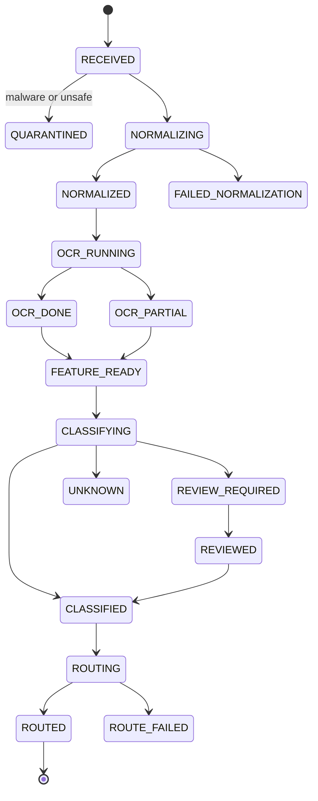
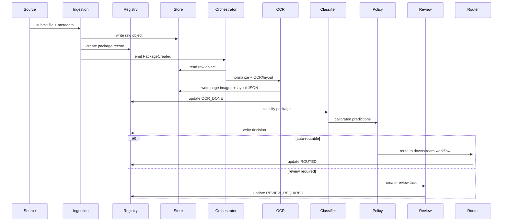

# 02 — Main Components and How They Relate

## 1. Component catalog

The system is a collection of services. Each service has a clear responsibility and exchanges canonical events and artifacts.

| Component | Main responsibility | Consumes | Produces |
|---|---|---|---|
| Ingestion API | Accept documents and source metadata | File, source metadata | `DocumentPackageCreated` event, raw object |
| Connector Workers | Pull from external systems | Email/SFTP/ECM/scanner folders | Raw packages and ingestion metadata |
| Malware / Content Safety Scanner | Prevent unsafe processing | Raw binary | safety result, quarantine decision |
| Document Registry | Track lifecycle and state | events, artifact refs | status, lineage, queryable metadata |
| Object Store | Store raw and normalized artifacts | binaries, JSON artifacts | immutable refs, versioned object paths |
| Normalizer | Convert documents into pages | raw file | normalized PDF, page images, quality metadata |
| Page Quality Analyzer | Identify scan quality problems | page images | quality scores, warnings |
| OCR/Layout Service | Extract text and spatial structure | page images/native PDF | OCR tokens, blocks, tables, layout JSON |
| Feature Builder | Build derived features | OCR/layout/images/metadata | embeddings, text chunks, layout graphs |
| Taxonomy Service | Define classes and policies | taxonomy config | class definitions, thresholds, route map |
| Classification Controller | Orchestrate classifiers | feature refs, class taxonomy | raw candidate predictions |
| Classifier Adapters | Run specific models/rules | canonical features | `PredictionCandidate` objects |
| Fusion + Calibration | Combine model outputs | candidates, reliability stats | calibrated predictions |
| Decision Policy Engine | Convert prediction into business action | calibrated prediction, policy | `ClassificationDecision` |
| Review Queue | Manage human review | decision requiring review | review task, corrected label |
| Review UI | Let users inspect and correct | document/page artifacts | adjudicated labels, comments |
| Label Store | Persist labels and reviewer feedback | review results, imports | training labels, audit trail |
| Training Pipeline | Build datasets and train models | label store, artifacts | model versions, evaluation reports |
| Model Registry | Govern model versions | training artifacts | approved/staged/deprecated models |
| Model Serving | Host inference endpoints | model versions, requests | inference responses |
| Routing Adapter | Call downstream systems | classification decision | workflow/case/ECM handoff |
| Monitoring | Detect failures and drift | logs, metrics, events | alerts, dashboards, reports |
| Audit Store | Immutable decision history | all critical events | reconstructable processing timeline |

## 2. Component boundaries

### 2.1 Ingestion API

The ingestion API should do very little synchronous work. It validates request metadata, writes the raw artifact, creates a registry record, and emits an event.

Required API behavior:

- Accept multipart file upload and metadata-only pre-signed upload workflows.
- Support idempotency keys.
- Return `package_id` immediately.
- Reject unsupported file types early.
- Record tenant, source system, business process, and requester identity.
- Support batch submissions.

Not recommended:

- Running OCR synchronously inside upload request.
- Returning final classification directly for large documents.
- Allowing downstream business systems to depend on unversioned classifier behavior.

### 2.2 Connector Workers

Connectors isolate source-system complexity.

Examples:

- Email connector reads inbox messages, extracts attachments and body-as-document.
- Scanner connector watches a folder or queue.
- SFTP connector imports scheduled batches.
- ECM connector pulls from repository folders and writes result metadata back.

Each connector maps source metadata into a normalized `source_context` block.

### 2.3 Document Registry

The registry holds the processing state machine.

Suggested states:



Registry entries should be append-only where practical. Updates can maintain the latest state, but state transitions should be preserved as events.

### 2.4 Normalizer

The normalizer creates a consistent page model.

Responsibilities:

- Convert supported inputs to rendered pages.
- Preserve page order.
- Generate page image at agreed DPI.
- Create thumbnail and preview assets.
- Detect document containers, embedded attachments, and image-only pages.
- Identify blank pages and separator sheets.
- Preserve native text when available.

Outputs:

- `NormalizedDocument` artifact.
- `Page` records.
- `PageQuality` records.
- `NormalizationCompleted` event.

### 2.5 OCR/Layout Service

The OCR/layout component is an adapter layer. It may call a cloud service, open-source OCR, or a custom model, but it always outputs canonical `OcrResult` and `LayoutBlock` structures.

Important fields:

- `token.text`
- `token.bbox`
- `token.confidence`
- `line_id`, `block_id`
- `reading_order`
- `page_rotation`
- `language`
- `table_id` / `cell_id` when detected

### 2.6 Feature Builder

The feature builder prepares model inputs and stores them for reuse.

Feature categories:

| Feature | Description | Example use |
|---|---|---|
| Full OCR text | Concatenated page/document text | text classifier, keyword rules |
| First-page text | Top N lines / first page | fast routing |
| Layout tokens | OCR tokens with normalized boxes | LayoutLM-style classifier |
| Page image | Rendered page | ViT, Donut, VLM |
| Visual thumbnail embedding | Global visual embedding | nearest neighbor / OOD |
| Text embedding | Semantic embedding | class discovery, similar examples |
| Metadata features | source, sender, filename, MIME | deterministic rules |
| Quality features | DPI, blur, skew, OCR confidence | routing and threshold policy |

### 2.7 Taxonomy Service

Document classes change over time. Do not hard-code them inside the model or rules.

The taxonomy service should define:

- Class id, display name, description.
- Parent/child hierarchy.
- Positive examples and negative examples.
- Required evidence.
- Confusable classes.
- Auto-routing threshold.
- Review threshold.
- Risk level.
- Downstream route.
- Extraction processor mapping.
- Retention and privacy flags.

Example:

```yaml
class_id: FIN.INVOICE.SUPPLIER
name: Supplier Invoice
parent: FIN.INVOICE
risk_level: medium
auto_route_threshold: 0.94
review_threshold: 0.70
requires_split_confidence: true
confusable_with:
  - FIN.CREDIT_NOTE
  - FIN.PURCHASE_ORDER
route:
  target: ap_automation
  extraction_profile: invoice_v4
privacy:
  contains_pii_likely: true
```

### 2.8 Classification Controller

The controller performs runtime strategy selection.

It decides:

- Which classifiers to run.
- Whether page-level or document-level classification is needed.
- Whether to run expensive fallback models.
- Whether to stop early because deterministic evidence is sufficient.
- How to handle low-quality pages.
- How to batch pages for GPU efficiency.

Example strategy:

1. Run cheap rules and text classifier.
2. If confidence is high and class is low-risk, skip expensive VLM.
3. If models disagree, run layout-aware model and nearest-neighbor lookup.
4. If still ambiguous or class is rare, ask VLM/LLM for a constrained JSON second opinion.
5. Fuse all predictions and apply decision policy.

### 2.9 Rule / Metadata Classifier

Rules are not old-fashioned; they are essential for production.

Good rule examples:

- Source email address is known AP mailbox and filename contains invoice number pattern.
- Barcode maps to a known form type.
- First page contains exact government form code.
- PDF metadata declares template id.
- Top-left region contains company logo + exact form title.

Bad rule examples:

- Any occurrence of word `invoice` means invoice.
- Hard-coded page number assumptions without packet splitting.
- Rules that silently override ML predictions without audit.

### 2.10 Text Classifier

A text classifier is cheap and effective when OCR quality is good.

Options:

- TF-IDF + linear model for baseline and explainability.
- Sentence/document embeddings + classifier.
- Fine-tuned BERT/ModernBERT-like model.
- Cloud custom text classifier.
- LLM prompt classifier for low-volume or exploratory tasks.

Use cases:

- Emails, contracts, reports, policies, letters.
- Native PDFs with rich text.
- Business classes defined by wording rather than visual format.

Limitations:

- Fails when OCR is poor.
- Ignores visual layout.
- May confuse documents with similar vocabulary but different form structure.

### 2.11 Layout-aware Classifier

This should usually be the primary model for visually rich business documents.

Inputs:

- OCR tokens.
- Bounding boxes.
- Page image patches or visual embeddings.
- Document/page metadata.

Good for:

- Forms.
- Invoices.
- Bank statements.
- Insurance documents.
- Tax documents.
- Application packets.
- Documents with strong layout signatures.

### 2.12 Visual / OCR-free Classifier

This classifies directly from page images or uses encoder-decoder document understanding.

Good for:

- Poor OCR.
- Handwriting-heavy documents.
- Highly visual layouts.
- Mixed-language content where OCR support is weak.
- First-pass page type detection.

Limitations:

- May be harder to explain.
- Requires GPU capacity.
- Needs careful resizing and page-image quality handling.

### 2.13 VLM / LLM Fallback

In 2026, VLMs are useful, but they should be controlled.

Use them for:

- Second opinion on ambiguous classes.
- Zero-shot triage for unknown classes.
- Reviewer explanation draft.
- Detecting novel document families.
- Building weak labels for active learning.

Do not use them blindly for:

- High-volume simple classes where cheaper models work.
- High-risk automatic decisions without calibration and review.
- Processing sensitive data unless deployment, privacy, and retention are approved.

VLM calls should be schema-constrained:

```json
{
  "document_type": "one_of_allowed_class_ids",
  "confidence_reasoning": "brief evidence only",
  "evidence": [
    {"page": 1, "region": "top_header", "text": "..."}
  ],
  "uncertainty": "low|medium|high",
  "needs_human_review": true
}
```

### 2.14 Fusion + Calibration Service

Fusion should not simply average scores. It should consider per-model reliability and class-specific performance.

Fusion inputs:

- Raw model probabilities.
- Rule results.
- Template match scores.
- OCR quality.
- Page quality.
- Source prior.
- Historical model reliability by class.
- Top-class margin.
- Disagreement score.

Calibration techniques:

- Temperature scaling.
- Isotonic regression.
- Platt scaling.
- Conformal prediction sets.
- Per-class threshold optimization.

Output:

- `p_calibrated`.
- `prediction_set` for uncertain classes.
- `margin`.
- `entropy`.
- `ood_score`.
- `decision_recommendation`.

### 2.15 Decision Policy Engine

A prediction becomes a decision only after policy.

Policy dimensions:

| Dimension | Examples |
|---|---|
| Confidence | top probability, margin, prediction set size |
| Risk | legal, financial, PII, regulated, fraud-sensitive |
| Quality | poor scan, partial OCR, skewed page |
| Business source | trusted source vs open upload |
| Model agreement | agreement/disagreement between classifiers |
| Class maturity | enough labeled data vs new class |
| Drift | source/template recently changed |
| Cost | whether VLM fallback is justified |

### 2.16 Human Review Service

Review is a workflow system.

Queues:

- Low-confidence queue.
- High-risk verification queue.
- Unknown / novel document queue.
- Split/merge correction queue.
- Quality/rescan queue.
- Model disagreement queue.
- Audit sample queue for random quality control.

Review outcomes:

- Accept prediction.
- Correct class.
- Split/merge pages.
- Mark as unknown/new class candidate.
- Reject as unsupported.
- Request rescan.
- Escalate to expert reviewer.

### 2.17 Training Pipeline

The training pipeline should be deterministic and reproducible.

Stages:

1. Snapshot label store.
2. Build dataset manifest.
3. Apply eligibility rules: consent, retention, tenant, source, PII handling.
4. Split data by time/source/template to avoid leakage.
5. Train candidate models.
6. Evaluate by class, source, language, quality, scanner, and template.
7. Calibrate confidence.
8. Compare to currently deployed model.
9. Generate model card and risk report.
10. Promote to staging, shadow, canary, then production.

### 2.18 Monitoring and Observability

Monitor both software and model behavior.

Software metrics:

- Queue lag.
- Processing latency.
- Error rate.
- OCR service failures.
- Model endpoint latency.
- GPU utilization.
- Cost per page.

Model metrics:

- Class distribution drift.
- Confidence distribution drift.
- Review rate.
- Override rate.
- Precision/recall from reviewed samples.
- Unknown/OOD rate.
- Disagreement rate.
- Calibration error.

### 2.19 Audit Store

The audit store should support reconstruction.

For every decision, you should be able to answer:

- Which raw document was processed?
- Which pages were generated?
- Which OCR/layout engine and version ran?
- Which models and rule packs ran?
- What did each model predict?
- What thresholds were used?
- Why was the document auto-routed or reviewed?
- Who reviewed it, if anyone?
- What changed after review?
- Which downstream system received it?

## 3. How components relate in runtime



## 4. System interfaces

### 4.1 Public API endpoints

| Endpoint | Purpose |
|---|---|
| `POST /packages` | Submit document package. |
| `GET /packages/{id}` | Get status and metadata. |
| `GET /packages/{id}/decision` | Get classification decision. |
| `POST /packages/{id}/reprocess` | Reprocess with chosen pipeline/model version. |
| `GET /classes` | List active taxonomy. |
| `POST /reviews/{task_id}/decision` | Submit reviewer decision. |
| `GET /metrics/model-quality` | Model quality dashboard API. |

### 4.2 Internal event names

- `DocumentPackageCreated`
- `RawObjectStored`
- `SafetyScanCompleted`
- `NormalizationCompleted`
- `OcrLayoutCompleted`
- `FeatureBuildCompleted`
- `ClassificationRequested`
- `ClassificationCandidateProduced`
- `ClassificationDecisionMade`
- `ReviewTaskCreated`
- `ReviewCompleted`
- `RoutingCompleted`
- `TrainingDatasetSnapshotCreated`
- `ModelVersionPromoted`

## 5. Component ownership model

| Area | Typical owner |
|---|---|
| Ingestion connectors | Integration team |
| Registry and APIs | Platform/backend team |
| OCR/layout adapters | Document AI team |
| Model training | ML team |
| Model serving | ML platform / DevOps |
| Review UI | Product/application team |
| Taxonomy and thresholds | Business + ML + risk owners |
| Security/governance | Security, privacy, compliance |
| Routing adapters | Workflow/ECM integration team |

## 6. Core design recommendation

Start with a modular architecture even if the first version uses only one cloud provider. The most expensive mistake is allowing a provider-specific OCR or classifier response to become the internal domain model. Use adapters to translate provider responses into the canonical schema, then keep the rest of the system vendor-neutral.
