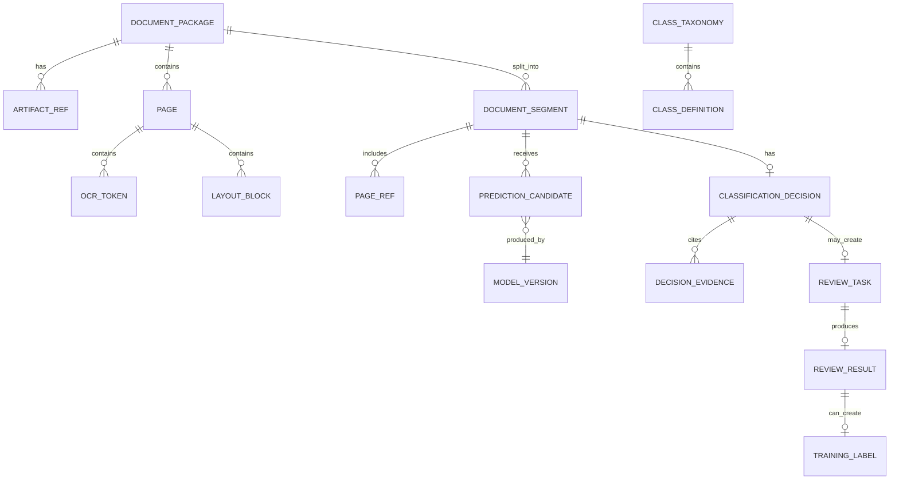

# 03 — Canonical Data Model

## 1. Data model goals

The document classification system should pass a rich, explicit data model through the pipeline. Avoid passing only file paths and labels. The data model must preserve lineage, evidence, confidence, and reviewability.

The canonical model should support:

- Multi-tenant processing.
- Multi-document packets.
- Page-level and document-level classification.
- OCR and layout geometry.
- Multiple candidate predictions.
- Calibrated final decisions.
- Human review corrections.
- Reprocessing with new model versions.
- Audit and compliance.
- Cloud-provider independence.

## 2. Core entities



## 3. Entity overview

| Entity | Meaning |
|---|---|
| `DocumentPackage` | The unit submitted to the system. May contain one or more business documents. |
| `ArtifactRef` | Pointer to raw file, normalized file, page image, OCR JSON, feature vector, model output. |
| `Page` | A canonical page record after normalization. |
| `OcrToken` | Text token with geometry and confidence. |
| `LayoutBlock` | Higher-level region: paragraph, table, title, figure, header, footer, checkbox group. |
| `DocumentSegment` | One classified document within a package, represented as page range(s). |
| `PredictionCandidate` | One model/rule output before fusion. |
| `CalibratedPrediction` | Fused and calibrated class probability output. |
| `ClassificationDecision` | Business decision after policy thresholds. |
| `ReviewTask` | Human review work item. |
| `ReviewResult` | Human adjudication result. |
| `TrainingLabel` | Versioned label used for training/evaluation. |
| `ClassTaxonomy` | Versioned class hierarchy and policy. |
| `PipelineEvent` | Immutable event for audit and orchestration. |

## 4. `DocumentPackage`

A `DocumentPackage` represents the submitted input. It does not equal one final business document because a PDF packet can contain multiple documents.

```json
{
  "package_id": "pkg_01JZ8G7Q5WJ6R9PN8H0F4K6S5T",
  "tenant_id": "tenant_acme",
  "source_context": {
    "source_type": "email_attachment",
    "source_system": "shared_mailbox_ap",
    "source_reference": "message:<abc123>/attachment:invoice.pdf",
    "received_at": "2026-06-08T08:15:11Z",
    "submitted_by": "connector:ap-mailbox",
    "business_process": "accounts_payable"
  },
  "raw_artifact": {
    "artifact_id": "art_raw_001",
    "uri": "s3://doc-classifier-prod/raw/tenant_acme/2026/06/08/pkg_.../invoice.pdf",
    "sha256": "ec6d...",
    "mime_type": "application/pdf",
    "size_bytes": 1842241
  },
  "status": "OCR_DONE",
  "priority": "normal",
  "retention_policy": "finance_7y",
  "legal_hold": false,
  "created_at": "2026-06-08T08:15:12Z",
  "updated_at": "2026-06-08T08:15:38Z"
}
```

### Required fields

| Field | Purpose |
|---|---|
| `package_id` | Stable id across all events and artifacts. |
| `tenant_id` | Tenant isolation and routing. |
| `source_context` | Business source and traceability. |
| `raw_artifact` | Immutable original file reference. |
| `status` | Current processing state. |
| `retention_policy` | Records management. |
| `created_at`, `updated_at` | Operational tracking. |

## 5. `ArtifactRef`

Large binary and JSON outputs should be stored as artifacts, not embedded in registry rows.

```json
{
  "artifact_id": "art_ocr_001",
  "package_id": "pkg_01JZ8G7Q5WJ6R9PN8H0F4K6S5T",
  "artifact_type": "ocr_layout_json",
  "uri": "s3://doc-classifier-prod/ocr/tenant_acme/2026/06/08/pkg_.../ocr.json",
  "content_type": "application/json",
  "sha256": "b919...",
  "created_by": "ocr-layout-service:v2.3.1",
  "created_at": "2026-06-08T08:15:35Z",
  "schema_version": "ocr-layout-v1.2"
}
```

Recommended artifact types:

- `raw_input`
- `normalized_pdf`
- `page_image`
- `page_thumbnail`
- `ocr_layout_json`
- `features_json`
- `embedding_vector`
- `prediction_json`
- `review_snapshot`
- `training_manifest`
- `evaluation_report`

## 6. `Page`

```json
{
  "page_id": "pg_0001",
  "package_id": "pkg_01JZ8G7Q5WJ6R9PN8H0F4K6S5T",
  "page_number": 1,
  "width_px": 2480,
  "height_px": 3508,
  "dpi": 300,
  "rotation_degrees": 0,
  "image_artifact_id": "art_page_img_0001",
  "thumbnail_artifact_id": "art_thumb_0001",
  "quality": {
    "blank_probability": 0.01,
    "blur_score": 0.08,
    "skew_degrees": 0.4,
    "darkness_score": 0.21,
    "ocr_mean_confidence": 0.962,
    "warnings": []
  },
  "native_text_available": false,
  "language_hints": ["en"],
  "created_at": "2026-06-08T08:15:25Z"
}
```

## 7. OCR and layout model

### 7.1 `OcrToken`

Use normalized coordinates from 0 to 1 where possible. Store original pixel coordinates when needed.

```json
{
  "token_id": "tok_000001",
  "page_id": "pg_0001",
  "text": "Invoice",
  "bbox": {"x0": 0.073, "y0": 0.052, "x1": 0.188, "y1": 0.084},
  "confidence": 0.991,
  "line_id": "line_001",
  "block_id": "block_title_001",
  "reading_order": 1,
  "font": {
    "size_estimate": "large",
    "bold_probability": 0.81
  }
}
```

### 7.2 `LayoutBlock`

```json
{
  "block_id": "block_title_001",
  "page_id": "pg_0001",
  "block_type": "title",
  "bbox": {"x0": 0.06, "y0": 0.04, "x1": 0.47, "y1": 0.10},
  "text": "Invoice",
  "token_ids": ["tok_000001"],
  "confidence": 0.97,
  "reading_order": 1
}
```

Recommended `block_type` values:

- `title`
- `paragraph`
- `header`
- `footer`
- `table`
- `table_cell`
- `key_value_group`
- `checkbox_group`
- `signature_region`
- `stamp`
- `barcode`
- `image`
- `separator`
- `unknown`

## 8. `DocumentSegment`

A segment is the system's hypothesis about a complete business document inside the package.

```json
{
  "segment_id": "seg_001",
  "package_id": "pkg_01JZ8G7Q5WJ6R9PN8H0F4K6S5T",
  "page_ranges": [
    {"from_page": 1, "to_page": 2}
  ],
  "split_method": "model_plus_blank_separator",
  "split_confidence": 0.94,
  "candidate_document_count": 1,
  "created_by": "segmentation-service:v1.4.0"
}
```

Important: splitting and classification are connected but not the same. A classifier might know page 3 is a contract page, but a segmenter decides whether pages 3–5 are the same contract.

## 9. Class taxonomy

### 9.1 `ClassTaxonomy`

```json
{
  "taxonomy_id": "tax_2026_06_finance_v3",
  "version": "2026.06.3",
  "status": "active",
  "created_at": "2026-06-01T00:00:00Z",
  "classes": [
    {
      "class_id": "FIN.INVOICE.SUPPLIER",
      "display_name": "Supplier Invoice",
      "parent_class_id": "FIN.INVOICE",
      "description": "Document requesting payment for supplied goods or services.",
      "risk_level": "medium",
      "routing_target": "ap_automation",
      "auto_route_threshold": 0.94,
      "review_threshold": 0.70,
      "allow_auto_route": true,
      "confusable_with": [
        "FIN.CREDIT_NOTE",
        "FIN.PURCHASE_ORDER"
      ],
      "required_evidence": [
        "supplier_name_or_tax_id",
        "invoice_number_or_invoice_date",
        "total_amount_or_line_items"
      ]
    }
  ]
}
```

### 9.2 Class hierarchy

A practical taxonomy should have hierarchy:

```text
FIN
  FIN.INVOICE
    FIN.INVOICE.SUPPLIER
    FIN.INVOICE.INTERCOMPANY
  FIN.CREDIT_NOTE
  FIN.PURCHASE_ORDER
  FIN.BANK_STATEMENT
HR
  HR.CV
  HR.CONTRACT
  HR.ID_DOCUMENT
LEGAL
  LEGAL.CONTRACT
  LEGAL.NOTICE
  LEGAL.POWER_OF_ATTORNEY
GEN
  GEN.EMAIL
  GEN.LETTER
  GEN.UNKNOWN
```

## 10. `PredictionCandidate`

A candidate prediction is one model's or rule's opinion.

```json
{
  "candidate_id": "cand_001",
  "package_id": "pkg_01JZ8G7Q5WJ6R9PN8H0F4K6S5T",
  "segment_id": "seg_001",
  "scope": "document_segment",
  "producer": {
    "component": "layout-aware-classifier",
    "model_id": "layoutlmv3-doccls",
    "model_version": "2026.05.12",
    "runtime": "triton-gpu"
  },
  "predictions": [
    {"class_id": "FIN.INVOICE.SUPPLIER", "score": 0.961},
    {"class_id": "FIN.CREDIT_NOTE", "score": 0.021},
    {"class_id": "FIN.PURCHASE_ORDER", "score": 0.011}
  ],
  "evidence": [
    {
      "type": "text_region",
      "page": 1,
      "bbox": {"x0": 0.06, "y0": 0.04, "x1": 0.47, "y1": 0.10},
      "text": "Invoice",
      "weight": 0.27
    }
  ],
  "latency_ms": 84,
  "created_at": "2026-06-08T08:15:37Z"
}
```

### Candidate score rule

Do not assume every candidate score is calibrated. Store raw scores as raw scores. Calibration is a later stage.

## 11. `CalibratedPrediction`

```json
{
  "calibration_id": "cal_001",
  "segment_id": "seg_001",
  "fusion_model_version": "fusion-v2.1.0",
  "taxonomy_version": "2026.06.3",
  "top_class_id": "FIN.INVOICE.SUPPLIER",
  "p_calibrated": 0.973,
  "top_k": [
    {"class_id": "FIN.INVOICE.SUPPLIER", "p_calibrated": 0.973},
    {"class_id": "FIN.CREDIT_NOTE", "p_calibrated": 0.018},
    {"class_id": "FIN.PURCHASE_ORDER", "p_calibrated": 0.006}
  ],
  "margin": 0.955,
  "entropy": 0.137,
  "ood_score": 0.022,
  "model_agreement": 0.91,
  "quality_penalty": 0.00,
  "prediction_set": ["FIN.INVOICE.SUPPLIER"]
}
```

## 12. `ClassificationDecision`

The final output should be this decision object.

```json
{
  "decision_id": "dec_001",
  "package_id": "pkg_01JZ8G7Q5WJ6R9PN8H0F4K6S5T",
  "segment_id": "seg_001",
  "decision_type": "auto_route",
  "class_id": "FIN.INVOICE.SUPPLIER",
  "display_name": "Supplier Invoice",
  "confidence": 0.973,
  "risk_level": "medium",
  "thresholds": {
    "auto_route_threshold": 0.94,
    "review_threshold": 0.70
  },
  "routing": {
    "target": "ap_automation",
    "extraction_profile": "invoice_v4",
    "priority": "normal"
  },
  "evidence_summary": [
    "Title region contains 'Invoice'.",
    "Detected invoice number and total amount regions.",
    "Layout matches known supplier invoice family."
  ],
  "candidate_ids": ["cand_001", "cand_002", "cand_003"],
  "policy_version": "policy-doccls-2026.06.1",
  "created_at": "2026-06-08T08:15:38Z"
}
```

Decision types:

- `auto_route`
- `review_required`
- `reject_unsupported`
- `quarantine`
- `rescan_required`
- `unknown_class`
- `duplicate_detected`
- `manual_only`

## 13. `ReviewTask`

```json
{
  "review_task_id": "rev_001",
  "package_id": "pkg_01JZ8G7Q5WJ6R9PN8H0F4K6S5T",
  "segment_id": "seg_001",
  "queue": "model_disagreement",
  "reason_codes": [
    "LOW_MARGIN",
    "CONFUSABLE_CLASSES",
    "HIGH_VALUE_TRANSACTION"
  ],
  "suggested_classes": [
    {"class_id": "FIN.INVOICE.SUPPLIER", "confidence": 0.72},
    {"class_id": "FIN.CREDIT_NOTE", "confidence": 0.21}
  ],
  "assigned_to": null,
  "priority": "high",
  "sla_due_at": "2026-06-08T12:15:38Z",
  "created_at": "2026-06-08T08:15:38Z"
}
```

## 14. `ReviewResult`

```json
{
  "review_result_id": "rr_001",
  "review_task_id": "rev_001",
  "reviewer_id": "user_123",
  "outcome": "corrected",
  "final_class_id": "FIN.CREDIT_NOTE",
  "final_page_ranges": [
    {"from_page": 1, "to_page": 1}
  ],
  "comments": "Credit note title visible in header; invoice model over-weighted amount table.",
  "create_training_label": true,
  "reviewed_at": "2026-06-08T09:01:22Z"
}
```

## 15. `TrainingLabel`

```json
{
  "label_id": "lbl_001",
  "package_id": "pkg_01JZ8G7Q5WJ6R9PN8H0F4K6S5T",
  "segment_id": "seg_001",
  "class_id": "FIN.CREDIT_NOTE",
  "taxonomy_version": "2026.06.3",
  "label_source": "human_review",
  "label_confidence": "gold",
  "reviewer_id": "user_123",
  "eligible_for_training": true,
  "exclusion_reasons": [],
  "created_at": "2026-06-08T09:01:22Z"
}
```

Label source values:

- `human_review`
- `expert_adjudication`
- `historical_system`
- `imported_ground_truth`
- `weak_label_rule`
- `synthetic`
- `llm_assisted_unverified`

Only high-quality labels should be used for final supervised training. Weak and LLM-assisted labels can be useful but should be flagged.

## 16. Pipeline events

Events should be compact but complete enough for replay and audit.

```json
{
  "event_id": "evt_001",
  "event_type": "ClassificationDecisionMade",
  "package_id": "pkg_01JZ8G7Q5WJ6R9PN8H0F4K6S5T",
  "segment_id": "seg_001",
  "occurred_at": "2026-06-08T08:15:38Z",
  "producer": "decision-policy-engine:v1.6.2",
  "correlation_id": "corr_20260608_081511_abc",
  "payload_ref": {
    "artifact_id": "art_decision_001",
    "uri": "s3://doc-classifier-prod/results/.../decision.json"
  },
  "summary": {
    "decision_type": "auto_route",
    "class_id": "FIN.INVOICE.SUPPLIER",
    "confidence": 0.973
  }
}
```

## 17. Data contracts between services

### 17.1 Classification request

```json
{
  "request_id": "cls_req_001",
  "package_id": "pkg_01JZ8G7Q5WJ6R9PN8H0F4K6S5T",
  "taxonomy_version": "2026.06.3",
  "pipeline_version": "doccls-pipeline-2026.06.1",
  "segments": [
    {
      "segment_id": "seg_001",
      "page_ids": ["pg_0001", "pg_0002"]
    }
  ],
  "artifact_refs": {
    "ocr_layout": "art_ocr_001",
    "features": "art_features_001"
  },
  "policy_context": {
    "business_process": "accounts_payable",
    "source_trust_level": "trusted_internal",
    "max_auto_route_risk": "medium"
  }
}
```

### 17.2 Classification response

```json
{
  "request_id": "cls_req_001",
  "package_id": "pkg_01JZ8G7Q5WJ6R9PN8H0F4K6S5T",
  "segment_results": [
    {
      "segment_id": "seg_001",
      "calibrated_prediction": {
        "top_class_id": "FIN.INVOICE.SUPPLIER",
        "p_calibrated": 0.973,
        "margin": 0.955,
        "ood_score": 0.022
      },
      "decision": {
        "decision_type": "auto_route",
        "routing_target": "ap_automation"
      }
    }
  ]
}
```

## 18. Data storage design

| Store | Data | Recommended pattern |
|---|---|---|
| Relational DB | Registry, statuses, review tasks, taxonomy metadata | PostgreSQL/Aurora/Cloud SQL/Azure SQL |
| Object store | Raw files, images, OCR JSON, results | S3/Blob/GCS/MinIO with immutable paths |
| Search index | OCR text, metadata, decisions | OpenSearch/Elasticsearch/Azure AI Search |
| Vector DB | page/document embeddings | pgvector, Milvus, OpenSearch vector, Pinecone, Vertex Matching Engine |
| Feature store | versioned feature snapshots | Feast or simple artifact manifests initially |
| Audit log | immutable event stream | Kafka compacted topic + object archive or append-only DB |
| Metrics store | time-series metrics | Prometheus/CloudWatch/Azure Monitor/Cloud Monitoring |

## 19. Schema versioning

Every artifact should carry:

- `schema_version`
- `producer_component`
- `producer_version`
- `created_at`
- `input_artifact_ids`
- `model_version` when ML-generated
- `taxonomy_version` when class-related
- `policy_version` when decision-related

## 20. Minimum viable data model

For MVP, do not overbuild. The minimum viable schema is:

- `DocumentPackage`
- `ArtifactRef`
- `Page`
- `OcrResult`
- `PredictionCandidate`
- `ClassificationDecision`
- `ReviewTask`
- `ReviewResult`
- `TrainingLabel`
- `PipelineEvent`

This is enough to build a production path while keeping reprocessing and audit possible.
