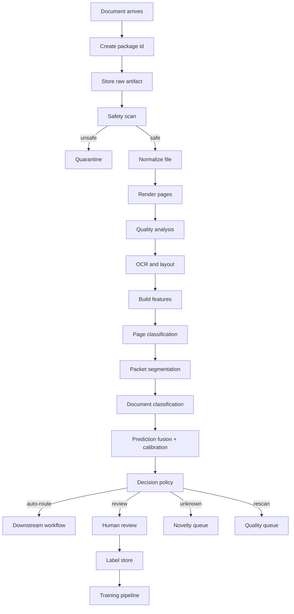
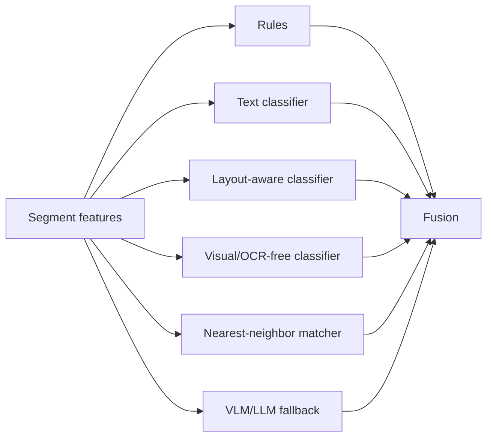
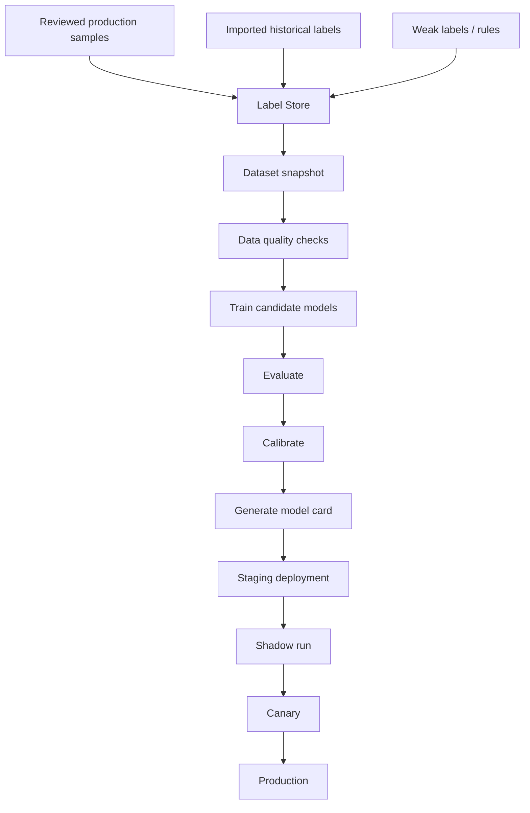
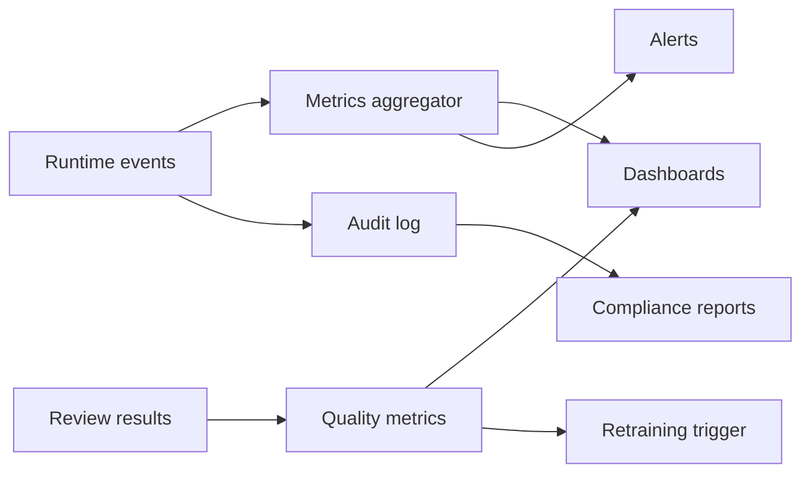

# 04 — Data Flow

## 1. Runtime flow summary

The core runtime flow is:

```text
Input → Ingest → Safety scan → Normalize → Page images → OCR/layout → Features → Split/classify → Fuse/calibrate → Policy decision → Route or review → Feedback
```

A modern system should handle both synchronous and asynchronous flows. Small single-page files may receive near-real-time classification. Large PDF packets should be handled asynchronously with event-driven processing.

## 2. End-to-end flow diagram



## 3. Flow 1 — Ingestion

### 3.1 Input

Possible input payload:

```json
{
  "file": "binary-stream-or-presigned-object-ref",
  "metadata": {
    "tenant_id": "tenant_acme",
    "source_type": "email_attachment",
    "business_process": "accounts_payable",
    "sender": "supplier@example.com",
    "filename": "invoice_12345.pdf",
    "submitted_at": "2026-06-08T08:15:11Z"
  }
}
```

### 3.2 Processing steps

1. Validate request and tenant.
2. Generate `package_id`.
3. Store raw object immutably.
4. Compute hash.
5. Create registry record.
6. Emit `DocumentPackageCreated`.

### 3.3 Output event

```json
{
  "event_type": "DocumentPackageCreated",
  "package_id": "pkg_01JZ8G7Q5WJ6R9PN8H0F4K6S5T",
  "raw_artifact_id": "art_raw_001",
  "source_type": "email_attachment",
  "business_process": "accounts_payable"
}
```

## 4. Flow 2 — Safety and validation

### 4.1 Checks

- File type allowed.
- File size and page count limits.
- Malware scan.
- Password/encryption status.
- Container recursion limit.
- Duplicate hash check.
- Tenant authorization.

### 4.2 Decisions

| Result | Action |
|---|---|
| Safe | Continue to normalization. |
| Duplicate | Link to existing package or reprocess depending on business policy. |
| Password-protected | Reject or review depending on source. |
| Malware | Quarantine. |
| Unsupported file | Manual triage or reject. |

## 5. Flow 3 — Normalization

### 5.1 Input

- Raw artifact reference.
- File metadata.
- Processing policy.

### 5.2 Processing

| Input type | Normalization action |
|---|---|
| Image | Validate, orient, generate page. |
| Scanned PDF | Render each page to image. |
| Native PDF | Extract native text if available; render pages for visual pipeline. |
| DOCX/XLSX/PPTX | Convert to PDF/pages, preserve original. |
| EML | Convert body to document and extract attachments. |
| ZIP | Extract child files, create child packages. |
| TIFF | Split frames to pages. |

### 5.3 Outputs

- `Page` records.
- Normalized PDF artifact if produced.
- Page image artifacts.
- Thumbnail artifacts.
- `NormalizationCompleted` event.

## 6. Flow 4 — Page quality analysis

Quality matters because confidence should depend on input quality.

Quality features:

- Blank page probability.
- Blur score.
- Skew angle.
- Rotation confidence.
- DPI.
- Darkness/contrast score.
- OCR feasibility estimate.
- Edge cropping detection.
- Noise score.
- Compression artifact score.

Example output:

```json
{
  "page_id": "pg_0001",
  "quality": {
    "blank_probability": 0.01,
    "blur_score": 0.08,
    "skew_degrees": 0.4,
    "ocr_feasibility": 0.97,
    "warnings": []
  }
}
```

## 7. Flow 5 — OCR and layout

### 7.1 OCR/layout execution

For each page:

1. Run OCR and native text extraction.
2. Merge native text and OCR carefully if both exist.
3. Detect reading order.
4. Detect layout blocks.
5. Detect tables/key-value-like structures when available.
6. Store canonical OCR/layout JSON.

### 7.2 OCR/layout output use

The output is used by:

- Text classifier.
- Layout-aware classifier.
- Rules.
- Search index.
- Review UI overlays.
- Evidence generation.
- Downstream extractors.

## 8. Flow 6 — Feature building

Feature building turns raw OCR/layout/images into model-ready inputs.

### 8.1 Page-level features

- First 256/512/1024 OCR tokens.
- Token bounding boxes normalized to 0–1000 or 0–1 scale.
- Page image resized to model input size.
- Layout block graph.
- Visual embeddings.
- Keyword and regex indicators.
- Quality vector.

### 8.2 Document-level features

- Concatenated text with page separators.
- First page / last page features.
- Page sequence features.
- Segment candidate features.
- Source metadata features.
- Aggregated embeddings.

## 9. Flow 7 — Page classification

Page classification predicts each page independently or with local context.

Example page classes:

- `invoice_page`
- `contract_page`
- `bank_statement_page`
- `id_document_front`
- `id_document_back`
- `blank_page`
- `separator_page`
- `unknown_page`

Page classification output:

```json
{
  "page_id": "pg_0001",
  "top_k": [
    {"class_id": "page.invoice", "score": 0.96},
    {"class_id": "page.purchase_order", "score": 0.02}
  ],
  "model_version": "page-cls-v1.8.0"
}
```

## 10. Flow 8 — Packet segmentation

Segmentation decides document boundaries.

Methods:

- Blank/separator page detection.
- Page class transition model.
- Sequence labeling with BIO tags: `B-INVOICE`, `I-INVOICE`, `B-CONTRACT`, etc.
- Layout similarity between adjacent pages.
- Header/footer continuity.
- Page numbering cues.
- Barcode/form-code cues.
- VLM/LLM fallback for ambiguous packets.

Example:

```json
{
  "segments": [
    {"segment_id": "seg_001", "page_ranges": [{"from_page": 1, "to_page": 2}], "split_confidence": 0.94},
    {"segment_id": "seg_002", "page_ranges": [{"from_page": 3, "to_page": 5}], "split_confidence": 0.89}
  ]
}
```

## 11. Flow 9 — Document classification

Each `DocumentSegment` is classified into business taxonomy classes.

### 11.1 Candidate classifiers

Run these in parallel or staged order:



### 11.2 Staged cost-aware execution

For cost control:

1. Run rules + cheap text classifier.
2. Run layout-aware model for likely structured docs.
3. Run visual/OCR-free model if OCR quality is low or visual signatures matter.
4. Run VLM/LLM fallback only if uncertainty remains or the class is unknown/high ambiguity.

## 12. Flow 10 — Fusion and calibration

Fusion combines candidates into a calibrated prediction.

Example logic:

```text
combined_score[class] =
  w_rule * rule_score[class] +
  w_text[class] * text_score[class] +
  w_layout[class] * layout_score[class] +
  w_visual[class] * visual_score[class] +
  w_vlm[class] * vlm_score[class] +
  source_prior[class]

p_calibrated = calibrator(combined_score, quality_features, model_agreement)
```

Recommended output:

- `top_class_id`
- `p_calibrated`
- `top_k`
- `margin`
- `entropy`
- `ood_score`
- `model_agreement`
- `prediction_set`

## 13. Flow 11 — Decision policy

Policy turns prediction into action.

### 13.1 Example thresholds

| Class risk | Auto-route threshold | Review threshold | Notes |
|---|---:|---:|---|
| Low | 0.90 | 0.65 | Marketing, generic correspondence. |
| Medium | 0.94 | 0.70 | Invoices, purchase orders, HR docs. |
| High | 0.98 | 0.85 | Legal, KYC, regulated, high-value finance. |
| Critical | manual | 0.90 | Court orders, sanctions, fraud-sensitive. |

### 13.2 Decision examples

| Condition | Decision |
|---|---|
| `p=0.97`, threshold `0.94`, no warnings | `auto_route` |
| `p=0.76`, top-2 margin small | `review_required` |
| `p=0.99`, high-risk class requiring dual control | `review_required` |
| OCR quality poor and class confidence medium | `rescan_required` or `review_required` |
| OOD score high | `unknown_class` |
| Unsafe file | `quarantine` |

## 14. Flow 12 — Human review

When review is required:

1. Create `ReviewTask`.
2. Assign queue based on reason code.
3. Present document, page thumbnails, OCR overlays, prediction, and evidence.
4. Reviewer accepts/corrects class and split.
5. Store `ReviewResult`.
6. Produce `TrainingLabel` if eligible.
7. Resume routing or mark unsupported.

### 14.1 Review reason codes

- `LOW_CONFIDENCE`
- `LOW_MARGIN`
- `MODEL_DISAGREEMENT`
- `HIGH_RISK_CLASS`
- `POOR_IMAGE_QUALITY`
- `UNKNOWN_CLASS`
- `OOD_DETECTED`
- `UNSUPPORTED_FORMAT`
- `SPLIT_UNCERTAIN`
- `POLICY_SAMPLE_QA`

## 15. Flow 13 — Routing

Routing uses the final decision, not raw model output.

Routing payload:

```json
{
  "package_id": "pkg_01JZ8G7Q5WJ6R9PN8H0F4K6S5T",
  "segment_id": "seg_001",
  "class_id": "FIN.INVOICE.SUPPLIER",
  "confidence": 0.973,
  "route_target": "ap_automation",
  "extraction_profile": "invoice_v4",
  "artifact_refs": {
    "raw": "art_raw_001",
    "normalized_pdf": "art_norm_001",
    "ocr_layout": "art_ocr_001"
  },
  "audit_ref": "dec_001"
}
```

## 16. Training and feedback flow



### 16.1 Dataset snapshot rules

A training dataset snapshot must record:

- Label version.
- Taxonomy version.
- Source artifact refs.
- Exclusion rules.
- Train/validation/test split ids.
- Random seed.
- Time window.
- Tenant eligibility.
- PII handling status.

### 16.2 Avoid leakage

Do not randomly split near-duplicate documents or pages from the same packet into train and test. Split by source, template family, account/customer, and time when possible.

## 17. Monitoring flow



Monitored events:

- Document count by class/source.
- Unknown/OOD rate.
- Review rate.
- Reviewer correction rate.
- Class-level precision estimates.
- Latency and failures.
- Cost per page.
- Model disagreement.
- Drift indicators.

## 18. Failure and retry flow

| Failure | Retry? | Action |
|---|---|---|
| Temporary OCR API failure | yes | exponential backoff, dead-letter after limit |
| Model endpoint timeout | yes | retry or fallback model |
| Unsupported file | no | manual triage/reject |
| Corrupted PDF | no/partial | manual review or reject |
| Low-quality scan | no | rescan request or review |
| Routing target unavailable | yes | retry route, keep decision state |
| Review UI save conflict | yes | optimistic locking |

## 19. Data flow anti-patterns

Avoid:

- Passing only text to all models.
- Collapsing page-level and document-level decisions into one label.
- Deleting intermediate artifacts to save storage before audit requirements are clear.
- Letting downstream systems infer class from filename instead of final decision object.
- Updating labels without preserving previous label and reviewer reason.
- Using the same documents for threshold tuning and final evaluation.

## 20. Minimal MVP flow

The smallest useful production-like flow is:

1. Ingest PDF/image.
2. Store raw file.
3. Normalize to pages.
4. OCR/layout.
5. Text + layout-aware classification.
6. Calibrated threshold policy.
7. Human review for uncertain cases.
8. Store final decision.
9. Export decision to downstream system.
10. Feed review labels into dataset snapshot.
