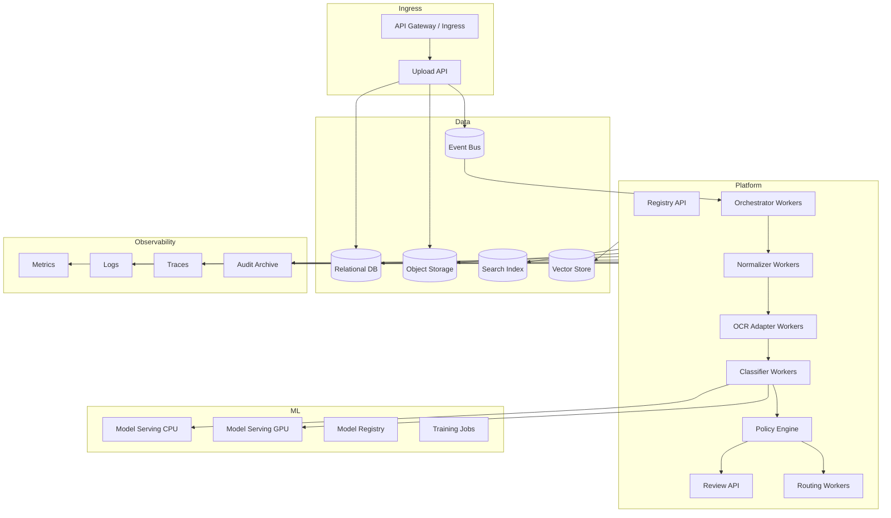
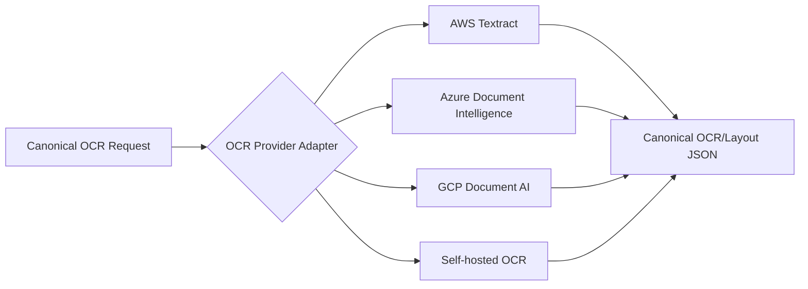

# 07 — Deployment and Operations

## 1. Deployment goals

The solution should support:

- Docker-based local development.
- Production deployment on Kubernetes or managed containers.
- Cloud provider adapters for AWS, Azure, and GCP.
- Optional self-hosted model serving.
- Managed OCR/document AI services where appropriate.
- Secure, auditable, scalable asynchronous processing.

## 2. Environment model

| Environment | Purpose | Data |
|---|---|---|
| `local` | developer testing | synthetic or anonymized samples |
| `dev` | shared integration testing | sanitized samples |
| `test` | QA and system testing | controlled test corpus |
| `staging` | production-like validation | masked production-like data if allowed |
| `prod` | live processing | production documents |
| `ml-lab` | experimentation | approved training data snapshots |

## 3. Local Docker development

### 3.1 Suggested local services

```yaml
services:
  api:
    image: doccls/api:dev
    depends_on: [postgres, minio, redpanda]
  orchestrator:
    image: doccls/orchestrator:dev
    depends_on: [redpanda, postgres]
  normalizer:
    image: doccls/normalizer:dev
  ocr-adapter:
    image: doccls/ocr-adapter:dev
  classifier:
    image: doccls/classifier:dev
  review-ui:
    image: doccls/review-ui:dev
  postgres:
    image: postgres:16
  minio:
    image: minio/minio
  redpanda:
    image: redpandadata/redpanda
  opensearch:
    image: opensearchproject/opensearch
  mlflow:
    image: ghcr.io/mlflow/mlflow
```

### 3.2 Local stack responsibilities

| Service | Purpose |
|---|---|
| PostgreSQL | registry, review tasks, taxonomy |
| MinIO | raw/normalized/OCR/result artifacts |
| Redpanda/Kafka | event bus |
| OpenSearch | OCR text search and debug |
| MLflow | experiment/model tracking |
| FastAPI services | ingestion, registry, classifier, review API |
| React app | review UI |

### 3.3 Local object layout

```text
s3://doccls-local/
  raw/{tenant}/{yyyy}/{mm}/{dd}/{package_id}/original
  normalized/{tenant}/{package_id}/normalized.pdf
  pages/{tenant}/{package_id}/page-0001.png
  thumbnails/{tenant}/{package_id}/page-0001.jpg
  ocr/{tenant}/{package_id}/ocr-layout.json
  features/{tenant}/{package_id}/features.json
  predictions/{tenant}/{package_id}/candidates.json
  decisions/{tenant}/{package_id}/decision.json
  reviews/{tenant}/{package_id}/review-snapshot.json
```

## 4. Production Kubernetes architecture



## 5. Scaling model

Scale by queue and workload type.

| Worker | Scaling signal | Notes |
|---|---|---|
| Ingestion API | request rate | stateless, CPU-light |
| Normalizer | queue depth, CPU, memory | can be CPU/memory heavy |
| OCR adapter | page queue depth, provider rate limit | cloud API throttling matters |
| Feature builder | page count, CPU/GPU if embeddings | batch embeddings where possible |
| Classifier CPU | request queue depth | rules/text models |
| Classifier GPU | GPU utilization, batch latency | layout/visual models |
| VLM fallback | budget, queue, rate limit | strict controls |
| Review API | user traffic | normal web app scaling |
| Routing worker | route queue depth | handle downstream retries |

## 6. AWS reference mapping

| Capability | AWS option |
|---|---|
| API | API Gateway + ECS/EKS/Lambda |
| Object storage | S3 |
| Registry DB | Aurora PostgreSQL or RDS PostgreSQL |
| Queue/events | SQS/SNS/EventBridge/MSK |
| OCR/layout | Amazon Textract |
| Text classification | Amazon Comprehend Custom Classification |
| IDP automation | Amazon Bedrock Data Automation where suitable |
| VLM/LLM fallback | Amazon Bedrock |
| Model training/serving | SageMaker |
| Model registry | SageMaker Model Registry or MLflow on EKS |
| Search | OpenSearch |
| Vector | OpenSearch vector, Aurora pgvector, managed vector DB |
| Review UI | ECS/EKS/Amplify + Cognito |
| Monitoring | CloudWatch, X-Ray, CloudTrail |
| Secrets | Secrets Manager |
| KMS | AWS KMS |

### AWS notes

- Textract is strong for OCR/layout and some domain-specific workflows.
- Comprehend custom classification is useful for text-centric classification.
- Bedrock/VLM fallback should be controlled by policy and budget.
- S3 event-driven processing works well, but use idempotent workers.

## 7. Azure reference mapping

| Capability | Azure option |
|---|---|
| API | API Management + Container Apps/AKS/App Service |
| Object storage | Blob Storage / ADLS Gen2 |
| Registry DB | Azure SQL or PostgreSQL Flexible Server |
| Queue/events | Event Grid, Service Bus, Event Hubs |
| OCR/layout/classification | Azure AI Document Intelligence |
| Model training/serving | Azure Machine Learning / Foundry |
| VLM/LLM fallback | Azure OpenAI / Azure AI Foundry models |
| Search | Azure AI Search |
| Vector | Azure AI Search vector, PostgreSQL pgvector |
| Review UI | Static Web Apps/App Service + Entra ID |
| Monitoring | Azure Monitor, Application Insights |
| Secrets | Key Vault |
| KMS | Key Vault managed keys |

### Azure notes

- Azure AI Document Intelligence custom classifiers can classify documents/page-level and are useful as managed provider adapters.
- Keep its output mapped into canonical schema to avoid lock-in.
- Azure AI Search can combine OCR text search and vector retrieval for reviewer evidence.

## 8. GCP reference mapping

| Capability | GCP option |
|---|---|
| API | API Gateway/Cloud Run/GKE |
| Object storage | Cloud Storage |
| Registry DB | Cloud SQL PostgreSQL / AlloyDB |
| Queue/events | Pub/Sub / Eventarc |
| OCR/layout/classification | Document AI and Document AI Workbench custom classifier |
| Model training/serving | Vertex AI |
| VLM/LLM fallback | Gemini via Vertex AI |
| Search | Vertex AI Search / OpenSearch self-hosted |
| Vector | Vertex AI Vector Search, AlloyDB pgvector |
| Review UI | Cloud Run + Identity-Aware Proxy |
| Monitoring | Cloud Monitoring, Cloud Trace, Cloud Logging |
| Secrets | Secret Manager |
| KMS | Cloud KMS |

### GCP notes

- Document AI custom classifier supports custom classes and managed workflows.
- Gemini-powered classifier versions can support zero-shot/fine-tuning use cases, but production usage should still be policy-controlled.

## 9. Cross-cloud adapter pattern

Keep provider-specific details behind adapters.



Adapter responsibilities:

- Translate request format.
- Handle provider authentication.
- Handle rate limits and retries.
- Normalize coordinate systems.
- Normalize confidence values as raw provider scores.
- Preserve provider raw response as artifact when allowed.
- Emit canonical result.

## 10. Security architecture

### 10.1 Identity and access

- Use service identities for every component.
- Apply least privilege.
- Separate read/write permissions by artifact prefix.
- Review UI access must be role-based.
- Human reviewers should see only assigned tenants/classes.
- Break-glass access must be logged.

### 10.2 Encryption

- Encrypt raw, normalized, OCR, and result artifacts at rest.
- Use TLS for all service-to-service communication.
- Use customer-managed keys where compliance requires it.
- Separate keys by tenant or environment if needed.

### 10.3 Sensitive data handling

- Redact logs.
- Never log full OCR text by default.
- Store prompts/LLM outputs carefully because they may contain sensitive text.
- Apply retention policies to raw and derived artifacts.
- Ensure training eligibility checks before using production documents.

## 11. Observability

### 11.1 Required dashboards

| Dashboard | Metrics |
|---|---|
| Pipeline health | document count, queue lag, failures, retries |
| Latency | per-stage latency, p50/p95/p99 |
| OCR quality | OCR confidence, blank pages, bad scans |
| Classification quality | class distribution, confidence, review rate |
| Human review | backlog, SLA, reviewer throughput, correction rate |
| Model drift | class drift, confidence drift, unknown rate |
| Cost | OCR cost/page, VLM cost/page, GPU cost, storage |

### 11.2 Required alerts

- Queue lag exceeds SLA.
- OCR provider error spike.
- Model endpoint latency/timeout spike.
- Review backlog exceeds SLA.
- Unknown/OOD rate spikes.
- Auto-route volume changes unexpectedly.
- Reviewer correction rate increases.
- Downstream routing failures increase.
- Cost budget threshold reached.

## 12. Resilience and retry

### 12.1 Retry policy

| Stage | Retry approach |
|---|---|
| Upload | client retry with idempotency key |
| Normalization | retry on transient errors only |
| OCR provider | exponential backoff, provider-specific throttling |
| Model inference | retry once then fallback if configured |
| Decision policy | deterministic, should not fail often |
| Routing | retry with dead-letter queue |

### 12.2 Dead-letter queues

Use dead-letter queues for:

- Normalization failures.
- OCR failures.
- Model inference failures.
- Routing failures.
- Event schema validation failures.

Each dead-letter item should include package id, failure reason, retry count, and recoverability.

## 13. Cost controls

Cost drivers:

- OCR per page.
- GPU inference for layout/visual models.
- VLM/LLM tokens/images.
- Storage of raw/images/OCR artifacts.
- Human review time.

Cost-control strategies:

- Skip OCR for unsupported/quarantined files.
- Downscale thumbnails separately from model images.
- Run cheap classifiers before expensive fallback.
- Cache OCR and features by document hash.
- Batch GPU inference.
- Use VLM fallback only for uncertain/high-value cases.
- Archive old page images according to retention policy.
- Monitor cost per class and source.

## 14. Production release checklist

- [ ] Threat model completed.
- [ ] Data retention policy implemented.
- [ ] PII logging disabled/redacted.
- [ ] Object storage lifecycle rules configured.
- [ ] Registry backups configured.
- [ ] Event schemas versioned.
- [ ] Worker retry and DLQ configured.
- [ ] Model registry and rollback configured.
- [ ] Review UI access controls tested.
- [ ] Downstream routing reconciliation tested.
- [ ] Dashboards and alerts live.
- [ ] Load test completed.
- [ ] Disaster recovery plan documented.
- [ ] Runbook completed.

## 15. Runbook outline

### Incident: OCR provider outage

1. Confirm provider status and local error rate.
2. Pause OCR workers if errors are non-transient.
3. Allow ingestion to continue if storage capacity is sufficient.
4. Notify operations of delayed classification.
5. Resume workers after provider stabilizes.
6. Backfill queued packages.
7. Review cost/retry impact.

### Incident: high misclassification rate

1. Check recent model/rule/taxonomy/policy deployment.
2. Compare correction rate by class and source.
3. Disable auto-route for affected class/source.
4. Roll back model or policy if needed.
5. Route affected items to review.
6. Create error analysis dataset.
7. Retrain or adjust thresholds.

### Incident: downstream routing failure

1. Stop or slow routing worker for target.
2. Keep classification decisions intact.
3. Retry route with idempotency key after target recovery.
4. Reconcile documents routed before failure.
5. Alert downstream owner.

## 16. Recommended deployment path

1. Start local Docker Compose for developer productivity.
2. Deploy dev/test on Kubernetes or managed containers.
3. Use managed OCR in early versions to reduce complexity.
4. Add self-hosted models only when accuracy/cost/privacy justify it.
5. Keep a canonical data model from day one.
6. Move to GPU inference only for classifiers that prove measurable value.
7. Roll out auto-routing gradually by class/source.
