---

<!-- Source file: 00_README.md -->


# Modern Document Classification Solution — 2026 Design Pack

This package designs a modern enterprise document classification solution suitable for scanned PDFs, native PDFs, Office files, email attachments, images, and multi-document packets. The design assumes production requirements: auditability, confidence-based automation, human review, model lifecycle management, cloud portability, and integration with downstream extraction / case-management / ECM systems.

## What the system should do

The system receives an unknown document or document packet and decides:

1. **What each page is** — page-level class, page quality, language, layout traits.
2. **Where documents start and end** — document splitting for packets containing multiple documents.
3. **What each document is** — canonical document class, sub-class, business routing class.
4. **How confident the system is** — calibrated confidence, uncertainty, explanation, and risk decision.
5. **What should happen next** — auto-route, send to extractor, ask for human review, reject, or quarantine.

The intended output is not only a label. It is a **classification decision object** with evidence, lineage, confidence, thresholds, and routing instructions.

## File map

| File | Purpose |
|---|---|
| `01_architecture.md` | End-to-end architecture, main components, relationships, and Mermaid diagrams. |
| `02_components.md` | Detailed component catalog with responsibilities, inputs, outputs, and design decisions. |
| `03_data_model.md` | Canonical data model and JSON examples for documents, pages, layout, predictions, decisions, reviews, labels, and events. |
| `04_data_flow.md` | Runtime flow from ingestion to routing, plus training / feedback / monitoring flows. |
| `05_model_strategy.md` | Model architecture choices: rules, text classifiers, layout-aware models, OCR-free models, VLM/LLM fallback, ensembles, calibration. |
| `06_implementation_plan.md` | Step-by-step implementation plan, milestones, backlog, acceptance criteria, and MVP-to-production roadmap. |
| `07_deployment_ops.md` | Docker-based development, production Kubernetes, and AWS/Azure/GCP deployment mapping. |
| `08_governance_evaluation.md` | Security, privacy, audit, risk controls, evaluation metrics, thresholds, test sets, and monitoring. |
| `09_references.md` | Source list and reading notes. |

## Recommended architecture in one paragraph

Build a **hybrid, event-driven Intelligent Document Processing classifier**. Persist raw documents immutably, normalize them into pages, extract text/layout/images, run multiple classification strategies, fuse their results, calibrate confidence, apply policy thresholds, and route only high-confidence low-risk cases automatically. Use human review for uncertain, novel, sensitive, or high-impact documents. Feed reviewer decisions back into a versioned training dataset and retrain/evaluate models in controlled promotion stages.

## Design principles

- **Classification is a decision, not just a model output.** Store predictions separately from business decisions.
- **Page-level classification comes before document-level classification.** Many enterprise inputs are packets.
- **Use layout and image information, not OCR text alone.** Modern document type classification benefits from text, layout, visual structure, and metadata.
- **Make uncertainty first-class.** Confidence, margin, entropy, OOD score, evidence, and threshold policy should all be explicit.
- **Route by risk.** A low-value marketing flyer can be auto-routed at lower certainty than a legal notice, insurance claim, or KYC document.
- **Keep raw, normalized, extracted, and predicted data separate.** This supports reprocessing and audit.
- **Design for human feedback from day one.** Review queues, label corrections, and active learning are core system components.
- **Avoid vendor lock-in at the domain model layer.** Cloud OCR/document AI providers can be adapters behind the same canonical schema.

## Suggested first MVP

Start with 10–20 document classes, 500–2,000 labeled examples if available, and a strict review policy. Use OCR + text classifier + layout-aware classifier + rule layer. Add VLM/LLM classification only as fallback or second-opinion until cost, latency, and hallucination risk are measured.

## Target outputs

Every processed package should produce:

- `DocumentPackage` record
- immutable raw object reference
- page records with rendered image references
- OCR/layout result
- page-level predictions
- document segment predictions
- document-level decision
- route action
- audit event chain
- review task when thresholds are not met

## Sources consulted

The design is intentionally vendor-neutral, but it reflects current 2025–2026 capabilities from major cloud and research sources:

- Microsoft Azure AI Document Intelligence custom classifier: https://learn.microsoft.com/en-us/azure/ai-services/document-intelligence/how-to-guides/build-a-custom-classifier?view=doc-intel-4.0.0
- Google Cloud Document AI custom classifier: https://docs.cloud.google.com/document-ai/docs/custom-classifier
- Amazon Textract overview: https://aws.amazon.com/textract/
- Amazon Textract Analyze Lending classification/extraction: https://docs.aws.amazon.com/textract/latest/dg/lending-document-classification-extraction.html
- Amazon Comprehend custom classification: https://docs.aws.amazon.com/comprehend/latest/dg/how-document-classification.html
- AWS Bedrock Data Automation / IDP concepts: https://docs.aws.amazon.com/bedrock/latest/userguide/bda.html
- LayoutLMv3 paper: https://arxiv.org/abs/2204.08387
- Donut OCR-free Document Understanding Transformer paper: https://arxiv.org/abs/2111.15664
- 2026 multimodal document type classification comparison: https://arxiv.org/abs/2606.02162
- RVL-CDIP dataset: https://adamharley.com/rvl-cdip/


---

<!-- Source file: 01_architecture.md -->


# 01 — Architecture

## 1. Scope

This design covers document classification in an enterprise Intelligent Document Processing system. The system classifies both single documents and multi-document packets. It supports scanned documents, native PDFs, Office files, image files, email bodies, and attachments.

Classification means more than assigning a top-level document type. A modern system should classify at several levels:

| Level | Question | Example |
|---|---|---|
| File level | What kind of input file is this? | PDF packet, image, DOCX, ZIP, EML. |
| Page level | What is this page? | Invoice page, bank statement page, attachment separator, blank page. |
| Segment level | Which pages belong together? | Pages 1–2 = invoice, pages 3–5 = contract. |
| Document level | What is this complete document? | Supplier invoice, purchase order, claim form. |
| Business routing level | What workflow should handle it? | AP automation, HR onboarding, legal review, compliance queue. |
| Risk level | Can it be auto-processed? | Auto-route, human-review, reject, quarantine. |

## 2. High-level architecture

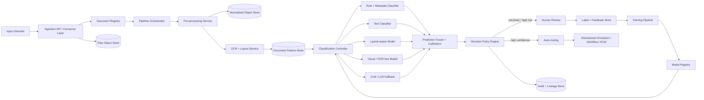

## 3. Logical component groups

### 3.1 Input and ingestion

This layer accepts documents from business systems and ensures that every file becomes a traceable, immutable processing unit.

Typical sources:

- Scanner / MFP output folder
- Email inbox or EML files
- SFTP batch folder
- Web portal upload
- ECM / content repository
- Case management system
- API-based document submission
- Cloud storage bucket events
- RPA bots or legacy batch jobs

Key design choices:

- Assign a globally unique `package_id` as early as possible.
- Store the raw file before any processing.
- Compute cryptographic hash for deduplication and audit.
- Perform malware scanning and file validation before parsing.
- Separate ingestion metadata from document content.

### 3.2 Document registry

The registry is the system of record for processing state. It should not store the full document binary. It stores metadata, object references, state, lineage, and processing events.

Responsibilities:

- Track status: `RECEIVED`, `NORMALIZED`, `OCR_DONE`, `CLASSIFIED`, `REVIEW_REQUIRED`, `ROUTED`, `FAILED`.
- Track source and business context.
- Track tenant, classification policy, retention class, and legal hold.
- Track references to raw, normalized, OCR, feature, and result objects.
- Track version of every model and rule pack used.

### 3.3 Pre-processing and normalization

This stage turns many file formats into a canonical page representation.

Tasks:

- Validate MIME type and file extension.
- Check file size and page count limits.
- Remove unsupported encryption if allowed; otherwise reject to manual queue.
- Split ZIP / email containers into child packages.
- Convert Office files to PDF or page images.
- Render PDFs to page images.
- Detect blank pages, separator pages, skew, rotation, low DPI, bad contrast.
- Normalize page orientation.
- Produce image thumbnails for review UI.

Output:

- Page image references.
- Page metadata.
- Quality metrics.
- Warnings and recoverable errors.

### 3.4 OCR and layout analysis

Even if the final model is visual or OCR-free, OCR and layout are still valuable for audit, search, explainability, and routing.

OCR/layout output should include:

- Text tokens.
- Bounding boxes.
- Confidence per token / line / block.
- Reading order.
- Detected tables.
- Key-value-like regions.
- Headers, footers, stamps, signatures, checkboxes, barcodes when available.
- Language and script detection.

Design rule: **never throw away spatial information**. Store text with geometry.

### 3.5 Feature and representation layer

This layer creates reusable representations for downstream models:

| Representation | Used by |
|---|---|
| Raw page image | visual classifiers, OCR-free models, VLM fallback, review UI |
| OCR text | text classifier, rules, search, explanations |
| OCR tokens + boxes | layout-aware transformer, evidence extraction |
| Layout blocks | packet splitting, rule matching, explanation |
| Page embeddings | duplicate detection, nearest-neighbor search, active learning |
| Document embeddings | routing, class discovery, OOD detection |
| Source metadata | rules, business policy, audit |

### 3.6 Classification controller

The controller coordinates classification strategies. It should not itself be a model. It invokes candidate classifiers, collects their outputs, and sends them to fusion/calibration.

Recommended candidate classifiers:

1. **Rule / metadata classifier** — fast and deterministic.
2. **Text classifier** — strong when OCR text is clean and class semantics are textual.
3. **Layout-aware classifier** — strong for forms, statements, invoices, applications, and structured business documents.
4. **Visual / OCR-free classifier** — useful when visual style matters or OCR is poor.
5. **VLM / LLM fallback classifier** — useful for rare classes, ambiguous samples, and explanation, but should be risk-controlled.
6. **Known-template matcher** — useful for stable forms and government/finance documents.
7. **Nearest-neighbor semantic matcher** — useful for class discovery and active learning.

### 3.7 Prediction fusion and calibration

This stage turns multiple candidate predictions into calibrated probabilities and interpretable uncertainty.

Inputs:

- Candidate labels.
- Scores from each model.
- Model reliability by class.
- Page/document quality metrics.
- Prior probabilities by source/channel.
- Business policy.

Outputs:

- Calibrated class probability.
- Margin between top classes.
- Uncertainty and OOD indicators.
- Evidence list.
- Recommended action.

### 3.8 Decision policy engine

The policy engine decides what the business should do with the prediction.

Example decisions:

| Condition | Action |
|---|---|
| High confidence, low risk | Auto-route. |
| Medium confidence | Human review. |
| High-confidence but sensitive class | Human review or dual control. |
| Unknown / OOD | Novelty queue. |
| Bad quality scan | Rescan request or quality review. |
| Malware / unsupported encrypted file | Quarantine. |
| Conflicting model outputs | Review with model disagreement explanation. |

### 3.9 Human review

Human review is not an afterthought. It is the control surface for reliability.

Review UI requirements:

- Show page thumbnails and full page image.
- Show OCR text and layout overlays.
- Show top predicted classes and confidence.
- Show evidence: matching keywords, visual regions, known template, similar examples.
- Allow class correction, split/merge correction, page reorder/rotation correction.
- Capture reviewer identity, time, reason, and comments.
- Support second review for high-risk classes.

### 3.10 Model training and evaluation

Training is fed by curated human labels, historical labels, synthetic augmentation, and selected production examples.

The model lifecycle should include:

- Dataset versioning.
- Taxonomy versioning.
- Train/validation/test split by source and time.
- Out-of-distribution test set.
- Class imbalance handling.
- Calibration evaluation.
- Bias and error analysis by source, language, quality, scanner, and template.
- Shadow deployment before promotion.

### 3.11 Downstream routing

Classification should hand off to specialized processing:

| Classification result | Typical downstream target |
|---|---|
| Invoice | AP extraction and approval workflow |
| Contract | Contract metadata extraction and legal repository |
| KYC ID | Identity verification workflow |
| Bank statement | Financial extraction processor |
| Claim form | Claims case system |
| HR document | HR onboarding workflow |
| Unknown | Manual triage |

## 4. Physical architecture layers

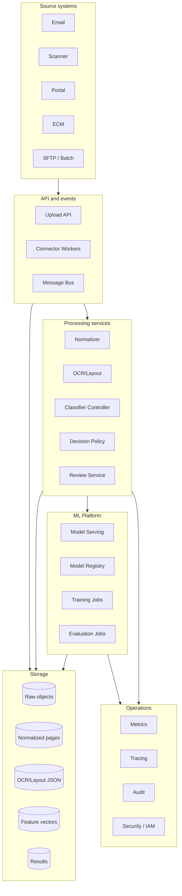

## 5. Component relationship rules

The cleanest architecture keeps these concerns separate:

- **Document registry** owns lifecycle state.
- **Object storage** owns binaries and large JSON artifacts.
- **Feature store / vector store** owns embeddings and feature snapshots.
- **Model serving** owns inference only.
- **Policy engine** owns business actions.
- **Human review** owns corrections and adjudication.
- **Training pipeline** owns dataset creation and model promotion.
- **Audit store** owns non-repudiable event history.

Avoid these anti-patterns:

- A classifier that directly writes into business systems without policy checks.
- OCR output stored only as text with no bounding boxes.
- Reusing production data for training without versioning and consent/retention checks.
- A single confidence threshold for all document classes.
- LLM-only classification without deterministic schema, confidence controls, and review fallback.
- Human corrections stored only in UI tables and not turned into training labels.

## 6. Reference technology options

| Capability | Open/self-hosted option | AWS | Azure | GCP |
|---|---|---|---|---|
| Object storage | MinIO | S3 | Blob Storage | Cloud Storage |
| Events | Kafka / Redpanda / NATS | EventBridge / SQS / SNS | Event Grid / Service Bus | Pub/Sub / Eventarc |
| OCR/layout | Tesseract, PaddleOCR, docTR, Surya-style parsers, custom OCR | Textract | Document Intelligence | Document AI |
| Text classifier | scikit-learn, fastText, BERT, ModernBERT | Comprehend Custom Classification, Bedrock | Azure ML, AI Language, Document Intelligence classifier | Document AI classifier, Vertex AI |
| Layout-aware classifier | LayoutLMv3, LiLT, DocFormer, custom spatial transformers | SageMaker | Azure ML | Vertex AI |
| OCR-free classifier | Donut, Nougat-like, custom ViT encoder-decoder | SageMaker / Bedrock models | Azure ML / Foundry | Vertex AI |
| VLM fallback | Qwen-VL, InternVL, Llama vision variants, GPT-family APIs where allowed | Bedrock | Azure OpenAI / Foundry | Gemini / Vertex AI |
| Review UI | Custom React app, Label Studio extension | A2I-style custom workflow | Custom app / Power Apps | Human review app / custom |
| Model registry | MLflow | SageMaker Model Registry | Azure ML Registry | Vertex Model Registry |
| Observability | OpenTelemetry, Prometheus, Grafana | CloudWatch / X-Ray | Monitor / App Insights | Cloud Monitoring / Trace |

## 7. Recommended baseline architecture

For a real enterprise system in 2026, the best baseline is:

1. **OCR/layout-first pipeline** for traceability and interoperability.
2. **Layout-aware transformer** as the primary classifier for structured and visually rich documents.
3. **Text classifier** as a cheap parallel signal.
4. **Rule/template layer** for deterministic business cases.
5. **Visual or OCR-free model** for poor OCR, highly visual documents, and handwriting-heavy cases.
6. **VLM/LLM fallback** for rare classes, zero-shot exploration, and reviewer explanations, not as the only production gate.
7. **Calibrated ensemble** with class-specific thresholds.
8. **Human review loop** for uncertain, novel, or high-risk decisions.

## 8. Non-functional requirements

| Requirement | Target |
|---|---|
| Throughput | Scale horizontally by queue depth and page count. |
| Latency | Seconds for small files; async for large packets. |
| Availability | No single point of failure in registry, object storage, queues, and model serving. |
| Audit | Every state transition and model decision must be reconstructable. |
| Security | Encryption, IAM, malware scan, tenant isolation, PII controls. |
| Explainability | Store evidence and model versions, not only a label. |
| Reprocessing | Any package can be replayed with a new pipeline/model version. |
| Cloud portability | Canonical schema independent of vendor OCR/model output. |
| Cost control | Cheap classifiers first; expensive VLM/LLM fallback only when justified. |


---

<!-- Source file: 02_components.md -->


# 02 — Main Components and How They Relate

## 1. Component catalog

The system is a collection of services. Each service has a clear responsibility and exchanges canonical events and artifacts.

| Component | Main responsibility | Consumes | Produces |
|---|---|---|---|
| Ingestion API | Accept documents and source metadata | File, source metadata | `DocumentPackageCreated` event, raw object |
| Connector Workers | Pull from external systems | Email/SFTP/ECM/scanner folders | Raw packages and ingestion metadata |
| Malware / Content Safety Scanner | Prevent unsafe processing | Raw binary | safety result, quarantine decision |
| Document Registry | Track lifecycle and state | events, artifact refs | status, lineage, queryable metadata |
| Object Store | Store raw and normalized artifacts | binaries, JSON artifacts | immutable refs, versioned object paths |
| Normalizer | Convert documents into pages | raw file | normalized PDF, page images, quality metadata |
| Page Quality Analyzer | Identify scan quality problems | page images | quality scores, warnings |
| OCR/Layout Service | Extract text and spatial structure | page images/native PDF | OCR tokens, blocks, tables, layout JSON |
| Feature Builder | Build derived features | OCR/layout/images/metadata | embeddings, text chunks, layout graphs |
| Taxonomy Service | Define classes and policies | taxonomy config | class definitions, thresholds, route map |
| Classification Controller | Orchestrate classifiers | feature refs, class taxonomy | raw candidate predictions |
| Classifier Adapters | Run specific models/rules | canonical features | `PredictionCandidate` objects |
| Fusion + Calibration | Combine model outputs | candidates, reliability stats | calibrated predictions |
| Decision Policy Engine | Convert prediction into business action | calibrated prediction, policy | `ClassificationDecision` |
| Review Queue | Manage human review | decision requiring review | review task, corrected label |
| Review UI | Let users inspect and correct | document/page artifacts | adjudicated labels, comments |
| Label Store | Persist labels and reviewer feedback | review results, imports | training labels, audit trail |
| Training Pipeline | Build datasets and train models | label store, artifacts | model versions, evaluation reports |
| Model Registry | Govern model versions | training artifacts | approved/staged/deprecated models |
| Model Serving | Host inference endpoints | model versions, requests | inference responses |
| Routing Adapter | Call downstream systems | classification decision | workflow/case/ECM handoff |
| Monitoring | Detect failures and drift | logs, metrics, events | alerts, dashboards, reports |
| Audit Store | Immutable decision history | all critical events | reconstructable processing timeline |

## 2. Component boundaries

### 2.1 Ingestion API

The ingestion API should do very little synchronous work. It validates request metadata, writes the raw artifact, creates a registry record, and emits an event.

Required API behavior:

- Accept multipart file upload and metadata-only pre-signed upload workflows.
- Support idempotency keys.
- Return `package_id` immediately.
- Reject unsupported file types early.
- Record tenant, source system, business process, and requester identity.
- Support batch submissions.

Not recommended:

- Running OCR synchronously inside upload request.
- Returning final classification directly for large documents.
- Allowing downstream business systems to depend on unversioned classifier behavior.

### 2.2 Connector Workers

Connectors isolate source-system complexity.

Examples:

- Email connector reads inbox messages, extracts attachments and body-as-document.
- Scanner connector watches a folder or queue.
- SFTP connector imports scheduled batches.
- ECM connector pulls from repository folders and writes result metadata back.

Each connector maps source metadata into a normalized `source_context` block.

### 2.3 Document Registry

The registry holds the processing state machine.

Suggested states:

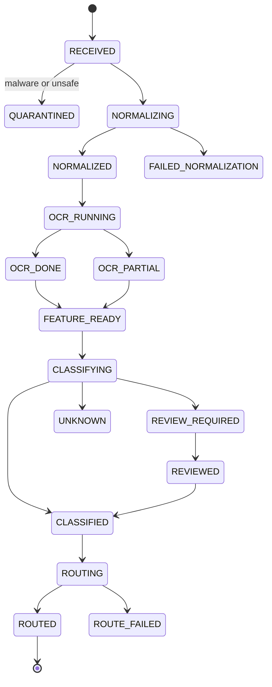

Registry entries should be append-only where practical. Updates can maintain the latest state, but state transitions should be preserved as events.

### 2.4 Normalizer

The normalizer creates a consistent page model.

Responsibilities:

- Convert supported inputs to rendered pages.
- Preserve page order.
- Generate page image at agreed DPI.
- Create thumbnail and preview assets.
- Detect document containers, embedded attachments, and image-only pages.
- Identify blank pages and separator sheets.
- Preserve native text when available.

Outputs:

- `NormalizedDocument` artifact.
- `Page` records.
- `PageQuality` records.
- `NormalizationCompleted` event.

### 2.5 OCR/Layout Service

The OCR/layout component is an adapter layer. It may call a cloud service, open-source OCR, or a custom model, but it always outputs canonical `OcrResult` and `LayoutBlock` structures.

Important fields:

- `token.text`
- `token.bbox`
- `token.confidence`
- `line_id`, `block_id`
- `reading_order`
- `page_rotation`
- `language`
- `table_id` / `cell_id` when detected

### 2.6 Feature Builder

The feature builder prepares model inputs and stores them for reuse.

Feature categories:

| Feature | Description | Example use |
|---|---|---|
| Full OCR text | Concatenated page/document text | text classifier, keyword rules |
| First-page text | Top N lines / first page | fast routing |
| Layout tokens | OCR tokens with normalized boxes | LayoutLM-style classifier |
| Page image | Rendered page | ViT, Donut, VLM |
| Visual thumbnail embedding | Global visual embedding | nearest neighbor / OOD |
| Text embedding | Semantic embedding | class discovery, similar examples |
| Metadata features | source, sender, filename, MIME | deterministic rules |
| Quality features | DPI, blur, skew, OCR confidence | routing and threshold policy |

### 2.7 Taxonomy Service

Document classes change over time. Do not hard-code them inside the model or rules.

The taxonomy service should define:

- Class id, display name, description.
- Parent/child hierarchy.
- Positive examples and negative examples.
- Required evidence.
- Confusable classes.
- Auto-routing threshold.
- Review threshold.
- Risk level.
- Downstream route.
- Extraction processor mapping.
- Retention and privacy flags.

Example:

```yaml
class_id: FIN.INVOICE.SUPPLIER
name: Supplier Invoice
parent: FIN.INVOICE
risk_level: medium
auto_route_threshold: 0.94
review_threshold: 0.70
requires_split_confidence: true
confusable_with:
  - FIN.CREDIT_NOTE
  - FIN.PURCHASE_ORDER
route:
  target: ap_automation
  extraction_profile: invoice_v4
privacy:
  contains_pii_likely: true
```

### 2.8 Classification Controller

The controller performs runtime strategy selection.

It decides:

- Which classifiers to run.
- Whether page-level or document-level classification is needed.
- Whether to run expensive fallback models.
- Whether to stop early because deterministic evidence is sufficient.
- How to handle low-quality pages.
- How to batch pages for GPU efficiency.

Example strategy:

1. Run cheap rules and text classifier.
2. If confidence is high and class is low-risk, skip expensive VLM.
3. If models disagree, run layout-aware model and nearest-neighbor lookup.
4. If still ambiguous or class is rare, ask VLM/LLM for a constrained JSON second opinion.
5. Fuse all predictions and apply decision policy.

### 2.9 Rule / Metadata Classifier

Rules are not old-fashioned; they are essential for production.

Good rule examples:

- Source email address is known AP mailbox and filename contains invoice number pattern.
- Barcode maps to a known form type.
- First page contains exact government form code.
- PDF metadata declares template id.
- Top-left region contains company logo + exact form title.

Bad rule examples:

- Any occurrence of word `invoice` means invoice.
- Hard-coded page number assumptions without packet splitting.
- Rules that silently override ML predictions without audit.

### 2.10 Text Classifier

A text classifier is cheap and effective when OCR quality is good.

Options:

- TF-IDF + linear model for baseline and explainability.
- Sentence/document embeddings + classifier.
- Fine-tuned BERT/ModernBERT-like model.
- Cloud custom text classifier.
- LLM prompt classifier for low-volume or exploratory tasks.

Use cases:

- Emails, contracts, reports, policies, letters.
- Native PDFs with rich text.
- Business classes defined by wording rather than visual format.

Limitations:

- Fails when OCR is poor.
- Ignores visual layout.
- May confuse documents with similar vocabulary but different form structure.

### 2.11 Layout-aware Classifier

This should usually be the primary model for visually rich business documents.

Inputs:

- OCR tokens.
- Bounding boxes.
- Page image patches or visual embeddings.
- Document/page metadata.

Good for:

- Forms.
- Invoices.
- Bank statements.
- Insurance documents.
- Tax documents.
- Application packets.
- Documents with strong layout signatures.

### 2.12 Visual / OCR-free Classifier

This classifies directly from page images or uses encoder-decoder document understanding.

Good for:

- Poor OCR.
- Handwriting-heavy documents.
- Highly visual layouts.
- Mixed-language content where OCR support is weak.
- First-pass page type detection.

Limitations:

- May be harder to explain.
- Requires GPU capacity.
- Needs careful resizing and page-image quality handling.

### 2.13 VLM / LLM Fallback

In 2026, VLMs are useful, but they should be controlled.

Use them for:

- Second opinion on ambiguous classes.
- Zero-shot triage for unknown classes.
- Reviewer explanation draft.
- Detecting novel document families.
- Building weak labels for active learning.

Do not use them blindly for:

- High-volume simple classes where cheaper models work.
- High-risk automatic decisions without calibration and review.
- Processing sensitive data unless deployment, privacy, and retention are approved.

VLM calls should be schema-constrained:

```json
{
  "document_type": "one_of_allowed_class_ids",
  "confidence_reasoning": "brief evidence only",
  "evidence": [
    {"page": 1, "region": "top_header", "text": "..."}
  ],
  "uncertainty": "low|medium|high",
  "needs_human_review": true
}
```

### 2.14 Fusion + Calibration Service

Fusion should not simply average scores. It should consider per-model reliability and class-specific performance.

Fusion inputs:

- Raw model probabilities.
- Rule results.
- Template match scores.
- OCR quality.
- Page quality.
- Source prior.
- Historical model reliability by class.
- Top-class margin.
- Disagreement score.

Calibration techniques:

- Temperature scaling.
- Isotonic regression.
- Platt scaling.
- Conformal prediction sets.
- Per-class threshold optimization.

Output:

- `p_calibrated`.
- `prediction_set` for uncertain classes.
- `margin`.
- `entropy`.
- `ood_score`.
- `decision_recommendation`.

### 2.15 Decision Policy Engine

A prediction becomes a decision only after policy.

Policy dimensions:

| Dimension | Examples |
|---|---|
| Confidence | top probability, margin, prediction set size |
| Risk | legal, financial, PII, regulated, fraud-sensitive |
| Quality | poor scan, partial OCR, skewed page |
| Business source | trusted source vs open upload |
| Model agreement | agreement/disagreement between classifiers |
| Class maturity | enough labeled data vs new class |
| Drift | source/template recently changed |
| Cost | whether VLM fallback is justified |

### 2.16 Human Review Service

Review is a workflow system.

Queues:

- Low-confidence queue.
- High-risk verification queue.
- Unknown / novel document queue.
- Split/merge correction queue.
- Quality/rescan queue.
- Model disagreement queue.
- Audit sample queue for random quality control.

Review outcomes:

- Accept prediction.
- Correct class.
- Split/merge pages.
- Mark as unknown/new class candidate.
- Reject as unsupported.
- Request rescan.
- Escalate to expert reviewer.

### 2.17 Training Pipeline

The training pipeline should be deterministic and reproducible.

Stages:

1. Snapshot label store.
2. Build dataset manifest.
3. Apply eligibility rules: consent, retention, tenant, source, PII handling.
4. Split data by time/source/template to avoid leakage.
5. Train candidate models.
6. Evaluate by class, source, language, quality, scanner, and template.
7. Calibrate confidence.
8. Compare to currently deployed model.
9. Generate model card and risk report.
10. Promote to staging, shadow, canary, then production.

### 2.18 Monitoring and Observability

Monitor both software and model behavior.

Software metrics:

- Queue lag.
- Processing latency.
- Error rate.
- OCR service failures.
- Model endpoint latency.
- GPU utilization.
- Cost per page.

Model metrics:

- Class distribution drift.
- Confidence distribution drift.
- Review rate.
- Override rate.
- Precision/recall from reviewed samples.
- Unknown/OOD rate.
- Disagreement rate.
- Calibration error.

### 2.19 Audit Store

The audit store should support reconstruction.

For every decision, you should be able to answer:

- Which raw document was processed?
- Which pages were generated?
- Which OCR/layout engine and version ran?
- Which models and rule packs ran?
- What did each model predict?
- What thresholds were used?
- Why was the document auto-routed or reviewed?
- Who reviewed it, if anyone?
- What changed after review?
- Which downstream system received it?

## 3. How components relate in runtime

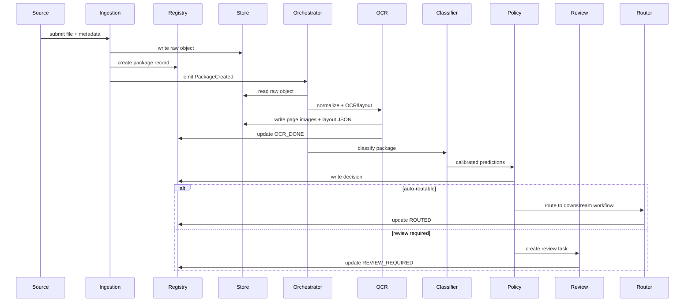

## 4. System interfaces

### 4.1 Public API endpoints

| Endpoint | Purpose |
|---|---|
| `POST /packages` | Submit document package. |
| `GET /packages/{id}` | Get status and metadata. |
| `GET /packages/{id}/decision` | Get classification decision. |
| `POST /packages/{id}/reprocess` | Reprocess with chosen pipeline/model version. |
| `GET /classes` | List active taxonomy. |
| `POST /reviews/{task_id}/decision` | Submit reviewer decision. |
| `GET /metrics/model-quality` | Model quality dashboard API. |

### 4.2 Internal event names

- `DocumentPackageCreated`
- `RawObjectStored`
- `SafetyScanCompleted`
- `NormalizationCompleted`
- `OcrLayoutCompleted`
- `FeatureBuildCompleted`
- `ClassificationRequested`
- `ClassificationCandidateProduced`
- `ClassificationDecisionMade`
- `ReviewTaskCreated`
- `ReviewCompleted`
- `RoutingCompleted`
- `TrainingDatasetSnapshotCreated`
- `ModelVersionPromoted`

## 5. Component ownership model

| Area | Typical owner |
|---|---|
| Ingestion connectors | Integration team |
| Registry and APIs | Platform/backend team |
| OCR/layout adapters | Document AI team |
| Model training | ML team |
| Model serving | ML platform / DevOps |
| Review UI | Product/application team |
| Taxonomy and thresholds | Business + ML + risk owners |
| Security/governance | Security, privacy, compliance |
| Routing adapters | Workflow/ECM integration team |

## 6. Core design recommendation

Start with a modular architecture even if the first version uses only one cloud provider. The most expensive mistake is allowing a provider-specific OCR or classifier response to become the internal domain model. Use adapters to translate provider responses into the canonical schema, then keep the rest of the system vendor-neutral.


---

<!-- Source file: 03_data_model.md -->


# 03 — Canonical Data Model

## 1. Data model goals

The document classification system should pass a rich, explicit data model through the pipeline. Avoid passing only file paths and labels. The data model must preserve lineage, evidence, confidence, and reviewability.

The canonical model should support:

- Multi-tenant processing.
- Multi-document packets.
- Page-level and document-level classification.
- OCR and layout geometry.
- Multiple candidate predictions.
- Calibrated final decisions.
- Human review corrections.
- Reprocessing with new model versions.
- Audit and compliance.
- Cloud-provider independence.

## 2. Core entities

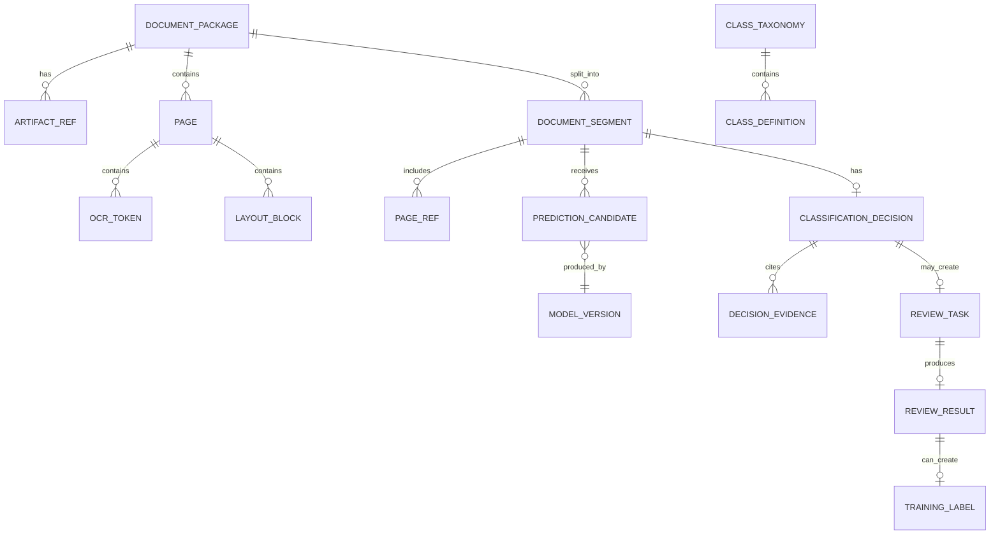

## 3. Entity overview

| Entity | Meaning |
|---|---|
| `DocumentPackage` | The unit submitted to the system. May contain one or more business documents. |
| `ArtifactRef` | Pointer to raw file, normalized file, page image, OCR JSON, feature vector, model output. |
| `Page` | A canonical page record after normalization. |
| `OcrToken` | Text token with geometry and confidence. |
| `LayoutBlock` | Higher-level region: paragraph, table, title, figure, header, footer, checkbox group. |
| `DocumentSegment` | One classified document within a package, represented as page range(s). |
| `PredictionCandidate` | One model/rule output before fusion. |
| `CalibratedPrediction` | Fused and calibrated class probability output. |
| `ClassificationDecision` | Business decision after policy thresholds. |
| `ReviewTask` | Human review work item. |
| `ReviewResult` | Human adjudication result. |
| `TrainingLabel` | Versioned label used for training/evaluation. |
| `ClassTaxonomy` | Versioned class hierarchy and policy. |
| `PipelineEvent` | Immutable event for audit and orchestration. |

## 4. `DocumentPackage`

A `DocumentPackage` represents the submitted input. It does not equal one final business document because a PDF packet can contain multiple documents.

```json
{
  "package_id": "pkg_01JZ8G7Q5WJ6R9PN8H0F4K6S5T",
  "tenant_id": "tenant_acme",
  "source_context": {
    "source_type": "email_attachment",
    "source_system": "shared_mailbox_ap",
    "source_reference": "message:<abc123>/attachment:invoice.pdf",
    "received_at": "2026-06-08T08:15:11Z",
    "submitted_by": "connector:ap-mailbox",
    "business_process": "accounts_payable"
  },
  "raw_artifact": {
    "artifact_id": "art_raw_001",
    "uri": "s3://doc-classifier-prod/raw/tenant_acme/2026/06/08/pkg_.../invoice.pdf",
    "sha256": "ec6d...",
    "mime_type": "application/pdf",
    "size_bytes": 1842241
  },
  "status": "OCR_DONE",
  "priority": "normal",
  "retention_policy": "finance_7y",
  "legal_hold": false,
  "created_at": "2026-06-08T08:15:12Z",
  "updated_at": "2026-06-08T08:15:38Z"
}
```

### Required fields

| Field | Purpose |
|---|---|
| `package_id` | Stable id across all events and artifacts. |
| `tenant_id` | Tenant isolation and routing. |
| `source_context` | Business source and traceability. |
| `raw_artifact` | Immutable original file reference. |
| `status` | Current processing state. |
| `retention_policy` | Records management. |
| `created_at`, `updated_at` | Operational tracking. |

## 5. `ArtifactRef`

Large binary and JSON outputs should be stored as artifacts, not embedded in registry rows.

```json
{
  "artifact_id": "art_ocr_001",
  "package_id": "pkg_01JZ8G7Q5WJ6R9PN8H0F4K6S5T",
  "artifact_type": "ocr_layout_json",
  "uri": "s3://doc-classifier-prod/ocr/tenant_acme/2026/06/08/pkg_.../ocr.json",
  "content_type": "application/json",
  "sha256": "b919...",
  "created_by": "ocr-layout-service:v2.3.1",
  "created_at": "2026-06-08T08:15:35Z",
  "schema_version": "ocr-layout-v1.2"
}
```

Recommended artifact types:

- `raw_input`
- `normalized_pdf`
- `page_image`
- `page_thumbnail`
- `ocr_layout_json`
- `features_json`
- `embedding_vector`
- `prediction_json`
- `review_snapshot`
- `training_manifest`
- `evaluation_report`

## 6. `Page`

```json
{
  "page_id": "pg_0001",
  "package_id": "pkg_01JZ8G7Q5WJ6R9PN8H0F4K6S5T",
  "page_number": 1,
  "width_px": 2480,
  "height_px": 3508,
  "dpi": 300,
  "rotation_degrees": 0,
  "image_artifact_id": "art_page_img_0001",
  "thumbnail_artifact_id": "art_thumb_0001",
  "quality": {
    "blank_probability": 0.01,
    "blur_score": 0.08,
    "skew_degrees": 0.4,
    "darkness_score": 0.21,
    "ocr_mean_confidence": 0.962,
    "warnings": []
  },
  "native_text_available": false,
  "language_hints": ["en"],
  "created_at": "2026-06-08T08:15:25Z"
}
```

## 7. OCR and layout model

### 7.1 `OcrToken`

Use normalized coordinates from 0 to 1 where possible. Store original pixel coordinates when needed.

```json
{
  "token_id": "tok_000001",
  "page_id": "pg_0001",
  "text": "Invoice",
  "bbox": {"x0": 0.073, "y0": 0.052, "x1": 0.188, "y1": 0.084},
  "confidence": 0.991,
  "line_id": "line_001",
  "block_id": "block_title_001",
  "reading_order": 1,
  "font": {
    "size_estimate": "large",
    "bold_probability": 0.81
  }
}
```

### 7.2 `LayoutBlock`

```json
{
  "block_id": "block_title_001",
  "page_id": "pg_0001",
  "block_type": "title",
  "bbox": {"x0": 0.06, "y0": 0.04, "x1": 0.47, "y1": 0.10},
  "text": "Invoice",
  "token_ids": ["tok_000001"],
  "confidence": 0.97,
  "reading_order": 1
}
```

Recommended `block_type` values:

- `title`
- `paragraph`
- `header`
- `footer`
- `table`
- `table_cell`
- `key_value_group`
- `checkbox_group`
- `signature_region`
- `stamp`
- `barcode`
- `image`
- `separator`
- `unknown`

## 8. `DocumentSegment`

A segment is the system's hypothesis about a complete business document inside the package.

```json
{
  "segment_id": "seg_001",
  "package_id": "pkg_01JZ8G7Q5WJ6R9PN8H0F4K6S5T",
  "page_ranges": [
    {"from_page": 1, "to_page": 2}
  ],
  "split_method": "model_plus_blank_separator",
  "split_confidence": 0.94,
  "candidate_document_count": 1,
  "created_by": "segmentation-service:v1.4.0"
}
```

Important: splitting and classification are connected but not the same. A classifier might know page 3 is a contract page, but a segmenter decides whether pages 3–5 are the same contract.

## 9. Class taxonomy

### 9.1 `ClassTaxonomy`

```json
{
  "taxonomy_id": "tax_2026_06_finance_v3",
  "version": "2026.06.3",
  "status": "active",
  "created_at": "2026-06-01T00:00:00Z",
  "classes": [
    {
      "class_id": "FIN.INVOICE.SUPPLIER",
      "display_name": "Supplier Invoice",
      "parent_class_id": "FIN.INVOICE",
      "description": "Document requesting payment for supplied goods or services.",
      "risk_level": "medium",
      "routing_target": "ap_automation",
      "auto_route_threshold": 0.94,
      "review_threshold": 0.70,
      "allow_auto_route": true,
      "confusable_with": [
        "FIN.CREDIT_NOTE",
        "FIN.PURCHASE_ORDER"
      ],
      "required_evidence": [
        "supplier_name_or_tax_id",
        "invoice_number_or_invoice_date",
        "total_amount_or_line_items"
      ]
    }
  ]
}
```

### 9.2 Class hierarchy

A practical taxonomy should have hierarchy:

```text
FIN
  FIN.INVOICE
    FIN.INVOICE.SUPPLIER
    FIN.INVOICE.INTERCOMPANY
  FIN.CREDIT_NOTE
  FIN.PURCHASE_ORDER
  FIN.BANK_STATEMENT
HR
  HR.CV
  HR.CONTRACT
  HR.ID_DOCUMENT
LEGAL
  LEGAL.CONTRACT
  LEGAL.NOTICE
  LEGAL.POWER_OF_ATTORNEY
GEN
  GEN.EMAIL
  GEN.LETTER
  GEN.UNKNOWN
```

## 10. `PredictionCandidate`

A candidate prediction is one model's or rule's opinion.

```json
{
  "candidate_id": "cand_001",
  "package_id": "pkg_01JZ8G7Q5WJ6R9PN8H0F4K6S5T",
  "segment_id": "seg_001",
  "scope": "document_segment",
  "producer": {
    "component": "layout-aware-classifier",
    "model_id": "layoutlmv3-doccls",
    "model_version": "2026.05.12",
    "runtime": "triton-gpu"
  },
  "predictions": [
    {"class_id": "FIN.INVOICE.SUPPLIER", "score": 0.961},
    {"class_id": "FIN.CREDIT_NOTE", "score": 0.021},
    {"class_id": "FIN.PURCHASE_ORDER", "score": 0.011}
  ],
  "evidence": [
    {
      "type": "text_region",
      "page": 1,
      "bbox": {"x0": 0.06, "y0": 0.04, "x1": 0.47, "y1": 0.10},
      "text": "Invoice",
      "weight": 0.27
    }
  ],
  "latency_ms": 84,
  "created_at": "2026-06-08T08:15:37Z"
}
```

### Candidate score rule

Do not assume every candidate score is calibrated. Store raw scores as raw scores. Calibration is a later stage.

## 11. `CalibratedPrediction`

```json
{
  "calibration_id": "cal_001",
  "segment_id": "seg_001",
  "fusion_model_version": "fusion-v2.1.0",
  "taxonomy_version": "2026.06.3",
  "top_class_id": "FIN.INVOICE.SUPPLIER",
  "p_calibrated": 0.973,
  "top_k": [
    {"class_id": "FIN.INVOICE.SUPPLIER", "p_calibrated": 0.973},
    {"class_id": "FIN.CREDIT_NOTE", "p_calibrated": 0.018},
    {"class_id": "FIN.PURCHASE_ORDER", "p_calibrated": 0.006}
  ],
  "margin": 0.955,
  "entropy": 0.137,
  "ood_score": 0.022,
  "model_agreement": 0.91,
  "quality_penalty": 0.00,
  "prediction_set": ["FIN.INVOICE.SUPPLIER"]
}
```

## 12. `ClassificationDecision`

The final output should be this decision object.

```json
{
  "decision_id": "dec_001",
  "package_id": "pkg_01JZ8G7Q5WJ6R9PN8H0F4K6S5T",
  "segment_id": "seg_001",
  "decision_type": "auto_route",
  "class_id": "FIN.INVOICE.SUPPLIER",
  "display_name": "Supplier Invoice",
  "confidence": 0.973,
  "risk_level": "medium",
  "thresholds": {
    "auto_route_threshold": 0.94,
    "review_threshold": 0.70
  },
  "routing": {
    "target": "ap_automation",
    "extraction_profile": "invoice_v4",
    "priority": "normal"
  },
  "evidence_summary": [
    "Title region contains 'Invoice'.",
    "Detected invoice number and total amount regions.",
    "Layout matches known supplier invoice family."
  ],
  "candidate_ids": ["cand_001", "cand_002", "cand_003"],
  "policy_version": "policy-doccls-2026.06.1",
  "created_at": "2026-06-08T08:15:38Z"
}
```

Decision types:

- `auto_route`
- `review_required`
- `reject_unsupported`
- `quarantine`
- `rescan_required`
- `unknown_class`
- `duplicate_detected`
- `manual_only`

## 13. `ReviewTask`

```json
{
  "review_task_id": "rev_001",
  "package_id": "pkg_01JZ8G7Q5WJ6R9PN8H0F4K6S5T",
  "segment_id": "seg_001",
  "queue": "model_disagreement",
  "reason_codes": [
    "LOW_MARGIN",
    "CONFUSABLE_CLASSES",
    "HIGH_VALUE_TRANSACTION"
  ],
  "suggested_classes": [
    {"class_id": "FIN.INVOICE.SUPPLIER", "confidence": 0.72},
    {"class_id": "FIN.CREDIT_NOTE", "confidence": 0.21}
  ],
  "assigned_to": null,
  "priority": "high",
  "sla_due_at": "2026-06-08T12:15:38Z",
  "created_at": "2026-06-08T08:15:38Z"
}
```

## 14. `ReviewResult`

```json
{
  "review_result_id": "rr_001",
  "review_task_id": "rev_001",
  "reviewer_id": "user_123",
  "outcome": "corrected",
  "final_class_id": "FIN.CREDIT_NOTE",
  "final_page_ranges": [
    {"from_page": 1, "to_page": 1}
  ],
  "comments": "Credit note title visible in header; invoice model over-weighted amount table.",
  "create_training_label": true,
  "reviewed_at": "2026-06-08T09:01:22Z"
}
```

## 15. `TrainingLabel`

```json
{
  "label_id": "lbl_001",
  "package_id": "pkg_01JZ8G7Q5WJ6R9PN8H0F4K6S5T",
  "segment_id": "seg_001",
  "class_id": "FIN.CREDIT_NOTE",
  "taxonomy_version": "2026.06.3",
  "label_source": "human_review",
  "label_confidence": "gold",
  "reviewer_id": "user_123",
  "eligible_for_training": true,
  "exclusion_reasons": [],
  "created_at": "2026-06-08T09:01:22Z"
}
```

Label source values:

- `human_review`
- `expert_adjudication`
- `historical_system`
- `imported_ground_truth`
- `weak_label_rule`
- `synthetic`
- `llm_assisted_unverified`

Only high-quality labels should be used for final supervised training. Weak and LLM-assisted labels can be useful but should be flagged.

## 16. Pipeline events

Events should be compact but complete enough for replay and audit.

```json
{
  "event_id": "evt_001",
  "event_type": "ClassificationDecisionMade",
  "package_id": "pkg_01JZ8G7Q5WJ6R9PN8H0F4K6S5T",
  "segment_id": "seg_001",
  "occurred_at": "2026-06-08T08:15:38Z",
  "producer": "decision-policy-engine:v1.6.2",
  "correlation_id": "corr_20260608_081511_abc",
  "payload_ref": {
    "artifact_id": "art_decision_001",
    "uri": "s3://doc-classifier-prod/results/.../decision.json"
  },
  "summary": {
    "decision_type": "auto_route",
    "class_id": "FIN.INVOICE.SUPPLIER",
    "confidence": 0.973
  }
}
```

## 17. Data contracts between services

### 17.1 Classification request

```json
{
  "request_id": "cls_req_001",
  "package_id": "pkg_01JZ8G7Q5WJ6R9PN8H0F4K6S5T",
  "taxonomy_version": "2026.06.3",
  "pipeline_version": "doccls-pipeline-2026.06.1",
  "segments": [
    {
      "segment_id": "seg_001",
      "page_ids": ["pg_0001", "pg_0002"]
    }
  ],
  "artifact_refs": {
    "ocr_layout": "art_ocr_001",
    "features": "art_features_001"
  },
  "policy_context": {
    "business_process": "accounts_payable",
    "source_trust_level": "trusted_internal",
    "max_auto_route_risk": "medium"
  }
}
```

### 17.2 Classification response

```json
{
  "request_id": "cls_req_001",
  "package_id": "pkg_01JZ8G7Q5WJ6R9PN8H0F4K6S5T",
  "segment_results": [
    {
      "segment_id": "seg_001",
      "calibrated_prediction": {
        "top_class_id": "FIN.INVOICE.SUPPLIER",
        "p_calibrated": 0.973,
        "margin": 0.955,
        "ood_score": 0.022
      },
      "decision": {
        "decision_type": "auto_route",
        "routing_target": "ap_automation"
      }
    }
  ]
}
```

## 18. Data storage design

| Store | Data | Recommended pattern |
|---|---|---|
| Relational DB | Registry, statuses, review tasks, taxonomy metadata | PostgreSQL/Aurora/Cloud SQL/Azure SQL |
| Object store | Raw files, images, OCR JSON, results | S3/Blob/GCS/MinIO with immutable paths |
| Search index | OCR text, metadata, decisions | OpenSearch/Elasticsearch/Azure AI Search |
| Vector DB | page/document embeddings | pgvector, Milvus, OpenSearch vector, Pinecone, Vertex Matching Engine |
| Feature store | versioned feature snapshots | Feast or simple artifact manifests initially |
| Audit log | immutable event stream | Kafka compacted topic + object archive or append-only DB |
| Metrics store | time-series metrics | Prometheus/CloudWatch/Azure Monitor/Cloud Monitoring |

## 19. Schema versioning

Every artifact should carry:

- `schema_version`
- `producer_component`
- `producer_version`
- `created_at`
- `input_artifact_ids`
- `model_version` when ML-generated
- `taxonomy_version` when class-related
- `policy_version` when decision-related

## 20. Minimum viable data model

For MVP, do not overbuild. The minimum viable schema is:

- `DocumentPackage`
- `ArtifactRef`
- `Page`
- `OcrResult`
- `PredictionCandidate`
- `ClassificationDecision`
- `ReviewTask`
- `ReviewResult`
- `TrainingLabel`
- `PipelineEvent`

This is enough to build a production path while keeping reprocessing and audit possible.


---

<!-- Source file: 04_data_flow.md -->


# 04 — Data Flow

## 1. Runtime flow summary

The core runtime flow is:

```text
Input → Ingest → Safety scan → Normalize → Page images → OCR/layout → Features → Split/classify → Fuse/calibrate → Policy decision → Route or review → Feedback
```

A modern system should handle both synchronous and asynchronous flows. Small single-page files may receive near-real-time classification. Large PDF packets should be handled asynchronously with event-driven processing.

## 2. End-to-end flow diagram

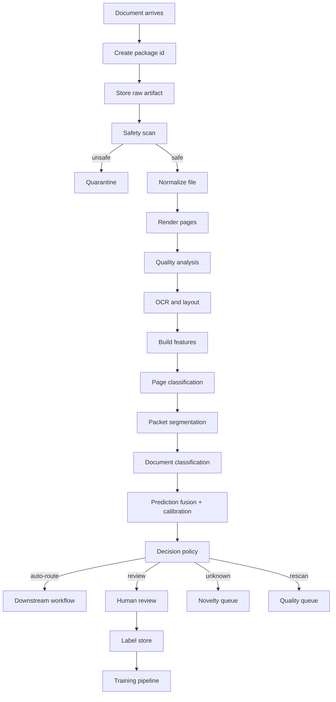

## 3. Flow 1 — Ingestion

### 3.1 Input

Possible input payload:

```json
{
  "file": "binary-stream-or-presigned-object-ref",
  "metadata": {
    "tenant_id": "tenant_acme",
    "source_type": "email_attachment",
    "business_process": "accounts_payable",
    "sender": "supplier@example.com",
    "filename": "invoice_12345.pdf",
    "submitted_at": "2026-06-08T08:15:11Z"
  }
}
```

### 3.2 Processing steps

1. Validate request and tenant.
2. Generate `package_id`.
3. Store raw object immutably.
4. Compute hash.
5. Create registry record.
6. Emit `DocumentPackageCreated`.

### 3.3 Output event

```json
{
  "event_type": "DocumentPackageCreated",
  "package_id": "pkg_01JZ8G7Q5WJ6R9PN8H0F4K6S5T",
  "raw_artifact_id": "art_raw_001",
  "source_type": "email_attachment",
  "business_process": "accounts_payable"
}
```

## 4. Flow 2 — Safety and validation

### 4.1 Checks

- File type allowed.
- File size and page count limits.
- Malware scan.
- Password/encryption status.
- Container recursion limit.
- Duplicate hash check.
- Tenant authorization.

### 4.2 Decisions

| Result | Action |
|---|---|
| Safe | Continue to normalization. |
| Duplicate | Link to existing package or reprocess depending on business policy. |
| Password-protected | Reject or review depending on source. |
| Malware | Quarantine. |
| Unsupported file | Manual triage or reject. |

## 5. Flow 3 — Normalization

### 5.1 Input

- Raw artifact reference.
- File metadata.
- Processing policy.

### 5.2 Processing

| Input type | Normalization action |
|---|---|
| Image | Validate, orient, generate page. |
| Scanned PDF | Render each page to image. |
| Native PDF | Extract native text if available; render pages for visual pipeline. |
| DOCX/XLSX/PPTX | Convert to PDF/pages, preserve original. |
| EML | Convert body to document and extract attachments. |
| ZIP | Extract child files, create child packages. |
| TIFF | Split frames to pages. |

### 5.3 Outputs

- `Page` records.
- Normalized PDF artifact if produced.
- Page image artifacts.
- Thumbnail artifacts.
- `NormalizationCompleted` event.

## 6. Flow 4 — Page quality analysis

Quality matters because confidence should depend on input quality.

Quality features:

- Blank page probability.
- Blur score.
- Skew angle.
- Rotation confidence.
- DPI.
- Darkness/contrast score.
- OCR feasibility estimate.
- Edge cropping detection.
- Noise score.
- Compression artifact score.

Example output:

```json
{
  "page_id": "pg_0001",
  "quality": {
    "blank_probability": 0.01,
    "blur_score": 0.08,
    "skew_degrees": 0.4,
    "ocr_feasibility": 0.97,
    "warnings": []
  }
}
```

## 7. Flow 5 — OCR and layout

### 7.1 OCR/layout execution

For each page:

1. Run OCR and native text extraction.
2. Merge native text and OCR carefully if both exist.
3. Detect reading order.
4. Detect layout blocks.
5. Detect tables/key-value-like structures when available.
6. Store canonical OCR/layout JSON.

### 7.2 OCR/layout output use

The output is used by:

- Text classifier.
- Layout-aware classifier.
- Rules.
- Search index.
- Review UI overlays.
- Evidence generation.
- Downstream extractors.

## 8. Flow 6 — Feature building

Feature building turns raw OCR/layout/images into model-ready inputs.

### 8.1 Page-level features

- First 256/512/1024 OCR tokens.
- Token bounding boxes normalized to 0–1000 or 0–1 scale.
- Page image resized to model input size.
- Layout block graph.
- Visual embeddings.
- Keyword and regex indicators.
- Quality vector.

### 8.2 Document-level features

- Concatenated text with page separators.
- First page / last page features.
- Page sequence features.
- Segment candidate features.
- Source metadata features.
- Aggregated embeddings.

## 9. Flow 7 — Page classification

Page classification predicts each page independently or with local context.

Example page classes:

- `invoice_page`
- `contract_page`
- `bank_statement_page`
- `id_document_front`
- `id_document_back`
- `blank_page`
- `separator_page`
- `unknown_page`

Page classification output:

```json
{
  "page_id": "pg_0001",
  "top_k": [
    {"class_id": "page.invoice", "score": 0.96},
    {"class_id": "page.purchase_order", "score": 0.02}
  ],
  "model_version": "page-cls-v1.8.0"
}
```

## 10. Flow 8 — Packet segmentation

Segmentation decides document boundaries.

Methods:

- Blank/separator page detection.
- Page class transition model.
- Sequence labeling with BIO tags: `B-INVOICE`, `I-INVOICE`, `B-CONTRACT`, etc.
- Layout similarity between adjacent pages.
- Header/footer continuity.
- Page numbering cues.
- Barcode/form-code cues.
- VLM/LLM fallback for ambiguous packets.

Example:

```json
{
  "segments": [
    {"segment_id": "seg_001", "page_ranges": [{"from_page": 1, "to_page": 2}], "split_confidence": 0.94},
    {"segment_id": "seg_002", "page_ranges": [{"from_page": 3, "to_page": 5}], "split_confidence": 0.89}
  ]
}
```

## 11. Flow 9 — Document classification

Each `DocumentSegment` is classified into business taxonomy classes.

### 11.1 Candidate classifiers

Run these in parallel or staged order:

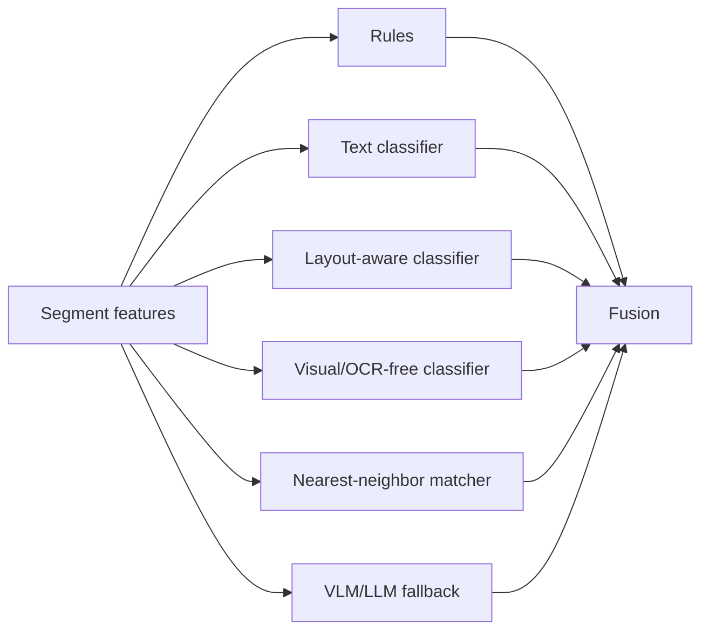

### 11.2 Staged cost-aware execution

For cost control:

1. Run rules + cheap text classifier.
2. Run layout-aware model for likely structured docs.
3. Run visual/OCR-free model if OCR quality is low or visual signatures matter.
4. Run VLM/LLM fallback only if uncertainty remains or the class is unknown/high ambiguity.

## 12. Flow 10 — Fusion and calibration

Fusion combines candidates into a calibrated prediction.

Example logic:

```text
combined_score[class] =
  w_rule * rule_score[class] +
  w_text[class] * text_score[class] +
  w_layout[class] * layout_score[class] +
  w_visual[class] * visual_score[class] +
  w_vlm[class] * vlm_score[class] +
  source_prior[class]

p_calibrated = calibrator(combined_score, quality_features, model_agreement)
```

Recommended output:

- `top_class_id`
- `p_calibrated`
- `top_k`
- `margin`
- `entropy`
- `ood_score`
- `model_agreement`
- `prediction_set`

## 13. Flow 11 — Decision policy

Policy turns prediction into action.

### 13.1 Example thresholds

| Class risk | Auto-route threshold | Review threshold | Notes |
|---|---:|---:|---|
| Low | 0.90 | 0.65 | Marketing, generic correspondence. |
| Medium | 0.94 | 0.70 | Invoices, purchase orders, HR docs. |
| High | 0.98 | 0.85 | Legal, KYC, regulated, high-value finance. |
| Critical | manual | 0.90 | Court orders, sanctions, fraud-sensitive. |

### 13.2 Decision examples

| Condition | Decision |
|---|---|
| `p=0.97`, threshold `0.94`, no warnings | `auto_route` |
| `p=0.76`, top-2 margin small | `review_required` |
| `p=0.99`, high-risk class requiring dual control | `review_required` |
| OCR quality poor and class confidence medium | `rescan_required` or `review_required` |
| OOD score high | `unknown_class` |
| Unsafe file | `quarantine` |

## 14. Flow 12 — Human review

When review is required:

1. Create `ReviewTask`.
2. Assign queue based on reason code.
3. Present document, page thumbnails, OCR overlays, prediction, and evidence.
4. Reviewer accepts/corrects class and split.
5. Store `ReviewResult`.
6. Produce `TrainingLabel` if eligible.
7. Resume routing or mark unsupported.

### 14.1 Review reason codes

- `LOW_CONFIDENCE`
- `LOW_MARGIN`
- `MODEL_DISAGREEMENT`
- `HIGH_RISK_CLASS`
- `POOR_IMAGE_QUALITY`
- `UNKNOWN_CLASS`
- `OOD_DETECTED`
- `UNSUPPORTED_FORMAT`
- `SPLIT_UNCERTAIN`
- `POLICY_SAMPLE_QA`

## 15. Flow 13 — Routing

Routing uses the final decision, not raw model output.

Routing payload:

```json
{
  "package_id": "pkg_01JZ8G7Q5WJ6R9PN8H0F4K6S5T",
  "segment_id": "seg_001",
  "class_id": "FIN.INVOICE.SUPPLIER",
  "confidence": 0.973,
  "route_target": "ap_automation",
  "extraction_profile": "invoice_v4",
  "artifact_refs": {
    "raw": "art_raw_001",
    "normalized_pdf": "art_norm_001",
    "ocr_layout": "art_ocr_001"
  },
  "audit_ref": "dec_001"
}
```

## 16. Training and feedback flow

```mermaid
flowchart TD
    A[Reviewed production samples] --> B[Label Store]
    C[Imported historical labels] --> B
    D[Weak labels / rules] --> B
    B --> E[Dataset snapshot]
    E --> F[Data quality checks]
    F --> G[Train candidate models]
    G --> H[Evaluate]
    H --> I[Calibrate]
    I --> J[Generate model card]
    J --> K[Staging deployment]
    K --> L[Shadow run]
    L --> M[Canary]
    M --> N[Production]
```

### 16.1 Dataset snapshot rules

A training dataset snapshot must record:

- Label version.
- Taxonomy version.
- Source artifact refs.
- Exclusion rules.
- Train/validation/test split ids.
- Random seed.
- Time window.
- Tenant eligibility.
- PII handling status.

### 16.2 Avoid leakage

Do not randomly split near-duplicate documents or pages from the same packet into train and test. Split by source, template family, account/customer, and time when possible.

## 17. Monitoring flow

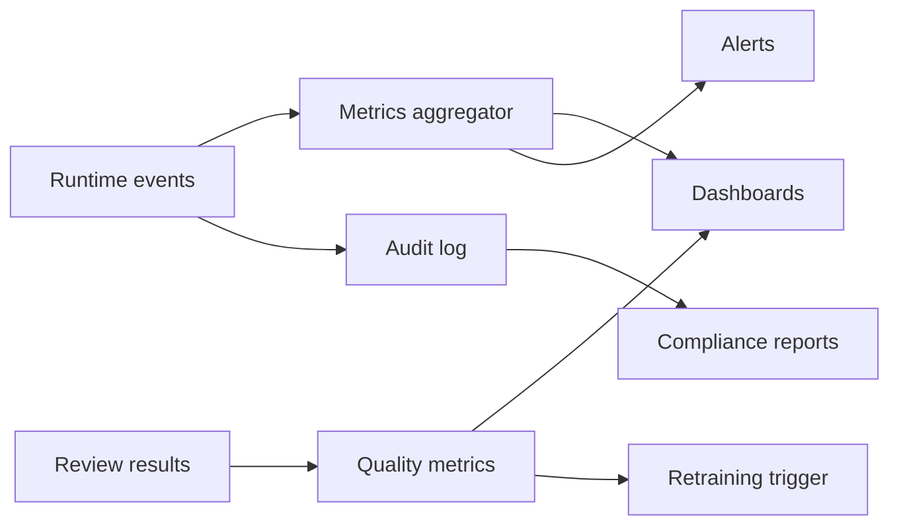

Monitored events:

- Document count by class/source.
- Unknown/OOD rate.
- Review rate.
- Reviewer correction rate.
- Class-level precision estimates.
- Latency and failures.
- Cost per page.
- Model disagreement.
- Drift indicators.

## 18. Failure and retry flow

| Failure | Retry? | Action |
|---|---|---|
| Temporary OCR API failure | yes | exponential backoff, dead-letter after limit |
| Model endpoint timeout | yes | retry or fallback model |
| Unsupported file | no | manual triage/reject |
| Corrupted PDF | no/partial | manual review or reject |
| Low-quality scan | no | rescan request or review |
| Routing target unavailable | yes | retry route, keep decision state |
| Review UI save conflict | yes | optimistic locking |

## 19. Data flow anti-patterns

Avoid:

- Passing only text to all models.
- Collapsing page-level and document-level decisions into one label.
- Deleting intermediate artifacts to save storage before audit requirements are clear.
- Letting downstream systems infer class from filename instead of final decision object.
- Updating labels without preserving previous label and reviewer reason.
- Using the same documents for threshold tuning and final evaluation.

## 20. Minimal MVP flow

The smallest useful production-like flow is:

1. Ingest PDF/image.
2. Store raw file.
3. Normalize to pages.
4. OCR/layout.
5. Text + layout-aware classification.
6. Calibrated threshold policy.
7. Human review for uncertain cases.
8. Store final decision.
9. Export decision to downstream system.
10. Feed review labels into dataset snapshot.


---

<!-- Source file: 05_model_strategy.md -->


# 05 — Model Strategy for 2026 Document Classification

## 1. Recommended model philosophy

Do not design the solution around a single classifier. The best practical design is a **hybrid classifier architecture**:

```text
rules + metadata + OCR text + layout-aware model + visual model + optional VLM/LLM fallback + calibration + policy
```

The model output is not the business decision. The system should separate:

1. Raw candidate predictions.
2. Fused/calibrated prediction.
3. Policy-based classification decision.
4. Human-reviewed final label where applicable.

## 2. Why hybrid classification is needed

Different document classes expose different signals:

| Signal | Strong for | Weak for |
|---|---|---|
| Filename/source metadata | controlled intake channels | open upload, renamed files |
| OCR text | contracts, letters, reports, native PDFs | poor scans, handwriting, visually similar forms |
| Layout | forms, invoices, statements, applications | plain text documents |
| Visual appearance | templates, scans, IDs, statements | documents differing mainly by wording |
| Business rules | known templates, barcodes, fixed forms | novel classes and exceptions |
| VLM/LLM reasoning | ambiguous/rare/zero-shot cases | high-volume cheap classification if used alone |

## 3. Model categories

### 3.1 Deterministic rules

Rules should handle known high-precision cases.

Examples:

- Barcode `FORM-1003` ⇒ mortgage application.
- `W-2` visible in top title region ⇒ W-2 tax form.
- Sender + mailbox + filename pattern strongly suggests AP invoice.
- PDF metadata contains known template id.

Rule output should still be represented as a `PredictionCandidate` with evidence and confidence. Rules should not bypass audit.

### 3.2 Text classifier

Text classifiers consume OCR/native text.

Recommended progression:

1. Baseline: TF-IDF + linear classifier.
2. Better: sentence/document embeddings + gradient boosted classifier or shallow neural classifier.
3. Stronger: fine-tuned transformer encoder.
4. Cloud option: managed custom text classification.

Strengths:

- Fast.
- Cheap.
- Easier to explain with keywords and snippets.
- Works well for letters, emails, contracts, reports.

Weaknesses:

- Sensitive to OCR quality.
- Loses layout information.
- Confuses classes with similar text but different visual structure.

### 3.3 Layout-aware transformer

Layout-aware models combine OCR tokens, bounding boxes, and sometimes page images. This is usually the core model for enterprise documents.

Good candidates:

- LayoutLMv3-style models.
- LiLT-style multilingual layout models.
- DocFormer-style multimodal architectures.
- Custom spatial transformer over OCR tokens.

Strengths:

- Strong on forms and visually rich documents.
- Uses both text and where text appears.
- Good balance of accuracy and production cost.

Weaknesses:

- Depends on OCR quality.
- Token limits require careful truncation/page handling.
- Multi-page documents need aggregation strategy.

### 3.4 Visual / OCR-free model

OCR-free models classify from the page image directly or learn to decode structured output from images.

Examples:

- Donut-style encoder-decoder.
- ViT/Swin/ConvNeXt page image classifier.
- Multimodal image-text encoders.

Strengths:

- Avoids OCR error propagation.
- Captures visual style and form structure.
- Useful for poor scans and multilingual/handwritten content.

Weaknesses:

- Harder to inspect evidence.
- More GPU-intensive.
- Needs robust image preprocessing.

### 3.5 VLM / LLM classifier

Vision-language models and LLMs can classify documents with constrained prompts and schema output.

Use cases:

- Fallback for ambiguous cases.
- Rare classes where supervised data is limited.
- Initial zero-shot taxonomy exploration.
- Reviewer assistive explanation.
- Weak-label generation for active-learning candidates.

Production controls:

- Use allowed class list only.
- Force JSON schema output.
- Store model prompt and output version.
- Do not expose chain-of-thought; store concise evidence only.
- Apply cost budget and rate limits.
- Human review high-risk outputs.
- Do not let LLM output override deterministic safety policies.

Example prompt pattern:

```text
You are classifying an enterprise document. Choose exactly one class_id from the allowed taxonomy or UNKNOWN.
Use only visible evidence from the document text/layout.
Return JSON matching the schema. Do not invent missing fields.

Allowed classes:
- FIN.INVOICE.SUPPLIER: Supplier invoice requesting payment.
- FIN.CREDIT_NOTE: Credit note reducing an invoice amount.
- FIN.PURCHASE_ORDER: Purchase order issued by buyer.

Document evidence:
<ocr text snippets, layout summaries, page thumbnails if VLM>
```

Schema:

```json
{
  "class_id": "FIN.INVOICE.SUPPLIER|FIN.CREDIT_NOTE|FIN.PURCHASE_ORDER|UNKNOWN",
  "confidence": "low|medium|high",
  "evidence": [
    {"page": 1, "kind": "text", "value": "Invoice No.", "why_it_matters": "invoice indicator"}
  ],
  "confusable_classes": ["FIN.CREDIT_NOTE"],
  "needs_human_review": false
}
```

## 4. Page vs document modeling

### 4.1 Page-level model

Classifies each page independently or with local context.

Use cases:

- Identify blank/separator pages.
- Detect document boundaries.
- Classify pages in packets.
- Route pages to specialized extractors.

### 4.2 Document-level model

Classifies one `DocumentSegment`.

Aggregation strategies:

| Strategy | Description | Good for |
|---|---|---|
| First page only | classify from first page | forms with strong title/header |
| Majority vote | aggregate page predictions | homogeneous multi-page docs |
| Max evidence | strongest page drives class | docs where only first/last page carries type |
| Sequence model | model page order | packets and multi-page forms |
| Attention aggregation | learn page weights | complex documents |
| Hierarchical model | page encoder + document encoder | high accuracy multi-page classification |

Recommended baseline:

- Use first page + all-page text + page sequence predictions.
- Add hierarchical model after enough data is available.

## 5. Packet splitting model

For document packets, segmentation is critical. Mis-splitting causes downstream extraction errors even if page classification is good.

Model options:

1. Rule-based separator/blank/barcode splitter.
2. Page class transition model.
3. BIO sequence labeling over pages.
4. Pairwise adjacent-page same-document classifier.
5. VLM/LLM fallback for ambiguous packet boundaries.

Recommended output:

```json
{
  "page_boundary_predictions": [
    {"after_page": 1, "new_document_probability": 0.04},
    {"after_page": 2, "new_document_probability": 0.91}
  ],
  "segments": [
    {"pages": [1,2], "split_confidence": 0.94},
    {"pages": [3,4,5], "split_confidence": 0.89}
  ]
}
```

## 6. Fusion design

### 6.1 Candidate inputs

Each classifier produces `top_k` predictions and evidence.

Example candidates:

| Classifier | Class | Raw score |
|---|---|---:|
| rule_form_title | `FIN.INVOICE.SUPPLIER` | 0.99 |
| text_classifier_v3 | `FIN.INVOICE.SUPPLIER` | 0.88 |
| layoutlmv3_v5 | `FIN.INVOICE.SUPPLIER` | 0.96 |
| visual_vit_v2 | `FIN.INVOICE.SUPPLIER` | 0.91 |
| nearest_neighbor | `FIN.CREDIT_NOTE` | 0.64 |

### 6.2 Fusion features

- Model score per class.
- Model rank per class.
- Model agreement.
- Class-specific model reliability.
- OCR quality.
- Source channel.
- Historical class prior for the source.
- Top-2 margin.
- OOD score.
- Rule strength.

### 6.3 Fusion implementation options

| Option | Pros | Cons |
|---|---|---|
| Weighted average | simple, transparent | weak when models are miscalibrated |
| Logistic regression stacker | interpretable, strong baseline | needs validation data |
| Gradient boosted stacker | handles nonlinear interactions | less transparent |
| Bayesian fusion | principled uncertainty | more complex |
| Conformal prediction | produces prediction sets | requires careful calibration split |

Recommended MVP: weighted average + per-class thresholds.
Recommended production: logistic/GBM stacker + calibration + conformal prediction sets for review.

## 7. Confidence and uncertainty

Raw model confidence is usually not enough. Store multiple uncertainty signals.

| Signal | Meaning |
|---|---|
| `p_calibrated` | estimated probability after calibration |
| `margin` | top probability minus second probability |
| `entropy` | overall uncertainty across classes |
| `prediction_set_size` | how many labels remain plausible |
| `ood_score` | novelty/out-of-distribution estimate |
| `model_agreement` | agreement between independent classifiers |
| `quality_penalty` | reduction due to scan/OCR quality |

### 7.1 Threshold policy example

```yaml
threshold_policy:
  default:
    auto_route: 0.95
    review: 0.70
  by_risk:
    low:
      auto_route: 0.90
      review: 0.60
    medium:
      auto_route: 0.94
      review: 0.70
    high:
      auto_route: 0.98
      review: 0.85
    critical:
      auto_route: null
      review: 0.90
  additional_review_triggers:
    - margin_below: 0.15
    - ood_score_above: 0.30
    - model_agreement_below: 0.70
    - ocr_mean_confidence_below: 0.80
```

## 8. Training data strategy

### 8.1 Minimum useful data

For a serious enterprise classifier:

| Stage | Suggested data |
|---|---|
| Prototype | 20–50 examples/class if using foundation/VLM-assisted fallback |
| MVP | 100–300 examples/class where possible |
| Production | 500+ examples/class for important classes, plus negative/confusable examples |
| High-risk class | more data, expert review, and separate test set |

Managed cloud services may start with fewer examples for custom classifiers, but production reliability still depends on representative examples and a careful test set.

### 8.2 Label types

| Label type | Use |
|---|---|
| Gold human label | training and final evaluation |
| Expert adjudicated label | high-risk classes and test sets |
| Historical label | bootstrapping, must be audited for noise |
| Weak rule label | pretraining or active learning candidate |
| LLM-assisted label | triage, never treat as gold without validation |
| Synthetic example | robustness testing and low-data augmentation |

### 8.3 Dataset split

Avoid naive random splits. Prefer:

- Time-based holdout.
- Source-system holdout.
- Template-family holdout.
- Vendor/customer holdout where applicable.
- Scanner/site holdout.
- Confusable-class stress set.

## 9. Evaluation metrics

### 9.1 Classification metrics

- Accuracy.
- Macro F1.
- Weighted F1.
- Per-class precision/recall/F1.
- Top-k accuracy.
- Confusion matrix.
- False auto-route rate.
- Review deflection rate.

### 9.2 Segmentation metrics

- Boundary precision/recall/F1.
- Segment exact match.
- Page-to-document assignment accuracy.
- Over-split and under-split rate.

### 9.3 Calibration metrics

- Expected Calibration Error (ECE).
- Brier score.
- Reliability curves.
- Accuracy by confidence bucket.

### 9.4 Business metrics

- Manual review rate.
- Reviewer correction rate.
- Straight-through processing rate.
- Cost per page.
- Time to route.
- Downstream extraction success rate.
- Misroute incident rate.

## 10. Error taxonomy

Track errors using a consistent taxonomy:

| Error type | Example |
|---|---|
| OCR failure | text missing due to poor scan |
| Layout confusion | invoice vs purchase order with similar terms |
| Split error | contract pages split into two docs |
| Taxonomy ambiguity | class definitions overlap |
| Source drift | new template from supplier |
| Unknown class | new document type not in taxonomy |
| Rule conflict | metadata rule contradicts visual evidence |
| Reviewer error | incorrect human correction |
| Downstream mismatch | classified correctly but sent to wrong extraction profile |

## 11. Active learning

Select samples for review/training based on value:

- Low confidence.
- Low margin.
- High model disagreement.
- High OOD score.
- New source/template cluster.
- High business volume class with rising errors.
- Random sample for unbiased quality measurement.
- High-risk class sample for compliance QA.

Active learning loop:


## 12. OOD and unknown-class handling

A production document classifier must admit when it does not know.

Methods:

- Maximum softmax probability threshold.
- Embedding distance from known training examples.
- Conformal prediction set too large.
- Autoencoder / density model over embeddings.
- High VLM uncertainty.
- Model disagreement.
- Novel cluster detection.

Unknown handling policy:

1. Route to novelty queue.
2. Reviewer assigns known class, unknown subtype, or new class candidate.
3. Product owner approves taxonomy change if needed.
4. Backfill labels and retrain.

## 13. Practical model roadmap

### Phase A — Baseline

- Rules.
- OCR text extraction.
- TF-IDF + linear classifier.
- Simple thresholds.
- Manual review.

### Phase B — Strong MVP

- Layout-aware model.
- Page classification.
- Packet splitting.
- Calibration.
- Per-class thresholds.
- Review feedback loop.

### Phase C — Advanced production

- Visual/OCR-free model.
- Fusion stacker.
- OOD detection.
- Active learning.
- Model monitoring.
- Shadow/canary deployments.

### Phase D — 2026 modern extension

- VLM fallback for ambiguous cases.
- LLM-assisted taxonomy maintenance.
- Reviewer copilot for evidence summaries.
- Semi-supervised class discovery.
- Cost-aware inference routing.
- Cross-cloud model adapters.

## 14. Recommended MVP model stack

For most enterprise use cases, start with:

| Layer | Technology pattern |
|---|---|
| OCR/layout | cloud OCR or strong open OCR adapter |
| Baseline classifier | TF-IDF + logistic regression |
| Primary classifier | LayoutLMv3-style layout-aware classifier |
| Visual backup | page-image ViT classifier or Donut-style model |
| Fusion | weighted/logistic stacker |
| Confidence | temperature scaling + per-class thresholds |
| Review | human UI with evidence overlays |
| Feedback | versioned label store + retraining pipeline |

## 15. Model anti-patterns

Avoid:

- LLM-only classification with no calibration.
- A single global confidence threshold.
- Evaluating only on clean public benchmark data.
- Ignoring packet splitting.
- Training on historical labels without noise analysis.
- Treating OCR confidence as document classification confidence.
- Promoting models without shadow comparison.
- Not storing model version and prompt version.
- Ignoring rejected/unknown documents during evaluation.


---

<!-- Source file: 06_implementation_plan.md -->


# 06 — Implementation Plan

## 1. Delivery strategy

Build the solution in increments. The goal is not to build the most advanced model first. The goal is to build a reliable classification product with audit, review, and feedback loops, then improve model sophistication safely.

Recommended delivery phases:

1. Discovery and taxonomy design.
2. Data foundation and ingestion.
3. OCR/layout and normalization.
4. Baseline classifier and review workflow.
5. Layout-aware classifier and packet splitting.
6. Calibration, thresholds, and decision policy.
7. MLOps, monitoring, and retraining.
8. Cloud hardening and production rollout.
9. Advanced VLM/LLM fallback and active learning.

## 2. Phase 0 — Discovery and scoping

### Goals

- Define business scope.
- Identify document classes.
- Understand source channels.
- Define risk levels and auto-routing policy.
- Collect sample documents.

### Tasks

- Interview business owners and operations users.
- Inventory input channels and downstream workflows.
- Create initial class taxonomy.
- Identify confusable classes.
- Define success metrics.
- Define privacy/retention constraints.
- Estimate volume, page counts, SLA, and peak load.
- Collect representative examples.

### Deliverables

- Class taxonomy v0.1.
- Source system inventory.
- Risk and routing matrix.
- Data availability report.
- Non-functional requirement list.

### Acceptance criteria

- At least the top 10–20 classes are clearly defined.
- Each class has examples and negative examples.
- Business owners agree on what should be auto-routed vs reviewed.
- Security/privacy constraints are documented.

## 3. Phase 1 — Data foundation

### Goals

- Create a reliable ingestion and storage foundation.
- Make every document traceable.
- Prepare for reprocessing and audit.

### Tasks

- Implement `DocumentPackage` registry table.
- Implement object store structure.
- Implement ingestion API.
- Implement idempotency and hash-based duplicate detection.
- Implement malware scan adapter.
- Implement event bus topics.
- Implement status state machine.
- Add basic admin/status API.

### Deliverables

- Running ingestion service.
- Raw object storage.
- Registry database.
- Event contracts.
- Basic status UI or API.

### Acceptance criteria

- A document can be submitted and traced by `package_id`.
- Raw file is stored immutably.
- Duplicate and malware scan results are recorded.
- Processing events are persisted.

## 4. Phase 2 — Normalization and OCR/layout

### Goals

- Convert all supported file formats into canonical pages.
- Extract text and layout in a provider-neutral format.

### Tasks

- Implement normalizer for PDF, image, TIFF, Office files, and email body if required.
- Render page images and thumbnails.
- Add page quality analyzer.
- Integrate OCR/layout provider.
- Map provider output to canonical schema.
- Store OCR/layout JSON artifacts.
- Index OCR text for search/debug.

### Deliverables

- Normalization service.
- OCR/layout adapter.
- Page and OCR artifact schema.
- Reviewable page thumbnails.

### Acceptance criteria

- Supported inputs produce page records and page images.
- OCR/layout output contains text, confidence, and bounding boxes.
- Poor quality and blank pages are detected.
- The pipeline can be replayed for a package.

## 5. Phase 3 — Baseline classification MVP

### Goals

- Build a first measurable classifier.
- Route only safe high-confidence cases.
- Send uncertain cases to review.

### Tasks

- Create training dataset manifest from available labels.
- Implement rule/metadata classifier.
- Implement TF-IDF + logistic regression or similar text classifier.
- Implement candidate prediction schema.
- Implement simple fusion.
- Implement thresholds by class/risk.
- Implement review queue creation.
- Implement manual correction UI/API.
- Store review labels.

### Deliverables

- Baseline classifier service.
- Decision policy v0.1.
- Review task workflow.
- Initial evaluation report.

### Acceptance criteria

- System produces final `ClassificationDecision` objects.
- Uncertain cases go to review.
- Reviewer corrections create training labels.
- Baseline metrics are known by class.

## 6. Phase 4 — Layout-aware classification

### Goals

- Improve accuracy for visually rich documents.
- Add page-level classification.
- Support document packet splitting.

### Tasks

- Prepare layout-aware model input from OCR tokens and boxes.
- Fine-tune or configure layout-aware model.
- Build page classifier.
- Implement sequence-based packet splitter.
- Add segment-level classification.
- Store page and segment predictions separately.
- Compare layout-aware model against baseline.

### Deliverables

- Page classifier.
- Segmenter.
- Layout-aware document classifier.
- Evaluation report with confusion matrix.

### Acceptance criteria

- Packet splitting works on representative multi-document PDFs.
- Layout-aware classifier improves target metrics on structured classes.
- Mis-split and misclassify examples are reviewable and labeled.

## 7. Phase 5 — Calibration and policy hardening

### Goals

- Make confidence usable for automation.
- Reduce false auto-routes.
- Implement class-specific thresholds.

### Tasks

- Create held-out calibration set.
- Apply temperature scaling or isotonic calibration.
- Evaluate reliability curves.
- Define thresholds by class/risk/source.
- Add OOD score and model disagreement triggers.
- Implement policy simulation on historical data.
- Add manual-only classes.

### Deliverables

- Calibrated prediction output.
- Threshold policy file.
- Calibration report.
- Business policy simulation.

### Acceptance criteria

- Accuracy by confidence bucket is measured.
- False auto-route rate is within agreed limit.
- High-risk classes cannot bypass policy.
- Policy changes are versioned.

## 8. Phase 6 — Production MLOps

### Goals

- Make training and deployment reproducible.
- Monitor model quality and drift.
- Enable safe model promotion.

### Tasks

- Implement dataset snapshot builder.
- Implement training pipeline.
- Implement model registry integration.
- Add model card generation.
- Add staging, shadow, canary, production stages.
- Implement online monitoring dashboards.
- Add alerting for drift and review-rate spikes.
- Add reprocessing capability.

### Deliverables

- Automated training pipeline.
- Model registry and promotion workflow.
- Monitoring dashboards.
- Drift alerts.

### Acceptance criteria

- Any production decision can be tied to model/rule/taxonomy/policy version.
- New model versions can be shadow tested.
- Production can roll back to previous model.
- Drift and review rate are visible.

## 9. Phase 7 — Advanced modern capabilities

### Goals

- Add cost-aware VLM/LLM fallback.
- Improve unknown-class handling.
- Accelerate learning from review feedback.

### Tasks

- Implement VLM/LLM classifier adapter with strict JSON schema.
- Add cost and rate-limit controls.
- Add active learning sample selector.
- Add nearest-neighbor similarity search for reviewer evidence.
- Add unknown-class clustering dashboard.
- Add reviewer copilot evidence summaries.
- Add synthetic/weak label workflow with human verification.

### Deliverables

- VLM fallback service.
- Active learning pipeline.
- Novelty queue.
- Reviewer assist features.

### Acceptance criteria

- VLM fallback runs only when policy allows it.
- Cost per page remains within budget.
- Unknown documents are clustered and triaged.
- Active learning improves target classes over time.

## 10. Work breakdown structure

### Epic A — Platform foundation

| Story | Description |
|---|---|
| A1 | Create registry schema and state machine. |
| A2 | Implement object storage abstraction. |
| A3 | Implement event bus contracts. |
| A4 | Implement ingestion API. |
| A5 | Implement connector framework. |
| A6 | Implement malware scan adapter. |

### Epic B — Document processing

| Story | Description |
|---|---|
| B1 | Render PDF/image/TIFF to pages. |
| B2 | Convert Office files to normalized PDF/pages. |
| B3 | Generate thumbnails. |
| B4 | Analyze page quality. |
| B5 | Integrate OCR/layout provider. |
| B6 | Map OCR/layout to canonical schema. |

### Epic C — Classification

| Story | Description |
|---|---|
| C1 | Implement taxonomy service. |
| C2 | Implement rule classifier. |
| C3 | Train baseline text classifier. |
| C4 | Implement layout-aware classifier. |
| C5 | Implement page classifier. |
| C6 | Implement packet segmenter. |
| C7 | Implement fusion/calibration. |
| C8 | Implement VLM fallback adapter. |

### Epic D — Review and feedback

| Story | Description |
|---|---|
| D1 | Create review task service. |
| D2 | Build review UI with thumbnails. |
| D3 | Add OCR/layout overlay. |
| D4 | Add class correction and split correction. |
| D5 | Store review result and training label. |
| D6 | Add active learning queue. |

### Epic E — MLOps and operations

| Story | Description |
|---|---|
| E1 | Dataset snapshot pipeline. |
| E2 | Training job pipeline. |
| E3 | Evaluation and model card. |
| E4 | Model registry. |
| E5 | Shadow/canary deployment. |
| E6 | Monitoring dashboards. |
| E7 | Drift alerts. |

### Epic F — Integration

| Story | Description |
|---|---|
| F1 | Downstream routing adapter. |
| F2 | ECM metadata writeback. |
| F3 | Case/workflow system integration. |
| F4 | Extraction processor routing. |
| F5 | Reprocessing API. |

## 11. Suggested timeline

### 12-week delivery plan

| Week | Focus | Outcome |
|---:|---|---|
| 1 | Discovery, taxonomy, architecture | agreed scope and classes |
| 2 | Data model, storage, registry | core schema and object layout |
| 3 | Ingestion API, event bus | documents can enter system |
| 4 | Normalization and page rendering | canonical pages available |
| 5 | OCR/layout integration | text/layout artifacts available |
| 6 | Baseline rules/text classifier | first classification output |
| 7 | Review workflow | uncertain docs can be corrected |
| 8 | Layout-aware model | stronger structured classification |
| 9 | Packet splitting | multi-document PDFs supported |
| 10 | Calibration and thresholds | confidence-based decisions |
| 11 | Monitoring and MLOps | dashboards and model registry |
| 12 | Pilot rollout | controlled production pilot |

### 6-month production hardening roadmap

| Month | Focus |
|---:|---|
| 1 | MVP platform and baseline classifier. |
| 2 | Review UI and feedback loop. |
| 3 | Layout-aware classifier and packet splitting. |
| 4 | Calibration, MLOps, monitoring, model registry. |
| 5 | Production integration, security hardening, performance tuning. |
| 6 | VLM fallback, active learning, unknown-class management, multi-cloud adapters. |

## 12. MVP scope recommendation

### Include in MVP

- PDF/image ingestion.
- Raw object storage.
- Registry and status API.
- OCR/layout extraction.
- 10–20 document classes.
- Rule + text classifier.
- Layout-aware classifier if labeled data is available.
- Human review queue.
- Final decision object.
- Simple downstream export.
- Evaluation report.

### Exclude from MVP unless required

- Full multi-cloud deployment.
- VLM fallback for every document.
- Fully automated retraining.
- Complex active learning.
- Advanced explainability dashboards.
- Multi-language optimization beyond current data.
- Fine-grained extraction after classification.

## 13. Acceptance criteria by capability

| Capability | Acceptance criterion |
|---|---|
| Ingestion | Every file receives `package_id`, raw object ref, and status. |
| Normalization | Supported files produce pages and thumbnails. |
| OCR/layout | OCR tokens include text, bbox, confidence, and page id. |
| Classification | Every segment receives top-k predictions and final decision. |
| Confidence | Decision records include thresholds and calibrated confidence. |
| Review | Reviewer can correct class and split; correction is stored. |
| Audit | Decision can be reconstructed with model/rule/taxonomy versions. |
| Routing | Auto-routed documents reach the correct downstream endpoint. |
| Monitoring | Latency, error rate, review rate, and class distribution are visible. |
| MLOps | Model versions are registered and rollbacks are possible. |

## 14. Key risks and mitigations

| Risk | Mitigation |
|---|---|
| Taxonomy ambiguity | Define class descriptions, examples, negatives, and confusable classes. |
| Poor label quality | Human review, adjudication, label audits. |
| OCR quality issues | Quality analyzer, visual model fallback, rescan workflow. |
| Model overconfidence | Calibration, thresholds, review triggers. |
| New templates/classes | OOD detection, novelty queue, active learning. |
| Mis-splitting packets | Separate page classification and segmentation evaluation. |
| Cost blow-up from VLMs | Cost-aware routing, fallback only. |
| Vendor lock-in | Canonical data model and adapter layer. |
| Compliance exposure | PII handling, encryption, retention, audit, access controls. |
| Silent model degradation | Drift monitoring and reviewer correction metrics. |

## 15. Definition of done for production pilot

A production pilot is ready when:

- At least 80–90% of input volume is represented in the taxonomy.
- Test set covers classes, source systems, scanners, languages, and quality levels.
- Auto-route threshold policy is approved by business/risk owners.
- Review UI is operational.
- False auto-route rate is measured and acceptable.
- Model and policy versions are logged in decisions.
- Monitoring and alerts are live.
- Rollback procedure is documented and tested.
- Security review is complete.
- Downstream routing has a reconciliation report.

## 16. Team roles

| Role | Responsibility |
|---|---|
| Product owner | business scope, taxonomy approval, routing rules |
| Document AI architect | end-to-end design and trade-offs |
| Backend engineer | ingestion, registry, APIs, events |
| Data engineer | artifact stores, dataset snapshots, pipelines |
| ML engineer | model training, evaluation, calibration |
| MLOps engineer | serving, registry, deployment, monitoring |
| Frontend engineer | review UI |
| Security engineer | IAM, encryption, data handling |
| Business reviewers | label validation and feedback |
| Integration engineer | ECM/workflow/downstream adapters |


---

<!-- Source file: 07_deployment_ops.md -->


# 07 — Deployment and Operations

## 1. Deployment goals

The solution should support:

- Docker-based local development.
- Production deployment on Kubernetes or managed containers.
- Cloud provider adapters for AWS, Azure, and GCP.
- Optional self-hosted model serving.
- Managed OCR/document AI services where appropriate.
- Secure, auditable, scalable asynchronous processing.

## 2. Environment model

| Environment | Purpose | Data |
|---|---|---|
| `local` | developer testing | synthetic or anonymized samples |
| `dev` | shared integration testing | sanitized samples |
| `test` | QA and system testing | controlled test corpus |
| `staging` | production-like validation | masked production-like data if allowed |
| `prod` | live processing | production documents |
| `ml-lab` | experimentation | approved training data snapshots |

## 3. Local Docker development

### 3.1 Suggested local services

```yaml
services:
  api:
    image: doccls/api:dev
    depends_on: [postgres, minio, redpanda]
  orchestrator:
    image: doccls/orchestrator:dev
    depends_on: [redpanda, postgres]
  normalizer:
    image: doccls/normalizer:dev
  ocr-adapter:
    image: doccls/ocr-adapter:dev
  classifier:
    image: doccls/classifier:dev
  review-ui:
    image: doccls/review-ui:dev
  postgres:
    image: postgres:16
  minio:
    image: minio/minio
  redpanda:
    image: redpandadata/redpanda
  opensearch:
    image: opensearchproject/opensearch
  mlflow:
    image: ghcr.io/mlflow/mlflow
```

### 3.2 Local stack responsibilities

| Service | Purpose |
|---|---|
| PostgreSQL | registry, review tasks, taxonomy |
| MinIO | raw/normalized/OCR/result artifacts |
| Redpanda/Kafka | event bus |
| OpenSearch | OCR text search and debug |
| MLflow | experiment/model tracking |
| FastAPI services | ingestion, registry, classifier, review API |
| React app | review UI |

### 3.3 Local object layout

```text
s3://doccls-local/
  raw/{tenant}/{yyyy}/{mm}/{dd}/{package_id}/original
  normalized/{tenant}/{package_id}/normalized.pdf
  pages/{tenant}/{package_id}/page-0001.png
  thumbnails/{tenant}/{package_id}/page-0001.jpg
  ocr/{tenant}/{package_id}/ocr-layout.json
  features/{tenant}/{package_id}/features.json
  predictions/{tenant}/{package_id}/candidates.json
  decisions/{tenant}/{package_id}/decision.json
  reviews/{tenant}/{package_id}/review-snapshot.json
```

## 4. Production Kubernetes architecture

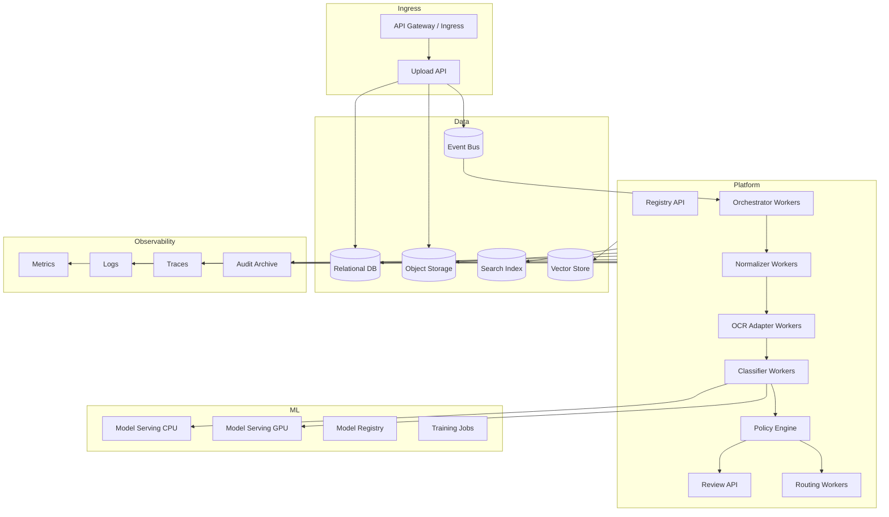

## 5. Scaling model

Scale by queue and workload type.

| Worker | Scaling signal | Notes |
|---|---|---|
| Ingestion API | request rate | stateless, CPU-light |
| Normalizer | queue depth, CPU, memory | can be CPU/memory heavy |
| OCR adapter | page queue depth, provider rate limit | cloud API throttling matters |
| Feature builder | page count, CPU/GPU if embeddings | batch embeddings where possible |
| Classifier CPU | request queue depth | rules/text models |
| Classifier GPU | GPU utilization, batch latency | layout/visual models |
| VLM fallback | budget, queue, rate limit | strict controls |
| Review API | user traffic | normal web app scaling |
| Routing worker | route queue depth | handle downstream retries |

## 6. AWS reference mapping

| Capability | AWS option |
|---|---|
| API | API Gateway + ECS/EKS/Lambda |
| Object storage | S3 |
| Registry DB | Aurora PostgreSQL or RDS PostgreSQL |
| Queue/events | SQS/SNS/EventBridge/MSK |
| OCR/layout | Amazon Textract |
| Text classification | Amazon Comprehend Custom Classification |
| IDP automation | Amazon Bedrock Data Automation where suitable |
| VLM/LLM fallback | Amazon Bedrock |
| Model training/serving | SageMaker |
| Model registry | SageMaker Model Registry or MLflow on EKS |
| Search | OpenSearch |
| Vector | OpenSearch vector, Aurora pgvector, managed vector DB |
| Review UI | ECS/EKS/Amplify + Cognito |
| Monitoring | CloudWatch, X-Ray, CloudTrail |
| Secrets | Secrets Manager |
| KMS | AWS KMS |

### AWS notes

- Textract is strong for OCR/layout and some domain-specific workflows.
- Comprehend custom classification is useful for text-centric classification.
- Bedrock/VLM fallback should be controlled by policy and budget.
- S3 event-driven processing works well, but use idempotent workers.

## 7. Azure reference mapping

| Capability | Azure option |
|---|---|
| API | API Management + Container Apps/AKS/App Service |
| Object storage | Blob Storage / ADLS Gen2 |
| Registry DB | Azure SQL or PostgreSQL Flexible Server |
| Queue/events | Event Grid, Service Bus, Event Hubs |
| OCR/layout/classification | Azure AI Document Intelligence |
| Model training/serving | Azure Machine Learning / Foundry |
| VLM/LLM fallback | Azure OpenAI / Azure AI Foundry models |
| Search | Azure AI Search |
| Vector | Azure AI Search vector, PostgreSQL pgvector |
| Review UI | Static Web Apps/App Service + Entra ID |
| Monitoring | Azure Monitor, Application Insights |
| Secrets | Key Vault |
| KMS | Key Vault managed keys |

### Azure notes

- Azure AI Document Intelligence custom classifiers can classify documents/page-level and are useful as managed provider adapters.
- Keep its output mapped into canonical schema to avoid lock-in.
- Azure AI Search can combine OCR text search and vector retrieval for reviewer evidence.

## 8. GCP reference mapping

| Capability | GCP option |
|---|---|
| API | API Gateway/Cloud Run/GKE |
| Object storage | Cloud Storage |
| Registry DB | Cloud SQL PostgreSQL / AlloyDB |
| Queue/events | Pub/Sub / Eventarc |
| OCR/layout/classification | Document AI and Document AI Workbench custom classifier |
| Model training/serving | Vertex AI |
| VLM/LLM fallback | Gemini via Vertex AI |
| Search | Vertex AI Search / OpenSearch self-hosted |
| Vector | Vertex AI Vector Search, AlloyDB pgvector |
| Review UI | Cloud Run + Identity-Aware Proxy |
| Monitoring | Cloud Monitoring, Cloud Trace, Cloud Logging |
| Secrets | Secret Manager |
| KMS | Cloud KMS |

### GCP notes

- Document AI custom classifier supports custom classes and managed workflows.
- Gemini-powered classifier versions can support zero-shot/fine-tuning use cases, but production usage should still be policy-controlled.

## 9. Cross-cloud adapter pattern

Keep provider-specific details behind adapters.

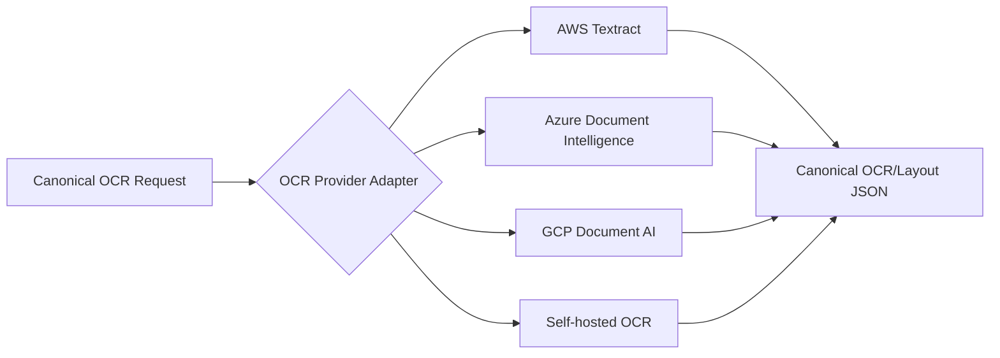

Adapter responsibilities:

- Translate request format.
- Handle provider authentication.
- Handle rate limits and retries.
- Normalize coordinate systems.
- Normalize confidence values as raw provider scores.
- Preserve provider raw response as artifact when allowed.
- Emit canonical result.

## 10. Security architecture

### 10.1 Identity and access

- Use service identities for every component.
- Apply least privilege.
- Separate read/write permissions by artifact prefix.
- Review UI access must be role-based.
- Human reviewers should see only assigned tenants/classes.
- Break-glass access must be logged.

### 10.2 Encryption

- Encrypt raw, normalized, OCR, and result artifacts at rest.
- Use TLS for all service-to-service communication.
- Use customer-managed keys where compliance requires it.
- Separate keys by tenant or environment if needed.

### 10.3 Sensitive data handling

- Redact logs.
- Never log full OCR text by default.
- Store prompts/LLM outputs carefully because they may contain sensitive text.
- Apply retention policies to raw and derived artifacts.
- Ensure training eligibility checks before using production documents.

## 11. Observability

### 11.1 Required dashboards

| Dashboard | Metrics |
|---|---|
| Pipeline health | document count, queue lag, failures, retries |
| Latency | per-stage latency, p50/p95/p99 |
| OCR quality | OCR confidence, blank pages, bad scans |
| Classification quality | class distribution, confidence, review rate |
| Human review | backlog, SLA, reviewer throughput, correction rate |
| Model drift | class drift, confidence drift, unknown rate |
| Cost | OCR cost/page, VLM cost/page, GPU cost, storage |

### 11.2 Required alerts

- Queue lag exceeds SLA.
- OCR provider error spike.
- Model endpoint latency/timeout spike.
- Review backlog exceeds SLA.
- Unknown/OOD rate spikes.
- Auto-route volume changes unexpectedly.
- Reviewer correction rate increases.
- Downstream routing failures increase.
- Cost budget threshold reached.

## 12. Resilience and retry

### 12.1 Retry policy

| Stage | Retry approach |
|---|---|
| Upload | client retry with idempotency key |
| Normalization | retry on transient errors only |
| OCR provider | exponential backoff, provider-specific throttling |
| Model inference | retry once then fallback if configured |
| Decision policy | deterministic, should not fail often |
| Routing | retry with dead-letter queue |

### 12.2 Dead-letter queues

Use dead-letter queues for:

- Normalization failures.
- OCR failures.
- Model inference failures.
- Routing failures.
- Event schema validation failures.

Each dead-letter item should include package id, failure reason, retry count, and recoverability.

## 13. Cost controls

Cost drivers:

- OCR per page.
- GPU inference for layout/visual models.
- VLM/LLM tokens/images.
- Storage of raw/images/OCR artifacts.
- Human review time.

Cost-control strategies:

- Skip OCR for unsupported/quarantined files.
- Downscale thumbnails separately from model images.
- Run cheap classifiers before expensive fallback.
- Cache OCR and features by document hash.
- Batch GPU inference.
- Use VLM fallback only for uncertain/high-value cases.
- Archive old page images according to retention policy.
- Monitor cost per class and source.

## 14. Production release checklist

- [ ] Threat model completed.
- [ ] Data retention policy implemented.
- [ ] PII logging disabled/redacted.
- [ ] Object storage lifecycle rules configured.
- [ ] Registry backups configured.
- [ ] Event schemas versioned.
- [ ] Worker retry and DLQ configured.
- [ ] Model registry and rollback configured.
- [ ] Review UI access controls tested.
- [ ] Downstream routing reconciliation tested.
- [ ] Dashboards and alerts live.
- [ ] Load test completed.
- [ ] Disaster recovery plan documented.
- [ ] Runbook completed.

## 15. Runbook outline

### Incident: OCR provider outage

1. Confirm provider status and local error rate.
2. Pause OCR workers if errors are non-transient.
3. Allow ingestion to continue if storage capacity is sufficient.
4. Notify operations of delayed classification.
5. Resume workers after provider stabilizes.
6. Backfill queued packages.
7. Review cost/retry impact.

### Incident: high misclassification rate

1. Check recent model/rule/taxonomy/policy deployment.
2. Compare correction rate by class and source.
3. Disable auto-route for affected class/source.
4. Roll back model or policy if needed.
5. Route affected items to review.
6. Create error analysis dataset.
7. Retrain or adjust thresholds.

### Incident: downstream routing failure

1. Stop or slow routing worker for target.
2. Keep classification decisions intact.
3. Retry route with idempotency key after target recovery.
4. Reconcile documents routed before failure.
5. Alert downstream owner.

## 16. Recommended deployment path

1. Start local Docker Compose for developer productivity.
2. Deploy dev/test on Kubernetes or managed containers.
3. Use managed OCR in early versions to reduce complexity.
4. Add self-hosted models only when accuracy/cost/privacy justify it.
5. Keep a canonical data model from day one.
6. Move to GPU inference only for classifiers that prove measurable value.
7. Roll out auto-routing gradually by class/source.


---

<!-- Source file: 08_governance_evaluation.md -->


# 08 — Governance, Evaluation, Risk, and Quality

## 1. Governance goals

Document classification can drive legal, financial, HR, compliance, and customer-impacting workflows. The governance model must make the system safe, auditable, and improvable.

Governance must cover:

- Taxonomy ownership.
- Label quality.
- Model evaluation.
- Confidence thresholds.
- Human review policy.
- Security and privacy.
- Auditability.
- Drift and incident response.
- Model promotion and rollback.

## 2. Taxonomy governance

### 2.1 Why taxonomy is critical

A classifier cannot be better than the class definitions. Many document classification failures are taxonomy failures, not model failures.

Common taxonomy problems:

- Two classes overlap.
- Business users use different names for the same class.
- A class is defined by downstream workflow rather than document content.
- Too many rare subclasses are introduced too early.
- Unknown classes are forced into known classes.

### 2.2 Taxonomy change process


### 2.3 Class definition template

Each class should have:

- Class id.
- Display name.
- Description.
- Inclusion criteria.
- Exclusion criteria.
- Positive examples.
- Negative examples.
- Confusable classes.
- Required evidence.
- Risk level.
- Auto-route threshold.
- Review threshold.
- Downstream route.
- Owner.

## 3. Label governance

### 3.1 Label quality levels

| Quality | Description | Training use |
|---|---|---|
| Bronze | historical/weak labels | exploratory only |
| Silver | human-reviewed once | training allowed with caution |
| Gold | expert-reviewed or adjudicated | train/evaluate |
| Platinum | expert consensus, high-risk set | final test and compliance evidence |

### 3.2 Label review process

- Use double review for high-risk or ambiguous classes.
- Track reviewer disagreement.
- Create adjudication workflow for conflicts.
- Sample accepted model predictions for quality control.
- Audit historical labels before training.
- Keep label source and label version.

## 4. Evaluation strategy

### 4.1 Test set structure

A good test set has multiple partitions:

| Partition | Purpose |
|---|---|
| Random holdout | general performance |
| Time-based holdout | future-like performance |
| Source holdout | source generalization |
| Template holdout | new template robustness |
| Low-quality scan set | OCR/visual robustness |
| Confusable class set | boundary errors |
| Unknown/OOD set | unknown handling |
| High-risk class set | compliance confidence |
| Packet set | split + classify behavior |

### 4.2 Classification metrics

Report:

- Overall accuracy.
- Macro F1.
- Weighted F1.
- Per-class precision, recall, F1.
- Top-2 / top-3 accuracy.
- Confusion matrix.
- False auto-route rate.
- Human review deflection rate.

### 4.3 Business-oriented metrics

| Metric | Meaning |
|---|---|
| Straight-through processing rate | percent auto-routed without review |
| False auto-route rate | auto-routed documents later found wrong |
| Review correction rate | percent reviewed cases changed by human |
| Time to decision | ingestion to decision latency |
| Cost per page | OCR + ML + infra + review cost |
| Downstream success rate | extraction/workflow accepted result |
| Unknown discovery rate | true new classes/templates found |

### 4.4 Segmentation metrics

For packets:

- Boundary precision.
- Boundary recall.
- Boundary F1.
- Exact segment match.
- Over-split rate.
- Under-split rate.
- Downstream extraction failure due to split error.

## 5. Confidence and calibration governance

### 5.1 Why calibration matters

A model can be accurate but overconfident. Automation decisions need calibrated probabilities, not just high raw scores.

### 5.2 Required reports

- Reliability curve.
- Expected Calibration Error.
- Brier score.
- Accuracy by confidence bucket.
- Class-specific threshold simulation.
- False auto-route simulation.

### 5.3 Threshold approval

Thresholds should be approved jointly by:

- Business owner.
- Operations owner.
- ML owner.
- Risk/compliance owner for sensitive classes.

Thresholds should be versioned and attached to every decision.

## 6. Human review governance

### 6.1 Review policy

Human review is required when:

- Confidence below class auto-route threshold.
- Margin is low.
- Model disagreement is high.
- OOD score is high.
- Document is high-risk or critical.
- Scan quality is poor.
- Packet split is uncertain.
- Source is untrusted.
- Random QA sample is selected.

### 6.2 Reviewer permissions

- Restrict by tenant, process, and document sensitivity.
- Hide/redact sensitive fields where feasible.
- Log every view and edit.
- Require second reviewer for high-risk corrections.

### 6.3 Review quality metrics

- Reviewer throughput.
- Reviewer disagreement rate.
- Adjudication overturn rate.
- Average review time by class.
- Correction rate by model version.
- SLA breach count.

## 7. Security and privacy

### 7.1 Security controls

| Control | Requirement |
|---|---|
| Encryption at rest | raw, normalized, OCR, features, predictions |
| Encryption in transit | all service calls |
| IAM | least privilege service identities |
| Tenant isolation | per-tenant access policy and data partitioning |
| Secrets | managed secret store only |
| Malware scanning | before parsing |
| Audit logging | every state transition and review action |
| Data minimization | no unnecessary copies or logs |
| Retention | lifecycle policies per class/source |

### 7.2 PII and sensitive data

OCR text can contain more sensitive data than the original file because it is searchable. Treat OCR/layout JSON as sensitive.

Controls:

- Redact logs.
- Avoid storing full OCR in application logs.
- Restrict search index access.
- Apply retention to derived artifacts.
- Restrict training eligibility for sensitive classes.
- Review external VLM/LLM use with privacy/compliance.

## 8. Auditability

Every decision must be reconstructable.

Minimum audit fields:

- Raw artifact hash.
- Package id and source context.
- Page generation parameters.
- OCR/layout provider and version.
- Model ids and versions.
- Rule pack version.
- Taxonomy version.
- Policy version and thresholds.
- Candidate predictions.
- Final decision.
- Review result if any.
- Downstream route result.

## 9. Model risk controls

### 9.1 Model card

Every promoted model should have a model card with:

- Intended use.
- Not intended use.
- Training data summary.
- Evaluation data summary.
- Metrics by class and source.
- Known limitations.
- Confusable classes.
- Calibration quality.
- Threshold recommendation.
- Security/privacy considerations.
- Approval status.

### 9.2 Promotion gates

A model can move to production only if:

- It beats or matches the incumbent on primary metrics.
- It does not regress high-risk classes beyond tolerance.
- Calibration is acceptable.
- False auto-route simulation is acceptable.
- Shadow test does not show unexpected drift.
- Rollback is possible.
- Model card is approved.

## 10. Drift monitoring

### 10.1 Drift types

| Drift | Signal |
|---|---|
| Class distribution drift | incoming class proportions change |
| Source drift | new scanner/vendor/email source |
| Template drift | layout embeddings shift |
| OCR quality drift | OCR confidence drops |
| Confidence drift | model confidence distribution changes |
| Review drift | reviewer correction rate changes |
| Unknown drift | OOD/unknown queue grows |

### 10.2 Drift response

1. Identify affected class/source/template.
2. Temporarily raise review requirements if needed.
3. Sample and label affected documents.
4. Update taxonomy/rules/model as needed.
5. Run targeted evaluation.
6. Promote fix through staging/canary.

## 11. Incident management

### 11.1 Misrouting incident

Steps:

1. Stop auto-routing for affected class/source.
2. Identify affected documents by decision version/time window.
3. Reprocess or review affected documents.
4. Notify downstream owners.
5. Root-cause error: taxonomy, OCR, model, policy, route mapping, or review.
6. Add regression test.
7. Update model/rule/policy.

### 11.2 Data exposure incident

Steps:

1. Disable affected access path.
2. Preserve audit logs.
3. Identify accessed artifacts and users/services.
4. Rotate credentials if needed.
5. Notify security/privacy owners.
6. Review logs and data retention.
7. Patch IAM/logging/search access.

## 12. Validation checklist before auto-routing a class

- [ ] Class definition approved.
- [ ] At least one strong evaluation set exists.
- [ ] Confusable classes tested.
- [ ] Threshold simulation completed.
- [ ] False auto-route rate acceptable.
- [ ] Review UI supports this class.
- [ ] Downstream route tested.
- [ ] Rollback plan exists.
- [ ] Monitoring by class is live.
- [ ] Business owner signs off.

## 13. Recommended KPI targets

These are starting points, not universal guarantees.

| KPI | Initial target |
|---|---:|
| High-confidence precision for auto-routed docs | 98–99%+ for medium/high-risk classes |
| Review correction rate | decreasing over time, monitored by class |
| Unknown/OOD rate | expected during early rollout, should stabilize |
| Packet split exact match | depends on packet complexity; track separately |
| Time to decision | near-real-time for small docs, async SLA for large packets |
| Audit completeness | 100% of final decisions |
| Model version traceability | 100% of predictions/decisions |

## 14. Compliance-friendly design decisions

- Store every model output separately from the final decision.
- Store thresholds used at decision time.
- Use immutable artifact references.
- Keep raw files and OCR/layout artifacts versioned.
- Human corrections should never overwrite original predictions silently.
- Use review queues for high-risk classes even when confidence is high if policy requires it.
- Keep prompt/model versions for any LLM/VLM involvement.
- Implement data retention on both raw and derived data.


---

<!-- Source file: 09_references.md -->


## Sources consulted

The design is intentionally vendor-neutral, but it reflects current 2025–2026 capabilities from major cloud and research sources:

- Microsoft Azure AI Document Intelligence custom classifier: https://learn.microsoft.com/en-us/azure/ai-services/document-intelligence/how-to-guides/build-a-custom-classifier?view=doc-intel-4.0.0
- Google Cloud Document AI custom classifier: https://docs.cloud.google.com/document-ai/docs/custom-classifier
- Amazon Textract overview: https://aws.amazon.com/textract/
- Amazon Textract Analyze Lending classification/extraction: https://docs.aws.amazon.com/textract/latest/dg/lending-document-classification-extraction.html
- Amazon Comprehend custom classification: https://docs.aws.amazon.com/comprehend/latest/dg/how-document-classification.html
- AWS Bedrock Data Automation / IDP concepts: https://docs.aws.amazon.com/bedrock/latest/userguide/bda.html
- LayoutLMv3 paper: https://arxiv.org/abs/2204.08387
- Donut OCR-free Document Understanding Transformer paper: https://arxiv.org/abs/2111.15664
- 2026 multimodal document type classification comparison: https://arxiv.org/abs/2606.02162
- RVL-CDIP dataset: https://adamharley.com/rvl-cdip/

## Reading notes

### Azure AI Document Intelligence custom classifier

Azure's custom classifier documentation is relevant because it supports page-level classification and multi-document/multi-instance scenarios. This reinforces the design choice that page-level classification and packet splitting should be first-class capabilities, not optional add-ons.

### Google Cloud Document AI custom classifier

Google's custom classifier documentation is relevant because it frames classification as a first step before extraction, which matches the recommended routing pattern: classify first, then send the document to the correct extractor or workflow.

### AWS Textract / Analyze Lending / Comprehend / Bedrock Data Automation

AWS materials are useful because they show the common enterprise IDP decomposition: classify, split, extract, validate, and route. Textract is an OCR/layout provider; Comprehend is a custom text classifier; Bedrock can be used for generative/VLM-based document processing where appropriate.

### LayoutLMv3

LayoutLMv3 is a strong reference architecture for OCR-dependent multimodal document AI because it combines text, layout, and image information. It is a good foundation for a layout-aware classifier.

### Donut

Donut is important because it represents OCR-free document understanding. OCR-free methods are useful when OCR is expensive, low quality, unavailable for the language, or error-prone.

### 2026 multimodal comparative analysis

The 2026 comparison is especially relevant because it evaluates specialized multimodal Transformers and LLM/VLM approaches for visually rich document type classification. Its conclusion supports a pragmatic design: use multimodal/layout-aware approaches as the production backbone and use LLM/VLM components selectively.

### RVL-CDIP

RVL-CDIP remains a common document image classification benchmark. It is useful for experimentation, but it should not replace enterprise-specific validation because real production documents differ by domain, source, language, scan quality, templates, and downstream business risk.