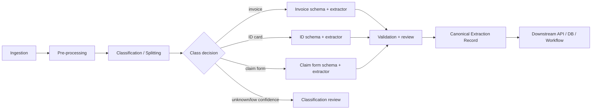

# 00 — Plan for a Modern Document Content Extraction System (2026)

## 1. Goal

Design and implement a document field extraction system that receives documents already processed by a classification/splitting pipeline, selects a class-specific extraction schema, extracts fields, validates them, routes uncertain cases to human review, and publishes trusted structured data to downstream systems.

The main document families are:

- invoices and credit notes,
- structured and semi-structured forms,
- ID documents such as ID cards, passports, driving licences, residence cards,
- handwritten forms and mixed handwritten/printed documents,
- receipts, bank statements, contracts, claims, onboarding packets, and other business documents,
- multi-page and multi-document PDFs where classification determines page ranges and logical document boundaries.

## 2. Relationship to the previous classification design

The previous classification system should remain the upstream decision layer. It produces:

- `document_packet_id`,
- `logical_document_id`,
- page range and page membership,
- candidate classes,
- selected `document_class`,
- class confidence,
- layout/OCR/visual features used for classification,
- routing decision,
- whether the classification itself requires human review.

The extraction system consumes this output and does **not** re-decide the full taxonomy unless confidence is low or extraction fails. Instead, it uses classification as the primary routing signal:

## 3. Core design decisions

| Decision | Rationale |
|---|---|
| Use a schema registry keyed by document class | Field sets depend on document class and schema version. |
| Keep OCR/layout separate from VLM/LLM extraction | OCR/layout is reusable, measurable, and often a bottleneck. |
| Use VLMs for layout-heavy, low-template, handwriting, and visual evidence tasks | VLMs can read directly from page images and reason about visual context. |
| Use deterministic parsers where possible | MRZ, barcode, QR, totals reconciliation, dates, VAT IDs, IBANs, and checksums should not rely only on generative output. |
| Store evidence for every field | Required for audit, human review, debugging, and trust. |
| Human review by field, not only by document | A document can be mostly correct while one high-value field is uncertain. |
| Version models, prompts, schemas, validators, and thresholds | Required for replay, regression testing, and controlled rollout. |
| Cloud-neutral canonical data model | Allows local Docker, AWS, Azure, GCP, and hybrid deployments. |

## 4. Phased implementation plan

### Phase 1 — Foundation and contracts

Deliverables:

- canonical extraction data model,
- event contracts,
- schema registry format,
- class-to-schema routing contract,
- immutable object storage layout,
- state machine for extraction jobs.

Acceptance criteria:

- an example classification result can be routed to the correct schema,
- a dummy extractor can produce a valid `ExtractionResult`,
- every object has stable IDs and idempotency keys,
- every stage can be replayed from stored inputs.

### Phase 2 — Baseline OCR/layout extraction

Deliverables:

- PDF/image renderer,
- image quality checks,
- OCR provider abstraction,
- layout model abstraction,
- page text, blocks, lines, words, tables, key-value candidates,
- searchable evidence index.

Acceptance criteria:

- printed PDFs and scans produce page-level OCR/layout records,
- bounding boxes use one normalized coordinate system,
- OCR output can be reused by multiple extractors,
- low-quality pages are flagged before extraction.

### Phase 3 — Class-specific schema-constrained extraction

Deliverables:

- invoice extractor,
- generic form extractor,
- ID-document extractor,
- handwritten-field extractor pattern,
- VLM/LLM adapter supporting structured JSON output,
- Pydantic / JSON Schema validation.

Acceptance criteria:

- output is valid JSON according to class schema,
- every field has value, confidence, evidence, and validation status,
- structured-output failure is retried with stricter prompt/decoder settings,
- missing and unreadable fields are represented explicitly, not silently omitted.

### Phase 4 — Validation and reconciliation

Deliverables:

- deterministic validator framework,
- cross-field checks,
- invoice arithmetic reconciliation,
- ID text/MRZ consistency checks,
- table row/total reconciliation,
- field-level review triggers.

Acceptance criteria:

- validation results are separated from model confidence,
- high-risk fields can require stricter thresholds,
- every review task includes evidence crops and candidate values,
- human corrections become labeled training/evaluation data.

### Phase 5 — Human review and audit

Deliverables:

- review queue API,
- reviewer UI contract,
- field correction model,
- audit log,
- adjudication workflow for conflicting reviewers.

Acceptance criteria:

- review can happen at field/document/batch level,
- reviewer decisions are immutable and traceable,
- final output shows whether each field was machine-extracted or human-corrected,
- downstream systems can consume only accepted records.

### Phase 6 — Production scaling and operations

Deliverables:

- Docker Compose development stack,
- Kubernetes/cloud production deployment,
- async worker queues,
- GPU inference pool,
- observability dashboards,
- evaluation harness,
- model/schema rollback process.

Acceptance criteria:

- ingestion and extraction scale independently,
- GPU-bound VLM/LLM workers are isolated from CPU-bound orchestration,
- latency/cost/accuracy metrics exist per class and per field,
- new schema versions can be canary-released.

## 5. MVP scope

Recommended MVP:

1. receive PDFs/images via API and object storage,
2. consume classification result from the previous system,
3. support three classes:
   - `invoice.v1`,
   - `generic_form.v1`,
   - `id_document.v1`,
4. use OCR/layout plus VLM extraction,
5. validate with Pydantic + deterministic business rules,
6. publish canonical JSON,
7. send low-confidence fields to a simple review queue.

## 6. Non-goals for the MVP

- full legal authenticity judgement for IDs,
- face matching or demographic inference from ID photos,
- all document classes at once,
- perfect handwriting recognition,
- fully automated processing of unknown document types,
- replacing business validation rules with prompts.

## 7. Key risks

| Risk | Mitigation |
|---|---|
| Wrong classification routes to wrong schema | Use class confidence thresholds, extraction sanity checks, fallback candidate classes. |
| VLM hallucination | Use schema constraints, evidence requirements, OCR grounding, null-over-guessing policy. |
| OCR failure on poor scans | Pre-quality checks, image enhancement, multiple OCR providers, human review. |
| Table extraction drift | Reconcile rows, totals, and detected table regions; keep visual evidence. |
| Cost explosion | Batch pages, cache OCR, avoid VLM calls where deterministic extraction works. |
| Unclear audit trail | Store raw input, intermediate outputs, model versions, prompts, evidence, and review actions. |

