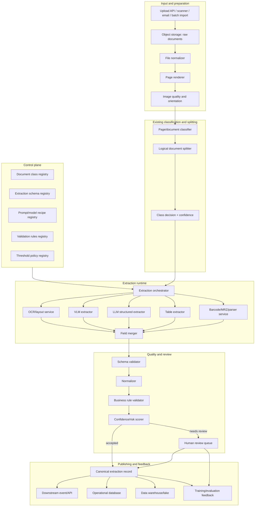
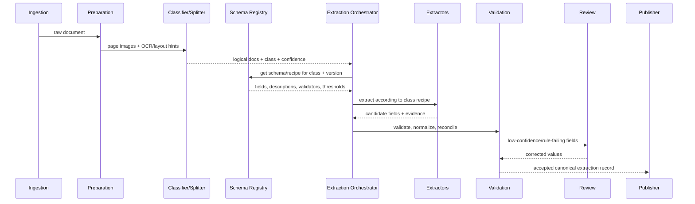

# 01 — Reference Architecture

## 1. Architecture overview

The system is a class-driven, schema-constrained, evidence-preserving document extraction platform.

It is composed of five large zones:

1. **Input and document preparation** — ingestion, file normalization, page rendering, image quality checks.
2. **Classification/splitting integration** — consume upstream class decisions and logical document boundaries.
3. **Extraction orchestration** — select schema, models, prompts, parsers, OCR/layout context, VLM calls, table extraction, deterministic parsers.
4. **Validation, confidence, review** — type checks, normalization, cross-field validation, confidence calibration, human review.
5. **Publishing, feedback, operations** — final canonical records, downstream APIs/events, training feedback, monitoring, evaluation.



## 2. Logical layers

### 2.1 Control plane

The control plane defines what the system is allowed to extract and how.

It contains:

- document class taxonomy,
- class aliases and versioning,
- field schemas,
- field descriptions,
- prompt templates,
- extraction recipes,
- validation policies,
- confidence thresholds,
- review policy,
- downstream mapping definitions.

This should be configuration-driven and reviewed like source code.

### 2.2 Data plane

The data plane processes documents.

It contains:

- ingestion APIs,
- storage adapters,
- queues,
- OCR/layout workers,
- VLM/LLM workers,
- extraction workers,
- validation workers,
- review task creation,
- publishing workers.

### 2.3 Feedback plane

The feedback plane turns operational usage into measurable improvement.

It contains:

- human corrections,
- false positives/false negatives,
- field-level accuracy metrics,
- class-level accuracy metrics,
- golden datasets,
- regression test suites,
- prompt/model/schema experiments,
- active learning candidate selection.

## 3. Component relationship to classification

Classification is not just a label; it is an extraction contract selector.



## 4. Recommended runtime decomposition

| Service | Scaling pattern | State | Notes |
|---|---:|---|---|
| Ingestion API | horizontal CPU | stateless | Handles uploads, callbacks, idempotency. |
| Document store | managed storage | stateful | Raw files, rendered pages, evidence crops. |
| Job orchestrator | horizontal CPU | DB-backed | Owns state machine and retries. |
| OCR/layout workers | CPU/GPU depending provider | stateless/cache | Often high-latency and reusable. |
| VLM workers | GPU | stateless | Batch page images, control concurrency. |
| LLM structured workers | GPU/API | stateless | Use schema-constrained JSON output. |
| Parser workers | CPU | stateless | MRZ, barcode, QR, checksums, regex, arithmetic. |
| Validator workers | CPU | stateless | Deterministic rules and score aggregation. |
| Review API/UI | horizontal CPU | DB-backed | Human correction and audit trail. |
| Publisher | horizontal CPU | DB/event-backed | Downstream mappings and delivery guarantees. |
| Evaluation service | batch/async | stateful | Golden set tests, drift metrics, replay. |

## 5. Recommended storage model

```text
s3://doc-ai/raw/{tenant}/{yyyy}/{mm}/{document_packet_id}/input.pdf
s3://doc-ai/rendered/{tenant}/{document_packet_id}/page-0001.png
s3://doc-ai/ocr/{tenant}/{document_packet_id}/ocr.json
s3://doc-ai/classification/{tenant}/{document_packet_id}/classification.json
s3://doc-ai/extraction-runs/{tenant}/{run_id}/candidates.json
s3://doc-ai/evidence/{tenant}/{run_id}/{field_id}/crop.png
s3://doc-ai/final/{tenant}/{logical_document_id}/extraction.json
```

A relational database or document database stores metadata, current state, indexes, review tasks, and downstream delivery status. Object storage stores large immutable artifacts.

## 6. Why not one end-to-end model only?

A single VLM prompt can work for demos, but production extraction needs:

- repeatability,
- schema versioning,
- deterministic validation,
- evidence traceability,
- per-field confidence,
- route-specific cost control,
- low-risk human review,
- reprocessing and audit.

Therefore, the recommended architecture is hybrid: OCR/layout + VLM/LLM + deterministic parsers + validators + review.

## 7. Architecture variants

### Variant A — OCR-first, LLM extraction

Best for high-volume printed documents where OCR is reliable.

Flow:

```text
PDF/image -> OCR/layout -> class schema -> LLM over OCR text/layout -> validators -> review
```

### Variant B — VLM-first extraction

Best for visually complex documents, handwritten forms, IDs, tables, and documents where OCR quality is weak.

Flow:

```text
page image -> VLM with schema + field descriptions -> evidence crops -> validators -> review
```

### Variant C — Hybrid ensemble

Best for high-risk documents.

Flow:

```text
OCR/layout + VLM + parser outputs -> field-level candidate merger -> validators -> review
```

### Variant D — Cloud-native managed IDP

Best when platform speed matters more than local model control.

Flow:

```text
Azure / AWS / GCP managed extractor -> canonical adapter -> validation -> review -> downstream
```

## 8. Recommended default

Use **Variant C** for the platform design, with per-class recipes choosing cheaper/simpler variants where enough.

Examples:

| Class | Default recipe |
|---|---|
| `invoice.v1` | OCR/layout + VLM/LLM + arithmetic validator + VAT/IBAN parsers. |
| `generic_form.v1` | OCR/layout + field-anchor extraction + VLM fallback for handwritten fields. |
| `id_document.v1` | VLM + OCR + MRZ/barcode parser + text consistency checks. |
| `receipt.v1` | OCR + table/line-item parser + VLM fallback. |
| `contract.v1` | OCR/layout + section chunking + schema-constrained LLM extraction. |

