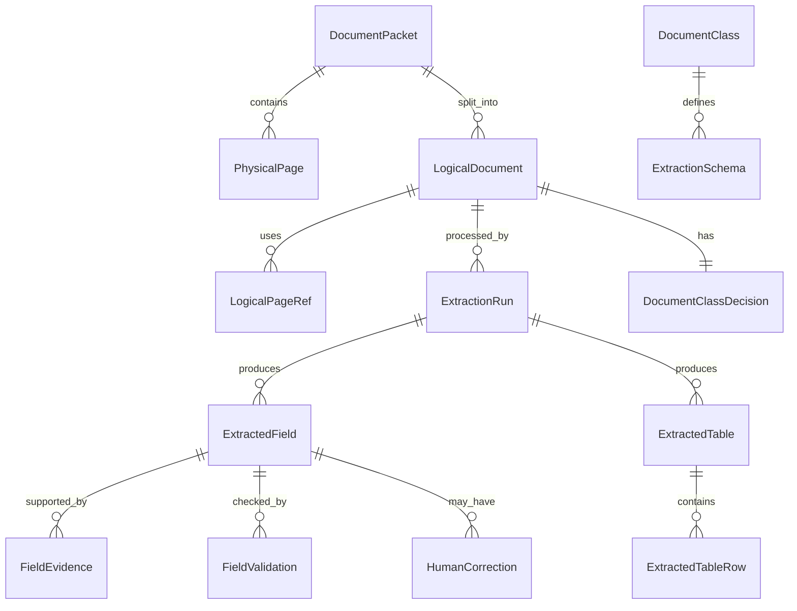

# 03 — Canonical Data Model

## 1. Data model goals

The data model must support:

- multi-document packets,
- page-level classification and logical splitting,
- class-specific extraction schemas,
- field-level evidence and confidence,
- handwritten and printed values,
- tables and line items,
- normalization and validation,
- human review and corrections,
- auditability and replay,
- downstream integration.

The model should separate **what the document says** from **how confident the system is** and **why the system believes it**.

## 2. Core entity overview



## 3. Top-level entities

### 3.1 `DocumentPacket`

Represents the original uploaded file or package.

```json
{
  "document_packet_id": "pkt_2026_000001",
  "tenant_id": "tenant_a",
  "source": {
    "source_type": "api_upload",
    "external_reference": "case-12345",
    "received_at": "2026-06-08T10:15:00Z"
  },
  "raw_artifact": {
    "uri": "s3://doc-ai/raw/tenant_a/2026/06/pkt_2026_000001/input.pdf",
    "sha256": "...",
    "mime_type": "application/pdf",
    "file_name": "input.pdf",
    "page_count": 5
  },
  "processing_status": "logical_documents_created"
}
```

### 3.2 `PhysicalPage`

Represents each rendered page of the original file.

```json
{
  "page_id": "page_pkt_2026_000001_0001",
  "document_packet_id": "pkt_2026_000001",
  "page_number": 1,
  "image_uri": "s3://doc-ai/rendered/tenant_a/pkt_2026_000001/page-0001.png",
  "width_px": 2480,
  "height_px": 3508,
  "dpi": 300,
  "quality": {
    "blur_score": 0.05,
    "skew_degrees": 0.7,
    "contrast_score": 0.88,
    "warnings": []
  }
}
```

### 3.3 `LogicalDocument`

Represents one business document inside a packet.

```json
{
  "logical_document_id": "ldoc_0001",
  "document_packet_id": "pkt_2026_000001",
  "page_refs": [
    {"page_id": "page_pkt_2026_000001_0001", "page_number": 1},
    {"page_id": "page_pkt_2026_000001_0002", "page_number": 2}
  ],
  "document_class_decision": {
    "selected_class": "invoice.v1",
    "confidence": 0.94,
    "candidate_classes": [
      {"class_id": "invoice.v1", "confidence": 0.94},
      {"class_id": "receipt.v1", "confidence": 0.04}
    ],
    "classification_run_id": "clsrun_123",
    "requires_review": false
  },
  "status": "ready_for_extraction"
}
```

## 4. Control-plane data model

### 4.1 `DocumentClass`

```yaml
class_id: invoice.v1
name: Invoice
parent_class_id: financial_document.v1
risk_level: medium
allowed_schema_versions:
  - invoice.schema.v1
  - invoice.schema.v2
classification:
  min_confidence_for_auto_extraction: 0.80
  fallback_classes:
    - receipt.v1
    - credit_note.v1
extraction:
  default_recipe_id: invoice.hybrid.v1
review:
  high_risk_fields:
    - supplier.tax_id
    - totals.amount_due
    - totals.total_gross
```

### 4.2 `ExtractionSchema`

```yaml
schema_id: invoice.schema.v1
class_id: invoice.v1
version: 1
status: active
fields:
  invoice_number:
    type: string
    required: true
    occurrence: single
    description: Unique invoice identifier printed by the supplier.
    evidence_required: true
    normalization: trim
    validators:
      - non_empty
  invoice_date:
    type: date
    required: true
    description: Invoice issue date. Prefer the date near labels such as Invoice Date, Date of Issue, Kelt.
    validators:
      - valid_date
  line_items:
    type: array
    required: false
    item_type: invoice_line_item
    description: Itemized goods or services table.
review_policy:
  default_auto_accept_threshold: 0.85
  high_risk_auto_accept_threshold: 0.95
```

### 4.3 `ExtractionRecipe`

```yaml
recipe_id: invoice.hybrid.v1
class_id: invoice.v1
schema_id: invoice.schema.v1
steps:
  - step: ocr_layout
    provider: internal_or_cloud
  - step: table_detection
    provider: layout_service
  - step: vlm_schema_extraction
    model: qwen3-vl-or-managed-vlm
    structured_output: json_schema
  - step: deterministic_parsers
    parsers: [iban, vat_id, date, currency, totals]
  - step: candidate_merge
  - step: validation
fallbacks:
  - when: structured_output_invalid
    action: retry_with_stricter_json_prompt
  - when: low_confidence_high_risk_field
    action: human_review
```

## 5. Extraction output model

### 5.1 `ExtractionRun`

Represents a single attempt to extract fields from a logical document.

```json
{
  "extraction_run_id": "extrun_2026_000001",
  "logical_document_id": "ldoc_0001",
  "class_id": "invoice.v1",
  "schema_id": "invoice.schema.v1",
  "recipe_id": "invoice.hybrid.v1",
  "started_at": "2026-06-08T10:16:00Z",
  "completed_at": "2026-06-08T10:16:41Z",
  "status": "needs_review",
  "models": [
    {
      "role": "vlm_extractor",
      "model_id": "qwen3-vl-local",
      "model_version": "2026-03",
      "prompt_version": "invoice_prompt.v4"
    }
  ]
}
```

### 5.2 `ExtractedField`

Every field should use a consistent wrapper.

```json
{
  "field_id": "invoice_number",
  "path": "header.invoice_number",
  "label": "Invoice number",
  "value": {
    "raw": "INV-2026-00421",
    "normalized": "INV-2026-00421",
    "type": "string"
  },
  "source": {
    "extraction_method": "vlm",
    "writing_type": "printed",
    "source_priority": 2
  },
  "confidence": {
    "model_confidence": 0.93,
    "ocr_confidence": 0.91,
    "evidence_confidence": 0.95,
    "validation_confidence": 1.0,
    "final_confidence": 0.93,
    "confidence_reason": "Value is clearly printed near Invoice No. label and passes non-empty validation."
  },
  "evidence": [
    {
      "evidence_id": "ev_001",
      "page_number": 1,
      "bbox": {"x": 0.62, "y": 0.12, "w": 0.22, "h": 0.03},
      "text_span": "Invoice No: INV-2026-00421",
      "crop_uri": "s3://doc-ai/evidence/extrun_2026_000001/invoice_number.png"
    }
  ],
  "validation": {
    "status": "passed",
    "rules": [
      {"rule_id": "non_empty", "status": "passed"}
    ]
  },
  "review": {
    "required": false,
    "reason": null
  }
}
```

### 5.3 Missing, unreadable, ambiguous values

Do not omit fields silently. Use explicit states.

```json
{
  "field_id": "customer_tax_id",
  "path": "customer.tax_id",
  "value": {
    "raw": null,
    "normalized": null,
    "type": "string"
  },
  "presence": "not_found",
  "confidence": {
    "final_confidence": 0.0,
    "confidence_reason": "No tax ID label or value found in the document."
  },
  "review": {
    "required": true,
    "reason": "Required field missing for invoice.v1."
  }
}
```

Recommended `presence` values:

- `present`,
- `not_found`,
- `unreadable`,
- `ambiguous`,
- `not_applicable`,
- `redacted`.

## 6. Evidence model

Evidence is the key to trust.

```json
{
  "evidence_id": "ev_001",
  "evidence_type": "bbox_text_crop",
  "page_id": "page_pkt_2026_000001_0001",
  "page_number": 1,
  "bbox": {
    "coordinate_system": "normalized_page",
    "x": 0.12,
    "y": 0.34,
    "w": 0.18,
    "h": 0.025
  },
  "text_span": "Total: 1,245.00 EUR",
  "ocr_word_ids": ["w_120", "w_121", "w_122"],
  "crop_uri": "s3://doc-ai/evidence/run/total.png",
  "evidence_confidence": 0.95
}
```

Use normalized coordinates from 0 to 1 to avoid provider-specific dimensions. Keep original image dimensions in `PhysicalPage`.

## 7. Table model

Tables need special handling because row/column relationships matter.

```json
{
  "table_id": "invoice_line_items",
  "path": "line_items",
  "page_numbers": [1],
  "bbox": {"x": 0.05, "y": 0.35, "w": 0.9, "h": 0.40},
  "columns": [
    {"column_id": "description", "label": "Description", "type": "string"},
    {"column_id": "quantity", "label": "Qty", "type": "decimal"},
    {"column_id": "unit_price", "label": "Unit price", "type": "money"},
    {"column_id": "line_total", "label": "Line total", "type": "money"}
  ],
  "rows": [
    {
      "row_index": 1,
      "cells": {
        "description": {"raw": "Consulting services", "normalized": "Consulting services"},
        "quantity": {"raw": "10", "normalized": 10},
        "unit_price": {"raw": "100.00", "normalized": {"amount": 100.00, "currency": "EUR"}},
        "line_total": {"raw": "1000.00", "normalized": {"amount": 1000.00, "currency": "EUR"}}
      },
      "validation": {
        "status": "passed",
        "rules": ["quantity_times_unit_price_equals_line_total"]
      }
    }
  ]
}
```

## 8. Validation model

Validation is separate from extraction confidence.

```json
{
  "rule_id": "invoice_total_reconciliation",
  "scope": "document",
  "severity": "error",
  "status": "failed",
  "message": "Subtotal + tax does not equal total gross.",
  "expected": "1245.00",
  "actual": "1240.00",
  "affected_fields": [
    "totals.subtotal",
    "totals.tax_total",
    "totals.total_gross"
  ],
  "review_required": true
}
```

Recommended rule statuses:

- `passed`,
- `warning`,
- `failed`,
- `not_applicable`,
- `not_evaluable`.

## 9. Human correction model

```json
{
  "correction_id": "corr_001",
  "field_path": "totals.total_gross",
  "old_value": "1240.00 EUR",
  "new_value": "1245.00 EUR",
  "reviewer_id": "reviewer_17",
  "corrected_at": "2026-06-08T10:25:00Z",
  "reason": "OCR missed digit 5 in total amount.",
  "source": "human_review",
  "evidence_id": "ev_total_gross_001"
}
```

## 10. Final canonical record

```json
{
  "logical_document_id": "ldoc_0001",
  "document_packet_id": "pkt_2026_000001",
  "class_id": "invoice.v1",
  "schema_id": "invoice.schema.v1",
  "extraction_run_id": "extrun_2026_000001",
  "status": "accepted_after_review",
  "fields": {},
  "tables": [],
  "validations": [],
  "review_summary": {
    "review_required": true,
    "review_completed": true,
    "corrected_fields": 1
  },
  "audit": {
    "created_at": "2026-06-08T10:16:41Z",
    "accepted_at": "2026-06-08T10:25:15Z",
    "pipeline_version": "doc-extract-pipeline.v1.3.0"
  }
}
```

## 11. Pydantic-style model skeleton

```python
from __future__ import annotations

from datetime import datetime, date
from decimal import Decimal
from enum import Enum
from typing import Any, Literal
from pydantic import BaseModel, Field


class Presence(str, Enum):
    PRESENT = "present"
    NOT_FOUND = "not_found"
    UNREADABLE = "unreadable"
    AMBIGUOUS = "ambiguous"
    NOT_APPLICABLE = "not_applicable"
    REDACTED = "redacted"


class BoundingBox(BaseModel):
    coordinate_system: Literal["normalized_page"] = "normalized_page"
    x: float = Field(ge=0, le=1)
    y: float = Field(ge=0, le=1)
    w: float = Field(ge=0, le=1)
    h: float = Field(ge=0, le=1)


class FieldEvidence(BaseModel):
    evidence_id: str
    page_number: int
    bbox: BoundingBox | None = None
    text_span: str | None = None
    ocr_word_ids: list[str] = Field(default_factory=list)
    crop_uri: str | None = None
    evidence_confidence: float = Field(ge=0, le=1)


class FieldValue(BaseModel):
    raw: str | None
    normalized: Any | None
    type: str


class FieldConfidence(BaseModel):
    model_confidence: float | None = Field(default=None, ge=0, le=1)
    ocr_confidence: float | None = Field(default=None, ge=0, le=1)
    evidence_confidence: float | None = Field(default=None, ge=0, le=1)
    validation_confidence: float | None = Field(default=None, ge=0, le=1)
    final_confidence: float = Field(ge=0, le=1)
    confidence_reason: str | None = None


class RuleResult(BaseModel):
    rule_id: str
    status: Literal["passed", "warning", "failed", "not_applicable", "not_evaluable"]
    message: str | None = None
    severity: Literal["info", "warning", "error", "critical"] = "info"


class FieldReview(BaseModel):
    required: bool
    reason: str | None = None
    status: Literal["not_required", "pending", "completed"] = "not_required"


class ExtractedField(BaseModel):
    field_id: str
    path: str
    label: str | None = None
    value: FieldValue
    presence: Presence = Presence.PRESENT
    writing_type: Literal["printed", "handwritten", "mixed", "unknown"] = "unknown"
    confidence: FieldConfidence
    evidence: list[FieldEvidence] = Field(default_factory=list)
    validation: list[RuleResult] = Field(default_factory=list)
    review: FieldReview


class ExtractionResult(BaseModel):
    logical_document_id: str
    document_packet_id: str
    class_id: str
    schema_id: str
    extraction_run_id: str
    status: Literal[
        "accepted", "accepted_with_warnings", "needs_review",
        "rejected", "accepted_after_review"
    ]
    fields: dict[str, ExtractedField]
    tables: list[dict[str, Any]] = Field(default_factory=list)
    document_validations: list[RuleResult] = Field(default_factory=list)
    created_at: datetime
```

