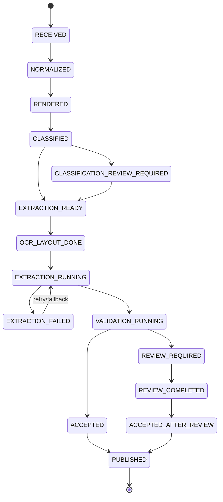
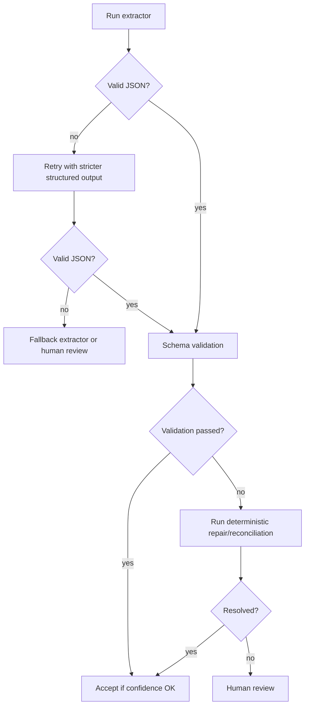
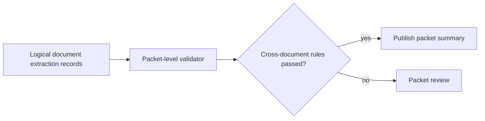

# 04 — End-to-End Data Flow

## 1. State machine overview

The extraction workflow should be asynchronous and replayable.



## 2. Data flow stages

### Stage 1 — Ingestion

Input:

- PDF/image/email/batch file,
- tenant ID,
- external reference,
- optional class hint,
- processing priority.

Processing:

- assign packet ID,
- hash file,
- store raw file,
- create job,
- emit event.

Output event:

```json
{
  "event_type": "DocumentPacketCreated",
  "event_version": "1.0",
  "document_packet_id": "pkt_2026_000001",
  "tenant_id": "tenant_a",
  "raw_uri": "s3://doc-ai/raw/tenant_a/2026/06/pkt/input.pdf",
  "sha256": "...",
  "received_at": "2026-06-08T10:15:00Z"
}
```

### Stage 2 — Normalization and rendering

Processing:

- validate file,
- check malware/password/encryption,
- render pages,
- create thumbnails,
- calculate page quality metrics,
- store page images.

Output:

- physical page records,
- page quality warnings,
- rendered image artifacts.

### Stage 3 — Classification and splitting

This is the existing upstream design.

Processing:

- classify each page or packet,
- split into logical documents,
- assign classes and page ranges,
- emit classification result.

Output:

```json
{
  "event_type": "LogicalDocumentClassified",
  "logical_document_id": "ldoc_0001",
  "document_packet_id": "pkt_2026_000001",
  "selected_class": "invoice.v1",
  "confidence": 0.94,
  "page_numbers": [1, 2],
  "requires_review": false
}
```

### Stage 4 — Class-to-schema routing

Processing:

- load `DocumentClass` definition,
- check class confidence threshold,
- select schema version,
- select extraction recipe,
- select validation policy,
- create extraction run.

Decision rules:

| Condition | Action |
|---|---|
| Class confidence >= auto threshold | Continue extraction. |
| Class confidence below threshold but top candidates are extractable | Run cautious extraction with top candidate schemas or route to classification review. |
| Class is unknown | Route to manual triage or generic extraction. |
| Class is unsupported | Store and notify downstream/manual process. |

### Stage 5 — OCR/layout enrichment

Processing:

- run OCR/layout if not already available,
- detect text blocks, tables, key-value candidates, selection marks,
- store OCR and layout records,
- create evidence index.

Output:

```json
{
  "ocr_run_id": "ocr_001",
  "logical_document_id": "ldoc_0001",
  "pages": [
    {
      "page_number": 1,
      "lines": [],
      "words": [],
      "tables": [],
      "selection_marks": []
    }
  ]
}
```

### Stage 6 — Extraction execution

The orchestrator runs the selected recipe.

Example invoice recipe:

```text
1. OCR/layout for text, words, tables, reading order
2. VLM page extraction using invoice schema and field descriptions
3. LLM extraction from OCR text for header/parties/totals
4. Table extractor for line items
5. Deterministic parsers for VAT IDs, IBANs, dates, currencies
6. Candidate merger
```

Example ID recipe:

```text
1. High-resolution page crop
2. OCR/VLM extraction of visible text fields
3. MRZ/barcode parser if present
4. Cross-check visible fields against machine-readable fields
5. No face matching or demographic inference
6. Human review for unreadable or inconsistent fields
```

### Stage 7 — Candidate merge

Candidate merge takes multiple possible values and chooses the best final candidate.

Example candidate set:

```json
{
  "field_path": "totals.total_gross",
  "candidates": [
    {"source": "ocr", "value": "1245.00", "confidence": 0.89},
    {"source": "vlm", "value": "1245.00", "confidence": 0.94},
    {"source": "llm_from_ocr", "value": "1240.00", "confidence": 0.72}
  ],
  "selected": {"source": "vlm", "value": "1245.00"},
  "reason": "VLM and OCR agree visually; LLM OCR-context candidate conflicts and fails total reconciliation."
}
```

Merge rules:

- prefer values with strong evidence,
- prefer deterministic parser output for machine-readable fields,
- penalize conflicts between sources,
- penalize low page quality,
- never invent missing values,
- keep alternatives for human review.

### Stage 8 — Normalization

Processing:

- date normalization to ISO 8601,
- amount normalization to decimal + currency,
- whitespace and punctuation cleanup,
- country/currency code normalization,
- address component normalization where possible,
- identifier formatting.

Rule:

- Preserve raw value always.
- Normalization must be reversible or explainable.

### Stage 9 — Validation

Validation layers:

1. **Schema validation** — types, required fields, structure.
2. **Field validation** — regex, checksum, allowed values.
3. **Cross-field validation** — date relationships, totals, ID consistency.
4. **Business validation** — known supplier/customer, purchase order match, case ID match.
5. **Risk validation** — high-risk fields require stricter confidence or review.

Output:

- field-level validation statuses,
- document-level validation statuses,
- review triggers.

### Stage 10 — Review routing

Review task is created if:

- required field missing,
- field confidence below threshold,
- validation failed,
- high-risk field has conflict,
- class confidence was borderline,
- page quality is too low,
- document class requires mandatory review.

Review task content:

```json
{
  "review_task_id": "rev_001",
  "logical_document_id": "ldoc_0001",
  "field_path": "totals.total_gross",
  "proposed_value": "1245.00 EUR",
  "alternatives": ["1240.00 EUR"],
  "reason": "High-risk total field has conflicting candidates.",
  "evidence": ["crop_uri", "page_number", "bbox"],
  "priority": "high"
}
```

### Stage 11 — Final record creation

After validation and review, the system creates a final canonical extraction record.

Statuses:

- `accepted`,
- `accepted_with_warnings`,
- `needs_review`,
- `accepted_after_review`,
- `rejected`,
- `failed`.

### Stage 12 — Publishing

Downstream options:

- REST callback,
- message/event topic,
- database table,
- ERP import file,
- case-management API,
- data warehouse/lake,
- search index/RAG index.

Publishing must be idempotent.

Event example:

```json
{
  "event_type": "ExtractionAccepted",
  "event_version": "1.0",
  "logical_document_id": "ldoc_0001",
  "class_id": "invoice.v1",
  "schema_id": "invoice.schema.v1",
  "status": "accepted_after_review",
  "final_record_uri": "s3://doc-ai/final/tenant_a/ldoc_0001/extraction.json",
  "published_at": "2026-06-08T10:30:00Z"
}
```

## 3. Data lineage

Every final value should be traceable:

```text
final field value
  -> human correction, if any
  -> selected machine candidate
  -> extractor/model/prompt/schema version
  -> evidence crop/text span
  -> rendered page image
  -> original file
  -> ingestion source
```

## 4. Retry and fallback flow



## 5. Multi-document packet flow

Input packet:

```text
pages 1-2: invoice
page 3: ID card
pages 4-5: claim form
```

Logical documents:

```text
ldoc_0001 -> invoice.v1 -> pages [1, 2]
ldoc_0002 -> id_card.hu.v1 -> pages [3]
ldoc_0003 -> claim_form.health.v1 -> pages [4, 5]
```

Each logical document receives its own extraction run, schema, validation, review task set, and final record. The packet-level record keeps the relationship between them.

## 6. Cross-document validation

Some workflows need packet-level validation:

- customer name on ID must match customer name on application form,
- invoice supplier must match purchase order supplier,
- claim form policy number must match attached policy statement,
- bank account statement holder must match onboarding form applicant.

This should be a separate packet-level validation stage after individual logical document extraction.



## 7. Feedback flow

Human review corrections and downstream rejections should feed the evaluation system.

```text
human correction -> correction store -> labeled dataset candidate -> schema/model/prompt evaluation -> controlled rollout
```

Do not immediately fine-tune on every correction. First deduplicate, quality-check, and split into train/test/golden sets.

