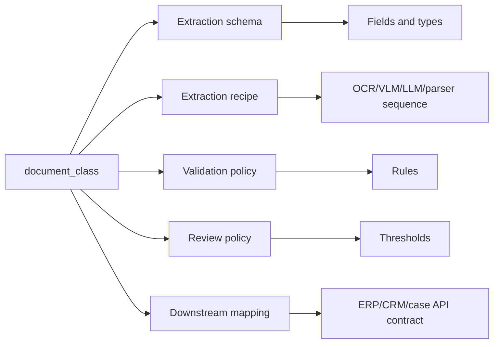

# 05 — Class-Based Schema Registry

## 1. Why schema registry is central

The extraction fields depend on the document class. Therefore, the classification result must not just be a label; it must select the extraction contract.

The schema registry answers:

- which fields must be extracted for this class,
- which fields are optional,
- which fields are repeated,
- which fields are nested,
- which model/prompt/parser should be used,
- what counts as valid,
- which confidence threshold is required,
- whether human review is mandatory,
- how the result maps to downstream systems.

## 2. Class-to-schema-to-recipe mapping



## 3. Recommended registry structure

```text
registry/
  classes/
    invoice.v1.yaml
    credit_note.v1.yaml
    receipt.v1.yaml
    id_card.hu.v1.yaml
    passport.generic.v1.yaml
    claim_form.health.v1.yaml
  schemas/
    invoice.schema.v1.yaml
    invoice.schema.v2.yaml
    id_document.schema.v1.yaml
    generic_form.schema.v1.yaml
  recipes/
    invoice.hybrid.v1.yaml
    id_document.vlm_parser.v1.yaml
    generic_form.anchor_vlm.v1.yaml
  validators/
    invoice.rules.v1.yaml
    id_document.rules.v1.yaml
  prompts/
    invoice_prompt.v4.md
    id_document_prompt.v2.md
  downstream_mappings/
    erp_invoice_import.v1.yaml
```

## 4. Document class definition

```yaml
class_id: invoice.v1
name: Invoice
version: 1
parent_class_id: financial_document.v1
status: active
risk_level: medium
supported_languages:
  - en
  - hu
  - de
  - any
classification:
  min_confidence_for_auto_extraction: 0.80
  min_confidence_for_auto_publish: 0.90
  review_if_confused_with:
    - receipt.v1
    - credit_note.v1
extraction:
  schema_id: invoice.schema.v1
  recipe_id: invoice.hybrid.v1
  validator_policy_id: invoice.rules.v1
  prompt_id: invoice_prompt.v4
review:
  default_review_policy_id: medium_risk_financial.v1
  mandatory_review: false
downstream:
  mapping_id: erp_invoice_import.v1
```

## 5. Schema field definition

Each field should include more than just a type. The description is a functional part of extraction quality.

```yaml
fields:
  supplier.name:
    type: string
    required: true
    occurrence: single
    description: Legal or trading name of the supplier issuing the invoice. Usually appears near the supplier address, logo, or top of the invoice.
    raw_value_required: true
    normalized_value_required: true
    evidence_required: true
    writing_type_allowed: [printed, handwritten, unknown]
    validators:
      - non_empty
    confidence:
      auto_accept_threshold: 0.85
      review_threshold: 0.70

  supplier.tax_id:
    type: string
    required: false
    occurrence: single
    description: Supplier VAT/tax registration identifier. Look for labels such as VAT No, Tax ID, EU VAT, Adószám.
    evidence_required: true
    validators:
      - tax_id_format
    confidence:
      auto_accept_threshold: 0.95
      review_threshold: 0.85
      high_risk: true
```

## 6. Field type system

Recommended field types:

| Type | Example | Notes |
|---|---|---|
| `string` | invoice number | Preserve exact raw value. |
| `text` | free-form notes | May be multi-line. |
| `date` | 2026-06-08 | Normalize to ISO 8601. |
| `datetime` | 2026-06-08T10:15:00Z | Include timezone when available. |
| `decimal` | 12.5 | Use decimal, not float, for money-like values. |
| `money` | `{amount, currency}` | Preserve raw symbol/currency. |
| `boolean` | true | Useful for checkboxes. |
| `enum` | `male/female/other/unknown` or business enums | Avoid inferring sensitive values visually; extract only explicit text where allowed. |
| `address` | structured address | Store raw block and parsed components. |
| `party` | supplier/customer/person | Nested object. |
| `identifier` | tax ID, personal ID, document number | Use parsers/checksums where available. |
| `signature_presence` | present/not_present/uncertain | This is presence detection, not signature verification. |
| `table` | line items | Requires row/column model. |
| `array` | multiple item rows | Use occurrence rules. |
| `object` | nested fields | Use for party, bank account, totals. |

## 7. Occurrence model

```yaml
occurrence:
  mode: single | optional_single | repeated | table_rows
  min_items: 0
  max_items: 100
```

Examples:

- `invoice_number`: single required,
- `purchase_order_numbers`: repeated optional,
- `line_items`: repeated/table rows,
- `signatures`: repeated optional,
- `checkboxes`: object of booleans or enum selections.

## 8. Extraction recipe definition

```yaml
recipe_id: invoice.hybrid.v1
class_id: invoice.v1
schema_id: invoice.schema.v1
runtime:
  max_pages: 10
  page_selection: all_pages
  timeout_seconds: 120
  cost_budget: medium
steps:
  - id: layout
    type: ocr_layout
    provider: default_ocr
    outputs: [words, lines, blocks, tables]
  - id: visual_invoice_extraction
    type: vlm_structured_extraction
    model: qwen3-vl-local
    input: page_images
    prompt_id: invoice_prompt.v4
    output_schema: invoice.schema.v1
  - id: line_item_extraction
    type: table_extraction
    input: layout.tables
    fallback: vlm_table_extraction
  - id: deterministic_parsing
    type: parser_bundle
    parsers: [date, money, vat_id, iban, totals]
  - id: merge
    type: field_candidate_merge
  - id: validate
    type: validation_policy
    policy_id: invoice.rules.v1
fallbacks:
  - condition: invalid_json
    action: retry
    max_retries: 2
  - condition: missing_required_fields
    action: use_alternative_candidate_class_if_confidence_close
  - condition: total_reconciliation_failed
    action: human_review
```

## 9. Prompt template definition

Prompt templates should be versioned separately from schemas.

Example:

```markdown
# invoice_prompt.v4

You are extracting fields from an invoice.
Return JSON only according to the supplied JSON Schema.
Use null when a value is not present or unreadable.
Do not infer values that are not visible.
For every field, include evidence: page number and bounding box if possible.
Preserve raw text exactly; put cleaned values in normalized fields.
For totals, prefer the value explicitly printed as total, then validate arithmetic later.
```

Important prompt rules:

- `null over guess`,
- preserve raw values,
- no hidden reasoning in output,
- evidence required,
- do not perform final business validation inside the prompt,
- do not invent missing values from context.

## 10. Validators per class

### 10.1 Invoice validators

```yaml
rules:
  - id: invoice_number_required
    scope: field
    field: header.invoice_number
    type: non_empty
    severity: error
  - id: invoice_date_valid
    scope: field
    field: header.invoice_date
    type: valid_date
    severity: error
  - id: iban_checksum
    scope: field
    field: supplier.bank_details.iban
    type: iban_checksum
    severity: warning
  - id: totals_reconciliation
    scope: document
    type: expression
    expression: subtotal + tax_total == total_gross
    tolerance: 0.02
    severity: error
    review_required_on_failure: true
```

### 10.2 Generic form validators

```yaml
rules:
  - id: required_checkboxes_present
    scope: field_group
    type: required_if
  - id: date_range_valid
    scope: cross_field
    type: start_before_end
  - id: signature_presence_required
    scope: visual_presence
    type: signature_or_stamp_present
    note: Detect only presence/absence/uncertainty, not legal validity.
```

### 10.3 ID document validators

```yaml
rules:
  - id: document_number_present
    scope: field
    field: document_number
    type: non_empty
  - id: expiry_after_issue
    scope: cross_field
    type: date_after
    left: expiry_date
    right: issue_date
  - id: mrz_visible_text_consistency
    scope: cross_source
    type: compare_visible_text_to_mrz
    fields: [document_number, date_of_birth, expiry_date, nationality]
```

Important ID boundary:

- Extract textual fields and machine-readable zones.
- Check consistency between textual fields and MRZ/barcode when available.
- Detect presence of visual/security elements only as observations.
- Do not claim legal authenticity.
- Do not perform face matching or infer sex/gender/age from a photo. Use only explicit document text where the schema legally requires it.

## 11. Review policy definition

```yaml
review_policy_id: medium_risk_financial.v1
field_thresholds:
  default:
    accept: 0.85
    review_below: 0.85
  high_risk:
    accept: 0.95
    review_below: 0.95
review_triggers:
  - missing_required_field
  - validation_failed
  - conflicting_candidates
  - low_classification_confidence
  - low_page_quality
  - high_risk_field_below_threshold
```

## 12. Schema evolution

Rules:

- schemas are immutable after activation,
- create `schema.v2` for changes,
- keep migration mapping between versions,
- run regression tests before activation,
- canary-release new schema/model/prompt combinations,
- store schema version with every extraction record.

Versioned migration example:

```yaml
from_schema: invoice.schema.v1
to_schema: invoice.schema.v2
mappings:
  supplier.vat_id: supplier.tax_registration.id
  totals.total_gross: totals.grand_total
new_fields:
  - supplier.tax_registration.country
removed_fields: []
compatibility: backward_read_compatible
```

## 13. Class confusion handling

Sometimes classification is uncertain.

Example:

```json
{
  "candidate_classes": [
    {"class_id": "invoice.v1", "confidence": 0.52},
    {"class_id": "receipt.v1", "confidence": 0.42}
  ]
}
```

Recommended actions:

1. If the top two classes share a parent schema, run parent-level extraction.
2. If one class has a safer validator, run both schemas cheaply and compare validation success.
3. If both remain plausible, route to classification review before extraction.
4. Never publish class-specific output if classification confidence is below policy.

## 14. Downstream mapping

The canonical extraction model should not be shaped by one downstream system. Use mapping config.

```yaml
mapping_id: erp_invoice_import.v1
source_schema: invoice.schema.v1
target_system: SAP_or_generic_ERP
fields:
  header.invoice_number: InvoiceNumber
  supplier.name: VendorName
  supplier.tax_id: VendorTaxId
  totals.total_gross.normalized.amount: GrossAmount
  totals.total_gross.normalized.currency: Currency
  line_items[].description: Items[].Description
  line_items[].line_total.normalized.amount: Items[].LineAmount
on_missing_required:
  action: reject_publish
```

