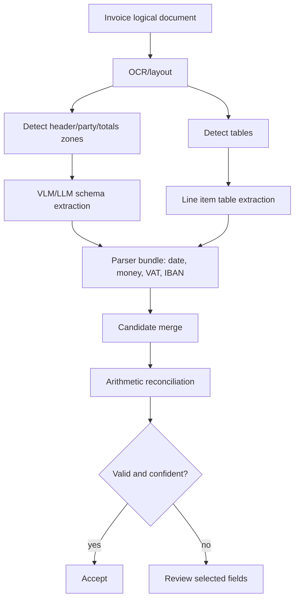

# 06 — Extraction Patterns by Document Type

## 1. Common extraction pattern

All document classes should follow the same high-level pattern:

```text
logical document + class -> schema + recipe -> OCR/layout/VLM/parsers -> candidate fields -> merge -> validate -> review/publish
```

The differences are in the schema, extraction recipe, validators, and review thresholds.

## 2. Invoice extraction pattern

### 2.1 Target fields

Typical invoice field groups:

- header:
  - invoice number,
  - invoice date,
  - due date,
  - purchase order number,
  - contract number,
  - payment terms,
- supplier:
  - name,
  - address,
  - tax ID/VAT ID,
  - company registration number,
  - bank details,
- customer/buyer:
  - name,
  - address,
  - tax ID,
  - customer ID,
- line items:
  - description,
  - quantity,
  - unit,
  - unit price,
  - discount,
  - tax rate,
  - net amount,
  - tax amount,
  - gross amount,
- tax summary:
  - tax rate,
  - taxable base,
  - tax amount,
- totals:
  - subtotal/net,
  - discount total,
  - tax total,
  - total gross,
  - amount due,
  - currency.

### 2.2 Recommended recipe



### 2.3 Special invoice rules

- Total fields are high risk.
- Line items should not be accepted blindly if row totals do not reconcile.
- VAT/tax fields should preserve raw strings because national formats vary.
- Currency must be explicit if multiple currencies appear.
- If total amount and amount due differ, preserve both.
- OCR and VLM may disagree on digits; use visual evidence crops for money fields.

### 2.4 Candidate merge logic

For each money field:

1. prefer exact value printed in the totals section,
2. compare with arithmetic calculation,
3. allow small rounding tolerance,
4. if printed total and calculated total conflict, flag review rather than silently correcting,
5. store both printed and calculated values.

## 3. Structured form extraction pattern

Forms can be fixed-template, semi-template, or free-layout.

### 3.1 Target fields

Typical form field types:

- text boxes,
- handwritten values,
- printed values,
- checkboxes,
- radio options,
- signatures/stamps presence,
- dates,
- addresses,
- IDs and reference numbers,
- multi-line notes.

### 3.2 Recommended recipe

```text
1. classify form type
2. load form schema and anchor definitions
3. OCR printed labels and values
4. detect handwriting regions
5. use VLM for handwritten or ambiguous fields
6. parse checkbox/selection marks
7. normalize typed fields
8. validate required sections and conditional fields
9. review low-confidence handwritten fields
```

### 3.3 Anchor-based extraction

For form schemas, define anchors:

```yaml
field: applicant.date_of_birth
anchors:
  - Date of birth
  - DOB
  - Születési idő
expected_location:
  relative_to_anchor: right_or_below
  max_distance: medium
writing_type: printed_or_handwritten
```

Anchor-based extraction is useful when forms have stable labels but values may appear in different positions.

### 3.4 Checkbox and radio extraction

Use a separate selection mark model or VLM visual check.

Output should include:

- selected/unselected/uncertain,
- evidence bbox,
- confidence,
- related label text,
- group name.

Example:

```json
{
  "field_id": "employment_status",
  "value": "student",
  "options": [
    {"label": "employed", "selected": false},
    {"label": "student", "selected": true},
    {"label": "unemployed", "selected": false}
  ]
}
```

## 4. ID document extraction pattern

### 4.1 Target fields

Typical textual fields:

- document type,
- issuing country,
- document number,
- surname,
- given names,
- date of birth,
- place of birth,
- nationality,
- issue date,
- expiry date,
- issuing authority,
- address, if present,
- MRZ lines, if present,
- barcode/QR payload, if present.

### 4.2 Recommended recipe

```text
1. use high-resolution image rendering/cropping
2. detect front/back sides if applicable
3. OCR/VLM visible text extraction
4. parse MRZ/barcode/QR where present
5. compare visible text to machine-readable fields
6. detect presence of visual elements such as photo, signature, hologram-like region as observations only
7. route inconsistency/unreadable fields to review
```

### 4.3 Safety and scope boundary

The system should:

- extract visible text,
- parse machine-readable zones,
- detect whether expected visual elements are present,
- check text consistency between visible and machine-readable fields,
- identify unreadable or ambiguous regions.

The system should not:

- make legal authenticity claims,
- perform face matching,
- infer demographic attributes from the photo,
- decide whether the person holding the document is the document owner,
- replace official verification services.

### 4.4 ID validation examples

- MRZ checksum validity,
- document number visible text equals MRZ document number,
- date of birth visible text equals MRZ date of birth,
- expiry date is not before issue date,
- country code is valid ISO-like value,
- required sides are present for a given class.

## 5. Handwritten document extraction pattern

### 5.1 Challenges

Handwriting introduces:

- low OCR confidence,
- ambiguous characters,
- inconsistent field placement,
- overwriting/corrections,
- mixed printed labels and handwritten values,
- non-standard abbreviations.

### 5.2 Recommended recipe

```text
1. use OCR/layout for printed labels
2. detect likely handwriting regions
3. crop field region around label/anchor
4. call VLM or handwriting-specialized OCR on the crop
5. ask model to return alternatives when uncertain
6. use validation to choose or review
7. preserve unreadable marks explicitly
```

### 5.3 Output for uncertain handwriting

```json
{
  "field_id": "applicant.last_name",
  "presence": "ambiguous",
  "value": {
    "raw": "Kovács? / Kovats?",
    "normalized": null,
    "type": "string"
  },
  "alternatives": [
    {"value": "Kovács", "confidence": 0.58},
    {"value": "Kovats", "confidence": 0.31}
  ],
  "review": {
    "required": true,
    "reason": "Handwritten surname ambiguous."
  }
}
```

## 6. Table extraction pattern

### 6.1 Table types

- simple grid tables,
- borderless invoice tables,
- merged-cell tables,
- multi-page tables,
- key-value tables,
- handwritten tables.

### 6.2 Recommended recipe

```text
1. detect table region
2. identify headers
3. infer columns
4. extract cell values with bbox
5. normalize each cell type
6. validate row-level formulas
7. validate table-level totals
8. preserve uncertain cells for review
```

### 6.3 Multi-page table handling

Use continuation detection:

- repeated headers,
- page footer/header removal,
- line item numbering,
- table region continuity,
- subtotal/carry-forward fields.

## 7. Long document extraction pattern

Examples:

- contracts,
- policies,
- reports,
- medical or legal packets,
- evidence documents.

### 7.1 Recommended recipe

```text
1. OCR/layout parse full document
2. split into page/section chunks
3. classify sections if needed
4. extract chunk-level candidate fields
5. merge deterministically into document-level record
6. preserve sentence/page-level provenance
7. validate conflicts and missing evidence
```

### 7.2 Chunk-level extraction model

Each chunk output should include:

- chunk ID,
- page range,
- section title,
- extracted candidates,
- evidence sentence/span,
- confidence,
- conflicts.

### 7.3 Merge strategy

- use set aggregation for repeated facts,
- use latest/most explicit value only when rule says so,
- prefer signed/executed section over draft section,
- flag conflicting values for review,
- keep every source reference.

## 8. Generic unknown document fallback

When classification cannot identify a supported class:

1. create a generic document summary,
2. extract visible key-value pairs,
3. identify candidate document class,
4. route to manual triage,
5. optionally create a new schema if volume justifies it.

Do not publish generic extraction as if it were a validated business record.

## 9. Model selection pattern

| Situation | Prefer |
|---|---|
| High-volume printed invoices | OCR/layout + LLM + deterministic validators. |
| Complex visual layouts | VLM + OCR grounding. |
| Handwriting | VLM/crop-based handwriting OCR + review. |
| ID documents | VLM + MRZ/barcode parser + consistency checks. |
| Tables | Dedicated table extraction + VLM fallback + reconciliation. |
| Long contracts | OCR/layout chunking + LLM structured extraction + provenance. |
| Strictly regulated output | Deterministic parsers + human review for uncertain fields. |

## 10. Structured output pattern with local vLLM/VLM

For a local OpenAI-compatible VLM server:

```python
from openai import OpenAI

client = OpenAI(base_url="http://localhost:8000/v1", api_key="EMPTY")

completion = client.chat.completions.create(
    model="qwen3-vl-local",
    temperature=0,
    messages=[
        {
            "role": "system",
            "content": "Return JSON only according to the provided schema. Use null if not visible."
        },
        {
            "role": "user",
            "content": [
                {"type": "text", "text": "Extract invoice fields from this page."},
                {"type": "image_url", "image_url": {"url": "data:image/png;base64,..."}}
            ]
        }
    ],
    extra_body={
        "structured_outputs": {
            "json": {
                "type": "object",
                "properties": {
                    "invoice_number": {"type": ["string", "null"]},
                    "invoice_date": {"type": ["string", "null"]}
                },
                "required": ["invoice_number", "invoice_date"]
            }
        }
    }
)
```

In production, wrap this in an adapter that can switch between:

- local vLLM/Qwen-style VLM,
- Azure Document Intelligence / Content Understanding,
- Google Document AI,
- AWS Bedrock Data Automation / Textract / Bedrock,
- other OCR/layout engines.

