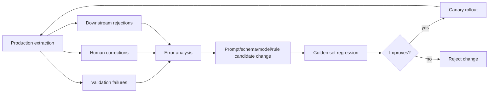

# 07 — Validation, Quality, Confidence, and Human Review

## 1. Why validation is separate from extraction

Model confidence is not enough. A model can be confident and still wrong. A field can have high OCR confidence but fail a business rule. A value can be visually correct but invalid for downstream processing.

Therefore, the system needs separate signals:

- classification confidence,
- OCR confidence,
- model extraction confidence,
- evidence confidence,
- validation status,
- business risk,
- human review status.

## 2. Quality model

### 2.1 Page quality

Page quality should be calculated before extraction.

Recommended metrics:

| Metric | Why it matters |
|---|---|
| Blur score | Lowers OCR and VLM accuracy. |
| Skew angle | Can break table/field alignment. |
| Contrast score | Affects faint scans and handwriting. |
| Cut-off detection | Missing document edges cause missing fields. |
| Resolution/DPI | ID cards and small print need higher resolution. |
| Orientation | Upside-down/rotated pages need correction. |
| Noise/background | Can confuse OCR and handwriting recognition. |
| Handwriting density | Helps choose handwriting-specific recipe. |

### 2.2 Document quality flags

```json
{
  "quality_flags": [
    {"flag": "low_contrast", "severity": "warning", "page": 1},
    {"flag": "possibly_cut_off", "severity": "error", "page": 2}
  ]
}
```

Quality flags should influence review routing and confidence.

## 3. Confidence model

### 3.1 Field final confidence

A practical formula:

```text
final_confidence = weighted_score(
  classification_confidence,
  model_confidence,
  ocr_confidence,
  evidence_confidence,
  validation_score,
  source_agreement_score,
  page_quality_score,
  field_risk_penalty
)
```

Do not hide the components. Store them separately.

### 3.2 Confidence bands

Recommended default bands:

| Band | Meaning | Default action |
|---:|---|---|
| 0.95–1.00 | Very high confidence | Auto-accept unless high-risk policy requires review. |
| 0.85–0.94 | High confidence | Auto-accept for normal-risk fields. |
| 0.70–0.84 | Medium confidence | Accept with warning or review depending on risk. |
| <0.70 | Low confidence | Review. |

Thresholds must be per class and per field. Invoice total should have a stricter threshold than a free-text note.

## 4. Validation layers

### 4.1 Schema validation

Checks:

- JSON is valid,
- required fields are present,
- field types are correct,
- enums are valid,
- arrays and nested objects follow schema,
- no unexpected fields unless allowed.

### 4.2 Field-level validation

Examples:

| Field | Validation |
|---|---|
| date | valid date, expected format, plausible range. |
| money | decimal amount, currency present or inferable with evidence. |
| IBAN | checksum validation. |
| VAT/tax ID | format by country where known. |
| email | format. |
| phone | normalized country code if possible. |
| ID document number | class-specific format where known. |

### 4.3 Cross-field validation

Examples:

- invoice due date >= invoice date,
- invoice subtotal + tax = total gross,
- total gross >= amount due when partial payment is present,
- expiry date > issue date,
- date of birth appears consistently in visible text and MRZ,
- selected checkbox implies required follow-up field.

### 4.4 Cross-document validation

Examples:

- ID name matches application form name using text comparison, not face matching,
- policy number on claim form matches policy attachment,
- supplier on invoice matches purchase order,
- account holder on bank statement matches onboarding form.

## 5. Invoice validation pattern

### 5.1 Arithmetic reconciliation

```text
sum(line_item.net_amount) ~= subtotal
subtotal - discount_total + tax_total ~= total_gross
total_gross - paid_amount ~= amount_due
```

Use currency-specific tolerance, usually 0.01 or 0.02.

### 5.2 What to do on mismatch

| Situation | Action |
|---|---|
| Small rounding difference | Warning, not error. |
| Printed total conflicts with calculated total | Review total and line items. |
| Tax rate missing but tax amount present | Accept if total reconciliation passes; mark tax rate missing. |
| Line items absent but totals present | Accept header/totals if document type permits summary invoices. |
| Multiple total-like values | Store total, amount due, balance due separately if labels support it. |

## 6. ID document validation pattern

### 6.1 Consistency checks

- visible document number vs MRZ document number,
- visible expiry date vs MRZ expiry date,
- visible date of birth vs MRZ date of birth,
- visible nationality vs MRZ country code,
- front/back required fields present,
- barcode payload fields consistent with visible fields where applicable.

### 6.2 Important scope boundaries

Allowed:

- text extraction,
- MRZ/barcode parsing,
- consistency checks between textual sources,
- detection of unreadable or missing fields,
- observation that expected visual elements are present or absent.

Not in scope:

- legal authenticity decision,
- face matching,
- inferring age/sex/gender from photo,
- biometric verification.

## 7. Human review routing

### 7.1 Review triggers

```yaml
review_triggers:
  - required_field_missing
  - field_confidence_below_threshold
  - high_risk_field_below_threshold
  - validation_failed
  - conflicting_candidates
  - class_confidence_below_publish_threshold
  - page_quality_error
  - unreadable_handwriting
  - unsupported_class
```

### 7.2 Field-level review task

```json
{
  "review_task_id": "rev_001",
  "task_type": "field_correction",
  "priority": "high",
  "logical_document_id": "ldoc_0001",
  "class_id": "invoice.v1",
  "schema_id": "invoice.schema.v1",
  "field_path": "totals.total_gross",
  "field_label": "Total gross",
  "proposed_value": "1245.00 EUR",
  "alternative_values": ["1240.00 EUR"],
  "reason": "Conflicting candidates and high-risk field.",
  "evidence": [
    {
      "page_number": 1,
      "bbox": {"x": 0.72, "y": 0.83, "w": 0.18, "h": 0.04},
      "crop_uri": "s3://doc-ai/evidence/total.png"
    }
  ],
  "instructions": "Check the total amount printed near the bottom-right totals section."
}
```

### 7.3 Document-level review task

Use when:

- class is uncertain,
- page split is uncertain,
- many required fields are missing,
- document appears incomplete,
- document is unsupported.

### 7.4 Packet-level review task

Use when:

- multiple logical documents conflict,
- a packet is missing a required document,
- identity/application/invoice documents do not match by text fields,
- one logical document depends on another.

## 8. Review UI requirements

Minimum field-review UI:

- full page image,
- zoomable evidence crop,
- OCR text around field,
- proposed value,
- alternatives,
- validation messages,
- previous/next uncertain field navigation,
- keyboard shortcuts,
- mark unreadable / not present / not applicable,
- audit comment.

Reviewer actions:

- accept proposed value,
- correct value,
- choose alternative,
- mark field unreadable,
- mark field not present,
- escalate to document-level review.

## 9. Audit model

Every action must be traceable.

Audit entries:

```json
{
  "audit_id": "audit_001",
  "timestamp": "2026-06-08T10:25:00Z",
  "actor_type": "human_reviewer",
  "actor_id": "reviewer_17",
  "action": "field_corrected",
  "logical_document_id": "ldoc_0001",
  "field_path": "totals.total_gross",
  "before": "1240.00 EUR",
  "after": "1245.00 EUR",
  "reason": "Visual correction from evidence crop."
}
```

## 10. Evaluation metrics

### 10.1 Field-level metrics

- exact match accuracy,
- normalized value accuracy,
- character error rate for text fields,
- date accuracy,
- amount accuracy,
- table cell accuracy,
- required-field recall,
- false extraction rate,
- human correction rate.

### 10.2 Document-level metrics

- document auto-accept rate,
- review rate,
- rejection rate,
- downstream rejection rate,
- average processing latency,
- average cost per document,
- pages per minute,
- extraction failure rate.

### 10.3 Class-level metrics

- accuracy per document class,
- fields causing most review,
- validators failing most often,
- class confusion impact on extraction,
- schema version performance comparison.

## 11. Golden datasets and regression tests

Build golden sets per class:

```text
golden_sets/
  invoice/
    simple_printed_50/
    complex_table_50/
    multilingual_50/
    low_quality_scan_50/
  id_document/
    front_back_50/
    mrz_50/
    poor_scan_50/
  forms/
    handwritten_50/
    checkbox_50/
```

Each golden example should include:

- raw document,
- rendered pages,
- expected fields,
- expected evidence if available,
- expected validations,
- allowed ambiguity notes.

## 12. Continuous improvement loop



## 13. Acceptance criteria for quality

MVP acceptance criteria:

- every field has raw value, normalized value, confidence, evidence, and validation status,
- high-risk fields have stricter thresholds,
- review tasks are created automatically from rules,
- human corrections update the final record and audit log,
- golden-set regression can compare two schema/model/prompt versions,
- downstream output can be restricted to accepted records only.

