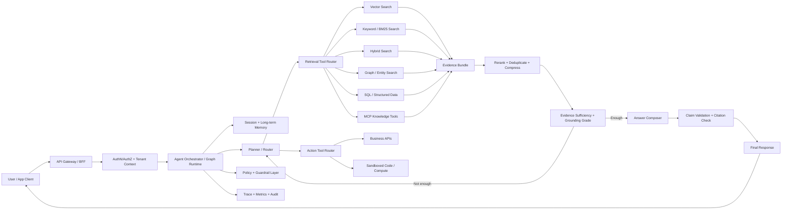

# Modern Agentic RAG System Design — 2026

This package is a practical architecture dossier for a modern **agentic Retrieval-Augmented Generation (RAG)** platform. It is written for a system that starts locally with Docker, then moves into production using cloud-managed infrastructure, with separate mapping for AWS, Azure, and Google Cloud.

## Intended outcome

Build a system where an agent can:

- understand a user task and decide whether retrieval is needed;
- decompose complex questions into sub-questions;
- choose between vector, keyword, hybrid, graph, SQL, file, API, and MCP-based tools;
- retrieve evidence with tenant-aware permissions;
- grade evidence sufficiency before answering;
- produce cited, auditable answers;
- log every step as a trace for debugging, evaluation, security review, and cost control;
- run in local Docker, then deploy to cloud-native managed services.

## Recommended reading order

1. `01_architecture_overview.md` — the big picture and main components.
2. `02_component_relationships.md` — how the pieces communicate and which contracts connect them.
3. `03_canonical_data_model.md` — the runtime and ingestion data objects that should flow through the system.
4. `04_data_flow.md` — ingestion-time and query-time flows.
5. `05_development_docker_blueprint.md` — local development architecture and Docker Compose services.
6. `06_production_reference_architecture.md` — cloud-agnostic production design.
7. `07_cloud_provider_mappings.md` — AWS, Azure, and GCP deployment options.
8. `08_security_governance_observability.md` — security, guardrails, tracing, monitoring, and evaluation.
9. `09_implementation_plan.md` — phased delivery plan.
10. `10_decision_log_and_backlog.md` — architecture decisions and backlog.

## Core design decision

The core system should be **cloud-portable**, but deployment should use **provider-native managed services** where they reduce operational burden. In other words:

- Keep the application-layer agent, data model, trace schema, prompt templates, test sets, and retrieval contracts portable.
- Make vector store, object storage, document AI/OCR, identity, queue/event bus, secrets, model hosting, and monitoring replaceable through provider adapters.
- Treat managed services such as Amazon Bedrock Knowledge Bases, Azure AI Search agentic retrieval, and Google RAG Engine as powerful provider-specific accelerators, not as the only possible architecture.

## High-level target architecture

## Source basis

The design is based on current 2026 patterns and vendor documentation. Key references are listed in `11_references.md`.
