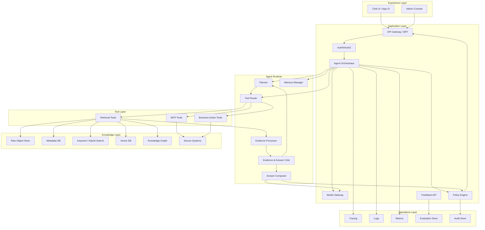

# 02 — Component Relationships

## 1. Relationship map



## 2. Component contracts

### 2.1 API -> Orchestrator

The API should pass a request envelope, not raw chat text.

```json
{
  "request_id": "req_01HX...",
  "tenant_id": "tenant_acme",
  "user_id": "user_123",
  "session_id": "sess_456",
  "input": {
    "type": "user_message",
    "text": "Compare the current architecture with the target cloud architecture."
  },
  "runtime_options": {
    "stream": true,
    "max_latency_ms": 12000,
    "answer_format": "markdown",
    "citation_policy": "required"
  },
  "permission_context": {
    "groups": ["architecture-readers"],
    "roles": ["solution-architect"],
    "data_regions": ["eu"]
  }
}
```

### 2.2 Orchestrator -> Planner

Planner input:

- user message;
- recent conversation summary;
- available tools;
- tenant/user permissions;
- runtime budgets;
- domain policy.

Planner output:

```json
{
  "requires_retrieval": true,
  "requires_action": false,
  "task_class": "architecture_analysis",
  "risk_level": "normal",
  "subtasks": [
    {"id": "s1", "kind": "retrieve", "goal": "Find current architecture components"},
    {"id": "s2", "kind": "retrieve", "goal": "Find cloud deployment constraints"},
    {"id": "s3", "kind": "synthesize", "goal": "Map gaps and recommendations"}
  ],
  "tool_plan": [
    {"tool": "hybrid_search", "input_ref": "s1"},
    {"tool": "hybrid_search", "input_ref": "s2"},
    {"tool": "source_read", "input_ref": "top_results"}
  ]
}
```

### 2.3 Planner -> Retrieval Router

The planner should not call vendor-specific APIs directly. It should request abstract retrieval operations.

```json
{
  "retrieval_request_id": "rr_001",
  "strategy": "hybrid_then_rerank",
  "queries": [
    {
      "query_id": "q1",
      "text": "current architecture components",
      "filters": {
        "tenant_id": "tenant_acme",
        "source_type": ["architecture_doc", "adr"],
        "classification_lte": "internal"
      },
      "top_k": 30
    }
  ],
  "rerank": {
    "enabled": true,
    "top_n": 8
  },
  "source_read": {
    "enabled": true,
    "neighbor_chunks": 1
  }
}
```

### 2.4 Retrieval Router -> Knowledge Stores

All retrieval calls must include:

- tenant filter;
- user permission filter;
- document status filter;
- source freshness policy;
- query trace ID.

Example internal call:

```python
results = retriever.hybrid_search(
    text="current architecture components",
    tenant_id="tenant_acme",
    acl_context=user_acl,
    filters={"doc_status": "active", "classification_lte": "internal"},
    top_k=30,
    trace_id="trace_abc"
)
```

### 2.5 Evidence Processor -> Answer Composer

The composer should receive evidence in a structured form.

```json
{
  "evidence_bundle_id": "evb_001",
  "coverage": {
    "subqueries_answered": ["q1", "q2"],
    "missing": []
  },
  "items": [
    {
      "evidence_id": "ev_001",
      "source_id": "doc_123",
      "chunk_id": "chunk_456",
      "title": "Target Cloud Architecture",
      "section": "Runtime Topology",
      "text": "The production deployment uses Kubernetes with managed identity...",
      "score": 0.91,
      "source_uri": "s3://... or https://...",
      "citation_anchor": "doc_123#section-runtime-topology",
      "acl_verified": true
    }
  ]
}
```

### 2.6 Answer Composer -> Claim Validator

The first answer should be a draft with claim structure.

```json
{
  "draft_id": "draft_001",
  "claims": [
    {
      "claim_id": "c1",
      "text": "The target architecture requires a managed vector store.",
      "supporting_evidence_ids": ["ev_001", "ev_002"],
      "confidence": 0.84
    }
  ],
  "rendered_markdown": "..."
}
```

### 2.7 Claim Validator -> Orchestrator

Validator output:

```json
{
  "valid": false,
  "issues": [
    {
      "claim_id": "c3",
      "severity": "major",
      "type": "unsupported_claim",
      "message": "The claim about GCP deployment is not supported by supplied evidence."
    }
  ],
  "recommended_action": "retrieve_more_or_remove_claim"
}
```

## 3. Synchronous vs asynchronous relationships

### Synchronous path

Use synchronous calls for:

- chat request handling;
- orchestration steps;
- retrieval calls;
- reranking;
- answer composition;
- validation before response.

### Asynchronous path

Use asynchronous jobs for:

- document ingestion;
- OCR;
- large file parsing;
- embedding generation;
- graph extraction;
- evaluation runs;
- feedback processing;
- index rebuilds;
- trace analytics.

## 4. Control plane vs data plane

### Control plane

Responsible for configuration and governance:

- tenants;
- connectors;
- knowledge sources;
- index schemas;
- prompt versions;
- model routing configuration;
- policies;
- evaluation sets;
- deployment configuration.

### Data plane

Responsible for runtime traffic:

- user request;
- planner decision;
- retrieval;
- tool call;
- evidence bundle;
- model generation;
- final answer;
- trace and audit.

Keep these separate. Production outages often happen when runtime code depends on mutable admin configuration without versioning.

## 5. Recommended internal APIs

### 5.1 Agent API

```http
POST /v1/agent/runs
GET  /v1/agent/runs/{run_id}
POST /v1/agent/runs/{run_id}/feedback
```

### 5.2 Retrieval API

```http
POST /v1/retrieval/search
POST /v1/retrieval/read-source
POST /v1/retrieval/rerank
POST /v1/retrieval/evidence/grade
```

### 5.3 Ingestion API

```http
POST /v1/ingestion/jobs
GET  /v1/ingestion/jobs/{job_id}
POST /v1/ingestion/sources/{source_id}/sync
```

### 5.4 Control API

```http
POST /v1/admin/knowledge-sources
POST /v1/admin/index-profiles
POST /v1/admin/policies
POST /v1/admin/evaluation-sets
```

## 6. Failure boundaries

Design for these failure boundaries:

| Failure | Boundary | Recovery |
|---|---|---|
| Model timeout | Model gateway | retry smaller model, degrade, ask concise response |
| Vector DB outage | Retrieval router | fall back to keyword search or cached evidence |
| Bad retrieval | Evidence grader | rewrite query, read source neighbors, route to different source |
| Policy denial | Policy engine | refuse or provide safe alternative |
| Tool failure | Tool router | return structured error to planner |
| Ingestion failure | Ingestion job | retry, quarantine document, alert |
| Citation validation failure | Claim validator | remove claim or retrieve more |

## 7. Design smell checklist

Avoid these smells:

- The model can see documents the user is not allowed to see.
- The final answer has citations but the internal claims are not validated.
- The vector DB stores chunks without source/version/ACL metadata.
- Retrieval is one-shot only.
- Tool calls are not traced.
- The orchestrator is a prompt, not a state machine.
- There is no evaluation dataset before production release.
- “Memory” is a generic text blob appended to every prompt.
- The system has no way to reproduce a bad answer.
