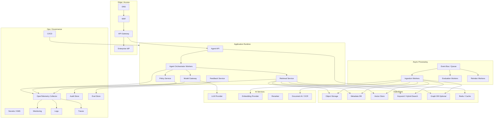

# 06 — Production Reference Architecture

This file defines a cloud-agnostic production architecture. Provider-specific mappings are in `07_cloud_provider_mappings.md`.

## 1. Production goals

The system should be:

- secure by default;
- tenant-aware;
- observable at trace level;
- horizontally scalable;
- resilient to partial provider failures;
- auditable;
- cost-controlled;
- eval-gated before release;
- portable across AWS, Azure, and GCP at the application contract level.

## 2. Production topology



## 3. Runtime services

### 3.1 Agent API

Responsibilities:

- authentication integration;
- request validation;
- streaming protocol;
- session lookup;
- rate limiting;
- response rendering;
- feedback endpoint.

Recommended runtime:

- containerized service;
- autoscaling by CPU, request count, and queue depth;
- request timeout tiering: interactive vs long-running;
- graceful cancellation.

### 3.2 Agent Orchestrator Workers

Responsibilities:

- stateful graph execution;
- planning;
- tool routing;
- loop budgets;
- evidence state;
- validation;
- trace emission.

Scaling:

- stateless compute where possible;
- external state store for resumable runs;
- sticky session not required if state is externalized;
- separate pools for interactive and deep-research workloads.

### 3.3 Model Gateway

Do not call model providers directly from every component. Use a gateway.

Responsibilities:

- provider routing;
- model fallback;
- token/cost accounting;
- prompt version tagging;
- retries and timeouts;
- safety filters;
- response schema validation;
- redaction of logs;
- provider-specific telemetry normalization.

Recommended model classes:

| Use case | Model type |
|---|---|
| intent classification | small/cheap fast model |
| planning | medium reasoning-capable model |
| answer composition | high-quality model |
| validation/critic | medium model or specialized judge |
| embeddings | embedding model with stable versioning |
| reranking | cross-encoder/reranker or provider rerank service |

### 3.4 Retrieval Service

Responsibilities:

- abstract retrieval API;
- provider-specific adapters;
- ACL and metadata filtering;
- hybrid result merging;
- reranking;
- source reading;
- result compression;
- retrieval telemetry.

Keep retrieval service independent from the agent runtime. This lets you test retrieval quality without running the whole agent.

### 3.5 Policy Service

Responsibilities:

- tenant policy;
- data classification rules;
- action approval rules;
- tool permission rules;
- PII handling;
- output policy;
- audit decisions.

Policy should be deterministic where possible. LLM-based safety checks can assist, but they should not be the only control for authorization.

## 4. Async services

### 4.1 Ingestion workers

Use async workers for:

- source sync;
- file parsing;
- OCR;
- chunking;
- embedding;
- indexing;
- graph extraction;
- ingestion quality checks.

Worker design:

- idempotent jobs;
- document hash deduplication;
- retry with exponential backoff;
- quarantine queue;
- dead-letter queue;
- progress events;
- metrics per connector and parser.

### 4.2 Evaluation workers

Run:

- nightly regression evaluations;
- pre-release evals;
- drift checks;
- retrieval-only evals;
- safety evals;
- cost and latency benchmarks.

### 4.3 Reindex workers

Needed when:

- embedding model changes;
- chunker changes;
- metadata schema changes;
- ACL model changes;
- source documents are updated in bulk.

## 5. Data stores

### 5.1 Object storage

Stores:

- raw documents;
- parsed outputs;
- generated artifacts;
- large traces if needed;
- eval datasets;
- audit exports.

Requirements:

- encryption at rest;
- lifecycle policies;
- object versioning;
- tenant prefixing or bucket separation;
- malware scanning;
- retention policy.

### 5.2 Metadata database

Stores:

- tenants;
- users/permissions references;
- knowledge sources;
- document metadata;
- document versions;
- chunk metadata;
- ingestion jobs;
- index manifests;
- agent run summaries;
- prompt/model versions.

Use Postgres unless a strong reason exists not to.

### 5.3 Vector/search index

Minimum fields per indexed chunk:

```json
{
  "chunk_id": "...",
  "tenant_id": "...",
  "document_id": "...",
  "document_version_id": "...",
  "text": "...",
  "embedding": [0.1, 0.2],
  "title": "...",
  "section": "...",
  "source_type": "...",
  "classification": "internal",
  "allow_groups": ["..."],
  "deny_groups": ["..."],
  "last_modified": "...",
  "status": "active"
}
```

### 5.4 Cache

Use cache for:

- session state;
- short-lived retrieval cache;
- model response cache for deterministic internal prompts;
- source-read cache;
- rate-limit counters.

Do not cache sensitive user-specific answers without tenant-safe keys and TTL.

## 6. Production environments

Recommended environments:

| Environment | Purpose | Data |
|---|---|---|
| local | developer loop | synthetic / sampled |
| dev | shared integration | synthetic / masked |
| test | automated integration | controlled test corpus |
| staging | production-like validation | sanitized/masked, or tightly governed real subset |
| prod | user traffic | real data |

## 7. Release strategy

Use versioned releases for:

- code;
- prompt templates;
- model routing config;
- retrieval profile;
- chunker profile;
- embedding profile;
- reranker profile;
- policy rules.

A production answer should be traceable to these versions.

Example release metadata:

```json
{
  "app_version": "0.8.3",
  "agent_graph_version": "graph_2026_06_01",
  "planner_prompt_version": "planner_0.9.1",
  "answer_prompt_version": "answer_1.2.0",
  "retrieval_profile": "hybrid_rerank_v3",
  "embedding_profile": "embed_2026_04",
  "policy_bundle": "policy_2026_06_01"
}
```

## 8. SLOs and operational targets

### Interactive assistant targets

| Metric | Target |
|---|---|
| p50 latency | < 5s |
| p95 latency | < 15s |
| successful completion | > 98% |
| citation validation pass | > 95% |
| unsupported claim rate | < 2% on eval set |
| retrieval ACL violation | 0 tolerated |

### Deep research mode targets

| Metric | Target |
|---|---|
| p95 latency | < 3 minutes |
| successful completion | > 95% |
| evidence coverage | > 90% on curated eval set |
| trace completeness | > 99% |

## 9. Disaster recovery and resilience

| Component | Backup/DR requirement |
|---|---|
| Metadata DB | PITR, daily backups, multi-AZ production |
| Object storage | versioning, replication for critical data |
| Vector/search index | rebuildable from object + metadata; snapshots recommended |
| Graph DB | rebuildable from extracted relations; backups for speed |
| Trace store | retention based on compliance; export to object/lake |
| Eval store | versioned and backed up |

Principle: vector/search/graph indexes should be **rebuildable**, not the only copy of knowledge.

## 10. Production readiness checklist

### Security

- Tenant isolation tested.
- ACL filters tested at retrieval time.
- Secrets in managed secrets store.
- KMS/CMEK policy decided.
- Prompt injection tests included.
- Data retention policy defined.
- Admin actions audited.

### Reliability

- Health checks.
- Autoscaling.
- Retry policies.
- Dead-letter queues.
- Graceful degradation.
- Index rebuild runbook.

### Quality

- Golden eval set.
- Retrieval eval set.
- Safety eval set.
- Citation validation.
- Human review loop.
- Release gates.

### Operations

- Trace dashboards.
- Cost dashboards.
- Latency dashboards.
- Alerting.
- Runbooks.
- Incident process.

## 11. Suggested production deployment patterns

### Pattern A — Portable Kubernetes

Use when portability and control matter most.

- API, orchestrator, model gateway, retrieval, ingestion workers on Kubernetes.
- Managed Postgres, object storage, queue, vector/search services.
- Provider-specific AI services behind adapters.

### Pattern B — Cloud-native managed RAG

Use when speed and lower ops burden matter most.

- Use provider-native RAG/agent services.
- Keep custom policy, evaluation, and domain-specific orchestration around it.
- Accept more provider coupling.

### Pattern C — Hybrid

Recommended for many enterprises.

- Portable core agent and data model.
- Provider-native retrieval services per cloud.
- Shared evaluation and observability contracts.
- Cloud-specific deployment adapters.

## 12. First production cut recommendation

For the first production version:

- one tenant or strict tenant partitioning;
- one high-value corpus;
- hybrid retrieval;
- graph optional, not mandatory;
- no autonomous write actions;
- human approval for operational actions;
- trace everything;
- 100–200 curated eval cases;
- canary release to limited users.
