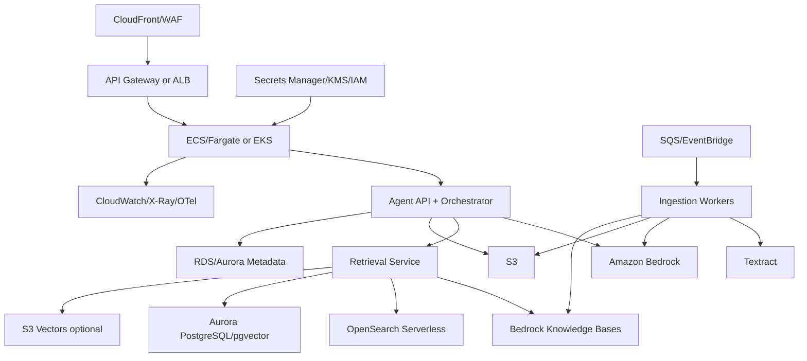
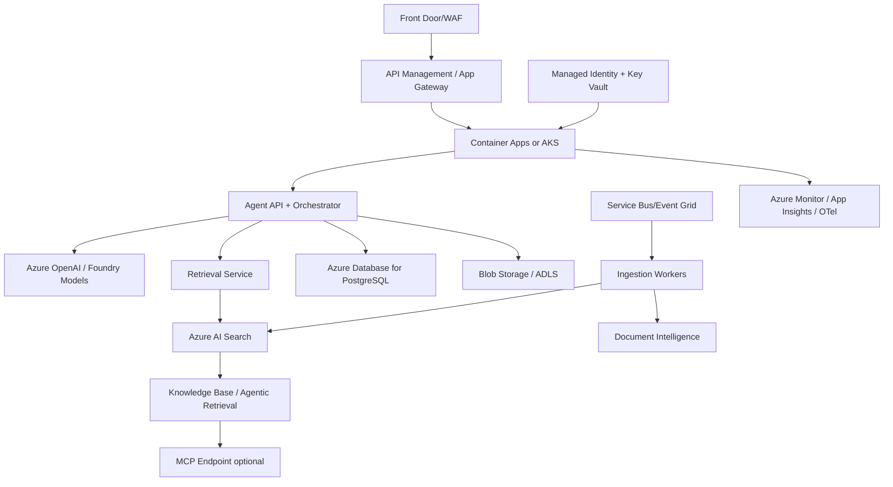
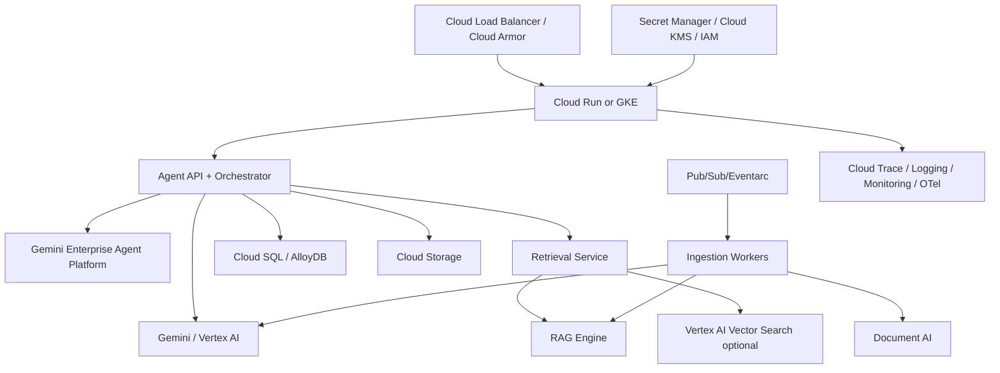

# 07 — Cloud Provider Mappings: AWS, Azure, GCP

This file maps the portable architecture to AWS, Azure, and Google Cloud.

## 1. Mapping strategy

The application should depend on stable internal interfaces:

- `ModelGateway`
- `EmbeddingProvider`
- `RetrievalProvider`
- `ObjectStore`
- `MetadataStore`
- `QueueProvider`
- `SecretsProvider`
- `TraceProvider`
- `PolicyProvider`

Each cloud deployment implements these interfaces differently.

## 2. Capability map

| Capability | AWS | Azure | GCP |
|---|---|---|---|
| App runtime | ECS, EKS, Lambda, App Runner | AKS, Container Apps, App Service, Functions | Cloud Run, GKE, Cloud Functions |
| Agent platform | Bedrock Agents | Azure AI Foundry Agent Service, Microsoft Agent Framework | Gemini Enterprise Agent Platform / Agent Runtime / ADK |
| RAG managed service | Bedrock Knowledge Bases | Azure AI Search agentic retrieval / knowledge base | Gemini Enterprise Agent Platform RAG Engine |
| LLMs | Amazon Bedrock models | Azure OpenAI / Foundry models | Gemini / Vertex AI models |
| Embeddings | Bedrock embeddings | Azure OpenAI embeddings / Foundry | Vertex AI embeddings / Gemini embeddings |
| Vector/search | OpenSearch Serverless, Aurora pgvector, S3 Vectors, Bedrock KB | Azure AI Search | RAG Engine, Vertex AI Vector Search, AlloyDB/Spanner vector |
| Object store | S3 | Blob Storage / ADLS Gen2 | Cloud Storage |
| Metadata DB | Aurora PostgreSQL / RDS | Azure Database for PostgreSQL | Cloud SQL / AlloyDB |
| Queue/event | SQS, SNS, EventBridge, MSK | Service Bus, Event Grid, Event Hubs | Pub/Sub, Eventarc |
| OCR/document AI | Textract | Azure AI Document Intelligence | Document AI |
| Secrets | Secrets Manager, Parameter Store | Key Vault | Secret Manager |
| Identity | IAM, Cognito, IAM Identity Center | Entra ID, Managed Identity | IAM, Workforce Identity Federation |
| Observability | CloudWatch, X-Ray, Managed Prometheus | Azure Monitor, App Insights | Cloud Logging, Cloud Trace, Cloud Monitoring |
| KMS | AWS KMS | Azure Key Vault / Managed HSM | Cloud KMS |
| IaC | Terraform, CDK, CloudFormation | Terraform, Bicep | Terraform, Deployment Manager less common |

## 3. AWS deployment option

### 3.1 AWS reference topology



### 3.2 AWS recommended variants

#### Variant A — Bedrock-native RAG

Use when you want fastest path to managed RAG.

- Bedrock Agents for orchestration where suitable.
- Bedrock Knowledge Bases for ingestion/retrieval.
- S3 as source store.
- OpenSearch Serverless, Aurora pgvector, Pinecone, Redis Enterprise, or S3 Vectors depending on supported configuration and cost/performance.
- Lambda action groups for business tools.

Pros:

- lower custom retrieval code;
- native Bedrock integration;
- strong IAM/KMS integration;
- managed ingestion and retrieval path.

Cons:

- provider coupling;
- less control over every retrieval stage;
- guardrail behavior must be understood carefully;
- portability requires adapter layer.

#### Variant B — Portable custom RAG on AWS

Use when you need control.

- API/orchestrator/retrieval services on ECS/EKS.
- S3 raw documents.
- Aurora PostgreSQL metadata.
- OpenSearch Serverless for hybrid search.
- Optional pgvector/Qdrant/Pinecone.
- Bedrock for LLMs and embeddings.
- Textract for PDFs/scans.
- CloudWatch/X-Ray/OTel for observability.

### 3.3 AWS notes

Important design notes:

- Bedrock Agents can associate knowledge bases and action groups; at runtime the agent may query a knowledge base or invoke an API operation during orchestration.
- Bedrock Knowledge Bases can retrieve chunks directly using the Retrieve API, and reranking can be used during retrieval.
- Validate how guardrails apply in your exact path. Provider documentation notes that guardrails apply to LLM input and generated response, not necessarily to retrieved references themselves. Therefore, keep your own retrieval filtering and evidence sanitization.
- Use IAM roles per service, not shared long-lived keys.
- Use VPC endpoints/private networking for data stores where possible.

### 3.4 AWS Terraform modules

```text
infra/terraform/aws/
  network/
  ecs_or_eks/
  rds_postgres/
  s3_documents/
  opensearch/
  bedrock/
  sqs_eventbridge/
  observability/
  secrets_kms/
```

## 4. Azure deployment option

### 4.1 Azure reference topology



### 4.2 Azure recommended variants

#### Variant A — Azure AI Search agentic retrieval

Use when your main need is enterprise RAG with structured grounding responses.

- Azure AI Search knowledge sources and knowledge base.
- Retrieve action for agentic retrieval.
- MCP endpoint for MCP-compatible agents.
- Azure OpenAI or Foundry models.
- Managed Identity and Entra ID for authentication.
- Azure AI Document Intelligence for document extraction.

Pros:

- very strong search stack;
- native hybrid search, semantic ranking, vectorization support;
- agentic retrieval can decompose complex queries into subqueries;
- MCP endpoint is attractive for interoperability.

Cons:

- some features may differ between stable and preview API versions;
- you still need app-level responsible AI mitigations;
- direct portability requires adapter layer.

#### Variant B — Portable custom RAG on Azure

- Container Apps or AKS for API/orchestrator/retrieval.
- Azure AI Search for hybrid/vector search.
- Azure Database for PostgreSQL metadata.
- Blob/ADLS for object store.
- Azure OpenAI/Foundry for models.
- Service Bus/Event Grid for async jobs.

### 4.3 Azure notes

Important design notes:

- Azure AI Search agentic retrieval supports a knowledge base object in current stable and preview REST APIs.
- The retrieve action can invoke parallel query processing from a knowledge base.
- Azure AI Search knowledge bases can expose an MCP endpoint, which lets MCP-compatible clients call a `knowledge_base_retrieve`-style tool.
- Use Managed Identity instead of API keys where possible.
- Design source-level ACL propagation carefully. Microsoft search stacks are powerful, but you still own the final authorization model and responsible AI mitigations.

### 4.4 Azure Terraform/Bicep modules

```text
infra/terraform/azure/
  network/
  container_apps_or_aks/
  postgres/
  blob_storage/
  ai_search/
  foundry_or_azure_openai/
  service_bus_event_grid/
  monitor_app_insights/
  key_vault_managed_identity/
```

## 5. GCP deployment option

### 5.1 GCP reference topology



### 5.2 GCP recommended variants

#### Variant A — Gemini Enterprise Agent Platform + RAG Engine

Use when you want Google-managed agent runtime and context-augmented generation.

- Gemini Enterprise Agent Platform Agent Runtime.
- RAG Engine for context augmentation and retrieval over private data.
- Cloud Storage and Google Drive sources where supported.
- Cloud Trace, Logging, Monitoring.
- IAM agent identity and Agent Gateway where suitable.

Pros:

- managed agent runtime path;
- built-in production scaling concepts;
- sessions and memory services available in platform;
- strong integration with Gemini models.

Cons:

- provider coupling;
- region/availability constraints can apply;
- portability requires adapter layer.

#### Variant B — Portable custom RAG on GCP

- Cloud Run or GKE for custom API/orchestrator/retrieval.
- Cloud Storage object store.
- Cloud SQL/AlloyDB metadata.
- Vertex AI models and embeddings.
- Vertex AI Vector Search or RAG Engine.
- Pub/Sub for ingestion jobs.
- Document AI for parsing/OCR.

### 5.3 GCP notes

Important design notes:

- Google’s RAG Engine is described as a component of Gemini Enterprise Agent Platform that facilitates RAG and context augmentation over private organizational data.
- Agent Platform production scaling includes managed runtime, sessions, memory, evaluation, tracing/logging/monitoring, IAM agent identity, and gateway patterns.
- Use Cloud Run for simple stateless deployment; use GKE when you need more control, private networking, GPUs, or complex sidecars.
- Pay attention to region support and allowlist requirements for new/preview services.

### 5.4 GCP Terraform modules

```text
infra/terraform/gcp/
  network/
  cloud_run_or_gke/
  cloud_sql_or_alloydb/
  cloud_storage/
  vertex_ai/
  rag_engine/
  pubsub_eventarc/
  observability/
  secret_manager_kms/
```

## 6. Cloud-neutral adapter interfaces

### 6.1 RetrievalProvider

```python
class RetrievalProvider:
    async def hybrid_search(self, request: RetrievalRequest) -> RetrievalResult:
        ...

    async def source_read(self, source_ref: SourceReadRequest) -> SourceReadResult:
        ...

    async def rerank(self, request: RerankRequest) -> RerankResult:
        ...
```

Provider implementations:

```text
retrieval/providers/
  local_qdrant_opensearch.py
  aws_bedrock_kb.py
  aws_opensearch.py
  azure_ai_search.py
  azure_ai_search_agentic.py
  gcp_rag_engine.py
  gcp_vertex_vector_search.py
```

### 6.2 ModelProvider

```python
class ModelProvider:
    async def chat(self, request: ChatRequest) -> ChatResponse:
        ...

    async def embed(self, request: EmbedRequest) -> EmbedResponse:
        ...

    async def rerank(self, request: RerankRequest) -> RerankResponse:
        ...
```

### 6.3 ObjectStore

```python
class ObjectStore:
    async def put_object(self, key: str, data: bytes, metadata: dict) -> str:
        ...

    async def get_object(self, uri: str) -> bytes:
        ...

    async def sign_read_url(self, uri: str, ttl_seconds: int) -> str:
        ...
```

## 7. Deployment decision matrix

| Requirement | Best initial choice |
|---|---|
| Fast enterprise Microsoft ecosystem integration | Azure AI Search + Azure OpenAI/Foundry |
| AWS-first enterprise with Bedrock standardization | Bedrock Agents + Knowledge Bases or custom ECS/EKS + Bedrock |
| Google/Gemini-first agent platform | Gemini Enterprise Agent Platform + RAG Engine |
| Maximum portability | Kubernetes/containers + Postgres + Qdrant/OpenSearch + model gateway |
| Strongest search control | Custom retrieval service + managed search/vector store |
| Lowest custom code | Provider-native RAG service |
| Strict vendor independence | Avoid provider-native knowledge base as core dependency; use adapter only |

## 8. Recommended deployment roadmap

### Step 1 — Local portable core

Build with Docker and abstract interfaces.

### Step 2 — One cloud production pilot

Pick one primary cloud based on customer environment.

### Step 3 — Provider adapter hardening

Implement only the provider adapters needed by the pilot.

### Step 4 — Multi-cloud portability validation

Deploy a subset to the other clouds:

- same eval dataset;
- same API contract;
- same canonical data model;
- provider-specific retrieval adapter;
- compare quality, latency, and cost.

### Step 5 — Decide standard deployment patterns

Adopt one or two blessed patterns, not unlimited combinations.

## 9. Cost considerations by provider

Common cost drivers:

- LLM input/output tokens;
- embedding generation;
- reranking calls;
- vector/search storage;
- OCR/document processing;
- trace/log volume;
- egress between services;
- GPU/self-hosted model runtime;
- over-retrieval and long context usage.

Cost controls:

- classify first, retrieve only when needed;
- use small models for routing and grading where adequate;
- cap evidence tokens;
- use hybrid retrieval to improve precision before generation;
- cache source reads and deterministic internal calls;
- batch ingestion embeddings;
- evaluate top-k/rerank tradeoffs;
- split interactive and deep-research modes.

## 10. Cloud portability warning

Cloud providers now offer increasingly capable agent/RAG platforms. These are useful, but they change faster than traditional databases. Keep these portable:

- your data model;
- your eval datasets;
- your trace schema;
- your prompt versions;
- your policy model;
- your application API;
- your ingestion source manifest.

That is what protects you from vendor lock-in while still allowing cloud-native acceleration.
