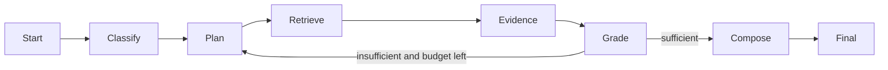

# 09 — Implementation Plan

This plan assumes a serious but pragmatic build: start with a Docker-based local platform, then move into a first cloud pilot, then add cloud-specific variants.

## 1. Delivery philosophy

Build in vertical slices. Do not spend months building an ingestion platform before one end-to-end answer works.

The first milestone should answer one real question from one real corpus with:

- ingestion;
- retrieval;
- evidence bundle;
- answer;
- citation;
- trace.

Then improve quality and harden security.

## 2. Phase overview

| Phase | Name | Outcome |
|---|---|---|
| 0 | Architecture decisions | Scope, technology choices, first corpus, cloud target |
| 1 | Repo and local platform | Docker stack, API skeleton, metadata DB |
| 2 | Canonical schemas | Request/state/retrieval/evidence models |
| 3 | Ingestion MVP | Parse, chunk, embed, index first corpus |
| 4 | Retrieval MVP | Hybrid/vector/keyword retrieval with ACL filters |
| 5 | Agent orchestration MVP | Planner, retrieval loop, answer composer |
| 6 | Citations and validation | Claim support and citation checks |
| 7 | Observability | OTel traces, metrics, dashboards |
| 8 | Evaluation | Golden sets, regression runner, CI gate |
| 9 | Security hardening | Prompt injection, tenant isolation, tool safety |
| 10 | Cloud pilot | Deploy one cloud target |
| 11 | Provider adapters | AWS/Azure/GCP mappings as needed |
| 12 | Production readiness | SLOs, runbooks, canary, monitoring |

## 3. Phase 0 — Architecture decisions

### Goals

- Agree on first use case.
- Choose first corpus.
- Choose first deployment cloud.
- Choose local vector/search stack.
- Choose model providers.

### Decisions to make

| Decision | Recommendation |
|---|---|
| Orchestration style | Graph/state-machine runtime |
| API | FastAPI or equivalent |
| Metadata DB | Postgres |
| Local vector | Qdrant or pgvector |
| Local object store | MinIO |
| Local queue | Redis initially |
| First retrieval | Hybrid search + rerank |
| First cloud | Choose based on customer/platform context |
| First safety scope | Read-only assistant, no write actions |

### Deliverables

- `docs/architecture/adr_0001_core_architecture.md`
- `docs/architecture/adr_0002_retrieval_stack.md`
- `docs/architecture/adr_0003_first_cloud_target.md`
- initial eval questions list

## 4. Phase 1 — Repo and local platform

### Tasks

- Create monorepo structure.
- Add Python project config.
- Add Docker Compose.
- Add API health endpoint.
- Add Postgres migrations.
- Add MinIO bucket init.
- Add Qdrant collection init.
- Add OTel collector and Jaeger.

### Acceptance criteria

- `make dev-up` starts core stack.
- `GET /health` works.
- Postgres migration runs.
- Trace appears for a dummy request.

## 5. Phase 2 — Canonical schemas

### Tasks

Implement Pydantic/domain models for:

- `AgentRunRequest`
- `AgentRunState`
- `TaskUnderstanding`
- `Plan`
- `RetrievalRequest`
- `RetrievalResult`
- `EvidenceItem`
- `EvidenceBundle`
- `AnswerDraft`
- `ValidationResult`
- `FinalAnswer`
- `KnowledgeSource`
- `DocumentVersion`
- `Chunk`
- `TraceEvent`
- `EvalCase`

### Acceptance criteria

- Schemas serialize to JSON.
- Schemas have version fields.
- API validates incoming run request.
- Unit tests cover required fields.

## 6. Phase 3 — Ingestion MVP

### Scope

Start with markdown and plain text. Add PDF/OCR later unless required immediately.

### Tasks

- Create `KnowledgeSource` config for local folder.
- Load files into object store.
- Store raw document metadata.
- Parse markdown/text into blocks.
- Chunk text with source anchors.
- Generate embeddings.
- Index into vector DB.
- Index into keyword search if enabled.
- Store index manifest.

### Acceptance criteria

- At least 10 documents ingested.
- Every chunk has source document, version, section, ACL, and tenant ID.
- Re-running ingestion is idempotent.
- Deleted/changed files update status correctly.

## 7. Phase 4 — Retrieval MVP

### Tasks

- Implement `vector_search`.
- Implement `keyword_search`.
- Implement `hybrid_search` merge.
- Implement ACL/tenant filters.
- Implement source-read by chunk neighbors.
- Implement reranking placeholder or real reranker.
- Implement retrieval API endpoint.

### Acceptance criteria

- Retrieval tests pass for exact and semantic queries.
- Unauthorized chunks never appear in results.
- Hybrid retrieval beats vector-only on exact ID/name queries.
- Source-read returns neighboring context with anchors.

## 8. Phase 5 — Agent orchestration MVP

### Tasks

- Implement graph state.
- Add intent classification node.
- Add planner node.
- Add retrieval node.
- Add evidence processor node.
- Add evidence sufficiency node.
- Add answer composer node.
- Add final response node.

### Minimal graph

### Acceptance criteria

- User can ask one question and receive cited answer.
- Agent loops at most configured number of times.
- Trace contains each node.
- Planner output is structured JSON.

## 9. Phase 6 — Citations and validation

### Tasks

- Generate draft with claim list.
- Map claims to evidence IDs.
- Validate citation relevance.
- Detect unsupported claims.
- If validation fails, revise answer or retrieve more.
- Add citation rendering to final response.

### Acceptance criteria

- No final answer without citations for factual claims.
- Unsupported claim test fails validation.
- Citation points to source anchor.

## 10. Phase 7 — Observability

### Tasks

- Add OTel tracing to API, orchestrator, model gateway, retrieval service.
- Add token/cost metrics.
- Add retrieval latency metrics.
- Add validation failure metrics.
- Add dashboards.
- Add trace redaction.

### Acceptance criteria

- Trace shows full trajectory.
- Metrics visible locally.
- Logs include run ID and trace ID.
- Sensitive fields are redacted.

## 11. Phase 8 — Evaluation

### Tasks

- Create 30–50 initial eval cases.
- Implement retrieval-only eval runner.
- Implement answer eval runner.
- Implement trajectory eval metrics.
- Add CI job.
- Store eval results by app/prompt/retrieval version.

### Acceptance criteria

- Eval suite runs locally.
- CI fails on severe regression.
- Bad citation and ACL test cases are included.

## 12. Phase 9 — Security hardening

### Tasks

- Add prompt injection test corpus.
- Add tenant isolation tests.
- Add PII/sensitive data detection if needed.
- Add tool risk taxonomy.
- Add approval flow for side-effect tools.
- Add audit events for retrieval and tool calls.

### Acceptance criteria

- Cross-tenant retrieval test passes with zero leakage.
- Prompt injection inside documents does not override system behavior.
- Tool calls are policy-checked.
- Audit log exists for security-sensitive operations.

## 13. Phase 10 — First cloud pilot

### Tasks

- Choose cloud target.
- Build Terraform skeleton.
- Deploy API/orchestrator/retrieval services.
- Provision managed Postgres/object store/vector/search.
- Configure secrets and identity.
- Deploy ingestion worker.
- Run smoke ingestion.
- Run eval suite against cloud deployment.

### Acceptance criteria

- Cloud endpoint answers from cloud-indexed corpus.
- Authentication works.
- Traces/logs/metrics visible in cloud monitoring.
- Eval suite passes within agreed thresholds.

## 14. Phase 11 — Provider adapters

### Tasks

Implement provider-specific adapters only as needed:

- AWS Bedrock / Knowledge Bases adapter.
- Azure AI Search classic/agentic retrieval adapter.
- GCP RAG Engine adapter.
- Object store adapters.
- Secret adapters.
- Queue adapters.
- Trace adapters.

### Acceptance criteria

- Same eval dataset can run against local and cloud provider retrieval.
- Provider-specific configs do not leak into agent core.
- Adapter tests use recorded fixtures/mocks where needed.

## 15. Phase 12 — Production readiness

### Tasks

- Define SLOs.
- Add dashboards and alerts.
- Add backup/restore runbook.
- Add index rebuild runbook.
- Add incident runbooks.
- Add canary release process.
- Add user feedback loop.
- Add governance review cadence.

### Acceptance criteria

- Canary users onboarded.
- On-call runbook exists.
- Rollback tested.
- Backup restore tested.
- Eval gate is part of release.

## 16. Suggested 8-week execution plan

### Week 1 — Foundation

- Phase 0 and 1.
- Repo, Docker, health endpoint, DB, object store, vector store.

### Week 2 — Schemas and ingestion MVP

- Phase 2 and start Phase 3.
- Ingest markdown/text corpus.

### Week 3 — Retrieval MVP

- Finish Phase 3.
- Implement vector/keyword/hybrid retrieval.
- Add source-read.

### Week 4 — Agent MVP

- Implement graph orchestration.
- First cited answer.
- Basic evidence sufficiency loop.

### Week 5 — Validation and observability

- Claim/citation validator.
- OTel traces and dashboards.
- Debug traces end to end.

### Week 6 — Evaluation and safety

- Eval datasets.
- CI eval gate.
- Prompt injection and ACL tests.

### Week 7 — Cloud pilot

- Terraform skeleton.
- Deploy to selected provider.
- Run ingestion and evals.

### Week 8 — Hardening and release candidate

- SLOs, alerts, runbooks.
- Canary release.
- Backlog for provider-specific enhancements.

## 17. MVP cutline

### Must have

- Docker local stack.
- One corpus ingested.
- Hybrid retrieval.
- ACL filtering.
- Agent graph.
- Cited answers.
- Trace per run.
- Basic eval suite.

### Should have

- Reranking.
- Evidence sufficiency scoring.
- Claim validation.
- Prompt injection tests.
- Cloud pilot.

### Could have later

- GraphRAG.
- MCP endpoint integration.
- Multi-cloud deployment.
- Deep research mode.
- Code execution sandbox.
- Automated human review workflow.

## 18. Backlog themes after MVP

- Graph-enhanced retrieval.
- Multi-modal document ingestion.
- Table-aware retrieval.
- Fine-grained provenance.
- Automated citation repair.
- Query rewrite learning from feedback.
- Semantic caching.
- Tenant-specific retrieval tuning.
- Provider-native RAG adapter comparison.
- Advanced cost optimizer.
