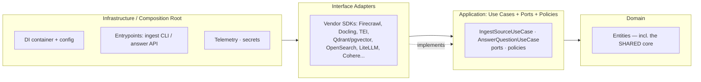
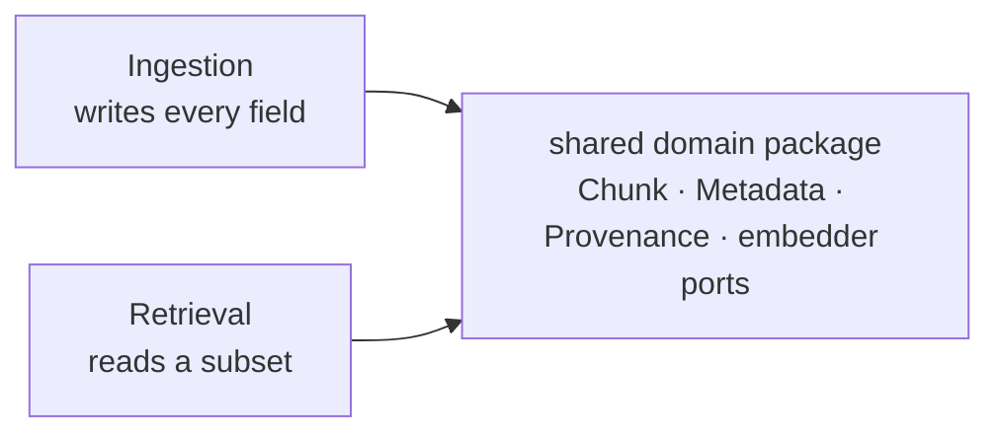
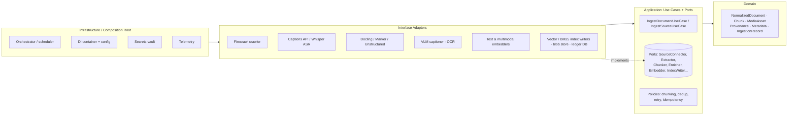
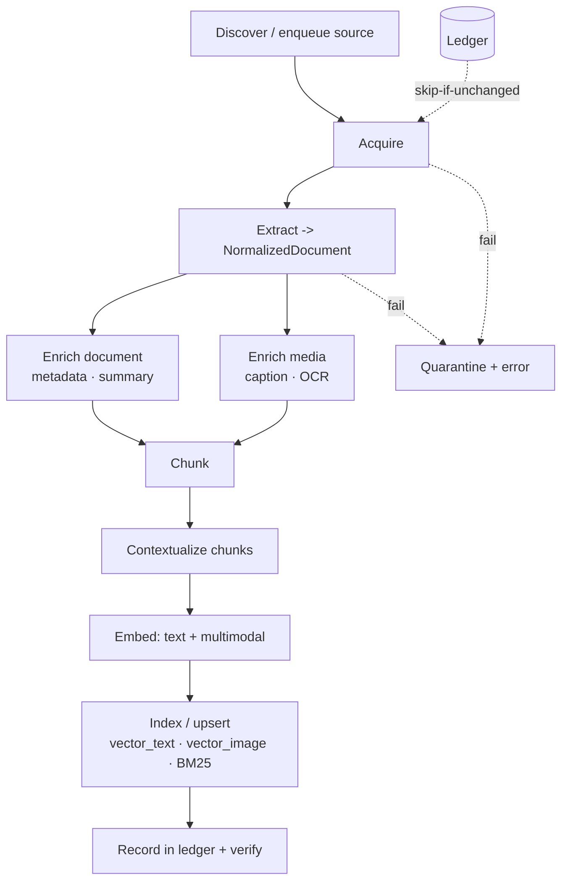
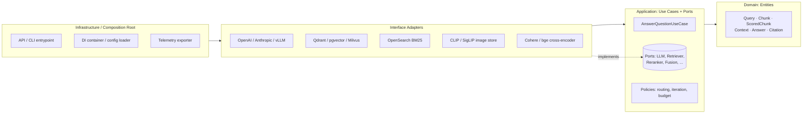
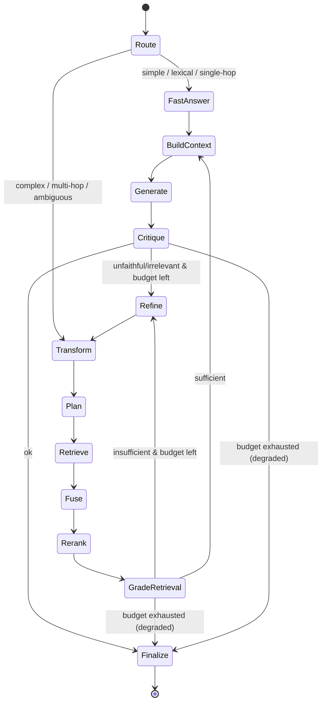
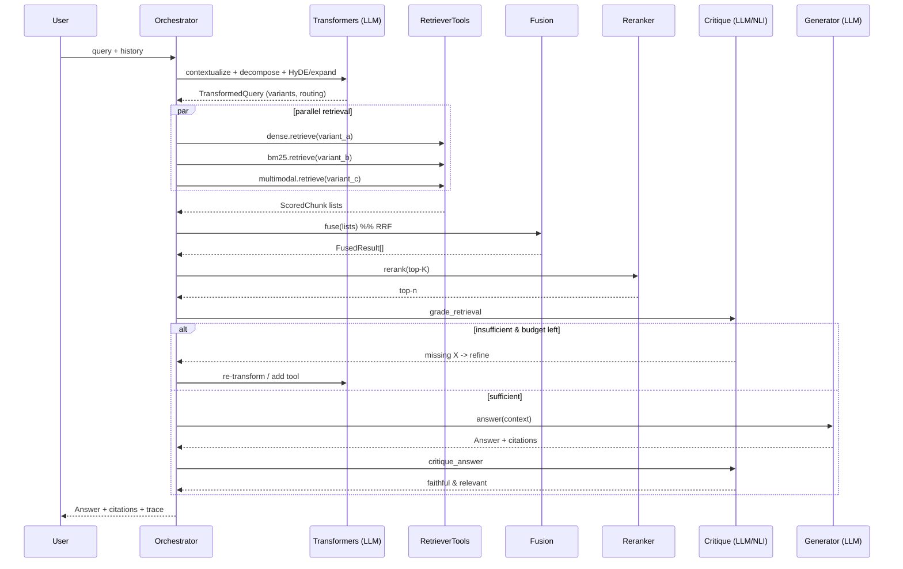

# Architecture — the whole system

This document describes how the **ingestion** and **retrieval** systems fit together as one product.
**Part I** states the structure they *share* once and shows how data flows end-to-end across both.
The **Ingestion** and **Retrieval** parts then specify each side in full — ports, entities, stages,
the agent runtime, and per-side trade-offs.

Read first: [DATA_MODEL.md](DATA_MODEL.md) (the contract both sides depend on).

Contents:

- [Part I — the whole system](#part-i--the-whole-system): 1 layers · 2 shared core · 3 subsystems ·
  4 data flow · 5 cross-cutting · 6 trade-offs
- [Ingestion — producer side](#ingestion--producer-side): I1 layers · I2 staged DAG · I3 domain ·
  I4 port catalog · I5 stage subsystems · I6 cross-cutting · I7 walkthroughs · I8 trade-offs
- [Retrieval — query side](#retrieval--query-side): R1 layers · R2 domain · R3 port catalog ·
  R4 agent runtime · R5 subsystems · R6 cross-cutting · R7 walkthroughs · R8 trade-offs

---

## Part I — the whole system

### 1. Layered architecture & the dependency rule

Both systems use the **same four layers** and the **same inward-only dependency rule**. This is not a
coincidence — it is what lets them share a domain core and swap any vendor independently.



- **Domain** — pure data, no I/O, no SDKs. The overlap between the two systems lives here (§2).
- **Application** — use cases + ports + policies. The ingestion pipeline and the retrieval agent
  both live here, speaking only to ports.
- **Adapters** — the **only** layer that may import a vendor SDK.
- **Infrastructure / Composition Root** — the only layer that knows concrete types; reads config,
  builds adapters, injects them, runs the parity check, hosts the entrypoints and telemetry.

**Rule:** dependencies point inward only. No vendor SDK import belongs in `domain` or `application`
— CI-enforced with import-linter on both sides.

---

### 2. The shared domain core (the contract seam)

The two systems share exactly the types and ports that make a written chunk a *readable, citable*
chunk. They are defined once in [DATA_MODEL.md](DATA_MODEL.md) and **imported by both,
re-declared by neither**:

```text
Shared entities/value objects:  Chunk · Metadata · Provenance · Anchor · TextSpan · Modality · Embedding
Shared ports:                   TextEmbedderPort · MultimodalEmbedderPort
```



Two checks at the composition root keep the seam honest — both **fail fast**, never degrade silently:

- **Embedder parity.** The configured ingestion embedder must equal the query-side embedder (model +
  version + pooling); the vectors in the stores are only comparable if it does.
- **`schema_version` compatibility.** The query side's expected range must be compatible (same major)
  with what ingestion wrote; the ledger records the version per chunk so migrations target exactly
  the stale ones.

The contract is **bidirectional but asymmetric**: ingestion populates every field, retrieval may read
only a subset (filters on `Metadata`, resolves citations via `Anchor`) and must never assume an
optional field is present. Full detail, evolution policy, and the reconciliation record:
[DATA_MODEL.md](DATA_MODEL.md).

---

### 3. The two subsystems at a glance

Each side is fully specified in its own part below; here is just enough to see how they meet.

#### Ingestion — a staged DAG (producer)
`Discover → Acquire → Extract → NormalizedDocument → Enrich (doc + media) → Chunk → Contextualize →
Embed → Index/upsert → record in ledger`. Every source kind implements one `SourceConnector`;
everything after `NormalizedDocument` is source-blind. Each stage boundary is a port, so each stage
is independently testable and replaceable. Ports, stage subsystems, and per-source walkthroughs:
[Ingestion part](#ingestion--producer-side) (ports in §I4).

#### Retrieval — a bounded agent state machine (consumer)
`Route → (fast path | deliberate: Transform → Plan → Retrieve → Fuse → Rerank → Grade → loop →
Build context → Generate → Critique) → Answer`. The agent is **bounded** by router / iteration /
budget policies — never an open-ended loop; on budget exhaustion it finalizes in a degraded-but-honest
mode. Dense / BM25 / multimodal are unified behind `RetrieverTool`; default behavior is hybrid
(run several in parallel, fuse with RRF k≈60, then rerank the top-K narrow). Ports, the runtime, and
walkthroughs: [Retrieval part](#retrieval--query-side) (ports in §R3).

#### Where they meet — the three stores
Ingestion **writes** and retrieval **reads** the same three stores, keyed by the same deterministic
`Chunk.id`:

| Store | Written by (ingestion) | Read by (retrieval) |
|-------|------------------------|---------------------|
| Text vector store | `VectorIndexWriterPort` (text vectors + image caption/OCR vectors) | `VectorSearchPort` (dense + image-caption retriever) |
| BM25 keyword index | `KeywordIndexWriterPort` (`keyword_text`) | `KeywordSearchPort` (BM25 retriever) |
| Multimodal image store | `VectorIndexWriterPort` (pixel vectors) | `VectorSearchPort` (multimodal retriever) |

An image is **triple-indexed**: caption+OCR → BM25 and the text vector store; pixels → the multimodal
store. So one picture is findable by keyword, by semantic text, and by visual query.

---

### 4. End-to-end data flow (ingest, then answer)

The two flows are decoupled in time — ingestion runs offline; a query arrives later — and connected
only through the stores and the shared contract.

```mermaid
sequenceDiagram
    participant SRC as Source
    participant ING as Ingestion (offline)
    participant ST as Three stores
    participant RET as Retrieval agent (online)
    participant U as User

    Note over ING: parity + schema_version checked at startup
    SRC->>ING: acquire (connector per source)
    ING->>ING: extract → NormalizedDocument → enrich → chunk → contextualize
    ING->>ING: embed (shared embedders)
    ING->>ST: upsert by deterministic chunk_id (idempotent); record in ledger

    U->>RET: query + conversation
    RET->>RET: route (fast vs deliberate); transform; plan
    RET->>ST: retrieve in parallel (dense · BM25 · multimodal)
    ST-->>RET: ScoredChunk lists
    RET->>RET: fuse (RRF) → rerank (cross-encoder) → grade → (loop if weak)
    RET->>RET: build context → generate → critique → output-safety gate
    RET-->>U: Answer + citations (resolved via Anchor) + trace
```

The citation at the end resolves because ingestion wrote a resolvable `Anchor` onto every chunk —
this is the §2 seam paying off at query time.

---

### 5. Cross-cutting concerns shared by both

- **One composition root each, config-driven.** Both wire concrete adapters in a single `container`
  from declarative YAML; it is the only code that branches on `provider` and the only place the
  parity / `schema_version` checks run.
- **Observability is the eval feed.** Ingestion emits a per-stage `IngestionRecord`; retrieval emits
  a per-query `QueryTrace`. In both, the same records that debug a run *are* the offline-eval dataset
  *and* the live-monitoring + drift feed (incl. hosted-model drift that would break parity). See
  [EVALUATION.md](EVALUATION.md).
- **The shared trust boundary (prompt injection).** *All ingested content is untrusted.* It reaches
  LLM/VLM calls on the ingestion side (captioner, contextualizer) — a poisoned caption is embedded
  and replayed on every future query — and again on the retrieval side (retrieved chunks in the
  generator prompt). Defense on both sides is the same: treat extracted/retrieved text as
  **data-never-instructions**, never let it drive tool decisions, plus an output-safety gate as the
  backstop. Detail: [Ingestion §I6](#ingestion--producer-side) and [Retrieval §R6](#retrieval--query-side).
- **Reindex / migration is blue-green, never in place.** Because vectors and ids are
  model-and-version-specific, an embedder or `schema_version` upgrade stands up a new collection,
  **backfills from the stored `NormalizedDocument` blobs** (no re-fetch), validates on the golden set,
  then cuts the query side over. The parity invariant forbids an in-place swap.
- **Security / ACLs.** `Metadata.access_level` (and a per-source license) is set at ingestion and
  enforced as a **hard filter pushed into the stores** at retrieval — never filtered after generation.
  PII redaction is an ingestion enrichment step *and* a retrieval output-gate check (each catches what
  the other can't).

---

### 6. Whole-system trade-offs

Decisions that span both sides (per-side trade-offs live in each part's §I8 / §R8).

| Decision | Options | Default & why |
|----------|---------|---------------|
| Store topology | one shared backbone · split managed services | **One backbone** (Postgres) locally; split a single port out only when that concern outgrows it — never as an upfront tax (see [DEPLOYMENT.md](DEPLOYMENT.md)) |
| Embedder choice | independent per side · **parity-locked** | **Parity-locked**, enforced at the composition root — a mismatch silently destroys quality |
| Source unification | bespoke per source · normalize early | **Normalize early** to `NormalizedDocument`; one uniform downstream, pluggable sources |
| Image handling | drop · caption only · **triple-index** | **Triple-index** (BM25 + text-emb + multimodal) so images are findable three ways |
| Hybrid retrieval | native DB hybrid · explicit fusion of separate ports | **Explicit fusion** — vendor-independent, per-query weighting, testable |
| Coupling between sides | shared service · **shared contract only** | **Shared contract only** (types + embedder ports); the sides are separate processes that never call each other |

Every row is a config/adapter choice, not a rewrite — because both systems depend only on ports and
the shared contract.

---

## Ingestion — producer side

This part specifies the ingestion pipeline at the same conceptual level as the [retrieval
part](#retrieval--query-side): conceptual first, but structured to map 1:1 onto code. It reuses the
shared conventions — ports, the dependency rule, the composition root, the shared `Chunk` entity and
metadata schema — and adds the acquisition/extraction stages unique to ingestion.

Pseudocode is language-neutral and typed; type names are port/entity names, not a language commitment.

### I1 · Layered architecture & the dependency rule

Same four layers and inward-only dependency rule as the query side.



- **Domain** — pure data: the normalized document, chunks, media, provenance, metadata. Shared
  with the query side where it overlaps (`Chunk`, `Metadata`, `Provenance`).
- **Application** — the pipeline use cases + ports + policies (chunking, dedup, idempotency, retry).
- **Adapters** — wrap every external tool/SDK behind a port.
- **Infrastructure / Composition Root** — wiring, config, the orchestrator/scheduler, the secrets
  vault, telemetry. The only layer that knows concrete types.

**Why:** extraction tools churn fast (new PDF parsers, new ASR models monthly). Isolating the
pipeline logic from them means re-targeting a parser or captioner is an adapter swap, and the
pipeline runs under test with fakes and golden fixtures.

### I2 · The pipeline as a staged DAG

Ingestion is a directed pipeline with well-defined stage boundaries. Each boundary is a port, so
each stage is independently testable and replaceable (this is also where the eval harness clips
on — see [EVALUATION.md](EVALUATION.md#ingestion--producer-side)).



Stage contracts (the types flowing between stages):

```
Acquire:        SourceRef            -> RawAsset[]
Extract:        RawAsset[]           -> NormalizedDocument
EnrichDoc:      NormalizedDocument   -> NormalizedDocument (metadata/summary added)
EnrichMedia:    MediaAsset           -> MediaAsset (caption + OCR added)
Chunk:          NormalizedDocument   -> Chunk[]
Contextualize:  Chunk                -> Chunk (context prepended)
Embed:          Chunk[]              -> EmbeddedChunk[]
Index:          EmbeddedChunk[]      -> IndexReceipt
```

### I3 · Domain model

Pure entities. The **shared types** — `Chunk`, `Metadata`, `Provenance`, `Anchor`, `Modality`,
`Embedding` — are defined once in the canonical contract,
[DATA_MODEL.md](DATA_MODEL.md), and imported by both systems (not re-declared
here). They are the *same* types the query system indexes and cites, which is what guarantees
compatibility. The types below are the **ingestion-only** entities; they reference the shared types.

```text
# Shared types (canonical defs in DATA_MODEL.md):
#   Chunk, Metadata, Provenance, Anchor, Modality, Embedding

# Identity & acquisition
SourceRef   { kind: enum(YOUTUBE|WEB|DOCUMENT); locator: string; hints: map }  # URL / path / video id
RawAsset    { kind: enum(HTML|MARKDOWN|PDF|TEXT|TRANSCRIPT|IMAGE|MEDIA);
              bytes/URI; mime; meta: map }

# The canonical intermediate representation
MediaAsset  { id; image_ref: URI; caption: string?; ocr_text: string?;
              parent_anchor: Anchor; meta: map }
NormalizedDocument {
  doc_id; markdown: string;           # tables as Markdown; images as refs
  media: MediaAsset[]; metadata: Metadata; provenance: Provenance; anchors: Anchor[]
}

# Chunking & embedding (Chunk is shared; EmbeddedChunk is ingestion-only / write-path)
EmbeddedChunk{ chunk: Chunk; text_vector: Embedding?; image_vector: Embedding?;
               keyword_text: string }                  # what goes to BM25

# Bookkeeping
IndexReceipt { doc_id; chunk_ids: string[]; stores_written: string[] }
IngestionRecord { source_id; content_hash; status: enum(OK|QUARANTINED|SKIPPED);
                  schema_version; receipt?; error?; timings: map }   # the ledger row
```

Design notes:

- An **image becomes both a `MediaAsset` and a `Chunk(modality=IMAGE)`**. The chunk's
  `keyword_text` and `text_vector` come from caption+OCR; its `image_vector` comes from pixels.
  This is the triple-index in data form.
- `Anchor` is what makes a chunk citable: a video chunk anchors to a timestamp, a PDF chunk to a
  page, a doc chunk to a heading path.
- `content_hash` keys idempotency at both source and chunk granularity.

### I4 · Port catalog

Each port is a narrow Application-layer interface; adapters implement them. For each: responsibility,
signature sketch, alternatives.

#### I4.1 `SourceConnectorPort` (the unifying abstraction)
**Responsibility:** acquire raw assets from one source kind. The keystone — YouTube, web, and
document acquisition all look identical to the pipeline.

```text
interface SourceConnectorPort {
  kind: enum
  acquire(ref: SourceRef, auth?: AuthContext) -> RawAsset[]
  discover(seed: SourceRef) -> SourceRef[]   # crawl/sitemap/playlist expansion; may be empty
}
```
A `SourceRegistry` maps `SourceRef.kind -> connector`. Adding a source = register one connector.

#### I4.2 `TranscriptProviderPort` (YouTube)
**Responsibility:** obtain a timestamped transcript, with fallback.
```text
interface TranscriptProviderPort { transcript(video_ref) -> TimedSegment[] }  # {text, start, end, speaker?}
```
**Alternatives:** platform captions (free, fast, may be absent/auto-generated and noisy) → **ASR
fallback** (Whisper / hosted speech-to-text: accurate, costs compute, enables no-caption videos).
Strategy `captions_then_asr` is the default. Diarization is optional.

#### I4.3 `WebFetcherPort` + `AuthProviderPort` (web)
**Responsibility:** fetch a page as clean Markdown; resolve authentication for gated domains.
```text
interface WebFetcherPort  { fetch(url, auth?) -> RawAsset(MARKDOWN) ; crawl(seed, scope) -> url[] }
interface AuthProviderPort{ resolve(domain) -> AuthContext? }   # cookies/headers/login action from vault
```
**Alternatives:** Firecrawl (default; clean markdown, JS render, crawl, auth actions) · Playwright/
headless browser (full control, more ops) · readability-style extractors (cheap, no JS/auth).
**Auth handling:** per-domain strategy (stored session cookie, header token, or a scripted login)
fetched from the secrets vault. Credentials are *configured operational secrets*, never improvised
at runtime; the vault is the only source. Respect robots/ToS as policy.

#### I4.4 `ExtractorPort` / `MarkdownConverterPort` (documents)
**Responsibility:** turn a raw asset into a `NormalizedDocument` — canonical Markdown, extracted
media, structural anchors. One implementation per asset family.
```text
interface ExtractorPort {
  supports(kind) -> bool
  extract(RawAsset[]) -> NormalizedDocument   # tables->markdown, images->MediaAsset, headings->anchors
}
```
**Alternatives (PDF→markdown):** Docling · Marker · Unstructured · LlamaParse · Azure Document
Intelligence. **Trade-off:** layout-aware parsers (better tables/reading order, slower/costlier) vs.
plain text extraction (fast, loses tables/structure). **Scanned PDFs** route through `OcrPort` first.

#### I4.5 `OcrPort` and `VisionCaptionerPort` (media enrichment)
```text
interface OcrPort             { ocr(image_ref) -> string }
interface VisionCaptionerPort { caption(image_ref, doc_context?) -> string }  # VLM
```
**Alternatives:** OCR — Tesseract (local) · cloud OCR (higher accuracy). Captioner — a VLM
(GPT-4o / Claude / local LLaVA). Passing `doc_context` (the surrounding section) yields captions
that describe the image *as used in the document*, which retrieves far better than generic captions.

#### I4.6 `EnricherPort` (composable)
**Responsibility:** add value to documents/chunks. A chain.
```text
interface EnricherPort { enrich(NormalizedDocument | Chunk, ctx) -> same }
```
**Implementations:** `MetadataExtractor` (title/author/date/language/entities), `Summarizer`
(doc/section summaries), `Contextualizer` (prepend a short section context to each chunk before
embedding — "contextual retrieval"), `PiiRedactor`. Most call an LLM; lightweight ones are rules.

#### I4.7 `ChunkerPort`
**Responsibility:** split a `NormalizedDocument` into `Chunk[]` with anchors preserved.
```text
interface ChunkerPort { chunk(NormalizedDocument, policy) -> Chunk[] }
```
**Modality-aware behavior (a policy, not separate ports):** text → structure-aware split by
heading/section with token bound + overlap; **tables → kept intact** as one chunk (never split
mid-table); **images → one chunk each**, content = caption+OCR; **video → time-window chunks**
aligned to transcript segments, anchored to timestamps.
**Alternatives:** fixed-size · recursive/structural · semantic (embedding-boundary) · layout-based.
Default structural; semantic chunking is an opt-in upgrade.

**Embed-unit ≠ return-unit (hierarchical chunking).** A policy may embed a *small* unit for precise
matching while linking it to a *larger* parent for generation — parent-document / auto-merging /
sentence-window retrieval. This is a chunker policy plus a query-side context-builder that resolves
children to parents; it directly addresses the precision-vs-context tension that overlap only softens.

**Large-table caveat.** Keeping tables atomic is right for *retrieving* a table, but a very large
table won't fit usefully in a generator's context and chunk-retrieval can't aggregate over its rows.
For numeric/aggregation workloads, extract tables to a structured store and answer via a tabular /
text-to-SQL retriever (registered as another `RetrieverTool` on the query side); optionally index a
table *summary* for findability while keeping the full table in the blob store.

#### I4.8 `TextEmbedderPort` and `MultimodalEmbedderPort`
**Shared with the query side** — same interfaces, same configured models (the parity invariant).
```text
interface TextEmbedderPort       { embed_text(string[]) -> Embedding[] }
interface MultimodalEmbedderPort { embed_image(URI[]) -> Embedding[]; embed_text(string[]) -> Embedding[] }
```
The composition root **fails fast** if the ingestion embedder config differs from the recorded
query-side config.

#### I4.9 Index writer ports
**Responsibility:** the write side of the three stores (the query side holds the read side).
```text
interface VectorIndexWriterPort  { upsert(collection, EmbeddedChunk[]) ; delete(ids) }
interface KeywordIndexWriterPort { upsert(index, {id, keyword_text, metadata}[]) ; delete(ids) }
```
Idempotent upsert by deterministic `chunk_id`. Dense text → `vector_text`; image vectors →
`vector_image`; `keyword_text` (incl. image captions/OCR) → BM25.
**Alternatives:** mirror the query side (Qdrant/pgvector/Milvus; OpenSearch/Elasticsearch).

#### I4.10 `DocumentStorePort` (blob)
**Responsibility:** persist the `NormalizedDocument` markdown + image bytes (so citations can
render images and re-chunking needs no re-fetch).
**Alternatives:** S3/GCS/blob · local FS (prototype).

#### I4.11 `IngestionLedgerPort`
**Responsibility:** idempotency, incremental runs, status/quarantine, lineage.
```text
interface IngestionLedgerPort {
  seen(content_hash) -> IngestionRecord? ; record(IngestionRecord)
  chunks_for(source_id) -> chunk_ids       # to supersede on re-ingest
}
```
**Alternatives:** Postgres (default) · any KV/DB.

#### I4.12 `DedupPort`, `CachePort`, `TelemetryPort`, `ClockPort`
```text
interface DedupPort { is_near_dup(chunk, neighbors) -> bool }  # MinHash/SimHash or embedding cosine
# Cache, Telemetry, Clock as on the query side (cost control, observability, test determinism).
```

#### Port → adapter summary

| Port | Default adapter | Notable alternatives |
|------|-----------------|----------------------|
| SourceConnectorPort | per-kind (YT/web/doc) | + Slack/email/audio connectors |
| TranscriptProviderPort | captions → Whisper ASR | hosted STT, diarizing ASR |
| WebFetcherPort | Firecrawl | Playwright, readability extractor |
| AuthProviderPort | cookie/header vault | scripted login action |
| ExtractorPort (PDF) | Docling | Marker, Unstructured, LlamaParse, Azure DI |
| OcrPort | Tesseract | cloud OCR |
| VisionCaptionerPort | VLM (Claude/GPT-4o) | local LLaVA |
| EnricherPort | LLM-based chain | rule-based |
| ChunkerPort | structural + modality policy | semantic, layout, fixed |
| Text/Multimodal embedders | **same as query side** | (must match) |
| Vector/Keyword writers | Qdrant / OpenSearch | pgvector/Milvus; Elasticsearch |
| DocumentStorePort | object storage | local FS |
| IngestionLedgerPort | Postgres | any DB/KV |

### I5 · Stage subsystems in detail

#### I5.1 Acquisition
Per-source connectors with `discover` for expansion (a playlist → videos; a sitemap/seed → URLs;
a folder → files). Web auth resolves a per-domain `AuthContext` from the vault before fetch.
Rate-limiting, retries/backoff, and robots/ToS checks live here. Output is always `RawAsset[]`,
hashed for idempotency before any expensive downstream work.

#### I5.2 Extraction → NormalizedDocument
The fidelity-critical stage. Per asset family:
- **YouTube:** transcript segments → Markdown with timestamp anchors; channel/title/description →
  metadata; optional keyframes → `MediaAsset`s.
- **Web:** Firecrawl markdown → canonical markdown; page metadata captured; inline images pulled
  into `MediaAsset`s.
- **Document/PDF:** layout-aware parse → markdown with **tables rendered as Markdown tables**,
  **images extracted** as `MediaAsset`s, headings → anchors, page numbers → anchors; scanned pages
  go through OCR first.
Everything converges on one `NormalizedDocument`; downstream is source-blind.

#### I5.3 Enrichment
Two tracks, both composable chains:
- **Media:** caption (VLM, with surrounding section as context) + OCR → fills `MediaAsset.caption`
  and `.ocr_text`. This text is what makes images keyword- and semantically-retrievable.
- **Document/chunk:** metadata extraction, optional summaries, **contextualization** (prepend a
  short "this section is about…" blurb to each chunk before embedding — markedly improves recall
  for chunks that are ambiguous in isolation), and PII redaction.

#### I5.4 Chunking
Structure-aware by default, with the modality rules from §I4.7. Anchors are preserved onto every
chunk so provenance survives the split. Tables and images are atomic chunks. Video chunks align
to transcript time windows. Overlap is applied to text chunks to avoid boundary loss.

#### I5.5 Embedding + the parity invariant
Text chunks (and image caption/OCR text) → `TextEmbedderPort`; image pixels → `MultimodalEmbedderPort`.
Batched for throughput, cached by `(text_hash, model_id)`. **The models must equal the query-side
models**; the composition root refuses to run on mismatch. This single check prevents the most
common silent ingestion failure.

#### I5.6 Indexing / upsert
Each `EmbeddedChunk` fans out: text vector → `vector_text`, image vector → `vector_image`,
`keyword_text` → BM25 — all keyed by deterministic `chunk_id` for idempotent upsert. On re-ingest
of a changed source, old chunk ids (from the ledger) are superseded/deleted, then new ones written.
A receipt is recorded; verification confirms counts match across all three stores.

#### I5.7 Dedup
Before indexing, near-duplicate chunks (same article mirrored across sites, boilerplate) are
detected via MinHash/SimHash or embedding cosine and collapsed, with provenance merged so the
surviving chunk still lists all its sources.

### I6 · Cross-cutting concerns

- **Idempotency & incremental.** Content-hash gating at source and chunk level via the ledger;
  re-runs skip unchanged work and never duplicate. Deterministic chunk ids make upserts safe.
- **Orchestration.** The pipeline is a DAG of stages run per source; batch by default, optionally
  streaming/scheduled. Stages parallelize across sources with bounded concurrency; per-stage
  retries with backoff.
- **Failure isolation / quarantine.** A source failing at any stage is recorded `QUARANTINED` with
  its error and skipped; the batch continues. Quarantine is re-drivable after a fix.
- **Secrets.** All site credentials and API keys come from a vault; never in code or config files
  in plaintext. Auth contexts are short-lived and scoped per domain.
- **Cost & rate limits.** ASR, VLM captioning, and embeddings are the cost centers — batch,
  cache, and gate them; the ledger ensures they run at most once per unchanged unit.
- **Provenance & lineage.** Every chunk keeps its `Anchor` and source id; the ledger records the
  full lineage (source → doc → chunks → stores). This is what the query side cites and what eval
  verifies.
- **PII / compliance.** Redaction is an enrichment step; license/robots/ToS respected at acquisition.
  `access_level` *and* a per-source `license`/permission are set on metadata for downstream ACL and
  redistribution enforcement. Authenticated ingestion is restricted to sources the operator is
  entitled to use — capability ≠ right; the operator owns the permissibility decision.
- **Untrusted content & prompt injection.** *All ingested content is untrusted.* It reaches LLM/VLM
  calls here (captioner, contextualizer, metadata extractor), so a poisoned caption or section-context
  is embedded and replayed on every future query — a persistent injection. Defenses: treat extracted
  text as data-never-instructions (delimit/spotlight) in every enricher prompt, an optional
  injection-screen `EnricherPort`, and never let retrieved/extracted text drive tool decisions. This
  trust boundary is shared with the query side ([Retrieval §R6](#retrieval--query-side)).
- **Freshness & re-crawl.** Each source carries a freshness policy (TTL / conditional-fetch / event);
  the scheduler enqueues re-acquisition, and change detection short-circuits unchanged sources before
  extraction. Removal (404/taken-down/deleted) is detected on re-crawl and retires the source's chunks.
- **Reindex & migration.** Embedder/schema upgrades use a versioned blue-green reindex backfilled from
  the stored `NormalizedDocument` blobs (no re-fetch); the ledger's per-chunk embedder + `schema_version`
  scopes the migration. Breaking changes never happen in place. See [DATA_MODEL.md §8](DATA_MODEL.md#8-schema-versioning--evolution-policy).
- **Observability, monitoring & drift.** Per-stage spans (input hashes, timings, costs, success) form an
  `IngestionRecord`; fakes + fixed fixtures + `ClockPort` let the pipeline run offline in tests. In
  production the same records drive live monitoring — throughput, cost-per-doc, quarantine rate — and
  **drift** detection: corpus-distribution shift, and silent vendor updates to *hosted* embedders that
  would violate the parity invariant (alert on embedding-norm/score-distribution change).

### I7 · End-to-end sequence walkthroughs

#### I7.1 Document (PDF with tables and images)

```mermaid
sequenceDiagram
    participant O as Orchestrator
    participant C as DocumentConnector
    participant X as Extractor (Docling)
    participant V as VLM captioner + OCR
    participant K as Chunker
    participant E as Embedders
    participant I as Index writers
    participant L as Ledger

    O->>C: acquire(pdf ref)
    C-->>O: RawAsset(PDF)  %% hashed; ledger says new
    O->>X: extract
    X-->>O: NormalizedDocument (md + tables + MediaAssets + page anchors)
    loop each image
        O->>V: caption(image, section ctx) + ocr
        V-->>O: caption + ocr_text
    end
    O->>K: chunk (structural; tables/images atomic)
    K-->>O: Chunk[]
    O->>E: embed text + multimodal
    E-->>O: EmbeddedChunk[]
    O->>I: upsert vector_text / vector_image / BM25
    I-->>O: receipt
    O->>L: record OK + lineage; verify counts
```

#### I7.2 YouTube (no captions → ASR)
`acquire(video) → transcript: captions miss → ASR (Whisper) → timestamped segments → Markdown
with timestamp anchors → (optional keyframes captioned) → time-window chunks → embed → index.`
Citations later resolve to `youtube.com/watch?v=…&t=<anchor>`.

#### I7.3 Auth-gated web page (Substack)
`AuthProvider.resolve("substack.com") → cookie from vault → Firecrawl.fetch(url, auth) → markdown
→ metadata + inline images → chunk → embed → index.` No auth context → page quarantined, not faked.

### I8 · Consolidated alternatives & trade-offs

| Decision | Options | Default & why |
|----------|---------|---------------|
| Source unification | per-source bespoke pipelines · one connector port + normalized doc | **Normalized doc**: one uniform downstream, pluggable sources |
| Transcript | captions only · ASR only · captions→ASR | **captions→ASR**: cheap when present, robust when absent |
| Web fetch | Firecrawl · headless browser · readability | **Firecrawl**: clean md + JS + auth, least ops |
| Auth-gated sites | skip · scripted login · vault cookies/headers | **Vault-resolved per-domain auth**, never improvised |
| PDF→markdown | layout-aware (Docling/Marker) · plain text | **Layout-aware**: tables/structure/images preserved |
| Image handling | drop · caption only · **triple-index** | **Triple-index** (BM25 + text-emb + multimodal) |
| Captioning | none · generic · **context-aware VLM** | **Context-aware**: captions retrieve far better |
| Chunking | fixed · structural · semantic · layout | **Structural + modality policy**; semantic as upgrade |
| Contextualization | off · prepend section context | **On**: improves recall of ambiguous chunks |
| Embedder choice | anything · **same as query side** | **Parity-locked** (enforced at composition root) |
| Re-ingestion | full rebuild · content-hash incremental | **Incremental** via ledger; idempotent upserts |
| Dedup | none · MinHash/SimHash · embedding cosine | **On**, source-merging, to avoid index pollution |
| Failure policy | abort batch · quarantine + continue | **Quarantine**: one bad source never blocks the rest |
| Orchestration | scripts · DAG batch · streaming | **DAG batch** default; streaming optional |

Every row is a config/adapter choice, not a rewrite — because the pipeline depends only on the
ports in §I4.

---

## Retrieval — query side

This part specifies the conceptual structure of the agentic RAG system in enough detail to begin
implementation without re-deciding anything fundamental. Pseudocode is intentionally language-neutral
and typed. Treat type names as port/entity names, not as a commitment to any language. See
[IMPLEMENTATION.md](IMPLEMENTATION.md#retrieval--query-side) for stack choices.

### R1 · Layered architecture & the dependency rule

Four concentric layers. **Source dependencies point inward only.** Inner layers know nothing
about outer layers; outer layers depend on inner abstractions.



- **Domain** — pure data and rules. No I/O, no framework, no model SDKs. Stable.
- **Application** — use cases (orchestration) + **ports** (the interfaces outer layers must
  satisfy) + **policies** (routing, stopping, budget). This is where the *agent* lives.
- **Adapters** — translate between the outside world and ports (LLM SDKs, DB clients,
  reranker APIs). Each adapter implements one or more ports.
- **Infrastructure / Composition Root** — the only place that knows concrete types; it reads
  config, builds adapters, and injects them into use cases. Also hosts the API/CLI and telemetry export.

**Why this matters here:** the agent's reasoning loop is the valuable, hard-to-get-right code.
Isolating it from vendor SDKs means you can re-target models and databases, run the core under
test with fakes, and reason about behavior independent of infrastructure churn.

### R2 · Domain model

Pure entities and value objects. No dependencies. The **shared types** — `Chunk`, `Metadata`,
`Provenance`, `Anchor`, `TextSpan`, `Modality`, `Embedding` — are defined once in the canonical
contract, [DATA_MODEL.md](DATA_MODEL.md), and imported (not re-declared here);
`Chunk` carries a typed `Metadata` and an `Anchor`, which is what lets citation reason about *where* a
result came from. The types below are the **retrieval-only** entities; they reference the shared types.

```text
# Shared types (canonical defs in DATA_MODEL.md):
#   Chunk, Metadata, Provenance, Anchor, TextSpan, Modality, Embedding

# Retrieval-only value objects
RetrieverId        = enum/string  # "dense_text" | "bm25" | "multimodal" | ...
Score              = float        # retriever-local, not comparable across retrievers
MetadataFilter     = structured predicate (field, op, value)   # over Metadata fields

# Core entities
Query {
  raw_text: string
  conversation: Message[]         # prior turns, for contextualization
  filters: MetadataFilter[]       # may be empty; filled by self-query
}

TransformedQuery {
  parent: Query
  variants: QueryVariant[]        # one per technique/sub-query
}
QueryVariant {
  text: string
  intent_tags: string[]           # "lexical" | "semantic" | "visual" | ...
  target_retrievers: RetrieverId[]# planner's routing hint
  hyde_passage: string?           # optional, for dense search
  filters: MetadataFilter[]
}

ScoredChunk {                     # a retrieval candidate WITH provenance
  chunk: Chunk
  retriever: RetrieverId
  raw_score: Score
  rank: int                       # position in that retriever's list
}

FusedResult  { chunk: Chunk; fused_score: float; sources: RetrieverId[] }
RerankedResult { chunk: Chunk; rerank_score: float }

ContextBlock { chunk: Chunk; cite_id: int }   # numbered for citation
Context      { blocks: ContextBlock[]; token_count: int }

Citation { cite_id: int; doc_id: string; chunk_id: string; span: TextSpan? }
           # coarse location is the cited chunk's shared Anchor (page/timestamp/heading);
           # span optionally narrows to a sub-range within the chunk (shared TextSpan)
Answer   { text: string; citations: Citation[]; confidence: float? }

# Verdicts produced by grading/critique
RetrievalGrade { sufficient: bool; reason: string; missing: string[] }
AnswerCritique { faithful: bool; relevant: bool; issues: string[] }

# The full run record (for observability & eval)
QueryTrace { steps: TraceStep[]; tokens: int; latency_ms: int; tool_calls: int }
```

Design notes:

- `ScoredChunk.raw_score` is explicitly **not** comparable across retrievers (BM25 scores and
  cosine similarities live on different scales). Fusion either ignores scores (RRF, uses
  `rank`) or normalizes them — see §R5.3.
- Images are represented as `Chunk(modality=IMAGE)` carrying a caption/OCR text *and* an
  `image_ref`. This lets a text generator cite an image by its caption while the UI can render
  the actual image.
- `cite_id` is assigned at context-build time so the generator references stable small integers.

### R3 · Port catalog

Each port is a narrow interface in the Application layer. Adapters implement them. For each
port: responsibility, signature sketch, and realistic alternatives.

#### R3.1 `LLMPort`
**Responsibility:** text generation and structured/JSON generation. Everything LLM-shaped
(rewriting, planning, grading, answering) goes through this one port.

```text
interface LLMPort {
  generate(prompt, opts) -> string
  generate_structured(prompt, schema, opts) -> object   # JSON-mode / function-call
  stream(prompt, opts) -> stream<token>                 # for final answer
}
```
**Alternatives:** OpenAI · Anthropic · local via vLLM/Ollama/TGI · Bedrock.
**Trade-offs:** hosted = best quality, per-token cost, data leaves premises; local = control &
privacy, ops burden, usually lower ceiling. Keep planning/grading on a cheaper model and the
final answer on a stronger one (see `LLMRouter` policy in §R4).

#### R3.2 `TextEmbedderPort` and `MultimodalEmbedderPort`
**Responsibility:** turn text (and text-or-image) into vectors. Split into two ports because
multimodal needs an image input path and a shared space.

```text
interface TextEmbedderPort        { embed_text(string[]) -> Embedding[] }
interface MultimodalEmbedderPort  { embed_text(string[]) -> Embedding[]
                                    embed_image(URI[])    -> Embedding[] }   # shared space
```
**Alternatives:** text — OpenAI text-embeddings · BGE · E5 · GTE · Jina. multimodal — CLIP ·
OpenCLIP · SigLIP · Jina-CLIP · Cohere multimodal.
**Trade-off / hazard:** the query-time embedder **must** match the ingestion-time embedder
exactly (same model + version + pooling). Enforce this at the composition root via config that
ingestion and query share.

#### R3.3 `VectorSearchPort` (dense) and `KeywordSearchPort` (BM25)
**Responsibility:** the two raw retrieval primitives. Multimodal search reuses
`VectorSearchPort` against the image collection.

```text
interface VectorSearchPort {
  search(vector: Embedding, k: int, filters) -> ScoredChunk[]
  collections() -> string[]          # text vs image collections live here
}
interface KeywordSearchPort {
  search(query_text: string, k: int, filters) -> ScoredChunk[]
}
```
**Alternatives:** vector — Qdrant · Weaviate · Milvus · pgvector · FAISS (embedded) ·
Pinecone. keyword — OpenSearch/Elasticsearch · Lucene · Tantivy · `rank_bm25` (in-proc).
**Trade-offs:** managed vector DBs (filters, scale, hybrid built in) vs. pgvector (one fewer
system if you already run Postgres) vs. FAISS (fastest single-node, no metadata filtering).
Some stores (Qdrant, Weaviate, OpenSearch) offer *native hybrid* dense+sparse — see §R5.2 for
why we still keep them as separate ports.

#### R3.4 `RetrieverTool` (the unifying abstraction)
**Responsibility:** wrap a retrieval primitive into a uniform, agent-callable tool. This is the
keystone of the design: dense, BM25, and multimodal all look identical to the agent.

```text
interface RetrieverTool {
  id: RetrieverId
  describe() -> ToolSpec            # name, when-to-use, input schema (for the planner/LLM)
  retrieve(variant: QueryVariant, k: int) -> ScoredChunk[]
}
```
Concrete tools compose lower ports:
- `DenseTextRetriever` = `TextEmbedderPort` + `VectorSearchPort(text_collection)`
- `Bm25Retriever`      = `KeywordSearchPort`
- `MultimodalRetriever`= `MultimodalEmbedderPort` + `VectorSearchPort(image_collection)`

A `ToolRegistry` holds all tools and exposes their `ToolSpec`s to the planner.
**Why a tool, not just a function:** it lets the planner reason in natural language about which
to use, lets you register new modalities without touching the agent, and gives a uniform place
for per-tool concurrency, caching, and error handling.

#### R3.5 `QueryTransformerPort`
**Responsibility:** produce a `TransformedQuery` (variants) from a `Query`. Implementations are
composable (a chain).

```text
interface QueryTransformerPort { transform(Query, ctx) -> TransformedQuery }
```
**Implementations:** `Contextualizer`, `Expander`, `HyDEGenerator`, `Decomposer`,
`StepBack`, `MultiQuery`, `SelfQueryFilterExtractor`, `ModalityRouter`. Most call `LLMPort`.
**Alternatives:** LLM-based (flexible, costs tokens) vs. rule/lexicon-based expansion (cheap,
deterministic, e.g., synonym tables for BM25). The fast path may use only the cheap ones.

#### R3.6 `FusionPort`
**Responsibility:** merge several per-retriever ranked lists into one.

```text
interface FusionPort { fuse(lists: ScoredChunk[][], opts) -> FusedResult[] }
```
**Alternatives:** RRF (default; rank-based, robust, no normalization) · weighted score fusion
(needs min-max/z-score normalization; tunable per-retriever weights) · relative-score fusion ·
learned fusion. See §R5.3.

#### R3.7 `RerankerPort`
**Responsibility:** re-score a candidate set jointly against the query.

```text
interface RerankerPort { rerank(query_text, candidates: Chunk[], top_n) -> RerankedResult[] }
```
**Alternatives:** cross-encoder API (Cohere Rerank) · local cross-encoder (bge-reranker,
mxbai-rerank) · ColBERT late-interaction · LLM listwise reranking · *no reranker* (skip on fast
path). Cross-encoders are accurate but quadratic-ish in length, so they run only on top-K
(e.g., 50→8). See §R5.4.

#### R3.8 `ContextBuilderPort`
**Responsibility:** turn reranked chunks into a token-budgeted, ordered, de-duplicated,
optionally compressed `Context` with citation ids.

```text
interface ContextBuilderPort { build(RerankedResult[], budget) -> Context }
```
**Sub-strategies (each its own small port if you want them swappable):** dedupe, MMR for
diversity, compression (extractive or LLMLingua-style), ordering (lost-in-the-middle aware).

#### R3.9 `AnswerGeneratorPort`
**Responsibility:** produce a grounded `Answer` with citations from a `Context` and the query.
Usually a thin policy over `LLMPort` with a citation-enforcing prompt and structured output.

```text
interface AnswerGeneratorPort { answer(Query, Context) -> Answer }
```

#### R3.10 `CritiquePort` (grading & reflection)
**Responsibility:** the quality gates. Two kinds of judgment:

```text
interface CritiquePort {
  grade_retrieval(Query, candidates) -> RetrievalGrade   # sufficient? what's missing?
  critique_answer(Query, Context, Answer) -> AnswerCritique  # faithful? relevant?
}
```
**Alternatives:** LLM-as-judge (flexible) · NLI model for faithfulness (cheaper, focused) ·
heuristic (score thresholds, citation coverage). See §R5.6.
**Output safety is a sibling gate.** Faithfulness ≠ safety — a faithfully-quoted harmful or
PII-laden passage is still harmful. A `screen_output` check (its own dimension or a `GuardrailPort`)
runs alongside `critique_answer`: PII-in-answer, harmful-use refusal, and a second line of defense
against a poisoned document that manipulated the generator (see §R6, prompt injection).

#### R3.11 Cross-cutting ports
```text
interface CachePort     { get(key)->value?; set(key,value,ttl) }
interface TelemetryPort { record(event); start_span(name)->span }
interface ClockPort     { now() }          # determinism in tests
interface GuardrailPort { screen_input(Query)->Verdict; screen_output(Answer,Context)->Verdict }
interface FeedbackPort  { record(QueryTrace, outcome)        # thumbs/click/edit/abandon -> sink
                          # feeds golden-set growth, fusion/rerank tuning, online quality monitoring }
```

#### Port → adapter summary

| Port | Default adapter | Notable alternatives |
|------|-----------------|----------------------|
| LLMPort | OpenAI | Anthropic, vLLM/Ollama (local), Bedrock |
| TextEmbedderPort | BGE-large | OpenAI, E5, Jina, GTE |
| MultimodalEmbedderPort | Jina-CLIP | OpenCLIP, SigLIP, Cohere multimodal |
| VectorSearchPort | Qdrant | Weaviate, Milvus, pgvector, FAISS |
| KeywordSearchPort | OpenSearch | Elasticsearch, Tantivy, rank_bm25 |
| RerankerPort | Cohere Rerank | bge-reranker (local), ColBERT, LLM listwise |
| FusionPort | RRF | weighted, relative-score, learned |
| CritiquePort | LLM-as-judge | NLI faithfulness, heuristics |

### R4 · The agent runtime (control flow)

The agent is a **bounded state machine** driven by policies, *not* an open-ended autonomous
loop. Bounding it (max iterations, token/tool/latency budgets) is what makes an agentic system
production-safe.



#### R4.1 Router policy
Classifies the query to pick a path and an initial tool mix. Signals: query length, presence of
exact identifiers/quotes (→ BM25), question complexity / multi-hop markers (→ decompose),
visual intent (→ multimodal), conversational coreference (→ contextualize first).
**Alternatives:** LLM classifier (one cheap call, flexible) · embedding-similarity to labeled
exemplars (no LLM call) · rules/regex (fastest, brittle). *Adaptive RAG* = this router.
**The router is the highest-risk gate, and asymmetric.** Over-routing (easy query → deliberate) only
wastes money; *under-routing* (hard query → fast path) answers confidently wrong with none of the
agentic safeguards, and the fast path has no way to notice. So bias toward caution and give the fast
path an **escape hatch**: a cheap post-retrieval sufficiency check (reuse `grade_retrieval`) that can
*escalate* to the deliberate path — making the routing decision revisable, not irreversible. When
uncertain, deliberate.

#### R4.2 Iteration / stopping policy
Decides whether to refine after a poor grade or critique. Inputs: `RetrievalGrade`/`AnswerCritique`,
iterations so far, remaining budget. Refinement actions it can choose:
- broaden `k` or relax filters,
- add a retriever (e.g., bring in BM25 if dense was thin),
- re-transform with a different technique (e.g., decompose further, step-back),
- escalate (e.g., a web/fallback tool, if registered) — the **Corrective-RAG** move.

#### R4.3 Budget policy
Hard ceilings on tokens, tool calls, latency, and iterations. When exhausted, the machine goes
to `Finalize` in a **degraded but honest** mode (answer with caveat, or "insufficient evidence")
rather than looping. This is the single most important guardrail.

#### R4.4 LLM routing within the agent
A small policy maps *task → model*: cheap/fast model for rewriting/grading/planning, strong
model for the final answer. Implemented as two `LLMPort` instances injected under named roles
(`llm.utility`, `llm.answer`).

#### Orchestrator pseudocode

```text
function answer(query):
  trace.start()
  plan = router.route(query)                       # path + initial tools + techniques
  if plan.path == FAST:
      cands = run_tools(plan.tools, transform_minimal(query))
      ctx   = context_builder.build(rerank(cands), budget)
      ans   = generator.answer(query, ctx)
      return finalize(ans, trace)

  for i in 0 .. budget.max_iterations:
      tq        = transformer_chain.transform(query, plan)      # rewrite/HyDE/decompose...
      plan.tools= planner.select_tools(tq, registry.specs())    # route per variant
      raw       = run_tools_parallel(plan.tools, tq)            # dense/bm25/multimodal
      fused     = fusion.fuse(group_by_retriever(raw))
      ranked    = reranker.rerank(query.raw_text, top(fused, K), top_n)
      grade     = critique.grade_retrieval(query, ranked)
      if grade.sufficient or budget.exhausted(): break
      plan = iteration_policy.refine(plan, grade)               # broaden / add tool / re-transform

  ctx  = context_builder.build(ranked, budget)
  ans  = generator.answer(query, ctx)
  crit = critique.critique_answer(query, ctx, ans)
  if not (crit.faithful and crit.relevant) and budget.left():
      plan = iteration_policy.refine(plan, crit); goto retrieve   # one corrective pass
  return finalize(ans, trace)
```

### R5 · Subsystems in detail

#### R5.1 Query transformation
A **chain** of `QueryTransformerPort`s selected by the router. Order matters: contextualize
first (so later steps see a standalone query), then decompose, then per-variant techniques
(HyDE for dense variants, expansion for BM25 variants), then self-query filter extraction.
Output is a `TransformedQuery` whose variants carry `target_retrievers` so the planner can route.
**Conceptual rule:** *shape the query to the tool.* The same intent becomes a hypothetical
passage for dense search, an expanded keyword set for BM25, and a visual description for multimodal.
**Conversation memory is a managed input, not a free variable.** `Query.conversation` cannot be
assumed small: long chats exceed the budget, so history is truncated/summarized (default: last N turns
verbatim + a rolling summary) — and *how* you compress it bounds what the contextualizer can resolve.
Decide whether retrieval targets only the current rewritten turn or the conversation's accumulated
need (both have failure modes). Session state lives in a store/cache with a lifecycle and counts
toward cumulative cost — the per-query budget doesn't cap a whole conversation.

#### R5.2 Retrieval
Tools run **in parallel** (independent I/O). Each returns `ScoredChunk[]` with `rank`. We keep
dense and BM25 as *separate ports* even when a store offers native hybrid, because: (a) the
agent may want them weighted differently per query, (b) fusion is then explicit and testable,
(c) you can mix vendors (Qdrant for dense, OpenSearch for BM25). Native hybrid remains available
as an *optimization adapter* that implements two ports at once if you choose it.

#### R5.3 Fusion
Default **RRF**: `score(d) = Σ_retriever 1 / (k + rank_retriever(d))`, `k≈60`. Rank-based, so it
needs no score normalization and is robust to wildly different score scales — ideal for
dense+BM25+multimodal.
**Weighted score fusion** is the alternative when you have tuned per-retriever trust: normalize
each list (min-max or z-score), then `Σ w_i · norm_score_i`. More powerful, more fragile, needs
calibration. Make it swappable via `FusionPort` so you can A/B them.

#### R5.4 Reranking
Applied to the **top-K fused candidates only** (e.g., K=50 → top_n=8). A cross-encoder reads
(query, chunk) jointly and is far more discriminating than the bi-encoder/BM25 first stage. This
"retrieve wide, rerank narrow" pattern is the highest-ROI quality lever in most RAG systems.
For image chunks, rerank on the caption/OCR text (or use a multimodal reranker if registered).
**Alternatives & when to skip:** drop reranking on the fast path or under tight latency budgets;
use ColBERT late-interaction if you want reranking quality closer to first-stage cost.

#### R5.5 Context building
Steps: **dedupe** (same chunk surfaced by multiple retrievers) → **diversify** (MMR, to avoid
five near-identical passages) → **compress** (optional: extract only query-relevant sentences,
or LLMLingua-style token pruning) → **order** (place strongest evidence at the head and tail to
counter "lost in the middle") → **number** (assign `cite_id`) → **fit budget** (drop weakest
until under token cap). Output `Context` is the only thing the generator sees.
**Hierarchical (parent-child) option.** The unit *retrieved/embedded* need not be the unit *given to
the generator*: a context builder can resolve small matched chunks up to their larger parent (or merge
a window of neighbors) — parent-document / auto-merging / sentence-window retrieval. Pair with the
ingestion-side hierarchical chunker ([Ingestion §I4.7](#ingestion--producer-side)); it's the structural
answer to the precision-vs-context trade-off that overlap only softens.

#### R5.6 Generation
`AnswerGeneratorPort` prompts `llm.answer` with: the (possibly decomposed) question, the numbered
context, and explicit instructions to *answer only from context* and *cite `cite_id`s*. Use
structured output to return `{text, citations[]}` so citations are machine-checkable. If decomposition
was used, generate per sub-answer then synthesize.
**Perceived latency.** Streaming the final answer only helps *once generation starts*; on the
deliberate path most wall-clock time is the *pre-generation* chain (transform → plan → retrieve →
grade). Mitigate with **progressive disclosure** — stream the intermediate `QueryTrace` steps
("rewriting… searching 3 sources… checking results…") so the user sees motion — then stream the
answer. The budget's latency ceiling bounds the worst case; this addresses the *felt* latency.

#### R5.7 Reflection / corrective loop
Three gates via `CritiquePort` (+ `GuardrailPort`):
- **Retrieval grade** (before generating): is the evidence sufficient? what's missing? → drives
  refinement (Corrective-RAG / Self-RAG style).
- **Answer critique** (after generating): is every claim grounded in a cited block; does it
  answer the question? → at most one corrective re-retrieval, then finalize honestly.
- **Output safety** (before returning): PII-in-answer, harmful-use refusal, injection-fallout — a
  faithful answer can still be unsafe, so this gate is independent of the faithfulness check.
Both correction gates are bounded by the budget policy. Faithfulness can use LLM-as-judge or a cheaper
NLI model that checks entailment of each sentence against its cited blocks.

### R6 · Cross-cutting concerns

- **Caching (`CachePort`).** Cache embeddings (by text hash + model id), retrieval results (by
  variant + filters + k), rerank scores, and LLM transformation outputs. Massive cost/latency win.
- **Concurrency.** Tools and query variants fan out concurrently; gather with a deadline tied to
  the latency budget. Slow/failed tools degrade gracefully (partial results, logged).
- **Error handling & fallbacks.** Each adapter wraps vendor errors into domain errors with a
  retry/backoff policy. If a retriever is down, the agent continues with the rest and notes the
  gap in the trace; if the answer LLM fails, fall back to the utility LLM.
- **Determinism for tests.** `ClockPort`, fixed seeds, and fake adapters let the entire agent run
  offline and reproducibly.
- **Observability, monitoring & drift.** Every step emits a span (input/output hashes, scores,
  latency, tokens) assembled into a `QueryTrace` — this *is* the eval dataset *and* the live monitoring
  feed. Offline eval guards *changes*; production monitoring guards *operation*: SLOs (p95 latency,
  token spend), and alerting on rising `grade_retrieval`-insufficient / abstention rates (query drift),
  corpus drift, and silent hosted-model updates that break the parity invariant.
- **Prompt-injection / untrusted content.** Retrieved chunks are attacker-controllable (the ingestion
  side fetches them; [Ingestion §I6](#ingestion--producer-side)). Treat retrieved text as
  **data-never-instructions**: delimit/spotlight it in every prompt, never let it drive tool-use
  decisions, and keep the §R5.7 output gate as the backstop when a poisoned passage still influences
  the generator.
- **Feedback loop (`FeedbackPort`).** Attach an outcome (thumbs/click/edit/abandon) to each
  `QueryTrace`; the sink feeds golden-set growth, fusion/rerank tuning, and online quality monitoring.
  Feedback is user data — same ACL/PII care as the corpus.
- **Prompt management.** The 10+ behavior-defining prompts (rewrite/HyDE/decompose/grade/critique/
  generate) are versioned, reviewed application-layer artifacts pinned in the eval RunManifest — not
  string literals in adapters (see [IMPLEMENTATION §R3](IMPLEMENTATION.md#retrieval--query-side),
  `prompts/`).
- **Security/privacy.** Metadata filters can enforce per-user document ACLs at retrieval time
  (push filters into the stores, never filter after generation). PII redaction is a context-build
  sub-step *and* an output-gate check (§R5.7); the ingestion-side redaction can't catch PII entered via
  the query or synthesized across chunks. Local LLM/embedder adapters exist for data-residency.

### R7 · End-to-end sequence walkthroughs

#### R7.1 Deliberate path (complex, multi-hop)



#### R7.2 Fast path (exact lookup)
`Route → BM25.retrieve → (optional rerank) → build context → answer → return.` One LLM call (the
answer), sub-second target. No transformation chain, no grading loop.

### R8 · Consolidated alternatives & trade-offs

| Decision | Options | Default & why |
|----------|---------|---------------|
| Control style | Static pipeline · ReAct agent · Plan-and-execute · Adaptive (router) | **Adaptive**: cheap path for easy queries, agent for hard ones |
| Hybrid combination | Native DB hybrid · explicit fusion of separate ports | **Explicit fusion**: vendor-independent, per-query weighting, testable |
| Fusion algorithm | RRF · weighted · relative-score · learned | **RRF**: robust, no calibration |
| Reranking | none · cross-encoder · ColBERT · LLM listwise | **Cross-encoder on top-K**: best quality/cost ratio |
| Query improvement | rules · LLM rewrite/HyDE/decompose · both | **Both, router-selected**: cheap default, LLM when it pays off |
| Correction | none · CRAG · Self-RAG | **Bounded CRAG-style**: grade + at most N refinements |
| Faithfulness check | LLM-judge · NLI · heuristic | **LLM-judge default, NLI for scale** |
| Context compression | none · extractive · LLMLingua | **Off by default, enable under token pressure** |
| LLM placement | one model · role-routed | **Role-routed**: utility model cheap, answer model strong |
| Vector store | Qdrant · pgvector · Milvus · FAISS · Weaviate | Pick per ops reality; **all behind `VectorSearchPort`** |

The architectural payoff: every row above is a config/adapter choice, not a code rewrite,
because the agent depends only on the ports in §R3.
