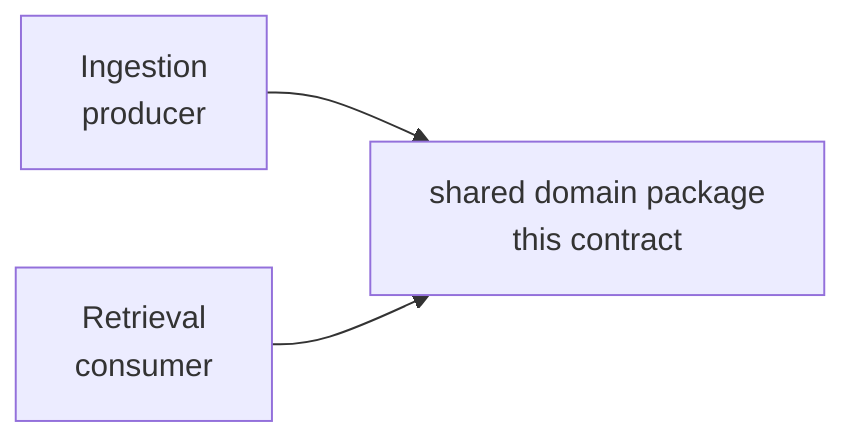

# Shared Data Model — the contract between ingestion and retrieval

This document is the **single source of truth** for the domain types and embedder ports that the
ingestion pipeline (the producer) and the retrieval system (the consumer) share. It is the contract
that makes an indexed chunk retrievable and citable: ingestion *writes* these shapes into the three
stores; retrieval *reads* them back. If the two sides disagree about these types, retrieval quality
degrades silently — so they are defined here once, and **neither system re-declares them**.

Pseudocode is language-neutral and typed (the same style as the two `ARCHITECTURE.md` documents).
Type names are entity/port names, not a language commitment.

Related: [ARCHITECTURE.md (Ingestion)](ARCHITECTURE.md#ingestion--producer-side) §I3 and
[ARCHITECTURE.md (Retrieval)](ARCHITECTURE.md#retrieval--query-side) §R2 consume these types and add
their own system-specific ones; the embedder **parity invariant** that this contract depends on is
described in both (ingestion ARCHITECTURE §I4.8, retrieval ARCHITECTURE §R3.2).

---

## 1. The sharing rule (dependency direction)



- **One definition, two importers.** Both systems import these types from a single shared domain
  package; neither copies or re-declares them. A divergent local re-definition is a defect.
- **Pure data.** These are domain entities and value objects: no I/O, no vendor SDKs, no framework
  types. They sit at the innermost layer of both systems' Clean Architecture.
- **The contract is bidirectional but asymmetric.** Ingestion populates *every* field; retrieval may
  read only a subset (e.g., it filters on `Metadata`, resolves citations via `Anchor`), but it must
  never assume a field the contract marks optional is present.
- **Compatibility is enforced, not promised.** The composition root checks `schema_version` (§8) the
  same way it checks embedder parity (§7); a mismatch fails fast rather than corrupting the index.

---

## 2. Shared value objects

```text
Modality   = enum(TEXT | IMAGE)        # a chunk is either text or an image
Embedding  = float[]                   # opaque vector; dimensionality is set by the embedder

Anchor     { kind: enum(HEADING | PAGE | TIMESTAMP | CHAR_SPAN); value }
             # the resolvable back-reference that makes a chunk citable:
             #   HEADING   -> heading path within a document
             #   PAGE      -> page number (PDF)
             #   TIMESTAMP -> seconds offset (video/audio)
             #   CHAR_SPAN -> character offsets within the source document

TextSpan   { start: int; end: int; unit: enum(CHAR | TOKEN) }   # text: a sub-range of chunk.content
ImageRegion{ x: float; y: float; w: float; h: float }           # image: a normalized bbox (0..1)
             # together these let a citation point INSIDE a chunk (highlight a sentence or region),
             # finer-grained than the chunk's own Anchor.
```

`Anchor` locates a **chunk** in its source; `TextSpan` / `ImageRegion` optionally locate a span
**within** a chunk for precise highlighting in a citation (§5, retrieval `Citation`).

---

## 3. Metadata

The typed schema the query side uses for **filters** (date, source type, author, language) and
**access control** (per-document ACLs enforced at retrieval). It is a typed object, not an untyped
map, so both sides agree on field names and types; `extra` is the escape hatch for source-specific
keys, so the query side loses no flexibility.

```text
Metadata {
  title:         string
  author?:       string
  published_at?: timestamp      # for recency filtering
  language?:     string         # BCP-47, e.g. "en", "fr"
  source_type:   enum(YOUTUBE | WEB | DOCUMENT)
  access_level:  string         # ACL tag enforced at retrieval time
  tags:          string[]
  extra:         map            # source-specific keys (e.g. section, page-count, channel)
}
```

> Note: `fetched_at` and the immutable source lineage live on `Provenance` (§4), not here — `Metadata`
> is about the *content*; `Provenance` is about *where it came from and when it was acquired*.

---

## 4. Provenance (document-level)

Provenance is a **document-level** entity (one per `doc_id`), not copied onto every chunk. It is
written by ingestion, stored alongside the normalized document (blob store / ledger), and resolvable
by `doc_id`. The query side reads it to render citations and show sources (including merged sources
after dedup, where the same content appears in multiple places).

```text
Provenance {
  source_id:    string          # identity of the originating source
  connector:    string          # which SourceConnector produced it (youtube | web | document | ...)
  content_hash: string          # keys idempotency; detects upstream change
  fetched_at:   timestamp       # when it was acquired
  anchors:      Anchor[]        # the document's structural anchors (headings/pages/timestamps)
  sources?:     string[]        # additional source ids merged in by dedup, if any
}
```

A chunk links to its provenance via `Chunk.doc_id`; it does not embed the whole `Provenance` object.

---

## 5. Chunk (the indexed unit)

The keystone shared entity — the unit ingestion indexes and retrieval ranks and cites. An image is
represented as `Chunk(modality=IMAGE)` carrying its caption/OCR text in `content` (for keyword + text
retrieval) and its pixels referenced by `image_ref` (for multimodal retrieval); see triple-indexing
in [README.md (Ingestion)](README.md#ingestion--producer-side) §I6.

```text
Chunk {
  id:            string         # stable, deterministic chunk id (see §6)
  doc_id:        string         # the document this chunk belongs to; links to Provenance (§4)
  modality:      Modality
  content:       string         # text, or caption + OCR text for images
  image_ref?:    URI            # present iff modality == IMAGE
  anchor:        Anchor         # where this chunk sits in its source -> enables citation
  metadata:      Metadata       # typed; used for filters & ACLs at retrieval
  schema_version: string        # the contract version this chunk was written under (§8)
}
```

**Why `anchor` is on the chunk (not only on Provenance):** the query side cites a *chunk*, so it needs
the chunk's own resolvable location without re-reading the document. `Provenance.anchors` is the
document's full anchor set; `Chunk.anchor` is this chunk's specific one.

`EmbeddedChunk` (chunk + its vectors + `keyword_text`) is an **ingestion-only derived type** — it
exists only on the write path and is *not* part of the shared contract. It is defined in
[ARCHITECTURE.md (Ingestion)](ARCHITECTURE.md#ingestion--producer-side) §I3.

---

## 6. Identity conventions

- **`doc_id`** identifies a source document; **`Chunk.id`** (a.k.a. `chunk_id` where referenced from
  the query side, e.g. `Citation.chunk_id`) identifies a chunk within it. They are strings.
- **Deterministic & content-derived.** Ids are derived deterministically (e.g. from `content_hash` +
  position) so that re-ingesting unchanged content yields the *same* ids — this is what makes index
  upserts idempotent and lets changed chunks supersede their predecessors. See
  [README.md (Ingestion)](README.md#ingestion--producer-side) §I10.
- **Stable across stores.** The same `Chunk.id` keys the text vector store, the image vector store,
  and the BM25 index, so the three stores reconcile and a citation resolves uniformly.

---

## 7. Embedder ports (shared interfaces + parity invariant)

The text and multimodal embedders are part of the contract because the *vectors* in the stores are
only comparable if both sides used the identical model. The interfaces are shared; the **models
configured for them must be identical** at ingestion time and query time (same model + version +
pooling). The composition root **fails fast** on mismatch.

```text
interface TextEmbedderPort       { embed_text(string[]) -> Embedding[] }
interface MultimodalEmbedderPort { embed_text(string[]) -> Embedding[]
                                   embed_image(URI[])    -> Embedding[] }   # shared text<->image space
```

This is the **parity invariant**: a silent embedder mismatch destroys retrieval quality, so it is
enforced, not conventional. Upgrading an embedder is therefore a coordinated reindex/migration, not an
in-place swap — see the evolution policy below (§8) and the reindex strategy (TODO item 2).

---

## 8. Schema versioning & evolution policy

The shared contract carries a single **`schema_version`** (semantic version, e.g. `"1.0.0"`) recorded
on every `Chunk` and in the ingestion ledger. This is what lets the contract evolve without silent
corruption — the problem this whole document exists to prevent.

| Change type | Examples | Version bump | Action required |
|-------------|----------|--------------|-----------------|
| **Additive (backward-compatible)** | new optional field; new `extra` key; new enum value the reader can ignore | **minor** | none — old chunks remain valid; readers tolerate missing new field |
| **Breaking** | rename/remove a field; change a type (e.g. map→typed); change `Anchor.kind` meaning; embedder change | **major** | coordinated **reindex/migration**: re-embed/re-emit from stored normalized docs into a new collection, then cut the query side over (TODO item 2) |

Rules:

- **Both sides pin a compatible range.** The composition root asserts the ingestion-written
  `schema_version` is compatible with the query side's expected range (same major), alongside the
  embedder parity check (§7). Incompatible → fail fast.
- **The ledger records the version per chunk** so a mixed-version index is detectable and a migration
  can target exactly the stale chunks.
- **Breaking changes never happen in place.** Because vectors and ids are version-and-model-specific, a
  major change uses versioned collections + blue-green cutover, never a destructive rewrite.

---

## 9. Reconciliation record

This contract resolved pre-existing divergences between the two systems' separate definitions. Recorded
here so reviewers can see what changed from each side and why.

| Type / field | Ingestion (was) | Retrieval (was) | Canonical decision |
|--------------|-----------------|-----------------|--------------------|
| `Chunk.metadata` | `Metadata` (typed) | `map` (untyped) | **typed `Metadata`** — shared field names/types; `extra: map` keeps flexibility |
| `Chunk.anchor` | present (`anchor: Anchor`) | absent | **present** — the query side cites chunks and needs the anchor |
| `Metadata` | typed object | untyped map w/ example keys | **typed object** (§3), `source_type` as enum, `extra` escape hatch |
| `Provenance` | defined (`source_id…anchors[]`) | undefined | **defined once, document-level** (§4), resolvable by `doc_id` |
| `Anchor` | defined (4 kinds) | only `Citation.span: TextSpan?`, `TextSpan` undefined | `Anchor` shared (§2); **`TextSpan` now defined**; `Citation.span` references it |
| `schema_version` | absent | absent | **added** to `Chunk` + ledger; enables the evolution policy (§8) |
| `EmbeddedChunk` | defined | not used | **ingestion-only**, explicitly *not* shared |

---

## 10. Glossary

- **Shared domain package** — the single module both systems import these types from; the code home of
  this document.
- **Parity invariant** — ingestion-time embedders must equal query-time embedders (model + version +
  pooling).
- **Anchor** — a chunk's resolvable back-reference to its source location (heading/page/timestamp).
- **schema_version** — the contract version a chunk was written under; gates compatibility and migration.
