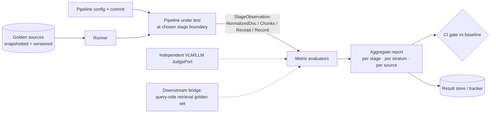
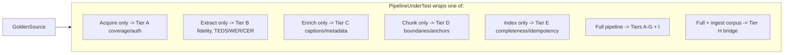
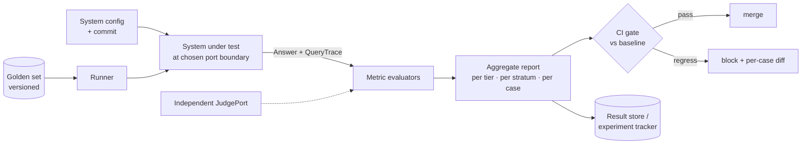
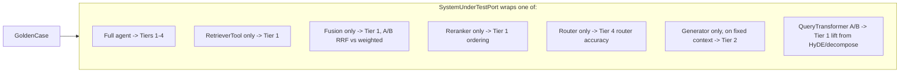
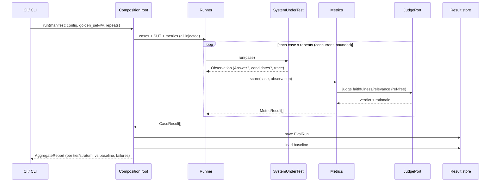

# Evaluation — the end-to-end quality story

Quality in a RAG system is a **chain**: retrieval can only be as good as what was indexed, and an
answer can only be as good as what was retrieved. **Part I** tells that chain as one story across
both halves. The **Ingestion** and **Retrieval** parts below are each side's full golden-set harness.

Contents:

- [Part I — the whole system](#part-i--the-whole-system): 1 why both · 2 the quality chain ·
  3 downstream bridge · 4 operating in production · 5 regression gates
- [Ingestion — producer side](#ingestion--producer-side): I1–I13 (golden *sources*, fidelity
  tiers A–I, stage-boundary eval, bridge, bake-offs)
- [Retrieval — query side](#retrieval--query-side): R1–R13 (golden cases, tiers 1–4 incl. agentic
  trajectory, port-boundary eval, A/B)

---

## Part I — the whole system

### 1. Why evaluate both sides

- **Ingestion failure is silent.** A mangled table, a dropped image, or a wrong embedder throws no
  error — it just quietly degrades everything downstream. So ingestion quality is measured
  *explicitly*, per stage, not inferred from the answer.
- **Retrieval failure is loud but late.** A confident wrong answer is the symptom; the cause is
  usually upstream. Attributing it requires metrics at each link.
- **One golden corpus connects them.** The same ingested corpus that proves extraction fidelity is
  the corpus the retrieval golden set runs against — which is what makes the chain end-to-end.

---

### 2. The quality chain

```mermaid
flowchart LR
    EX[Extraction fidelity<br/>CER/WER · heading F1 · TEDS · image recall · OCR/ASR] --> IDX
    IDX[Index integrity — hard gates<br/>parity · triple-index · reconciliation · idempotency] --> R
    R[Retrieval<br/>recall@k · nDCG · MRR · context precision/recall] --> G
    G[Generation<br/>faithfulness · answer relevance · citation correctness] --> S
    S[System<br/>latency · token cost · tool-call / iteration count]
    IDX -. downstream bridge .-> R
```

| Link | Owns it | Headline metrics | Detail |
|------|---------|------------------|--------|
| Extraction fidelity | Ingestion | CER/WER, heading-structure F1, **TEDS** (tables), image-extraction recall, OCR/ASR accuracy | [Ingestion part](#ingestion--producer-side) |
| Enrichment | Ingestion | caption quality (VLM-judge + retrievability proxy), metadata accuracy, contextualization | [Ingestion part](#ingestion--producer-side) |
| Index integrity (**hard gates**) | Ingestion | cross-store reconciliation, **triple-index** check, **parity** assertion, **idempotency** (zero new chunks on re-ingest) | [Ingestion part](#ingestion--producer-side) |
| Retrieval | Retrieval | recall@k, nDCG, MRR, context precision/recall | [Retrieval part](#retrieval--query-side) |
| Generation | Retrieval | faithfulness/groundedness, answer relevance, citation correctness | [Retrieval part](#retrieval--query-side) |
| System | Retrieval | end-to-end latency, token cost, tool-call & iteration counts | [Retrieval part](#retrieval--query-side) |

---

### 3. The downstream bridge (the keystone)

The link that makes the chain whole: a **freshly-ingested corpus is run against the retrieval golden
set** (recall@k / nDCG). This is where ingestion fidelity *cashes out* as retrieval quality — and the
only test that catches a defect that is invisible on either side alone (e.g. a subtly wrong chunk
boundary that extraction metrics pass but that tanks recall).

It also depends on the two **fail-fast** seam checks holding (see
[ARCHITECTURE.md](ARCHITECTURE.md) §2): embedder **parity** and `schema_version` compatibility. If
either drifts, the bridge is meaningless because the vectors aren't comparable — so these are gates,
not metrics.

---

### 4. Operating in production

The same telemetry that powers offline eval powers live operation:

- **Trace-driven monitoring.** Ingestion's `IngestionRecord` and retrieval's `QueryTrace` feed SLOs
  (p95 latency, token/cost per doc and per query, quarantine rate) and dashboards.
- **Drift detection.** Corpus-distribution shift; rising `grade_retrieval`-insufficient / abstention
  rates (query drift); and **silent hosted-model updates** that would violate the parity invariant
  (alert on embedding-norm / score-distribution change). Offline eval guards *changes*; monitoring
  guards *operation*.
- **Feedback loop.** A user outcome (thumbs / click / edit / abandon) attaches to each `QueryTrace`;
  the sink grows the golden set and tunes fusion/rerank. Feedback is user data — same ACL/PII care as
  the corpus.

---

### 5. Regression gates

Both sides re-run their golden sets at **every phase gate** — this is how each phase proves it helped
rather than just adding moving parts. The combined gate before any production cutover (including a
blue-green reindex) is: ingestion hard gates green **and** the downstream bridge meets or beats the
prior baseline on the golden set. Per-side harnesses, strata, and thresholds:
[Ingestion part](#ingestion--producer-side) · [Retrieval part](#retrieval--query-side).

---

## Ingestion — producer side

This part specifies how we measure ingestion quality, in detail. It mirrors the [retrieval
part](#retrieval--query-side) — same Clean-Architecture harness, same "evaluate at any port boundary"
payoff, same trust discipline — and adds the fidelity dimensions unique to turning messy sources into
clean, citable index entries. It also defines the **bridge** to the query-side harness: ingestion's
ultimate test is whether the indexed corpus supports retrieval.

### I1 · Why ingestion eval is different

Ingestion sits *upstream of everything*, which changes what evaluation must do:

- **Errors are unrecoverable.** A table mangled at extraction, an image dropped, a transcript
  with high word-error-rate — no reranker or clever prompt downstream can fix what was never
  indexed. So fidelity must be measured *at the point of extraction*, not inferred from final answers.
- **Much of it is objectively checkable.** Unlike answer quality (subjective, judge-reliant),
  large parts of ingestion have ground truth: was every image extracted? does the table match?
  does re-ingestion produce zero new chunks? These are cheap, deterministic, high-signal metrics.
- **The remaining parts need judgment.** Caption quality and markdown faithfulness need a (VLM/LLM)
  judge — but they're a minority, and they're triangulated by objective proxies (e.g.,
  retrievability).
- **The real target is downstream.** Intrinsic fidelity is necessary but not sufficient; the
  decisive question is whether the ingested corpus lets the query side retrieve and cite correctly.
  So the harness must both measure stages intrinsically *and* bridge to query-side retrieval.

### I2 · Principles

1. **Attribute to a stage.** Every run scores per stage (acquisition, extraction, enrichment,
   chunking, indexing) and per stratum, so a regression points at the responsible component.
2. **Prefer objective anchors.** Lead with deterministic, reference-based checks (counts, hashes,
   edit distance, TEDS, idempotency); use the judge only where no objective reference exists.
3. **Evaluate at stage boundaries.** Because each stage is a port, the harness clips onto any one
   of them with the same machinery — and onto the whole pipeline plus the downstream bridge.
4. **Pin the sources.** Golden *sources* are snapshotted (raw bytes stored), because web pages and
   videos drift; otherwise "regressions" are really source changes.
5. **Independent, calibrated judges.** Markdown-fidelity and caption judges use models distinct
   from the pipeline's captioner/enricher, calibrated against human labels.
6. **The bridge is a first-class metric.** Downstream retrievability of the query-side golden set
   on the freshly ingested corpus is tracked as the integrative score.

### I3 · One-picture overview



### I4 · The golden set (golden *sources*)

#### I4.1 Anatomy of a `GoldenSource`

Where the query side curates query→answer cases, ingestion curates **source→expected-output**
cases, with the source content snapshotted for stability.

```text
GoldenSource {
  id: string
  version_added: string
  stratum: enum                       # clean_pdf | scanned_pdf | nested_table | image_heavy
                                      # captioned_video | no_caption_video | public_web
                                      # auth_web | duplicate_pair
  difficulty: enum                    # easy | medium | hard

  # Pinned input (so the set is stable)
  source_ref: SourceRef
  snapshot: URI                       # stored raw bytes of the page/PDF/video+captions

  # Expected outputs (references; any subset may be present)
  expected_markdown: string?          # canonical reference body (for fidelity)
  expected_headings: string[]?        # structure reference
  expected_tables: TableRef[]?        # reference cell grids (for TEDS / cell-F1)
  expected_images: { count: int; key_terms: string[][] }?   # extraction completeness + caption probes
  expected_transcript: string?        # for ASR WER
  expected_metadata: { title?; author?; published_at?; language? }
  expected_anchors: AnchorRef[]?      # which page/timestamp/heading each key fact lives at
  expected_chunk_bounds: { min: int; max: int }?            # sane chunk count range
  dedup_partner: source_id?           # for duplicate_pair stratum

  # Bridge to query-side eval
  enables_query_cases: case_id[]?     # query-side golden cases that should pass once this is ingested
}
```

The fields most teams omit and most regret: `snapshot` (stability), `expected_tables`
(tables are where extractors fail hardest), `expected_anchors` (citation resolvability), and
`enables_query_cases` (the downstream bridge).

#### I4.2 Snapshotting (source stability)

A live URL or video can change between runs; comparing against it would conflate *pipeline*
regressions with *source* drift. Each `GoldenSource` therefore stores a frozen `snapshot` of the
raw bytes (HTML, PDF, transcript+media), and the harness replays from the snapshot by default. A
separate, occasional "live" mode re-snapshots to detect upstream changes deliberately.

#### I4.3 Stratification (coverage)

| Stratum | Probes the stage | Why it's hard |
|---------|------------------|---------------|
| clean_pdf | extraction text/structure | baseline |
| scanned_pdf | OCR path | image-only pages, noise |
| nested_table | table extraction | merged cells, nesting |
| image_heavy | media extraction + triple-index | completeness, caption quality |
| captioned_video | transcript (captions) | timestamp alignment |
| no_caption_video | ASR fallback | WER, segmentation |
| public_web | Firecrawl extraction | boilerplate, JS |
| auth_web | auth resolution + extraction | login, paywall |
| duplicate_pair | dedup | near-dup precision/recall |

Report **per stratum** — a global average hides that, say, nested-table TEDS collapsed.

#### I4.4 How to build it (alternatives)

| Source | Strength | Weakness | Use for |
|--------|----------|----------|---------|
| **Hand-built references** | exact, true edge cases | slow | tables, scanned, auth, dedup core |
| **Semi-synthetic** (render known content to PDF/HTML; you own the ground truth) | exact references at scale, no labeling | synthetic look | bulk structure/table/image fidelity |
| **Production-sampled** (real sources, human-verified outputs) | realistic distribution | labeling cost, privacy | distribution realism |

Recommended hybrid: a hand-built hard core, plus **semi-synthetic** sources (you author content,
render to PDF/HTML, so `expected_*` is known by construction — uniquely powerful for tables and
image-extraction), refreshed from production samples. Snapshot everything.

#### I4.5 Versioning & governance

Same as the query side: `ingestion_golden@vN`, code-reviewed, recorded in every run; per-source
provenance so an ambiguous reference can be retired; new baselines promoted deliberately.

### I5 · Metric taxonomy

Two axes again: **the stage** (which component) and **objective vs. judge** (does the metric need a
human/model judgment or is it a deterministic reference check). Each metric is an injectable
`MetricPort`. Lead with objective metrics; reserve judges for caption/markdown quality.

#### Tier A — Acquisition & coverage (objective)
- Connector success rate; **auth success rate** (auth_web); transcript source used
  (captions vs. ASR); discovery completeness (did `discover` find all videos/pages/files).

#### Tier B — Extraction fidelity (mostly objective) — *the heart of ingestion eval*

| Metric | Stage target | Method |
|--------|--------------|--------|
| Text fidelity | markdown body | CER / WER vs `expected_markdown` (normalized) |
| Structure fidelity | headings | heading-set F1; reading-order rank correlation (Kendall τ) |
| **Table fidelity** | tables | **TEDS** (tree-edit-distance similarity) + cell-content F1 |
| Image extraction recall | media | `extracted / expected.count` (were all images captured?) |
| OCR accuracy | scanned/image text | CER vs reference |
| Transcript accuracy | ASR | **WER** vs `expected_transcript`; timestamp alignment error |

Tables and OCR are where extractor choices (Docling vs. Marker vs. Unstructured) diverge most —
TEDS is the metric that makes that bake-off decidable.

#### Tier C — Enrichment quality (judge + objective proxy)
- **Caption quality** — VLM-judge rubric (does the caption describe the image's content and any
  text in it?) *plus* an objective proxy: can the image be retrieved by a query built from its
  `key_terms`? (retrievability beats subjective scoring).
- **Metadata accuracy** — field-level exact/fuzzy match for title/author/language; date correctness.
- **Contextualization correctness** — does the prepended context match the chunk's section (judge
  or heading-overlap), and does it *help* (measured at the bridge, Tier H).

#### Tier D — Chunking quality (objective + judge)
- **Boundary integrity** — fraction of chunks that split a sentence or, critically, a **table**
  (lower is better; mid-table splits should be ~0).
- **Anchor correctness** — does each chunk's `anchor` resolve to a location whose content contains
  the chunk? (objective for PDF page/heading; transcript-overlap check for video timestamps).
- **Standalone interpretability** — judge: is the chunk understandable alone? (the thing
  contextualization is meant to improve).
- **Size distribution** — stats vs `expected_chunk_bounds`; flag pathological tiny/huge chunks.

#### Tier E — Index integrity (objective, deterministic — cheap & high-value)
- **Completeness / reconciliation** — every chunk present in the stores it should be; counts match
  across `vector_text`, `vector_image`, BM25; no orphans.
- **Triple-index check** — each image chunk appears in BM25 + text vector + image vector.
- **Parity assertion** — ingestion embedder config == query-side config (hard fail otherwise).
- **Idempotency** — re-ingesting an unchanged source yields **exactly zero** new chunks (a binary gate).

#### Tier F — Provenance / citation resolvability (objective)
- Sample chunks → follow `anchor` → verify it points to the correct page/timestamp/heading
  containing the chunk's content. A chunk that can't be resolved home is a defect. This is what
  guarantees the query side's citations actually land.

#### Tier G — Dedup correctness (objective)
- On `duplicate_pair` strata: precision/recall of near-dup detection (collapse true dupes, keep
  distinct content); verify surviving chunk merges both sources' provenance.

#### Tier H — Downstream bridge (the integrative metric)
- Ingest the golden sources, then run the **query-side retrieval golden set** (those cases linked
  via `enables_query_cases`) against the freshly built corpus; report **recall@k / nDCG**. This is
  the decisive ingestion-quality signal — it's where contextualization, chunking, and extraction
  fidelity all cash out. A drop here with stable Tier-B fidelity points at chunking/enrichment;
  a drop with degraded Tier-B points at extraction.

#### Tier I — System (objective, from `IngestionRecord`)
- Throughput (docs/min, chunks/min), cost per doc ($ for ASR/VLM/embeddings), per-stage latency,
  failure/quarantine rate, cache hit-rate.

### I6 · The harness as Clean Architecture

Same shape as the query-side harness; specialized ports for the staged pipeline.

```mermaid
flowchart TB
    subgraph Infra[Composition root]
        CFG[eval config + run manifest] --> CONT[container]
    end
    subgraph App[Application]
        EUC[RunIngestionEvalUseCase] --> EP[(Ports)]
    end
    subgraph Dom[Domain]
        GE[GoldenSource · StageObservation<br/>MetricResult · AggregateReport]
    end
    subgraph Ad[Adapters]
        D1[GoldenSource store: snapshots]
        D2[PipelineUnderTest: full | single stage]
        D3[Metrics: TEDS · WER · F1 · counts · idempotency]
        D4[Judge: VLM caption · LLM markdown-fidelity]
        D5[Bridge: query-side retrieval harness]
        D6[Result store / tracker]
    end
    CONT --> Ad
    Ad -. implements .-> EP
    App --> Dom
```

#### I6.1 Ports

```text
interface GoldenSourcePort   { load(version) -> GoldenSource[]; snapshot(id) -> RawAsset[] }
interface PipelineUnderTestPort { run(GoldenSource, boundary) -> StageObservation }  # any stage or full
interface MetricPort         { id; stage; objective: bool
                               score(GoldenSource, StageObservation, judge?, bridge?) -> MetricResult }
interface JudgePort          { judge_caption(image, caption) -> verdict
                               judge_markdown(ref, got) -> verdict }     # independent, calibrated
interface BridgePort         { retrieval_scores(corpus, query_cases) -> {recall@k, ndcg} }  # query-side harness
interface ResultStorePort    { save(EvalRun); baseline(suite) -> EvalRun }
interface RunnerPort         { run_all(sources, put, metrics) -> CaseResult[] }
interface ReportSinkPort     { emit(AggregateReport) }
```

`PipelineUnderTestPort` is the hinge (§I7); `BridgePort` is the link to the query side.

#### I6.2 Entities

```text
StageObservation { boundary: enum; normalized_doc?: NormalizedDocument;
                   chunks?: Chunk[]; receipt?: IndexReceipt; record?: IngestionRecord }
MetricResult     { metric_id; stage; objective; value; passed?; rationale? }
CaseResult       { source_id; stratum; metrics: MetricResult[]; raw: StageObservation }
AggregateReport  { run_id; ingestion_golden_version; pipeline_commit; config_hash;
                   by_stage: map; by_stratum: map; by_metric: {mean, ci}; failures: CaseResult[];
                   bridge: {recall@k, ndcg} }
RunManifest      { pipeline_config; ingestion_golden_version; judge_config; bridge_query_version; repeats; seed }
EvalRun          { manifest; results: CaseResult[]; report: AggregateReport }
```

`RunManifest` pins reproducibility *and* records the query-golden version used at the bridge, so
two ingestion runs are comparable only when both their source set and their bridge set match.

### I7 · The key payoff: evaluate at any stage boundary

Because each pipeline stage is a port, `PipelineUnderTestPort` can wrap **any boundary**, and the
same harness + golden sources + metrics apply. This is what makes a regression *attributable*.



Practical consequences:

- **Isolate a regression.** Downstream bridge recall drops but Tier-B fidelity is stable → re-run
  the *chunk-only* and *enrich-only* boundaries to find whether chunking or contextualization broke it.
- **Bake off extractors.** Run *extract-only* with Docling vs. Marker on the same golden sources;
  compare TEDS and image-recall directly (§I11).
- **Prove contextualization earns its tokens.** Run the bridge with contextualization on vs. off;
  if recall@k doesn't move, it's just cost.
- **Cheap fast gates.** Tier-E (counts, idempotency, parity) and Tier-F (anchor resolvability)
  are deterministic and fast — run them on every commit; reserve judge-based Tier-C and the
  bridge (Tier-H) for nightly/phase gates.

This is the same insight as the pipeline architecture, applied to measurement: narrow stage ports
make narrow, attributable experiments possible.

### I8 · Run lifecycle

```mermaid
sequenceDiagram
    participant CI as CI / CLI
    participant C as Composition root
    participant R as Runner
    participant P as PipelineUnderTest
    participant M as Metrics
    participant J as JudgePort
    participant Br as BridgePort (query-side)
    participant St as Result store

    CI->>C: run(manifest: config, ingestion_golden@v, bridge_query@v, repeats)
    C->>R: sources + PUT(boundary) + metrics (injected)
    loop each golden source (x repeats for stochastic stages)
        R->>P: run(source, boundary)  %% replays from snapshot
        P-->>R: StageObservation
        R->>M: score(source, observation)
        M->>J: judge captions / markdown (only where needed)
        J-->>M: verdicts
        M-->>R: MetricResult[]
    end
    opt boundary == full+bridge
        R->>Br: retrieval_scores(ingested corpus, linked query cases)
        Br-->>R: recall@k, ndcg
    end
    R-->>C: CaseResult[] (+ bridge)
    C->>St: save EvalRun; load baseline
    C-->>CI: AggregateReport (per stage/stratum, bridge, vs baseline, failures)
```

Orchestrator sketch:

```text
function run_ingestion_eval(manifest):
  sources = golden.load(manifest.ingestion_golden_version)     # replay from snapshots
  put     = container.build_pipeline(manifest.pipeline_config, manifest.boundary)
  metrics = container.build_metrics(manifest)                  # filtered by boundary's stage
  results = []
  for src in sources:
      for r in 1 .. repeats_for(manifest.boundary):            # repeats only for ASR/VLM/LLM stages
          obs = put.run(src, manifest.boundary)
          ms  = [m.score(src, obs, judge, bridge) for m in metrics if applicable(m, src, obs)]
          results.append(CaseResult(src, ms, obs))
  if manifest.boundary == FULL_PLUS_BRIDGE:
      bridge = bridge_port.retrieval_scores(corpus_of(results), linked_query_cases(sources))
  report  = aggregate(results, bridge)                         # mean+CI, by stage, by stratum
  store.save(EvalRun(manifest, results, report))
  return compare(report, store.baseline(manifest.suite))
```

### I9 · Trustworthy measurement

- **Snapshots kill drift.** Default to replaying frozen source bytes; live re-snapshotting is a
  separate, deliberate run so source changes never masquerade as pipeline regressions.
- **Objective-first.** The bulk of signal (TEDS, WER, CER, counts, idempotency, anchor resolution)
  is deterministic and needs no judge — run it cheaply and often, with exact pass/fail.
- **Repeats only where stochastic.** Extraction of digital PDFs is deterministic (no repeats
  needed); ASR, VLM captioning, and LLM enrichment are stochastic → run those `repeats` times,
  report mean + CI. Don't pay for repeats on deterministic stages.
- **Calibrated, independent judges.** Caption and markdown-fidelity judges use models distinct from
  the pipeline's captioner/enricher, calibrated against a human-labeled subset (report judge↔human
  κ); low agreement means fix the rubric, not the pipeline.
- **Triangulate judges with proxies.** Pair the subjective caption judge with the objective
  retrievability proxy (can the image be found by its `key_terms`?) so caption quality has a
  ground-truthable backstop.
- **Pin the bridge version.** The query-side golden set used at Tier H is versioned in the manifest;
  a bridge-set change is not comparable to prior runs.

### I10 · CI / regression gates

- **Tiered cadence.** Per-commit: fast deterministic gates — Tier-E (counts, **idempotency==0 new**,
  parity) and Tier-F (anchor resolvability) — plus Tier-B on a small core. Nightly / phase-gate:
  full Tier-B/C/D, judge metrics, and the Tier-H bridge.
- **Hard binary gates** (fail the build outright): parity mismatch; non-zero new chunks on
  re-ingest; any chunk with an unresolvable anchor; mid-table split rate above a tiny threshold.
- **Baseline-relative thresholds** for graded metrics (TEDS, WER, recall@k), per **stratum** —
  a global average holding while `nested_table` TEDS collapses must still fail.
- **Cost gates.** Tier-I cost-per-doc and latency have their own thresholds; a fidelity win that
  triples ASR/VLM cost is flagged.
- **Per-source diffs** on failure, with the judge's rationale and before/after references, so the
  regression is actionable. Baselines promoted only on reviewed runs.

### I11 · Experiment tracking & A/B (the bake-offs)

The harness doubles as the decision tool for ingestion's biggest choices. A **run matrix** crosses
configs × golden sources, keyed by `RunManifest`:

```text
configs = [ {extractor: docling}, {extractor: marker}, {extractor: unstructured} ]   # extractor bake-off
# or: {captioner: vlm-a vs vlm-b}, {chunking: structural vs semantic}, {contextualize: on vs off}
for cfg in configs: run_ingestion_eval(manifest.with(cfg))
ResultStore.compare_runs([...]) -> leaderboard   # per stage AND at the bridge
```

This makes the recurring questions evidence-based rather than vibes:

- *Which PDF parser?* → compare TEDS, image-recall, OCR-CER, and bridge recall.
- *Which captioner?* → compare caption-judge + retrievability + bridge recall on image_heavy.
- *Structural vs. semantic chunking?* → compare boundary integrity + bridge recall.
- *Is contextualization worth the tokens?* → bridge recall on vs. off, against the cost gate.

Runs compare only when source set + bridge set + judge config match; the store enforces it.

### I12 · Consolidated alternatives & trade-offs

| Decision | Options | Default & why |
|----------|---------|---------------|
| Golden inputs | live URLs/videos · **snapshots** | **Snapshots**: stability, no source-drift false positives |
| Reference creation | hand-built · **semi-synthetic** · production-sampled | **Hybrid**; semi-synthetic gives exact table/image ground truth at scale |
| Table metric | cell-F1 · **TEDS** · exact match | **TEDS (+cell-F1)**: structure-aware, the right table metric |
| Transcript metric | exact · **WER** + alignment | **WER + timestamp alignment** |
| Caption metric | judge only · **judge + retrievability proxy** | **Both**: subjective score backed by ground-truthable proxy |
| Judge model | pipeline's own · **independent calibrated** | **Independent**, calibrated to human |
| Determinism | repeat everything · **repeat only stochastic stages** | **Targeted repeats**: deterministic stages run once |
| Integrative signal | intrinsic only · **+ downstream bridge** | **Bridge**: ties ingestion to actual retrievability |
| CI cadence | all gates always · **tiered (fast per-commit, full nightly)** | **Tiered**: cheap deterministic gates frequent, judges/bridge nightly |
| Hard gates | thresholds only · **+ binary (parity/idempotency/anchors)** | **Binary gates** for non-negotiables |
| Result store | files · DB · tracker | **Tracker** if available, files for prototype — behind `ResultStorePort` |

Every row is a config/adapter choice, not a rewrite — same payoff as the pipeline architecture.

### I13 · Build order

Mirrors the ingestion phases so each eval capability lands with the stage it measures.

| Step | Build | Gates which phase |
|------|-------|-------------------|
| E0 | Harness skeleton: entities + ports + fakes; snapshot-backed `GoldenSourcePort`; console sink | runnable on fakes |
| E1 | Tier-B text/structure fidelity (CER/WER, heading-F1) + Tier-E integrity/idempotency/parity + extract/index boundaries | Phase I1 (PDF→index) |
| E2 | **TEDS** + image-extraction recall + Tier-C caption judge & retrievability proxy | Phase I2 (image triple-index) |
| E3 | Tier-A auth/coverage; web-extraction fidelity on public_web/auth_web strata | Phase I3 (web + auth) |
| E4 | ASR **WER** + timestamp alignment; video chunk/anchor checks | Phase I4 (YouTube) |
| E5 | Tier-D chunking (boundaries, standalone-interpretability) + Tier-G dedup + the **Tier-H bridge** | Phase I5 (enrich + dedup) |
| E6 | Tiered CI gates + cost (Tier-I) + the A/B run matrix (extractor/captioner/chunker bake-offs) | Phases I6–I7 (incremental, hardening) |

Build the **snapshot-backed golden sources, Tier-B fidelity, and Tier-E integrity gates in E0–E1**,
before there's much pipeline — they are what prove each later stage improves fidelity rather than
merely adding moving parts, and the **Tier-H bridge** is what proves all that fidelity actually
turns into retrievable, citable answers downstream.

---

## Retrieval — query side

This part specifies the evaluation harness for the agentic RAG system at the same conceptual level as
[ARCHITECTURE.md](ARCHITECTURE.md#retrieval--query-side). It reuses that system's vocabulary — ports,
the composition root, the three-tier eval split (retrieval / generation / system), `QueryTrace`,
`RetrieverTool`, `CritiquePort` — and adds the agentic-specific layer that ordinary RAG eval omits.

### R1 · Why agentic-RAG eval is different

Vanilla RAG eval asks "given retrieved context, is the answer good?" An *agentic* system adds
moving parts that each fail independently and that a single end-to-end score cannot diagnose:

- The **router** picks a path and a tool mix — it can be wrong before any retrieval happens.
- **Query transformers** (HyDE, decompose, expand) can help *or hurt* retrieval.
- **Fusion** and **reranking** reorder candidates — each is a separate quality lever.
- The **correction loop** may fail to trigger when retrieval is weak, or loop wastefully when it
  isn't.
- The system may **hallucinate instead of abstaining** on out-of-corpus questions.
- Cost and latency are **variable per query** (iterations, tool calls), not fixed.

So the harness must (a) score the *whole* system, (b) **attribute** failures to components, and
(c) judge the *trajectory* (the decisions), not just the final text.

### R2 · Principles

1. **Attribution over a single number.** Every run produces per-tier, per-stratum, per-case
   scores so a regression points at a component, not just "quality went down."
2. **Evaluate at port boundaries.** Because the system is all ports, the harness can target any
   one of them — retriever alone, reranker alone, or the full agent — with the same machinery.
3. **The trace is the evidence.** Tier-3/4 metrics are computed from the `QueryTrace` the system
   already emits; the harness adds no instrumentation to the system under test.
4. **The judge is independent.** LLM-as-judge uses a *different* (ideally stronger) model than
   the system, behind its own `JudgePort`, and is itself calibrated against human labels.
5. **Measure uncertainty.** LLM steps are stochastic; report means with confidence intervals
   over repeated runs, never a lone point estimate.
6. **The golden set is a versioned asset.** It is curated, stratified, governed, and pinned to a
   version id recorded in every run.

### R3 · One-picture overview



### R4 · The golden set (the dataset)

#### R4.1 Anatomy of a `GoldenCase`

A case carries everything any metric might need, plus the *expected agentic behavior*.

```text
GoldenCase {
  id: string
  version_added: string

  # Input
  query: string
  conversation: Message[]            # for contextualization cases

  # Retrieval ground truth (Tier 1)
  relevant_chunk_ids: {id, grade}[]  # graded relevance for nDCG
  required_filters: MetadataFilter[] # for self-query cases

  # Generation ground truth (Tier 2)
  reference_answer: string?          # gold answer; null for unanswerable cases
  must_include: string[]             # key facts the answer must contain
  must_not_include: string[]         # forbidden claims (e.g., known distractors)
  expected_citations: chunk_id[]
  answerable: bool                   # false => correct behavior is abstention

  # Agentic ground truth (Tier 4)
  stratum: enum                      # lexical | semantic | multihop | visual | unanswerable | adversarial
  expected_path: enum?               # fast | deliberate     (router target)
  expected_tools: RetrieverId[]?     # tool-selection target
  expects_correction: bool?          # weak first-pass that grading should catch

  # Bookkeeping
  source: enum                       # manual | synthetic | production-mined
  difficulty: enum                   # easy | medium | hard
}
```

The crucial, often-missing fields: `answerable=false` cases (the correct output is "I don't
have enough evidence"), and the Tier-4 targets that let us score *decisions*, not just outputs.

#### R4.2 Stratification (coverage)

The set is balanced across strata so each capability has signal. Minimum strata:

| Stratum | Probes | Example |
|---------|--------|---------|
| lexical | BM25 path, exact identifiers | "clause 7.3.1", "error E-4012" |
| semantic | dense retrieval, paraphrase | "trade-offs of approach X" |
| multi-hop | decomposition, multi-pass | "compare the two designs the report proposes" |
| visual | multimodal tool, image citation | "show the pipeline diagram" |
| unanswerable | abstention, no hallucination | question whose answer isn't in corpus |
| adversarial | robustness, prompt-injection in docs | leading/ambiguous queries |
| conversational | contextualization | "does *it* support *that*?" after prior turns |

Report metrics **per stratum** — a global average hides that, say, multimodal recall collapsed.

#### R4.3 How to build it (alternatives)

| Source | Strength | Weakness | Use for |
|--------|----------|----------|---------|
| **Manual curation** | highest quality, true edge cases | slow, small | the hard/adversarial/unanswerable core |
| **LLM-synthetic** (generate Q + reference from chunks) | scalable, cheap | leakage, easy bias, needs filtering | bulk semantic/lexical coverage |
| **Production-mined** (real queries + mined traces, human-labeled) | realistic distribution | labeling cost, privacy | distribution realism, regression catch |

Recommended: a **hybrid** — a small hand-built hard core, bulked out by filtered synthetic
cases, refreshed periodically from production logs. Synthetic generation should itself be
adapter-pluggable (a `CaseGeneratorPort`) and every synthetic case should pass a human or
judge spot-check before entering the set.

#### R4.4 Versioning & governance

The golden set is code-reviewed and **versioned** (`golden_set@v3`). Every run records the
version id. Changing the set is a deliberate, reviewed act (you cannot compare runs across
incompatible set versions). Track per-case provenance so a flaky/ambiguous case can be retired.

### R5 · Metric taxonomy

Two orthogonal axes. **The tier** (which component) and **the reference axis** (does the metric
need a gold answer).

- **Reference-based** metrics compare to `reference_answer` / `relevant_chunk_ids`
  (objective, but needs labels).
- **Reference-free** metrics judge internal consistency — answer vs. retrieved context, answer
  vs. query (no labels needed, but rely on a judge).

Each metric is an injectable `MetricPort` (§R6), so the suite is configurable.

#### Tier 1 — Retrieval (needs `relevant_chunk_ids`)

| Metric | Question it answers |
|--------|--------------------|
| Recall@k | Did we retrieve the relevant chunks at all? |
| Precision@k | How much of what we retrieved is relevant? |
| MRR | How high is the first relevant chunk? |
| nDCG@k | Are graded-relevant chunks ranked well? |
| Context recall | Does the final context contain what's needed to answer? |
| Context precision | Is the final context free of noise? |

Tier 1 is where fusion (RRF vs weighted) and reranking improvements show up.

#### Tier 2 — Generation

| Metric | Ref? | Question |
|--------|------|----------|
| Faithfulness / groundedness | free | Is every claim supported by the cited context? |
| Answer relevance | free | Does the answer actually address the query? |
| Answer correctness | based | Does it match the reference (`must_include`/`must_not_include` + semantic similarity)? |
| Citation precision | based | Do cited chunks actually support their claims? |
| Citation recall | based | Do all claims that need a citation have one? |
| **Abstention correctness** | based | On `answerable=false` cases, did it abstain instead of hallucinate? |

Faithfulness is computed by decomposing the answer into atomic claims and checking each is
entailed by its cited blocks — via the `JudgePort` (LLM-judge) or a cheaper NLI model.

#### Tier 3 — System (from `QueryTrace`)

End-to-end latency, token cost (and $ cost), tool-call count, iteration count, cache hit-rate,
path taken. These gate production viability and are tracked for cost regressions.

#### Tier 4 — Agentic / trajectory (the differentiator)

| Metric | Question | Ground truth |
|--------|----------|--------------|
| Router accuracy | fast vs. deliberate chosen correctly? | `expected_path` |
| Tool-selection F1 | right retrievers engaged? | `expected_tools` |
| Correction efficacy | when first-pass was weak, did grading catch it *and* did refinement fix it? | `expects_correction` + before/after Tier-1 |
| Efficiency (quality-per-cost) | quality achieved per token / per iteration | Tier-2 ÷ Tier-3 |
| Loop discipline | did it stop at the right time (no needless iterations, no premature stop)? | iterations vs. grade outcomes |

Tier 4 reads the decision steps in the `QueryTrace`; it does not require new instrumentation.

### R6 · The harness as Clean Architecture

The harness obeys the same dependency rule as the system: a pure domain, an application core of
use cases + ports, and adapters chosen at a composition root.

```mermaid
flowchart TB
    subgraph Infra[Composition root]
        CFG[eval config + run manifest] --> CONT[container]
    end
    subgraph App[Application]
        EUC[RunEvaluationUseCase] --> EP[(Ports)]
    end
    subgraph Dom[Domain]
        GE[GoldenCase · CaseResult<br/>MetricResult · AggregateReport]
    end
    subgraph Ad[Adapters]
        D1[Dataset: file / DB / HF]
        D2[SUT: full agent | single port]
        D3[Metrics: ragas-style | NLI | lexical]
        D4[Judge: strong LLM | human-in-loop]
        D5[Store: tracker | flat files]
    end
    CONT --> Ad
    Ad -. implements .-> EP
    App --> Dom
```

#### R6.1 Ports

```text
interface DatasetPort        { load(version) -> GoldenCase[];  strata() -> map }
interface SystemUnderTestPort{ run(GoldenCase) -> Observation } # Observation = {Answer?, candidates?, QueryTrace}
interface MetricPort         { id; tier; needs_reference: bool
                               score(GoldenCase, Observation, judge?) -> MetricResult }
interface JudgePort          { judge(rubric, inputs) -> verdict+rationale } # independent model
interface ResultStorePort    { save(EvalRun); load(run_id) -> EvalRun;  baseline(suite) -> EvalRun }
interface RunnerPort         { run_all(cases, sut, metrics) -> CaseResult[] } # concurrency + retries
interface ReportSinkPort     { emit(AggregateReport) }            # console / markdown / dashboard
# optional, for dataset growth:
interface CaseGeneratorPort  { generate(chunks, n) -> GoldenCase[] }
```

The `SystemUnderTestPort` is the hinge — see §R7.

#### R6.2 Entities

```text
Observation     { answer: Answer?; candidates: RerankedResult[]?; trace: QueryTrace }
MetricResult    { metric_id; tier; value: float; passed: bool?; rationale: string? }
CaseResult      { case_id; stratum; metrics: MetricResult[]; raw: Observation }
AggregateReport { run_id; golden_set_version; system_commit; config_hash;
                  by_tier: map; by_stratum: map; by_metric: {mean, ci}; failures: CaseResult[] }
RunManifest     { system_config; golden_set_version; judge_config; repeats; seed }   # full reproducibility
EvalRun         { manifest; results: CaseResult[]; report: AggregateReport }
```

`RunManifest` makes any run reproducible and comparable: it pins *what was tested, against which
data, judged how*.

### R7 · The key payoff: evaluate at any port boundary

Because both systems are built on ports, `SystemUnderTestPort` can wrap **any layer** of the
RAG system, and the *same* harness, golden set, and metrics apply. This converts the architecture
into testability.



Practical consequences:

- **Isolate a regression.** If end-to-end faithfulness drops, re-run the *generator-only* SUT on
  fixed context to tell "bad retrieval" from "bad generation."
- **A/B a single decision.** Swap RRF→weighted at the fusion port, hold everything else, measure
  Tier-1 delta only.
- **Prove a transformer earns its tokens.** Run the retriever SUT with and without HyDE; if
  Tier-1 doesn't move, HyDE is just cost.
- **No mocking gymnastics.** The fakes that already exist for testing double as fixed, deterministic
  inputs (e.g., a fixed-context generator eval).

This is the same insight as the system's architecture, applied to measurement: *narrow ports
make narrow, attributable experiments possible.*

### R8 · Run lifecycle



Orchestrator sketch:

```text
function run_evaluation(manifest):
  cases   = dataset.load(manifest.golden_set_version)
  sut     = container.build_sut(manifest.system_config)     # any port boundary
  metrics = container.build_metrics(manifest)               # filtered by SUT tier capability
  results = []
  for case in cases:
      for r in 1 .. manifest.repeats:                        # stochasticity
          obs = sut.run(case)
          ms  = [m.score(case, obs, judge) for m in metrics if applicable(m, case, obs)]
          results.append(CaseResult(case, ms, obs))
  report  = aggregate(results)                               # mean + CI, by tier, by stratum
  store.save(EvalRun(manifest, results, report))
  return compare(report, store.baseline(manifest.suite))     # for the CI gate
```

`applicable(...)` skips reference-based metrics on `answerable=false` cases (except abstention),
and skips Tier-2/4 when the SUT is a retriever-only boundary.

### R9 · Trustworthy measurement

The two failure modes of LLM-based eval are *stochasticity* and *judge bias*. Both are handled
as first-class concerns, not afterthoughts.

- **Repeat & report intervals.** Run each case `repeats` times (e.g., 3–5); report mean and a
  confidence interval. A 1-point move inside the CI is noise, not a regression.
- **Pin determinism where possible.** Temperature 0 for grading/judging; fixed seeds; the
  `ClockPort` fake; cached embeddings. Reserve stochastic repeats for the genuinely
  non-deterministic answer step.
- **Independent, calibrated judge.** The `JudgePort` model differs from the system's answer
  model. Calibrate it against a human-labeled subset (report judge↔human agreement, e.g.,
  Cohen's κ); if agreement is low, the judge rubric — not the system — is the bug.
- **Prefer pairwise for subjective dimensions.** "Is A better than B?" is more reliable from an
  LLM judge than an absolute 1–5 score; use it for A/B comparisons.
- **Mix in cheaper objective metrics** (NLI entailment for faithfulness, embedding similarity +
  `must_include` checks for correctness) to triangulate the LLM judge rather than trusting it alone.
- **Keep a human-in-the-loop sink.** A `ReportSink` mode that surfaces low-agreement / borderline
  cases for human review, feeding corrections back into golden-set governance.

### R10 · CI / regression gates

The harness is the gate at every phase boundary from [IMPLEMENTATION.md](IMPLEMENTATION.md#retrieval--query-side).

- **Baseline-relative thresholds.** Fail the build if any tier mean drops more than a configured
  margin below the stored baseline (accounting for the CI), or if any *stratum* regresses even
  if the global mean holds.
- **Cost gates too.** A change that improves faithfulness by 1% but doubles tokens/latency should
  be flagged — Tier-3 has its own thresholds.
- **Per-case diff on failure.** The report names exactly which cases regressed, with their
  before/after metrics and the judge's rationale, so the diff is actionable.
- **Promote baselines deliberately.** A new baseline is set only on an approved, reviewed run
  (same governance as the golden set).

### R11 · Experiment tracking & A/B

The harness doubles as an experimentation tool. A **run matrix** crosses configs × golden set:

```text
configs = [ {fusion: rrf}, {fusion: weighted} ]            # or reranker on/off, model A/B, k sweeps
for cfg in configs: run_evaluation(manifest.with(cfg))
ResultStore.compare_runs([...]) -> leaderboard
```

Every run is keyed by its `RunManifest` (config hash + golden-set version + judge config), so
results are comparable only when those match — the store enforces this. A `ReportSink` can emit a
leaderboard ranking configs per tier, making "should we ship weighted fusion?" an evidence-based
call rather than a vibe.

### R12 · Consolidated alternatives & trade-offs

| Decision | Options | Default & why |
|----------|---------|---------------|
| Metric framework | RAGAS-style · DeepEval · TruLens · ARES · custom | **Custom behind `MetricPort`**, borrowing RAGAS metric definitions — keeps metrics swappable & versionable |
| Faithfulness scorer | LLM-judge · NLI model · heuristic citation-coverage | **LLM-judge default, NLI for scale**, triangulated |
| Correctness scorer | exact/F1 · embedding similarity · LLM-judge · `must_include` | **`must_include` + semantic similarity**; lexical (BLEU/ROUGE) avoided as too weak |
| Judge model | same as system · stronger separate · human | **Stronger separate, calibrated to human** |
| Dataset source | manual · synthetic · production-mined | **Hybrid**: hand-built hard core + filtered synthetic + periodic prod refresh |
| Scoring scale | absolute (1–5) · pairwise | **Pairwise for A/B**, absolute for trend tracking |
| Execution | sync · async batch · distributed | **Async batch with bounded concurrency**; distributed only if the set is large |
| SUT boundary | full agent only · any port | **Any port** — attribution is the whole point |
| Result store | flat files · DB · experiment tracker | **Tracker if available**, files for a prototype — behind `ResultStorePort` |

Every row is a config/adapter choice, not a rewrite — same payoff as the system architecture.

### R13 · Build order

Mirrors the system phases so eval lands *before* the capability it measures.

| Step | Build | Unblocks |
|------|-------|----------|
| E0 | Domain entities + ports + fakes; flat-file `DatasetPort` & `ResultStorePort`; console `ReportSink` | a runnable harness on fakes |
| E1 | Tier-1 metrics (recall@k, nDCG, MRR) + retriever-boundary SUT | Phase R1–R2 (dense, hybrid+RRF) gates |
| E2 | Tier-2 ref-based (correctness, citation) + the **hard-core + unanswerable** golden cases | Phase R1 generation, abstention |
| E3 | `JudgePort` + ref-free metrics (faithfulness, relevance) + judge↔human calibration | Phase R3 rerank/context quality |
| E4 | Tier-3 metrics from `QueryTrace`; cost gates | Phase R3–R7 viability |
| E5 | Tier-4 trajectory metrics (router, tool-F1, correction efficacy) | Phase R6 agentic loop |
| E6 | Run matrix / A-B + CI baseline gates; synthetic `CaseGeneratorPort` to scale the set | continuous regression defense |

Build the **golden-set hard core and Tier-1 harness in E0–E1**, before there's much system to
measure — it is what proves each later phase actually helped rather than merely adding parts.
