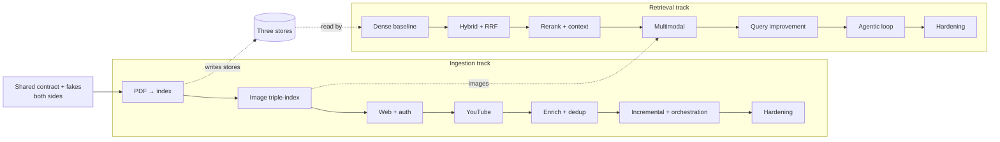
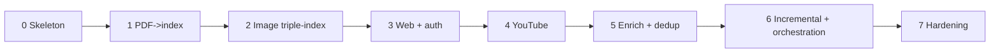
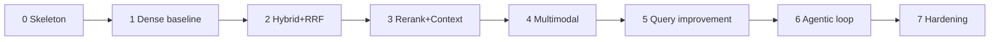

# Implementation Plan (High Level) — the whole system

How to build both halves as one product: *what to build, in what order, where it lives* — not
line-by-line code. **Part I** is the **combined** plan (shared repo layout, interleaved build order,
the one config story). The **Ingestion** and **Retrieval** parts below hold the authoritative
per-phase gates and full module trees for each side.

The contract both sides import: [DATA_MODEL.md](DATA_MODEL.md).

Contents:

- [Part I — the whole system](#part-i--the-whole-system): 1 principles · 2 repo layout ·
  3 combined build order · 4 config story · 5 testing · 6 deployment
- [Ingestion — producer side](#ingestion--producer-side): I1 principles · I2 stack · I3 layout ·
  I4 phases · I5 config · I6 testing · I7 deployment · I8 first week
- [Retrieval — query side](#retrieval--query-side): R1 principles · R2 stack · R3 layout ·
  R4 phases · R5 config · R6 testing · R7 deployment · R8 first week

---

## Part I — the whole system

### 1. Guiding principles (both sides)

1. **Walking skeleton first.** Get one path end-to-end with the *simplest* adapter for every port,
   then improve adapters in place. Never build a layer in isolation.
2. **Code against ports only.** No file in `domain`/`application` imports a vendor SDK — enforced
   with an import-linter rule in CI on both sides.
3. **One composition root.** All wiring lives in a single `container` per side, driven by config.
   Adding a vendor = new adapter + one config branch.
4. **Fakes from day one.** Every port ships an in-memory fake; a `ClockPort` keeps tests
   deterministic. Both systems run fully under test with zero network.
5. **Share the core, don't copy it.** `Chunk`, `Metadata`, `Provenance`, and the embedder ports are
   imported from the shared domain package — so index/query parity is *structural*, not a promise.

---

### 2. Repo layout (both packages on one shared core)

Two application packages rest on the shared domain package and read/write one backbone:

```
shared/                  # the canonical contract (DATA_MODEL.md): Chunk, Metadata,
                         # Provenance, Anchor, Modality, Embedding, embedder ports
                         # — imported by BOTH packages, re-declared by neither

ingestion/               # producer — full tree in §I3 below
  domain/ application/{ports,usecases,policies,enrichers,prompts}/ adapters/ infrastructure/

src/                     # retrieval — full tree in §R3 below
  domain/ application/{ports,usecases,policies,transformers,prompts,services}/ adapters/ infrastructure/

tests/                   # each side: fakes/ unit/ integration/ eval/ fixtures/
```

In both trees the dependency rule is visible: `domain` (shared) ← `application` ports ←
`adapters`/`infrastructure`. The embedder ports are *re-exported* from the shared package, never
redefined.

---

### 3. Combined phased build order

Each phase is shippable. The two tracks are independent except where they **meet at the three
stores** — and the moment ingestion has written real chunks (its Phase I1), the retrieval baseline
(its Phase R1) can read them. Build the shared contract + fakes once, up front, for both.



Recommended interleave (full gates in each part's §I4 / §R4):

1. **Shared first.** Define the contract types + embedder ports; stand up fakes for every port on
   both sides. Both walking skeletons run on fakes, no network.
2. **Ingestion P1 → Retrieval P1.** Real PDF → text-vector + BM25; then a dense baseline that
   retrieves and cites it. This is the first true end-to-end slice and your quality floor.
3. **Retrieval P2–P3 / Ingestion P2.** Add hybrid (BM25 + RRF) and reranking on the read side; add
   image triple-indexing on the write side — they meet at Retrieval P4 (multimodal).
4. **Broaden sources / improve queries.** Ingestion P3–P4 (web + auth, YouTube); Retrieval P5
   (transform chain) and P6 (router / iteration / budget / critique — the bounded agent).
5. **Harden both.** Ingestion P5–P7 (enrichment, dedup, idempotency, orchestration, cost/secrets);
   Retrieval P7 (caching, deadlines, ACLs, full trace).

---

### 4. The one config story

Both sides are config-driven, and the composition root is the **only** place that branches on
`provider` — and the **only** place the embedder **parity check** runs. The embedder block must be
*identical* on both sides; the container loads the counterpart's config and aborts on mismatch.

```yaml
# shared — MUST be identical in both packages' configs (parity invariant)
embedder:
  text:       { provider: bge,  model: bge-large-en, dim: 1024 }
  multimodal: { provider: jina, model: jina-clip-v2 }

# ingestion side (excerpt) — full schema in §I5 below
sources:  { youtube: {...}, web: {...}, document: { converter: docling } }
index:    { vector_text: {...}, vector_image: {...}, keyword: {...} }
pipeline: { mode: batch, idempotency: content_hash, on_failure: quarantine }

# retrieval side (excerpt) — full schema in §R5 below
llm:      { answer: {...}, utility: {...} }
reranker: { provider: cohere, top_n: 8 }
fusion:   { strategy: rrf, k: 60 }
agent:    { mode: adaptive, max_iterations: 3, budget: { max_tokens: 60000, max_latency_ms: 15000 } }
```

---

### 5. Testing strategy (shared ladder)

| Level | What | How |
|-------|------|-----|
| Unit | policies, fusion math, chunking, idempotency, anchor mapping | pure functions, no I/O |
| Contract | each adapter satisfies its port | one shared suite run against every adapter incl. the fake |
| Integration | pipeline / agent on **fakes** | deterministic, asserts control flow, budgets, quarantine, idempotency |
| Golden | per-side golden sets (sources → expected docs; queries → relevant chunks) | re-run at every phase gate |
| **Downstream bridge** | freshly-ingested corpus → retrieval golden set | where ingestion fidelity cashes out as retrieval quality |

Build the golden sets **early** (each side's Phase 1) — they prove later phases *helped* rather than
just added moving parts. Wire `TelemetryPort` minimally from Phase 0 on both sides, because the trace
is the data source for all system metrics. Full quality story: [EVALUATION.md](EVALUATION.md).

---

### 6. Deployment

Both the ingestion workers and the query service are **stateless and scale horizontally**; all
durable state is the shared backbone (or its split-out managed services). Start with one Postgres
backbone; move a single port to a dedicated/managed service only when that concern outgrows it.
Embedder/`schema_version` upgrades run as a blue-green backfill from stored blobs, never in place.

The full per-component **CLI · cloud-agnostic · AWS · GCP · Azure** matrix, the orchestration
progression (native Python → Prefect → Temporal), and the rationale for every default are in
[DEPLOYMENT.md](DEPLOYMENT.md).

---

## Ingestion — producer side

This turns the concepts in [ARCHITECTURE.md](ARCHITECTURE.md#ingestion--producer-side) into a build
plan. High-level by design: *what to build, in what order, and where it lives* — not line-by-line
code. Each phase ends with something runnable. It mirrors the [retrieval part](#retrieval--query-side)
and shares its principles, since the two systems share a domain core.

### I1 · Guiding implementation principles

1. **Walking skeleton first.** Get one source type flowing end-to-end (acquire → index) with the
   simplest adapter for every port, then improve adapters in place.
2. **Code against ports only.** Application/Domain never import a vendor SDK; enforce with an
   import-linter rule in CI.
3. **One composition root.** All wiring lives in a single container driven by config. New source
   or new tool = new adapter + one config branch.
4. **Fakes from day one.** Every port ships an in-memory fake (fake connector returning a fixed
   doc, echo captioner, in-memory index) so the pipeline runs in tests with zero network.
5. **Share the core with the query side.** `Chunk`, `Metadata`, `Provenance`, and the embedder
   ports are imported from the shared domain package (canonical contract:
   [DATA_MODEL.md](DATA_MODEL.md)) — not re-declared — so index/query parity is
   structural, not a documentation promise.

### I2 · Suggested stack (all swappable)

**How to read this.** Python only; **local development stack only**. Each concern has one local-dev
default and the open-standard *swap contract* (the port) that keeps it replaceable.

- **Local-first with Docker.** Everything that can run in `docker-compose` does; in local dev the
  **only** network calls are **LLM and embedding** APIs (and embeddings can self-host via TEI to go
  fully offline). A captioning VLM and the Gemini YouTube transcription are themselves LLM calls, so
  they fall under that same "online model" bucket.
- **One backbone.** In local dev *all* state lives in a single **Supabase / Postgres** engine —
  ledger + vector + BM25 + blob + cache + **job queue via `pgmq`** + secrets — one stack, no separate
  broker or orchestrator. The processing tools and models are stateless adapters on top.
- **Deployment beyond the laptop** — the CLI · cloud-agnostic · **AWS · GCP · Azure** options for
  every component, and the **rationale for each choice** (e.g. native-Python vs Prefect vs Temporal;
  Opik vs Langfuse), live in [DEPLOYMENT.md](DEPLOYMENT.md).

#### I2a. Stateful backbone (local dev)

One engine behind the storage / index / ledger / queue / secret ports.

| Concern (port) | Local dev default | Swap contract |
|----------------|-------------------|---------------|
| Relational ledger (`ledger`) | Postgres (Supabase) | Postgres wire + Alembic |
| Text vector store (`index_writer`) | `pgvector` + `pgvectorscale` | ANN index port + embedder parity |
| Image vector store (`index_writer`) | `pgvector` (separate collection) | same |
| Keyword / BM25 (`index_writer`) | ParadeDB `pg_search` (+ RRF) | keyword index port |
| Blob store (`document_store`) | Supabase Storage (S3 API) | **S3 API** (boto3 + endpoint URL) |
| Cache / dedupe (`dedup`) | in-proc LRU + Postgres | cache port (RESP) |
| Job queue (task handoff) | `pgmq` | queue / orchestrator port |
| Secrets | Supabase Vault / `.env` | thin `get_secret()` wrapper |

#### I2b. Stateless processing & models (local dev)

Native-CLI tools (poppler, MuPDF, Ghostscript, libvips, ffmpeg, yt-dlp) are single binaries,
multithreaded and embarrassingly parallel — fan out per file with GNU `parallel` / `xargs -P
$(nproc)`. Models stay online (or self-host via vLLM / TEI).

| Concern (port) | Local dev default | Swap contract |
|----------------|-------------------|---------------|
| Language | Python (typed) | — |
| PDF → markdown (`extractor`) | Docling (built-in Tesseract OCR) | `Extractor` → `NormalizedDocument` |
| OCR (`ocr`) | Tesseract (Docling's default engine) | `OcrPort` (text + conf + bbox) |
| Media preprocessing (native CLI) | ffmpeg + libvips + yt-dlp | behind `extractor` / media ports |
| Web fetch (`web_fetcher`) | Firecrawl (self-host) | `WebFetcher` → clean markdown |
| YouTube transcript (`transcript`) | Gemini native YouTube-URL transcription (`google-genai`, `file_uri`) | `TranscriptPort` (text + segment timestamps) |
| Captioning / VLM (`vision_captioner`) | Gemini (multimodal) | `VisionCaptioner` port |
| Text embedders (`embedder`) | BGE / E5 via HF TEI | `TextEmbedderPort` — **parity invariant** |
| Multimodal embedders (`embedder`) | Jina-CLIP via HF TEI | `MultimodalEmbedderPort` — parity |
| Telemetry (`telemetry`) | OpenTelemetry → Grafana LGTM | **OpenTelemetry** SDK |
| LLM trace / eval | Opik (Comet, self-host) | OTel traces + RAGAS / DeepEval |

> A framework (LlamaIndex/Unstructured pipelines) may implement stages, but keep it **behind the
> Application ports** — never let framework types leak into the domain, or you lose swap-ability.

### I3 · Module / package layout

```
ingestion/
  domain/                 # ingestion-only entities; shared types (Chunk/Metadata/Provenance/
                          # Anchor/Embedding) imported from the shared domain package
                          # (canonical contract: DATA_MODEL.md), not redefined
    normalized_document.py  media_asset.py  raw_asset.py  source_ref.py
    embedded_chunk.py  ingestion_record.py

  application/
    ports/                # ARCHITECTURE §I4
      source_connector.py  transcript.py  web_fetcher.py  auth_provider.py
      extractor.py  ocr.py  vision_captioner.py  enricher.py  chunker.py
      embedder.py          # re-exported from shared package
      index_writer.py  document_store.py  ledger.py  dedup.py  telemetry.py
    usecases/
      ingest_source.py     # the pipeline orchestrator (ARCHITECTURE §I2)
    policies/
      chunking.py  idempotency.py  retry.py  dedup.py
    enrichers/             # EnricherPort implementations
      metadata.py  summarize.py  contextualize.py  pii_redact.py
    prompts/               # versioned, reviewed prompt artifacts for the LLM/VLM enrichers
                           # (caption, contextualize, metadata-extract...) — application-layer,
                           # not buried in adapters; pinned in the eval RunManifest

  adapters/               # only layer importing SDKs
    connectors/{youtube,web_firecrawl,document}.py
    transcript/{captions,whisper}.py
    web/{firecrawl,playwright}.py  auth/{vault_cookie}.py
    extract/{docling,marker,unstructured}.py
    media/{tesseract_ocr,vlm_captioner}.py
    embed/{bge,jina_clip}.py        # thin re-use of shared adapters
    index/{qdrant_writer,opensearch_writer}.py
    store/{object_store}.py  ledger/{postgres}.py  cache/{redis}.py  telemetry/otel.py

  infrastructure/
    container.py          # composition root: config -> adapters -> use case; parity check here
    config.py             # schema + loader (README §I9)
    orchestrator.py       # DAG/queue wiring, concurrency, retries, quarantine
    secrets.py            # vault client

tests/
  fakes/  unit/  integration/  fixtures/golden_sources/  eval/
```

The dependency rule is visible: `domain` (shared) ← `application` ports ← `adapters`/`infrastructure`.

### I4 · Phased build plan

Each phase is shippable and testable on its own; each ends with content actually retrievable by
the query side.

#### Phase I0 — Skeleton & contracts
- Define ingestion entities + all port interfaces (signatures only); import shared `Chunk` etc.
- Fakes for every port (fixed-doc connector, echo captioner, in-memory writers, in-memory ledger).
- Composition root + config loader + a CLI `ingest <ref>`; wire the stage DAG on fakes.
- **Exit:** a fake source flows acquire→index end-to-end, fully under test, no network.

#### Phase I1 — Document path (PDF → markdown → index)
- `DocumentConnector` + `Extractor` (one real PDF→markdown adapter) producing `NormalizedDocument`
  (text + tables; images extracted but not yet enriched).
- Structural `Chunker`; real text `Embedder` (parity with query side); `VectorIndexWriter` +
  `KeywordIndexWriter`; `DocumentStore`; `Ledger`.
- **Exit:** a real PDF is searchable in text-vector + BM25 stores; query side can retrieve & cite by page.

#### Phase I2 — Image triple-indexing
- `VisionCaptioner` (context-aware) + `OcrPort`; `MultimodalEmbedder` (parity).
- Image chunks: caption+OCR → BM25 + text vector; pixels → image vector store.
- **Exit:** an image in a PDF is retrievable by keyword, by semantic text, and by visual query, and cites the image.

#### Phase I3 — Web path (Firecrawl + auth)
- `WebFetcher` (Firecrawl) + crawl/discover; `AuthProvider` resolving per-domain cookies from the vault.
- **Exit:** public and **auth-gated** (Medium/Substack) pages ingest to all relevant stores; no-auth pages quarantine cleanly.

#### Phase I4 — YouTube path
- `YouTubeConnector` + `TranscriptProvider` (captions → Whisper ASR fallback); timestamp anchors;
  optional keyframe captioning.
- Time-window chunking aligned to transcript segments.
- **Exit:** a video (with or without captions) is searchable and cites back to a timestamp.

#### Phase I5 — Enrichment & quality
- Enricher chain: metadata extraction, summaries, **contextualization** (prepend section context
  before embedding), PII redaction. `Dedup` before indexing.
- **Exit:** measurable retrieval lift from contextualization (validated by the eval harness); dupes collapsed.

#### Phase I6 — Idempotency, incremental & orchestration
- Content-hash gating in the ledger; deterministic upsert/supersede on re-ingest; quarantine + re-drive.
- Wire the real orchestrator (DAG/queue): bounded concurrency, per-stage retries, scheduling.
- **Exit:** re-running on changed/unchanged sources is safe, cheap, and duplicate-free.

#### Phase I7 — Hardening
- Caching of ASR/VLM/embeddings; cost & rate-limit governance; full per-stage telemetry/lineage;
  secrets hygiene; robots/ToS/ACL enforcement.
- **Exit:** production-ready: observable, idempotent, cost-bounded, resilient, compliant.



### I5 · Config schema (sketch)

Single declarative file selects adapters and tunes policy (mirrors README §I9). The container is the
only code that branches on `provider` — and the only place the **parity check** runs.

```yaml
sources:
  youtube:  { transcript: captions_then_asr, asr: { provider: whisper, model: large-v3 }, keyframes: true }
  web:      { provider: firecrawl, mode: crawl, max_pages: 200, respect_robots: true,
              auth: { "medium.com": vault:medium_cookie, "substack.com": vault:substack_cookie } }
  document: { converter: docling, ocr: { provider: tesseract }, extract_images: true }
enrich:
  captioner:     { provider: vlm-claude }
  contextualize: true
  pii_redact:    true
chunking: { strategy: structural, max_tokens: 512, overlap: 64, table: atomic, image: atomic,
            video: { window_s: 45 } }
embedder:
  text:       { provider: bge,  model: bge-large-en }     # MUST equal query side
  multimodal: { provider: jina, model: jina-clip-v2 }     # MUST equal query side
index:
  vector_text:  { provider: qdrant, collection: docs }
  vector_image: { provider: qdrant, collection: imgs }
  keyword:      { provider: opensearch, index: docs }
store:    { provider: object_store, bucket: rag-normalized }
ledger:   { provider: postgres, dsn: ... }
pipeline: { mode: batch, concurrency: 8, idempotency: content_hash, on_failure: quarantine,
            retries: { max: 3, backoff: exponential } }
```

**Enforced invariant:** the container loads the query-side embedder config and aborts if `embedder`
here differs (model + version + pooling).

### I6 · Testing strategy

| Level | What | How |
|-------|------|-----|
| Unit | chunking policy, idempotency, dedup, anchor mapping | pure functions, no I/O |
| Contract | each adapter satisfies its port | one shared suite run against every adapter incl. fakes |
| Integration | pipeline with **fakes** | deterministic acquire→index on fixed fixtures; asserts stage flow, quarantine, idempotency |
| Golden fixtures | known source → expected NormalizedDocument / chunks | extraction & chunking fidelity (see [EVALUATION.md](EVALUATION.md#ingestion--producer-side)) |
| Idempotency | re-ingest produces zero new chunks | hash gating + deterministic ids |
| Downstream | freshly ingested corpus supports query-side retrieval golden set | bridges to query-side eval |

Build the **golden source fixtures early** (Phase I1) — they are how you prove later phases improve
fidelity rather than just adding stages. Per-stage telemetry feeds the ingestion eval harness, so
wire `TelemetryPort` minimally from Phase I0.

### I7 · Deployment notes (high level)

> See [DEPLOYMENT.md](DEPLOYMENT.md) for the per-component CLI / cloud-agnostic
> / AWS / GCP / Azure matrix and the rationale for each choice.

- **Ingestion workers** (stateless, scale horizontally) pull sources from a queue and run the DAG.
- **Stateful backends** — vector stores, BM25, blob store, ledger DB, Redis — shared with / adjacent
  to the query side; embedders are the shared dependency.
- **External cost centers** — ASR, VLM captioning, embeddings — run behind caches and rate gates;
  the ledger guarantees at-most-once processing per unchanged unit.
- **Scheduling** — batch backfills + incremental scheduled runs (e.g., recrawl feeds, new videos);
  webhooks/streaming optional for near-real-time sources. Re-crawl cadence follows each source's
  freshness policy, not a global timer.
- **Reindex/migration** — embedder or `schema_version` upgrades run as a versioned blue-green
  backfill from the stored normalized-doc blobs (no re-fetch), evaluated on the golden set before the
  query side cuts over; never an in-place swap (the parity invariant forbids it).
- **Secrets** — site credentials and API keys from the vault, scoped per domain, short-lived.

### I8 · First week, concretely

1. Define ingestion entities + ports; import the shared `Chunk`/`Metadata`/embedder packages.
2. Implement in-memory fakes for every port.
3. Wire the composition root + `ingest` CLI; prove acquire→index on a fake source.
4. Swap in one real PDF→markdown extractor + text embedder + index writers (Phase I1); ingest a real PDF.
5. Stand up golden source fixtures + an extraction-fidelity check, and confirm the query side can
   retrieve and cite the ingested PDF.

From there, Phases I2→I7 are additive: implement a connector/adapter/enricher, register it, re-run
fixtures + the downstream retrieval check. The architecture guarantees later phases never force a
rewrite of the pipeline core.

---

## Retrieval — query side

This part turns the concepts in [ARCHITECTURE.md](ARCHITECTURE.md#retrieval--query-side) into a build
plan. It is deliberately high-level: it tells you *what to build, in what order, and where it lives* —
not line-by-line code. Each phase ends with something runnable.

### R1 · Guiding implementation principles

1. **Walking skeleton first.** Get an end-to-end query→answer path working with the *simplest*
   adapter for every port, then improve adapters in place. Never build a layer in isolation.
2. **Code against ports only.** No file in the Application/Domain layers may import a vendor SDK.
   Enforce with an import-linter / dependency-check rule in CI.
3. **One composition root.** All concrete wiring lives in a single `bootstrap`/`container`
   module driven by config. Adding a vendor = new adapter + one config branch.
4. **Fakes from day one.** Every port ships with an in-memory fake so the agent runs in tests
   with zero network.

### R2 · Suggested stack (all swappable)

**How to read this.** Python only; **local development stack only**. Each concern has one local-dev
default and the open-standard *swap contract* (the port) that keeps it replaceable.

- **Local-first with Docker.** Everything that can run in `docker-compose` does; in local dev the
  **only** network calls are **LLM and embedding** APIs (and embeddings can self-host via TEI to go
  fully offline).
- **One backbone.** The query side **reads** the same **Supabase / Postgres** backbone the ingestion
  side populates (text/image vector, keyword, cache) — the embedder **parity invariant** is what
  makes that shared store correct. It is not a second store.
- **Deployment beyond the laptop** — the CLI · cloud-agnostic · **AWS · GCP · Azure** options for
  every component, and the **rationale for each choice** (e.g. native-Python vs Prefect vs Temporal;
  Opik vs Langfuse), live in [DEPLOYMENT.md](DEPLOYMENT.md).

#### R2a. Stateful backbone — read view (local dev)

The query side reads what ingestion wrote; this is the same backbone, not a second store.

| Concern (port) | Local dev default | Swap contract |
|----------------|-------------------|---------------|
| Text vector search (`search` / `retriever_tool`) | `pgvector` + `pgvectorscale` | `VectorSearchPort` + embedder parity |
| Image vector search (`search`) | `pgvector` (separate collection) | same |
| Keyword / BM25 (`search`) | ParadeDB `pg_search` (+ RRF) | `KeywordSearchPort` |
| Cache (`cache`) | in-proc LRU + Postgres | cache port (RESP) |

#### R2b. Compute & models (local dev)

| Concern (port) | Local dev default | Swap contract |
|----------------|-------------------|---------------|
| Language | Python (typed) | — |
| API | FastAPI / ASGI | ASGI; gRPC for service mesh |
| DI | constructor injection + small container | explicit wiring |
| Text embeddings (`embedder`) | BGE / E5 via HF TEI | `TextEmbedderPort` — **parity invariant** |
| Multimodal (`embedder`) | Jina-CLIP via HF TEI | `MultimodalEmbedderPort` |
| Reranker (`reranker`) | bge-reranker via HF TEI | `RerankerPort` |
| LLM (`llm`) | hosted via LiteLLM — online (Claude / GPT / Gemini), answer + utility roles | `LLMPort` — **OpenAI-compatible API / LiteLLM** swap point |
| Telemetry (`telemetry`) | OpenTelemetry → trace store | **OpenTelemetry** |
| LLM obs + eval | Opik (Comet, self-host) | OTel traces + RAGAS / DeepEval |

> Frameworks (LangGraph, LlamaIndex, Haystack) can implement the agent loop, but keep them
> **behind the Application layer** as an orchestration adapter — do not let framework types
> leak into your domain, or you lose the swap-ability that motivated this design.

### R3 · Module / package layout

```
src/
  domain/                 # pure entities & value objects (ARCHITECTURE §R2). No imports out.
    query.py  result.py  context.py  answer.py  verdicts.py  trace.py
    # shared types (Chunk, Metadata, Provenance, Anchor, TextSpan, Modality, Embedding) are
    # IMPORTED from the shared domain package (DATA_MODEL.md), not redefined here

  application/
    ports/                # the interfaces (ARCHITECTURE §R3)
      llm.py  embedder.py  search.py  retriever_tool.py  reranker.py
      fusion.py  context_builder.py  generator.py  critique.py  cache.py  telemetry.py
      guardrail.py  feedback.py     # output-safety gate; user-feedback sink (ARCHITECTURE §R3.11)
    usecases/
      answer_question.py  # the orchestrator / agent runtime (ARCHITECTURE §R4)
    policies/
      router.py  iteration.py  budget.py  llm_router.py
    transformers/         # QueryTransformerPort implementations
      contextualize.py  expand.py  hyde.py  decompose.py  step_back.py
      multi_query.py  self_query.py  modality_router.py
    prompts/              # versioned, reviewed prompt artifacts (rewrite/HyDE/decompose/grade/
                          # critique/generate) — application-layer, pinned in the eval RunManifest
    services/             # fusion impls, context-build sub-strategies (MMR, compress, order)

  adapters/               # implement ports; only layer that imports SDKs
    llm/{openai,anthropic,vllm}.py
    embedder/{bge,openai,jina_clip}.py
    vectorstore/{qdrant,pgvector,faiss}.py
    keyword/{opensearch,rank_bm25}.py
    reranker/{cohere,bge_reranker}.py
    cache/{redis,inmemory}.py
    telemetry/otel.py
    retrievers/{dense,bm25,multimodal}.py   # RetrieverTool implementations (compose lower ports)

  infrastructure/
    container.py          # composition root: config -> concrete adapters -> usecases
    config.py             # schema + loader (ARCHITECTURE §R8 / README §R8)
    api.py                # HTTP/streaming entrypoint
    ingestion/            # parse -> chunk -> embed -> index (offline; shares embedder ports)

tests/
  fakes/                  # in-memory adapter for every port
  unit/  integration/  eval/  fixtures/golden_set/
```

The dependency rule is visible in the tree: `domain` imports nothing; `application` imports
`domain`; `adapters` and `infrastructure` import `application` ports.

### R4 · Phased build plan

Each phase is shippable and testable on its own.

#### Phase R0 — Skeleton & contracts
- Define all **domain entities** and **port interfaces** (signatures only).
- Write **fake adapters** for every port (in-memory store, echo LLM, identity reranker).
- Stand up the **composition root** + config loader + a single `/answer` endpoint.
- **Exit:** a query returns a (dummy) answer end-to-end, fully under test, no network.

#### Phase R1 — Single-retriever baseline
- Implement `DenseTextRetriever` (`TextEmbedderPort` + `VectorSearchPort`) with one real vector
  DB, plus a minimal ingestion script to populate it.
- Real `AnswerGeneratorPort` over a real `LLMPort` with citation-enforcing structured output.
- **Exit:** real dense RAG with citations. This is your quality floor and regression baseline.

#### Phase R2 — Hybrid retrieval + fusion
- Add `Bm25Retriever` (`KeywordSearchPort`) and the `ToolRegistry`.
- Implement `FusionPort` with **RRF**; run dense + BM25 in parallel and fuse.
- **Exit:** hybrid retrieval measurably beats Phase R1 on the golden set (recall@k, nDCG).

#### Phase R3 — Reranking
- Add `RerankerPort` (cross-encoder) applied to top-K fused candidates.
- Implement `ContextBuilderPort`: dedupe → MMR → order → number → fit budget.
- **Exit:** context precision and answer faithfulness improve; latency budget still met.

#### Phase R4 — Multimodal
- Add `MultimodalEmbedderPort` + `MultimodalRetriever` against the image collection.
- Extend ingestion to embed images (+ captions/OCR for citation).
- Add `ModalityRouter` transformer to bias visual queries.
- **Exit:** image-answerable queries succeed and cite the right image.

#### Phase R5 — Query improvement
- Implement the transformer chain: `Contextualizer`, `Expander`, `HyDE`, `Decomposer`,
  `SelfQueryFilterExtractor`, `MultiQuery`. Wire role-routed `LLMPort` (utility vs. answer).
- **Exit:** ambiguous / multi-hop / lexical queries each improve on the golden set.

#### Phase R6 — Agentic control & correction
- Implement `Router`, `IterationPolicy`, `BudgetPolicy`, and `CritiquePort`
  (`grade_retrieval`, `critique_answer`). Assemble the bounded state machine.
- **Exit:** weak-retrieval queries trigger bounded refinement; budgets cap cost/latency; the
  fast path serves easy queries cheaply.

#### Phase R7 — Hardening
- Caching across embeddings/retrieval/rerank/LLM; concurrency with deadlines; graceful
  degradation; full `QueryTrace` telemetry; ACL filters; PII redaction sub-step.
- **Exit:** production-ready: observable, bounded, resilient, secure.



### R5 · Config schema (sketch)

Single declarative file selects adapters and tunes policy (mirrors README §R8). The container
reads it and is the only code that branches on `provider`.

```yaml
llm:
  answer:  { provider: openai, model: gpt-4.1 }
  utility: { provider: openai, model: gpt-4.1-mini }   # rewriting/grading/planning
embedder:   { provider: bge, model: bge-large-en, dim: 1024 }
multimodal: { provider: jina, model: jina-clip-v2 }
vector_db:  { provider: qdrant, url: ..., text_collection: docs, image_collection: imgs }
keyword:    { provider: opensearch, url: ..., index: docs }
reranker:   { provider: cohere, model: rerank-3, top_n: 8 }
fusion:     { strategy: rrf, k: 60 }
context:    { max_tokens: 6000, mmr_lambda: 0.5, compress: false }
agent:
  mode: adaptive
  retrieval_k: 50
  max_iterations: 3
  budget: { max_tokens: 60000, max_tool_calls: 12, max_latency_ms: 15000 }
cache:     { provider: redis, ttl_s: 86400 }
telemetry: { provider: otel, endpoint: ... }
```

**Invariant to enforce in the container:** the embedder config used at query time must equal the
one recorded with the index at ingestion time — fail fast on mismatch.

### R6 · Testing & evaluation strategy

| Level | What | How |
|-------|------|-----|
| Unit | entities, policies, fusion math, context builder | pure functions, no I/O |
| Contract | each adapter satisfies its port | one shared test suite run against every adapter (incl. the fake) |
| Integration | orchestrator with **fakes** | deterministic full-loop runs, asserts control flow & budgets |
| Retrieval eval | recall@k, nDCG, MRR, context precision/recall | golden query→relevant-chunk set |
| Generation eval | faithfulness, answer relevance, citation correctness | RAGAS-style, LLM-judge + spot human review |
| System | latency, token cost, tool/iteration counts | from `QueryTrace`; track per-phase regressions |

Build the **golden set early** (Phase R1) and re-run it at every phase gate — it is how you prove
each phase actually helped rather than just adding moving parts. The telemetry trace is the
data source for all system-level metrics, so wire `TelemetryPort` minimally even in Phase R0.

### R7 · Deployment notes (high level)

> See [DEPLOYMENT.md](DEPLOYMENT.md) for the per-component CLI / cloud-agnostic
> / AWS / GCP / Azure matrix and the rationale for each choice.

- **Query service** (stateless, scales horizontally): API + agent + adapter clients.
- **Stateful backends**: vector DB, BM25 store, Redis — run/managed separately.
- **Ingestion** runs as an offline/batch job sharing the embedder ports and config with the
  query service (guarantees index/query model parity).
- **Model serving**: hosted APIs need only keys; self-hosted (vLLM, local rerankers, CLIP) run
  as separate GPU services behind the same ports.
- **Scaling levers**: cache hit-rate first, then rerank `top_n`, then `retrieval_k`, then the
  agent's `max_iterations`. The budget policy is the runtime throttle.

### R8 · First week, concretely

1. Write the domain entities and all port interfaces (Phase R0 contracts).
2. Implement in-memory fakes for every port.
3. Wire the composition root + `/answer` endpoint; prove the loop end-to-end on fakes.
4. Swap in one real vector DB + embedder + LLM (Phase R1) and ingest a small corpus.
5. Stand up the golden set and baseline metrics.

From there, Phases R2→R7 are additive: each is "implement one or two adapters/policies, register,
re-run the golden set." The architecture guarantees none of these later phases force a rewrite
of the agent core.
