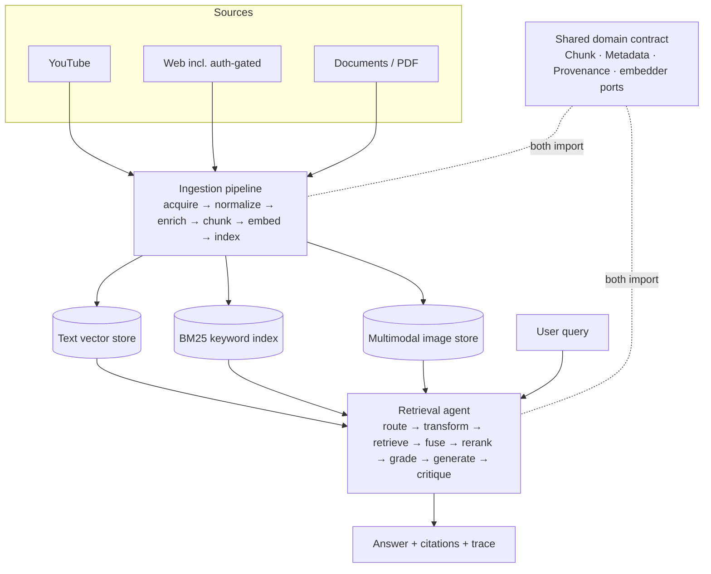
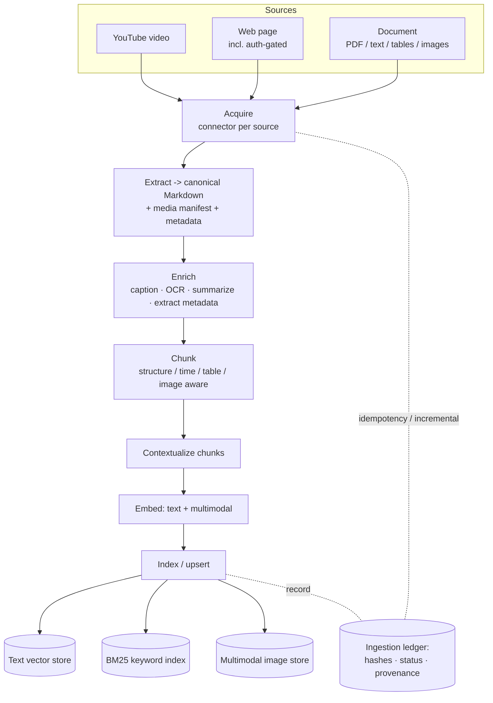
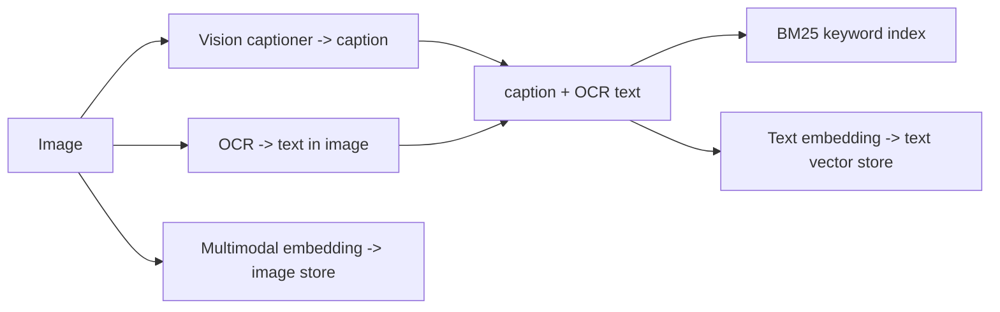
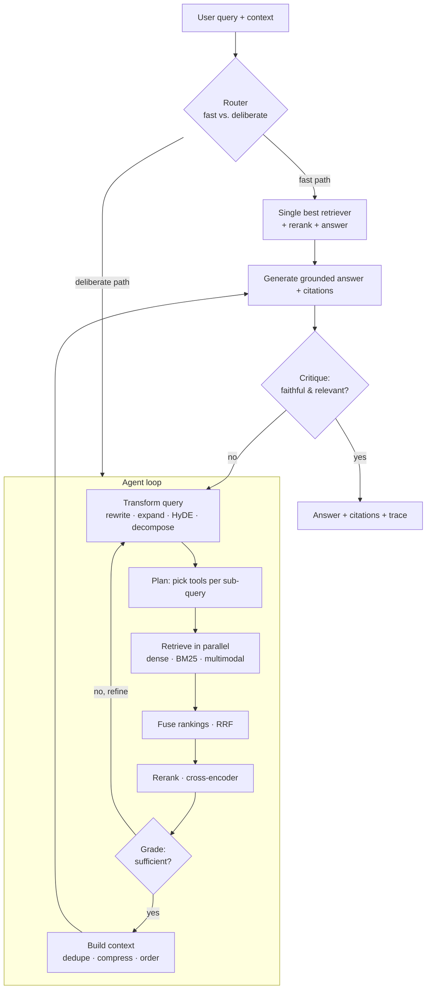

# RAG-Anything — a multimodal, agentic RAG system

> Two cooperating Retrieval-Augmented Generation systems, built on **Clean Architecture** and a
> single shared domain contract. An **ingestion** pipeline acquires heterogeneous sources
> (YouTube, web pages incl. auth-gated, documents/PDF), normalizes them, and writes **three stores**.
> A **retrieval** system reads those stores and answers questions agentically, with citations.

This is the **system-level entry point**. **Part I** (below) explains how the two halves fit together;
**Part II** is the full ingestion (producer) concept doc and **Part III** the full retrieval (consumer)
concept doc. The types and embedders the two sides share are defined once in the canonical contract,
[DATA_MODEL.md](DATA_MODEL.md); per-component deployment is in [DEPLOYMENT.md](DEPLOYMENT.md).

**Contents:** [Part I — the whole system](#part-i--the-whole-system) ·
[Part II — Ingestion (producer side)](#ingestion--producer-side) ·
[Part III — Retrieval (query side)](#retrieval--query-side)

---

## Part I — the whole system

### 1. What this is

Two systems, one product, documented in parallel:

- **Ingestion (the producer)** — see [Part II](#ingestion--producer-side). An offline/batch pipeline.
  It collapses every source type to one `NormalizedDocument` (canonical Markdown + media manifest +
  metadata + provenance) as early as possible, then runs a single uniform downstream pipeline:
  **acquire → normalize → enrich → chunk → embed → index**. It writes the three stores the query
  side reads.
- **Retrieval (the consumer)** — see [Part III](#retrieval--query-side). A query-adaptive *agentic*
  system. A router sends each query down a cheap deterministic **fast path** or a fully agentic
  **deliberate path** (transform → plan → retrieve → fuse → rerank → grade → loop → generate →
  critique). It reads the three stores through one uniform `RetrieverTool` abstraction.

They are deliberately separate processes that **share only a domain core and the embedder ports** —
the seam that guarantees an indexed chunk is retrievable and citable.

---

### 2. The system in one picture



The two sides never call each other. They meet **only** at the three stores and the shared contract
that defines what is written there.

---

### 3. The two halves

| | Ingestion (producer) | Retrieval (consumer) |
|---|---|---|
| **Job** | Turn messy heterogeneous sources into uniformly retrievable, citable chunks | Answer questions over those chunks, adaptively and with citations |
| **Keystone concept** | `NormalizedDocument` — every source converges on it; everything downstream is source-blind | `RetrieverTool` — dense / BM25 / multimodal look identical to the agent |
| **Shape** | Staged DAG, offline/batch, idempotent & incremental | Bounded agent state machine, online, fast vs. deliberate paths |
| **Read more** | [Part II — Ingestion](#ingestion--producer-side) · [architecture](ARCHITECTURE.md#ingestion--producer-side) · [build plan](IMPLEMENTATION.md#ingestion--producer-side) · [eval](EVALUATION.md#ingestion--producer-side) | [Part III — Retrieval](#retrieval--query-side) · [architecture](ARCHITECTURE.md#retrieval--query-side) · [build plan](IMPLEMENTATION.md#retrieval--query-side) · [eval](EVALUATION.md#retrieval--query-side) |

---

### 4. What binds them — the shared contract

The two systems share `Chunk`, `Metadata`, `Provenance`, `Anchor`, and the **embedder ports**,
defined canonically once in [DATA_MODEL.md](DATA_MODEL.md) and imported by both —
**re-declared by neither**. This is the load-bearing seam:

- **The embedder parity invariant.** Ingestion-time embedders **must** equal query-time embedders
  (same model + version + pooling). A silent mismatch destroys retrieval quality, so the composition
  root **fails fast** on it — and likewise on a `schema_version` mismatch.
- **Provenance is mandatory.** No chunk is indexed without a resolvable `Anchor` back to its source
  (PDF page, video timestamp, doc heading). Citations depend on it.
- **One `Chunk.id` across three stores.** The same deterministic id keys the text vector store, the
  image vector store, and the BM25 index, so the three reconcile and citations resolve uniformly.

See the contract, its versioning/evolution policy, and the reconciliation record in
[DATA_MODEL.md](DATA_MODEL.md).

---

### 5. Architecture rules (load-bearing invariants)

These hold across **all** code in both systems. Most edits are wrong if they break one.

1. **Dependency rule (inward only).** `domain` → `application` → `adapters` → `infrastructure`.
   Only `adapters`/`infrastructure` may import a vendor SDK — CI-enforced (import-linter).
2. **Ports over implementations.** Every external capability is a port with swappable adapters.
   Adding a vendor = new adapter + one config branch. Adding a modality = one more `RetrieverTool`.
   Adding a source = one more `SourceConnector`.
3. **One composition root.** All concrete wiring lives in a single `container` driven by declarative
   YAML — the only code that branches on `provider`, and the only place the parity check runs.
4. **The embedder parity invariant** (§4) — enforced, not documented.
5. **Provenance is mandatory** (§4) — a chunk that can't be traced home is a defect caught in eval.
6. **Fakes from day one.** Every port ships an in-memory fake; a `ClockPort` keeps tests
   deterministic. The whole system runs in tests with zero network.

---

### 6. Default stack (all swappable via config)

| Concern | Default | Swap contract |
|---------|---------|---------------|
| Backbone (local dev) | one Supabase / Postgres engine (ledger + vector + BM25 + blob + cache + queue) | open protocols (Postgres wire, S3 API, RESP) |
| Vector store | pgvector + pgvectorscale → Qdrant / Milvus at scale | `VectorSearchPort` / `index_writer` |
| Keyword / BM25 | ParadeDB `pg_search` → OpenSearch at scale | `KeywordSearchPort` / `index_writer` |
| Text embeddings | BGE / E5 via HF TEI | `TextEmbedderPort` — **parity invariant** |
| Multimodal embeddings | Jina-CLIP / SigLIP via HF TEI | `MultimodalEmbedderPort` — parity |
| Reranker | bge-reranker (local) / Cohere Rerank | `RerankerPort` |
| LLM | hosted via LiteLLM (Claude / GPT / Gemini), answer + utility roles | `LLMPort` — OpenAI-compatible |
| Doc parse / OCR | Docling + Tesseract | `ExtractorPort` / `OcrPort` |
| Web fetch | Firecrawl | `WebFetcherPort` |
| Transcript / ASR | Gemini native URL → yt-dlp + faster-whisper fallback | `TranscriptProviderPort` |
| Telemetry / eval | OpenTelemetry + Opik (Langfuse alt) | OTel + RAGAS / DeepEval |

The full per-component **CLI · cloud-agnostic · AWS · GCP · Azure** matrix and the rationale for each
choice are in [DEPLOYMENT.md](DEPLOYMENT.md).

---

### 7. Document map

| Document | Audience | Depth |
|----------|----------|-------|
| **README.md** (this) | Anyone landing on the repo | Whole-system overview + both sides' concept docs (Parts II–III) |
| [ARCHITECTURE.md](ARCHITECTURE.md) | Engineers | How the two sides fit together + each side's full ports/stages |
| [IMPLEMENTATION.md](IMPLEMENTATION.md) | Implementers | Combined build order + each side's phases, layout, config |
| [EVALUATION.md](EVALUATION.md) | Anyone validating quality | The end-to-end quality chain + each side's full harness |
| [DATA_MODEL.md](DATA_MODEL.md) | Both sides | The canonical domain contract |
| [DEPLOYMENT.md](DEPLOYMENT.md) | Operators | Per-component deploy matrix + rationale |

Each of `ARCHITECTURE` / `IMPLEMENTATION` / `EVALUATION` is organized the same way as this file:
a whole-system Part I, then **Ingestion** and **Retrieval** parts with the full per-side detail.

---

### 8. Glossary (cross-cutting terms)

- **Port / Adapter / Composition Root** — Clean-Architecture interface / its implementation / the
  single wiring point.
- **Parity invariant** — ingestion-time embedders must equal query-time embedders (model + version +
  pooling); enforced at the composition root.
- **Provenance / Anchor** — a chunk's resolvable back-reference (page / timestamp / heading) that
  makes it citable.
- **NormalizedDocument** — the canonical Markdown + media + metadata + provenance intermediate every
  source converges on (ingestion keystone).
- **RetrieverTool** — the uniform tool wrapping dense / BM25 / multimodal retrieval (retrieval keystone).
- **Triple-indexing** — representing one image in BM25, the text vector store, and the multimodal
  store simultaneously.
- **The three stores** — text vector store, BM25 keyword index, multimodal image store.

---

## Ingestion — producer side

> The producer side of the RAG system. It acquires content from heterogeneous sources —
> **YouTube videos, web pages (including auth-gated sites), and documents (PDF, text, tables,
> images)** — normalizes everything to **canonical Markdown + a media manifest + metadata**,
> then chunks, enriches, embeds, and indexes it into the **three stores the query system
> consumes**: a text-embedding vector store, a BM25 keyword index, and a multimodal image store.

This part is the conceptual entry point for ingestion. Structural detail is in
[ARCHITECTURE.md](ARCHITECTURE.md#ingestion--producer-side); the build plan is in
[IMPLEMENTATION.md](IMPLEMENTATION.md#ingestion--producer-side); how we measure ingestion quality is in
[EVALUATION.md](EVALUATION.md#ingestion--producer-side). This pipeline feeds the
[query-side system](#retrieval--query-side), with which it shares a domain core (`Chunk`, `Metadata`,
`Provenance`, the embedder ports) defined canonically in [DATA_MODEL.md](DATA_MODEL.md).

### I1 · The problem this solves

Retrieval can only be as good as what was indexed. Ingestion is where most RAG quality is won or
lost, and it is hard precisely because the inputs are heterogeneous and messy:

- **Many source shapes, one index.** A YouTube transcript, a paywalled Substack essay, and a
  scanned PDF with nested tables must all end up as uniformly retrievable, citable units.
- **The hard parts are extraction, not storage.** Parsing tables without mangling them, pulling
  every image out of a PDF, transcribing a video with no captions, getting *clean* markdown from
  a JS-rendered page behind a login — this is where fidelity is lost silently.
- **Images are first-class.** An image is not noise to discard; it is content that must be made
  retrievable through *three* paths (keyword, semantic text, and visual).
- **Provenance must survive.** Every indexed chunk must trace back to an exact location (PDF
  page, video timestamp, document heading, URL) so the query system can cite it.
- **Re-ingestion is normal.** Sources change; ingestion must be idempotent and incremental, not
  a destructive full rebuild.

The design answer: **collapse all sources to one normalized representation as early as possible,
then run a single uniform downstream pipeline** — with every external capability (transcriber,
crawler, parser, captioner, embedder, index) behind an injectable port.

#### Assumptions (stated up front)

- The three target stores already exist (this pipeline writes to them; the query system reads).
- The **embedders used here must be identical to the query-side embedders** (same model +
  version + pooling). This parity is an enforced invariant, not a convention — a mismatch
  silently destroys retrieval quality.
- Ingestion runs as an **offline / batch (or scheduled streaming) job**, separate from the live
  query service, sharing only the embedder ports and metadata schema.
- **English-first by default.** The default stack is monolingual; multilingual or cross-lingual
  corpora require a multilingual embedder (matched on the query side per the parity invariant),
  per-language BM25 analyzers, and language-appropriate OCR/ASR models. The `language` metadata field
  exists to drive that per-language routing, not as decoration.

#### When this design fits (and when it's overkill)

This pipeline earns its complexity when the corpus is **large, heterogeneous, image-rich, and
re-ingested over time**. For a small, stable, text-only corpus, a single parser + fixed-size chunker
+ one embedder is enough — skip the connectors, triple-indexing, and ledger. Two known boundaries to
set expectations: **tables are preserved atomically as Markdown** (great for *retrieving* a table,
but aggregation/numeric-reasoning over large tables needs a separate tabular/text-to-SQL path — see
[ARCHITECTURE.md §I4.7](ARCHITECTURE.md#ingestion--producer-side)), and the system indexes *passages*, so
corpus-global questions ("summarize everything") are a query-side scope boundary, not an ingestion
feature.

### I2 · Design principles

1. **Normalize early, process uniformly.** All sources converge on one `NormalizedDocument`
   (canonical Markdown + media manifest + metadata + provenance). Everything after that point is
   source-agnostic.
2. **Every source is a connector.** YouTube, web, and document acquisition each implement the
   same `SourceConnector` port. Adding a new source (Slack export, email, audio file) is "register
   one more connector," not a rewrite — the same keystone idea as `RetrieverTool` on the query side.
3. **Ports over implementations.** Transcriber, crawler, PDF-to-markdown converter, vision
   captioner, OCR, embedders, and index writers are all swappable adapters chosen at the
   composition root.
4. **Images are triple-indexed.** Each image yields (a) keyword text → BM25, (b) a text embedding
   of its caption/OCR → text vector store, (c) a multimodal embedding of the pixels → image store.
5. **Provenance is mandatory.** No chunk is indexed without a resolvable back-reference to its
   source location. Citations on the query side depend on it.
6. **Idempotent & incremental.** Content-hash–keyed upserts; only changed sources are reprocessed;
   re-running the pipeline never duplicates.
7. **Fail in isolation.** A source that fails at any stage is quarantined with its error; it does
   not abort the batch.

### I3 · The mental model in one picture



In words: **acquire → normalize to Markdown → enrich → chunk → contextualize → embed → index**,
with a ledger threading idempotency and provenance through the whole run.

### I4 · The three source types and their connectors

| Source | Acquire what | Key challenges | Produces |
|--------|--------------|----------------|----------|
| **YouTube** | Transcript (captions, else ASR) + video metadata + optional keyframes | No captions → ASR fallback; speaker turns; **timestamps** | Time-stamped Markdown transcript; thumbnails as images |
| **Web page** | Clean Markdown via Firecrawl | JS rendering; **auth-gated sites** (Medium, Substack, paywalls); crawl scope; rate limits; robots | Markdown body + page metadata + inline images |
| **Document (PDF-centric)** | Text, structure, **tables**, embedded **images** | Scanned/OCR; nested tables; reading order; figures | Markdown (tables as Markdown) + extracted images |

Each connector emits the *same* `NormalizedDocument`, after which the pipeline does not care
where the content came from. The interesting per-source work — transcript fallback logic,
authentication strategy, table/image extraction — is contained inside the connector and its
extractor, behind the port boundary.

#### Note on auth-gated sites

Sites like Medium and Substack need authenticated fetches. The pipeline does **not** hard-code
credentials: a per-domain **auth strategy** (stored session cookies, headers, or a login action)
is resolved from a **secrets vault** and handed to the crawler. The system uses stored secrets;
it never improvises credentials. See [ARCHITECTURE.md §Acquisition](ARCHITECTURE.md#ingestion--producer-side).

**Compliance is a posture, not a feature.** The *capability* to fetch gated content does not grant
the *right* to. Authenticated ingestion is restricted to sources the operator is contractually
entitled to use; robots/ToS are respected as policy (not just crawl politeness); and a per-source
**license / permission** is recorded in `Metadata` so the query side can refuse to surface content it
isn't licensed to redistribute (the same mechanism as ACLs). The operator — not the pipeline — owns
the decision of what is permissible to ingest.

### I5 · The canonical intermediate representation

The keystone entity. Everything downstream consumes this, nothing downstream knows the source:

```text
NormalizedDocument {
  markdown:   string            # canonical body; tables as Markdown; images as refs
  media:      MediaAsset[]      # each extracted image: bytes/URI + caption + OCR text
  metadata:   Metadata          # title, author, published_at, language, access_level, source_type...
  provenance: Provenance        # source id, connector, content_hash, fetched_at, structural anchors
  anchors:    Anchor[]          # headings (docs), page numbers (PDF), timestamps (video) -> for citation
}
```

This is the contract between "the messy world of sources" and "the clean uniform pipeline." Its
existence is what lets a new source type slot in with zero downstream changes.

### I6 · How images become retrievable (the triple-index path)

For every image — whether from a PDF, a web page, or a video keyframe:



So an image is findable by keyword (its caption/OCR words), by semantic text query (embedding of
its description), and by visual/cross-modal query (its pixel embedding). The image chunk carries
its `image_ref` so the query system can render and cite the actual picture.

### I7 · Metadata & provenance

Metadata is not decoration — the query system uses it for **filters** (date, source type,
author, language) and **access control** (per-document ACLs enforced at retrieval). Provenance
is what makes **citation** possible. The pipeline therefore guarantees, for every chunk:

- a stable `doc_id` and `chunk_id`,
- the source identity and a content hash,
- a structural anchor: heading path (docs), page number (PDF), or timestamp (video),
- an `access_level` / ACL tag,
- temporal fields (`published_at`, `fetched_at`) for recency filtering.

A chunk that cannot be traced back to a resolvable location is a defect, caught in evaluation.

### I8 · Clean Architecture at a glance

```
  Infrastructure / Composition Root   wiring, config, orchestration, secrets, telemetry
    └── Adapters (implement ports)     Firecrawl, Whisper/captions, Docling/Marker,
          └── Application              VLM captioner, OCR, embedders, index writers, blob store
                (use cases + ports)    IngestDocumentUseCase; SourceConnectorPort, ExtractorPort,
                  └── Domain           ChunkerPort, EnricherPort, EmbedderPorts, IndexWriterPorts...
                       (entities)      NormalizedDocument, Chunk, MediaAsset, Provenance, Metadata
  Dependencies point INWARD only. The pipeline imports ports, never adapters.
```

The same dependency rule, ports, and composition-root pattern as the query-side system (Part I §5).
The two systems deliberately **share** the `Chunk` entity, the metadata schema, and the embedder
ports — that shared core is what guarantees index/query compatibility. It is defined once,
canonically, in [DATA_MODEL.md](DATA_MODEL.md) (imported by both systems, re-declared by neither).

### I9 · Configuration philosophy

One declarative config selects adapters and tunes policy; no code change to retarget:

```yaml
sources:
  youtube:  { transcript: captions_then_asr, asr: { provider: whisper }, keyframes: true }
  web:      { provider: firecrawl, mode: crawl, respect_robots: true,
              auth: { medium: cookie_vault, substack: cookie_vault } }
  document: { converter: docling, ocr: { provider: tesseract }, extract_images: true }
enrich:
  captioner: { provider: vlm-claude }          # or gpt-4o | local-llava
  contextualize: true                          # prepend section context to each chunk
embedder:
  text:       { provider: bge, model: bge-large-en }     # MUST match query side
  multimodal: { provider: jina, model: jina-clip-v2 }    # MUST match query side
chunking:    { strategy: structural, max_tokens: 512, overlap: 64 }
index:
  vector_text:  { provider: qdrant, collection: docs }
  vector_image: { provider: qdrant, collection: imgs }
  keyword:      { provider: opensearch, index: docs }
pipeline:
  mode: batch                                  # batch | streaming
  idempotency: content_hash
  on_failure: quarantine
```

**Cost is a config decision.** The dominant cost centers are **ASR** (every caption-less video),
**per-image VLM captioning** (cost scales with *media* volume, not document count — an image-heavy
PDF corpus can cost orders of magnitude more than its page count suggests), and **embeddings**.
The levers above are largely cost levers: the ledger guarantees at-most-once processing per unchanged
unit, caching dedupes expensive ASR/VLM/embed calls, and `keyframes`/`extract_images`/`contextualize`
toggles trade ingestion spend for retrieval quality. Budget per *1k pages* and per *media asset*, not
per document.

### I10 · Idempotency & incremental ingestion

Re-running ingestion is safe and cheap. The **ingestion ledger** records, per source and per
chunk, a content hash and status. On re-run: unchanged sources are skipped; changed sources are
reprocessed and their old chunks superseded (upsert by deterministic id); removed sources have
their chunks retired. Near-duplicate content across sources (the same article mirrored on two
sites) is collapsed by a dedup step so the index isn't polluted.

#### Freshness & re-crawl (when to re-ingest)

Idempotency answers *how to re-ingest cheaply*; **freshness** answers *when*. Each source declares a
freshness policy — a news feed re-crawls daily, a published PDF essentially never, a video is immutable
but its channel/playlist gains new items. The scheduler enqueues re-acquisition accordingly, and
change detection (HTTP conditional requests / ETags, or `content_hash` comparison) short-circuits
unchanged sources *before* expensive extraction. Removal is detected on re-crawl (404, taken-down
video, deleted file) and triggers chunk retirement. Freshness is also a cost lever — re-crawling
isn't free — so it is governed, not global.

#### Reindex & migration (changing the embedder or schema)

The parity invariant means you can't swap an embedding model in place — half the index would be in a
different vector space. Upgrades use a **versioned, blue-green reindex**: stand up a new collection
embedded with the new model, **backfill it from the stored `NormalizedDocument` blobs** (re-embedding
needs no re-fetch or re-extract — this is why the blob store exists), evaluate it on the golden set,
then atomically cut the query side over. The ledger records the embedder *and* `schema_version` per
chunk so a migration can target exactly the stale chunks. Breaking schema changes follow the same
path. See the evolution policy in [DATA_MODEL.md §8](DATA_MODEL.md#8-schema-versioning--evolution-policy).

### I11 · What "good" looks like (evaluation)

Ingestion quality is *silent* — a mangled table or a dropped image throws no error, it just quietly
degrades retrieval downstream — so it is measured rigorously. Quality is split by stage so failures
are attributable:

- **Extraction fidelity:** character/word error rate, heading-structure F1, **TEDS** for tables,
  image-extraction recall, OCR/ASR accuracy.
- **Enrichment:** caption quality (VLM-judge rubric + a retrievability proxy), metadata accuracy,
  contextualization correctness.
- **Index integrity (hard gates):** completeness/reconciliation across the three stores, the
  **triple-index** check, the **parity** assertion, and **idempotency** (zero new chunks on re-ingest).
- **Downstream bridge:** the freshly-ingested corpus is run against the query-side golden set
  (recall@k / nDCG) — this is where ingestion fidelity cashes out as retrieval quality.

The per-stage telemetry (`IngestionRecord`) is the data source for these metrics. Full harness,
strata, and regression gates: [EVALUATION.md](EVALUATION.md#ingestion--producer-side).

### I12 · Extending the system

- **New source type** → implement `SourceConnector` (+ an `Extractor`), register it.
- **New parser / transcriber / captioner / OCR / embedder / index** → write an adapter, point
  config at it.
- **New enrichment** → implement `EnricherPort`, add it to the enrichment chain.
- **New chunking strategy** → implement `ChunkerPort`.

### I13 · Glossary (ingestion)

- **NormalizedDocument** — the canonical Markdown + media + metadata + provenance intermediate
  every source converges on.
- **Triple-indexing** — representing an image in BM25, the text vector store, and the multimodal
  store simultaneously.
- **Contextual retrieval** — prepending a short doc/section context to a chunk before embedding,
  to make it self-explanatory.
- **Provenance / anchor** — the resolvable back-reference (page / timestamp / heading) enabling
  citation.
- **Ingestion ledger** — the record of what's been ingested (hashes, status) enabling idempotent,
  incremental runs.
- **Parity invariant** — ingestion-time embedders must equal query-time embedders.
- **Port / Adapter / Composition Root** — Clean-Architecture interface / implementation / wiring point.

---

## Retrieval — query side

> A query-adaptive, agentic Retrieval-Augmented Generation system that orchestrates
> **dense text embeddings**, a **BM25 lexical index**, and **multimodal image embeddings**
> behind a single, uniform tool abstraction — built on Clean Architecture so that every
> moving part (LLM, vector DB, reranker, fusion strategy, embedder) is an injectable port.

This part is the conceptual entry point for retrieval. It explains *what* the system is, *why* it is
shaped this way, and *how the pieces relate*. Deep structural detail lives in
[ARCHITECTURE.md](ARCHITECTURE.md#retrieval--query-side); a concrete build plan lives in
[IMPLEMENTATION.md](IMPLEMENTATION.md#retrieval--query-side).

### R1 · The problem this solves

Classic "embed → top-k → stuff into prompt" RAG breaks down in real corpora because:

- **A single retriever is never enough.** Dense embeddings miss exact identifiers, rare
  entities, codes, and numbers. BM25 misses paraphrase and conceptual matches. Neither
  understands images, charts, or screenshots.
- **The user's query is rarely retrieval-ready.** It may be conversational, underspecified,
  multi-hop, or full of coreference ("does *it* support *that*?").
- **One static pipeline can't serve every query.** A keyword lookup ("error code E-4012")
  and a synthesis question ("compare the two architectures the report proposes") deserve
  different strategies.
- **Retrieval can simply fail**, and a naive pipeline answers anyway — confidently and wrong.

This system treats retrieval as an **agentic, adaptive process**: a controller reasons about
the query, *improves* it, *chooses and combines* retrieval tools, *judges* whether what came
back is good enough, and only then answers — with citations and a groundedness check.

#### Assumptions (stated up front)

- Three retrieval backends already exist and are populated: (a) a **text-embedding vector
  store**, (b) a **BM25 keyword index**, (c) a **multimodal (image) embedding store** with a
  shared text↔image space (CLIP/SigLIP-style).
- Documents have already been ingested and chunked. Ingestion is the producer side (Part II); the
  live system here is the **query/answer path**.
- We want a design that is *conceptual first* but maps 1:1 onto code modules without rework.
- **English-first by default** — multilingual/cross-lingual corpora need a multilingual embedder
  (matched on both sides) and per-language BM25 analyzers; the `language` metadata field drives that.

**Scope boundary.** This answers *specific-fact and synthesis-over-retrieved-passages* questions. It
does **not** answer *corpus-global* questions ("summarize the main themes across all documents",
counting/aggregation) — top-k retrieval is local by construction; global questions need a
precomputed summary/graph layer at ingestion (GraphRAG-style) registered as another tool. Ideally the
router recognizes a global question and abstains rather than answering from an unrepresentative sample.

**When this design fits.** The agentic, multi-retriever machinery earns its cost when queries are
varied (lexical *and* semantic *and* visual; simple *and* multi-hop) over a large heterogeneous
corpus. For a small homogeneous text corpus, plain top-k dense RAG — or even long-context prompting —
may beat it; the design degrades gracefully to a fast-path-only, single-retriever configuration.

### R2 · Design principles

1. **Ports over implementations.** The core depends only on interfaces. OpenAI vs. a local
   model, Qdrant vs. pgvector, Cohere vs. a local cross-encoder — all are swappable adapters
   chosen at the composition root.
2. **Every retriever is a tool.** Dense, BM25, and multimodal search each implement the same
   `RetrieverTool` port. Adding a fourth modality (e.g., a knowledge-graph or SQL retriever)
   is "register one more tool," not a rewrite.
3. **Adaptive, not monolithic.** The system supports a spectrum from a cheap deterministic
   *fast path* to a fully agentic *deliberate path*; a router decides which a given query gets.
4. **Fail loudly, recover gracefully.** Poor retrieval is detected and corrected (re-query,
   broaden, escalate) rather than silently passed to the generator.
5. **Grounded *and* safe by construction.** Generation must cite retrieved evidence; a faithfulness
   gate checks the answer against its sources, and an independent output-safety gate screens for
   PII-in-answer and harmful-use before returning (faithful ≠ safe). Retrieved content is treated as
   data, never instructions — the system's defense against prompt injection from ingested documents.
6. **Everything is observable — and the loop closes.** Each query produces a structured trace
   (decisions, tool calls, scores, latencies, token costs) for debugging, evaluation, *live
   monitoring*, and a user-feedback signal that feeds continuous improvement.

### R3 · The mental model in one picture



The same picture, in words: **understand → improve → plan → retrieve broadly → fuse → rerank →
judge → (loop if weak) → assemble → generate → verify → return.**

Two caveats this picture hides. The **router is an asymmetric risk**: misrouting a hard query to the
fast path fails *silently* (no safeguards to notice), so it biases toward caution and the fast path
keeps an escape-hatch to escalate. And the deliberate path is **several sequential LLM calls**, so
felt latency is mitigated by streaming intermediate progress ("searching… checking results…"), not
just the final answer.

### R4 · The three retrieval tools

| Tool | Strength | Weakness | Best for |
|------|----------|----------|----------|
| **Dense text** (bi-encoder) | Semantic / paraphrase matching | Exact terms, rare entities, numbers | "Explain the trade-offs of X" |
| **BM25** (lexical) | Exact terms, IDs, codes, jargon | Vocabulary mismatch, no semantics | "Find clause 7.3.1", "error E-4012" |
| **Multimodal** (CLIP-style) | Text→image, image→image | Coarse, weak on fine text-in-image | "Show the diagram of the pipeline" |

The agent rarely picks one. The default is **hybrid**: run several in parallel and fuse. The
*interesting* agentic decisions are (a) *which* tools to weight up for a given query, (b) *how*
to phrase the query differently for each (BM25 likes expanded keywords; dense likes a
hypothetical answer; multimodal likes a visual description), and (c) *whether* to add a tool
on a second pass when the first results look thin.

### R5 · Query-improvement techniques (the "make the query better" layer)

These are composable transformers; the router/planner selects which apply.

- **Rewrite / contextualize** — resolve coreference and make the query standalone (critical in
  multi-turn chat). Note this depends on **conversation memory** being managed: long histories are
  truncated/summarized (default: last N turns + a rolling summary), and that compression bounds what
  can be resolved; session state has a lifecycle and counts toward cumulative cost.
- **Expansion** — add synonyms and related terms; disproportionately helps BM25.
- **HyDE** (Hypothetical Document Embeddings) — generate a plausible answer, embed *that*, and
  search dense with it; closes the question↔passage style gap.
- **Decomposition** — split a multi-hop question into sub-queries answered independently, then
  recombined.
- **Step-back** — generate a more general question to pull in background/context.
- **Multi-query / RAG-Fusion** — generate N paraphrases, retrieve for each, fuse with RRF.
- **Self-query / metadata extraction** — pull filters out of natural language ("papers after
  2020" → `date > 2020-01-01`) and push them into the retrievers as hard constraints.
- **Modality routing** — detect when a query is really visual and bias toward the multimodal tool.

See [ARCHITECTURE.md §Query Transformation](ARCHITECTURE.md#retrieval--query-side) for how these are
sequenced and which run on the fast vs. deliberate path.

### R6 · Ingestion (context only)

Although the live system is the query path, it assumes an ingestion pipeline produced the
indices. That pipeline is documented in full in [Part II](#ingestion--producer-side);
conceptually: **parse → chunk (with overlap and structure awareness) → enrich
(titles, summaries, metadata) → embed (text + image) → index (vector store + BM25 + image
store)**. Keeping ingestion behind the same embedder/store ports — and on the same shared domain
contract, [DATA_MODEL.md](DATA_MODEL.md) — means the *exact* models and types used to index are
guaranteed identical to those used at query time (a common source of silent quality loss).

### R7 · Clean Architecture at a glance

```
        ┌───────────────────────────────────────────────┐
        │  Infrastructure / Composition Root             │  wiring, config, API, DI
        │  ┌─────────────────────────────────────────┐  │
        │  │  Adapters (implement ports)              │  │  OpenAI, Qdrant, Cohere,
        │  │  ┌───────────────────────────────────┐  │  │  OpenSearch(BM25), CLIP...
        │  │  │  Application (use cases + ports)  │  │  │  AnswerQuestionUseCase,
        │  │  │  ┌─────────────────────────────┐  │  │  │  LLMPort, RerankerPort...
        │  │  │  │  Domain (entities)          │  │  │  │  Query, Chunk, Answer,
        │  │  │  │  pure, no dependencies      │  │  │  │  Citation, ScoredChunk...
        │  │  │  └─────────────────────────────┘  │  │  │
        │  │  └───────────────────────────────────┘  │  │
        │  └─────────────────────────────────────────┘  │
        └───────────────────────────────────────────────┘
        Dependencies point INWARD only. The agent imports ports, never adapters.
```

The agent runtime lives in **Application** and speaks only to ports: `LLMPort`,
`RetrieverTool`, `RerankerPort`, `FusionPort`, `QueryTransformerPort`, `ContextBuilderPort`,
`CritiquePort`. The **Composition Root** reads config and injects concrete adapters. Swapping
your vector DB is a one-line change there; the agent code never notices.

Full port catalog, signatures, and per-port alternatives: [ARCHITECTURE.md](ARCHITECTURE.md#retrieval--query-side).
The domain types this system shares with ingestion (`Chunk`, `Metadata`, `Provenance`, the embedder
ports) are defined canonically in [DATA_MODEL.md](DATA_MODEL.md) — imported by both systems,
re-declared by neither.

### R8 · Configuration philosophy

A single declarative config selects adapters and tunes policy — no code change to retarget:

```yaml
llm:        { provider: openai,  model: gpt-4.1 }           # or anthropic | local-vllm
embedder:   { provider: bge,     model: bge-large-en }       # text
multimodal: { provider: jina,    model: jina-clip-v2 }
vector_db:  { provider: qdrant,  url: ... }                  # or pgvector | weaviate | milvus
keyword:    { provider: opensearch, index: docs }            # BM25
reranker:   { provider: cohere,  model: rerank-3 }           # or local bge-reranker
fusion:     { strategy: rrf, k: 60 }                         # or weighted
agent:
  mode: adaptive            # fast | deliberate | adaptive
  max_iterations: 3
  budget: { max_tokens: 60000, max_tool_calls: 12, max_latency_ms: 15000 }
```

**Cost is set by the path.** The deliberate path runs several LLM calls (transform, plan, grade,
generate, critique), so a hard query can cost 5–10× a fast-path one. The `budget` block is the runtime
throttle; role-routed LLMs (cheap utility model, strong answer model) and caching are the main levers.
Budget per query *and* per conversation (history re-sent each turn inflates tokens).

### R9 · What "good" looks like (evaluation + operation)

Quality is split so failures are attributable:

- **Retrieval:** recall@k, nDCG, MRR, context precision/recall.
- **Generation:** faithfulness/groundedness, answer relevance, citation correctness.
- **System:** end-to-end latency, token cost, tool-call count, iteration count.

The agent emits the trace these metrics need on every query. That same trace serves three jobs:
offline **eval** (golden set, guards changes), live **monitoring + drift** detection (SLOs, rising
insufficient/abstention rates, hosted-model drift — guards operation), and a **feedback loop**
(thumbs/click/edit attached to the trace) that grows the golden set and tunes ranking. See
[IMPLEMENTATION.md §Testing & Evaluation](IMPLEMENTATION.md#retrieval--query-side).

### R10 · Extending the system

- **New retrieval modality** → implement `RetrieverTool`, register it. (graph, SQL, web.)
- **New LLM / vector DB / reranker** → write an adapter, point config at it.
- **New query technique** → implement `QueryTransformerPort`, add to the transform chain.
- **New stopping/iteration rule** → implement an `IterationPolicy`.

### R11 · Glossary (retrieval)

- **RRF** — Reciprocal Rank Fusion; combines rankings by rank position, no score normalization.
- **HyDE** — Hypothetical Document Embeddings; search with an embedded fake answer.
- **Cross-encoder** — a reranker that scores (query, passage) jointly; accurate but slower.
- **MMR** — Maximal Marginal Relevance; balances relevance against redundancy.
- **CRAG / Self-RAG** — corrective / self-reflective RAG patterns that grade and retry retrieval.
- **Port / Adapter** — Clean-Architecture interface / its concrete implementation.
- **Composition Root** — the single place where concrete adapters are wired into the core.
