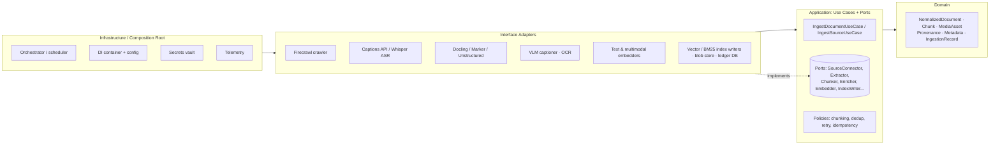
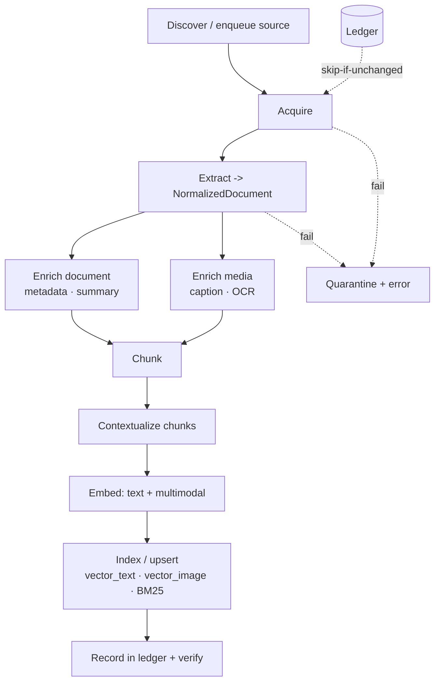

# Architecture — Ingestion

This specifies the ingestion pipeline at the same conceptual level as the query-side
[`ARCHITECTURE.md`](../ARCHITECTURE.md): conceptual first, but structured to map 1:1 onto code.
It reuses that system's conventions — ports, the dependency rule, the composition root, the
shared `Chunk` entity and metadata schema — and adds the acquisition/extraction stages unique to
ingestion.

Organization:

1. Layered architecture & the dependency rule
2. The pipeline as a staged DAG
3. Domain model
4. Port catalog (interfaces to inject) — each with a signature sketch and alternatives
5. Stage subsystems in detail
6. Cross-cutting concerns
7. End-to-end sequence walkthroughs (per source type)
8. Consolidated alternatives & trade-offs

Pseudocode is language-neutral and typed; type names are port/entity names, not a language commitment.

---

## 1. Layered architecture & the dependency rule

Same four layers and inward-only dependency rule as the query side.



- **Domain** — pure data: the normalized document, chunks, media, provenance, metadata. Shared
  with the query side where it overlaps (`Chunk`, `Metadata`, `Provenance`).
- **Application** — the pipeline use cases + ports + policies (chunking, dedup, idempotency, retry).
- **Adapters** — wrap every external tool/SDK behind a port.
- **Infrastructure / Composition Root** — wiring, config, the orchestrator/scheduler, the secrets
  vault, telemetry. The only layer that knows concrete types.

**Why:** extraction tools churn fast (new PDF parsers, new ASR models monthly). Isolating the
pipeline logic from them means re-targeting a parser or captioner is an adapter swap, and the
pipeline runs under test with fakes and golden fixtures.

---

## 2. The pipeline as a staged DAG

Ingestion is a directed pipeline with well-defined stage boundaries. Each boundary is a port, so
each stage is independently testable and replaceable (this is also where the eval harness clips
on — see [`EVALUATION.md`](./EVALUATION.md)).



Stage contracts (the types flowing between stages):

```
Acquire:        SourceRef            -> RawAsset[]
Extract:        RawAsset[]           -> NormalizedDocument
EnrichDoc:      NormalizedDocument   -> NormalizedDocument (metadata/summary added)
EnrichMedia:    MediaAsset           -> MediaAsset (caption + OCR added)
Chunk:          NormalizedDocument   -> Chunk[]
Contextualize:  Chunk                -> Chunk (context prepended)
Embed:          Chunk[]              -> EmbeddedChunk[]
Index:          EmbeddedChunk[]      -> IndexReceipt
```

---

## 3. Domain model

Pure entities. `Chunk`, `Metadata`, and `Provenance` are the **same** types the query system
indexes and cites, guaranteeing compatibility.

```text
# Identity & provenance
SourceRef   { kind: enum(YOUTUBE|WEB|DOCUMENT); locator: string; hints: map }  # URL / path / video id
Provenance  { source_id; connector: string; content_hash; fetched_at;
              anchors: Anchor[] }                       # how to trace a chunk home
Anchor      { kind: enum(HEADING|PAGE|TIMESTAMP|CHAR_SPAN); value }
Metadata    { title; author?; published_at?; language?; source_type;
              access_level; tags: string[]; extra: map }  # used by query-side filters & ACLs

# Acquisition output
RawAsset    { kind: enum(HTML|MARKDOWN|PDF|TEXT|TRANSCRIPT|IMAGE|MEDIA);
              bytes/URI; mime; meta: map }

# The canonical intermediate representation
MediaAsset  { id; image_ref: URI; caption: string?; ocr_text: string?;
              parent_anchor: Anchor; meta: map }
NormalizedDocument {
  doc_id; markdown: string;           # tables as Markdown; images as refs
  media: MediaAsset[]; metadata: Metadata; provenance: Provenance; anchors: Anchor[]
}

# Chunking & embedding (Chunk shared with query side)
Chunk        { id; doc_id; modality: enum(TEXT|IMAGE); content: string;
               image_ref: URI?; anchor: Anchor; metadata: Metadata }
EmbeddedChunk{ chunk: Chunk; text_vector: Embedding?; image_vector: Embedding?;
               keyword_text: string }                  # what goes to BM25

# Bookkeeping
IndexReceipt { doc_id; chunk_ids: string[]; stores_written: string[] }
IngestionRecord { source_id; content_hash; status: enum(OK|QUARANTINED|SKIPPED);
                  receipt?; error?; timings: map }      # the ledger row
```

Design notes:

- An **image becomes both a `MediaAsset` and a `Chunk(modality=IMAGE)`**. The chunk's
  `keyword_text` and `text_vector` come from caption+OCR; its `image_vector` comes from pixels.
  This is the triple-index in data form.
- `Anchor` is what makes a chunk citable: a video chunk anchors to a timestamp, a PDF chunk to a
  page, a doc chunk to a heading path.
- `content_hash` keys idempotency at both source and chunk granularity.

---

## 4. Port catalog

Each port is a narrow Application-layer interface; adapters implement them. For each: responsibility,
signature sketch, alternatives.

### 4.1 `SourceConnectorPort` (the unifying abstraction)
**Responsibility:** acquire raw assets from one source kind. The keystone — YouTube, web, and
document acquisition all look identical to the pipeline.

```text
interface SourceConnectorPort {
  kind: enum
  acquire(ref: SourceRef, auth?: AuthContext) -> RawAsset[]
  discover(seed: SourceRef) -> SourceRef[]   # crawl/sitemap/playlist expansion; may be empty
}
```
A `SourceRegistry` maps `SourceRef.kind -> connector`. Adding a source = register one connector.

### 4.2 `TranscriptProviderPort` (YouTube)
**Responsibility:** obtain a timestamped transcript, with fallback.
```text
interface TranscriptProviderPort { transcript(video_ref) -> TimedSegment[] }  # {text, start, end, speaker?}
```
**Alternatives:** platform captions (free, fast, may be absent/auto-generated and noisy) → **ASR
fallback** (Whisper / hosted speech-to-text: accurate, costs compute, enables no-caption videos).
Strategy `captions_then_asr` is the default. Diarization is optional.

### 4.3 `WebFetcherPort` + `AuthProviderPort` (web)
**Responsibility:** fetch a page as clean Markdown; resolve authentication for gated domains.
```text
interface WebFetcherPort  { fetch(url, auth?) -> RawAsset(MARKDOWN) ; crawl(seed, scope) -> url[] }
interface AuthProviderPort{ resolve(domain) -> AuthContext? }   # cookies/headers/login action from vault
```
**Alternatives:** Firecrawl (default; clean markdown, JS render, crawl, auth actions) · Playwright/
headless browser (full control, more ops) · readability-style extractors (cheap, no JS/auth).
**Auth handling:** per-domain strategy (stored session cookie, header token, or a scripted login)
fetched from the secrets vault. Credentials are *configured operational secrets*, never improvised
at runtime; the vault is the only source. Respect robots/ToS as policy.

### 4.4 `ExtractorPort` / `MarkdownConverterPort` (documents)
**Responsibility:** turn a raw asset into a `NormalizedDocument` — canonical Markdown, extracted
media, structural anchors. One implementation per asset family.
```text
interface ExtractorPort {
  supports(kind) -> bool
  extract(RawAsset[]) -> NormalizedDocument   # tables->markdown, images->MediaAsset, headings->anchors
}
```
**Alternatives (PDF→markdown):** Docling · Marker · Unstructured · LlamaParse · Azure Document
Intelligence. **Trade-off:** layout-aware parsers (better tables/reading order, slower/costlier) vs.
plain text extraction (fast, loses tables/structure). **Scanned PDFs** route through `OcrPort` first.

### 4.5 `OcrPort` and `VisionCaptionerPort` (media enrichment)
```text
interface OcrPort             { ocr(image_ref) -> string }
interface VisionCaptionerPort { caption(image_ref, doc_context?) -> string }  # VLM
```
**Alternatives:** OCR — Tesseract (local) · cloud OCR (higher accuracy). Captioner — a VLM
(GPT-4o / Claude / local LLaVA). Passing `doc_context` (the surrounding section) yields captions
that describe the image *as used in the document*, which retrieves far better than generic captions.

### 4.6 `EnricherPort` (composable)
**Responsibility:** add value to documents/chunks. A chain.
```text
interface EnricherPort { enrich(NormalizedDocument | Chunk, ctx) -> same }
```
**Implementations:** `MetadataExtractor` (title/author/date/language/entities), `Summarizer`
(doc/section summaries), `Contextualizer` (prepend a short section context to each chunk before
embedding — "contextual retrieval"), `PiiRedactor`. Most call an LLM; lightweight ones are rules.

### 4.7 `ChunkerPort`
**Responsibility:** split a `NormalizedDocument` into `Chunk[]` with anchors preserved.
```text
interface ChunkerPort { chunk(NormalizedDocument, policy) -> Chunk[] }
```
**Modality-aware behavior (a policy, not separate ports):** text → structure-aware split by
heading/section with token bound + overlap; **tables → kept intact** as one chunk (never split
mid-table); **images → one chunk each**, content = caption+OCR; **video → time-window chunks**
aligned to transcript segments, anchored to timestamps.
**Alternatives:** fixed-size · recursive/structural · semantic (embedding-boundary) · layout-based.
Default structural; semantic chunking is an opt-in upgrade.

### 4.8 `TextEmbedderPort` and `MultimodalEmbedderPort`
**Shared with the query side** — same interfaces, same configured models (the parity invariant).
```text
interface TextEmbedderPort       { embed_text(string[]) -> Embedding[] }
interface MultimodalEmbedderPort { embed_image(URI[]) -> Embedding[]; embed_text(string[]) -> Embedding[] }
```
The composition root **fails fast** if the ingestion embedder config differs from the recorded
query-side config.

### 4.9 Index writer ports
**Responsibility:** the write side of the three stores (the query side held the read side).
```text
interface VectorIndexWriterPort  { upsert(collection, EmbeddedChunk[]) ; delete(ids) }
interface KeywordIndexWriterPort { upsert(index, {id, keyword_text, metadata}[]) ; delete(ids) }
```
Idempotent upsert by deterministic `chunk_id`. Dense text → `vector_text`; image vectors →
`vector_image`; `keyword_text` (incl. image captions/OCR) → BM25.
**Alternatives:** mirror the query side (Qdrant/pgvector/Milvus; OpenSearch/Elasticsearch).

### 4.10 `DocumentStorePort` (blob)
**Responsibility:** persist the `NormalizedDocument` markdown + image bytes (so citations can
render images and re-chunking needs no re-fetch).
**Alternatives:** S3/GCS/blob · local FS (prototype).

### 4.11 `IngestionLedgerPort`
**Responsibility:** idempotency, incremental runs, status/quarantine, lineage.
```text
interface IngestionLedgerPort {
  seen(content_hash) -> IngestionRecord? ; record(IngestionRecord)
  chunks_for(source_id) -> chunk_ids       # to supersede on re-ingest
}
```
**Alternatives:** Postgres (default) · any KV/DB.

### 4.12 `DedupPort`, `CachePort`, `TelemetryPort`, `ClockPort`
```text
interface DedupPort { is_near_dup(chunk, neighbors) -> bool }  # MinHash/SimHash or embedding cosine
# Cache, Telemetry, Clock as on the query side (cost control, observability, test determinism).
```

### Port → adapter summary

| Port | Default adapter | Notable alternatives |
|------|-----------------|----------------------|
| SourceConnectorPort | per-kind (YT/web/doc) | + Slack/email/audio connectors |
| TranscriptProviderPort | captions → Whisper ASR | hosted STT, diarizing ASR |
| WebFetcherPort | Firecrawl | Playwright, readability extractor |
| AuthProviderPort | cookie/header vault | scripted login action |
| ExtractorPort (PDF) | Docling | Marker, Unstructured, LlamaParse, Azure DI |
| OcrPort | Tesseract | cloud OCR |
| VisionCaptionerPort | VLM (Claude/GPT-4o) | local LLaVA |
| EnricherPort | LLM-based chain | rule-based |
| ChunkerPort | structural + modality policy | semantic, layout, fixed |
| Text/Multimodal embedders | **same as query side** | (must match) |
| Vector/Keyword writers | Qdrant / OpenSearch | pgvector/Milvus; Elasticsearch |
| DocumentStorePort | object storage | local FS |
| IngestionLedgerPort | Postgres | any DB/KV |

---

## 5. Stage subsystems in detail

### 5.1 Acquisition
Per-source connectors with `discover` for expansion (a playlist → videos; a sitemap/seed → URLs;
a folder → files). Web auth resolves a per-domain `AuthContext` from the vault before fetch.
Rate-limiting, retries/backoff, and robots/ToS checks live here. Output is always `RawAsset[]`,
hashed for idempotency before any expensive downstream work.

### 5.2 Extraction → NormalizedDocument
The fidelity-critical stage. Per asset family:
- **YouTube:** transcript segments → Markdown with timestamp anchors; channel/title/description →
  metadata; optional keyframes → `MediaAsset`s.
- **Web:** Firecrawl markdown → canonical markdown; page metadata captured; inline images pulled
  into `MediaAsset`s.
- **Document/PDF:** layout-aware parse → markdown with **tables rendered as Markdown tables**,
  **images extracted** as `MediaAsset`s, headings → anchors, page numbers → anchors; scanned pages
  go through OCR first.
Everything converges on one `NormalizedDocument`; downstream is source-blind.

### 5.3 Enrichment
Two tracks, both composable chains:
- **Media:** caption (VLM, with surrounding section as context) + OCR → fills `MediaAsset.caption`
  and `.ocr_text`. This text is what makes images keyword- and semantically-retrievable.
- **Document/chunk:** metadata extraction, optional summaries, **contextualization** (prepend a
  short "this section is about…" blurb to each chunk before embedding — markedly improves recall
  for chunks that are ambiguous in isolation), and PII redaction.

### 5.4 Chunking
Structure-aware by default, with the modality rules from §4.7. Anchors are preserved onto every
chunk so provenance survives the split. Tables and images are atomic chunks. Video chunks align
to transcript time windows. Overlap is applied to text chunks to avoid boundary loss.

### 5.5 Embedding + the parity invariant
Text chunks (and image caption/OCR text) → `TextEmbedderPort`; image pixels → `MultimodalEmbedderPort`.
Batched for throughput, cached by `(text_hash, model_id)`. **The models must equal the query-side
models**; the composition root refuses to run on mismatch. This single check prevents the most
common silent ingestion failure.

### 5.6 Indexing / upsert
Each `EmbeddedChunk` fans out: text vector → `vector_text`, image vector → `vector_image`,
`keyword_text` → BM25 — all keyed by deterministic `chunk_id` for idempotent upsert. On re-ingest
of a changed source, old chunk ids (from the ledger) are superseded/deleted, then new ones written.
A receipt is recorded; verification confirms counts match across all three stores.

### 5.7 Dedup
Before indexing, near-duplicate chunks (same article mirrored across sites, boilerplate) are
detected via MinHash/SimHash or embedding cosine and collapsed, with provenance merged so the
surviving chunk still lists all its sources.

---

## 6. Cross-cutting concerns

- **Idempotency & incremental.** Content-hash gating at source and chunk level via the ledger;
  re-runs skip unchanged work and never duplicate. Deterministic chunk ids make upserts safe.
- **Orchestration.** The pipeline is a DAG of stages run per source; batch by default, optionally
  streaming/scheduled. Stages parallelize across sources with bounded concurrency; per-stage
  retries with backoff.
- **Failure isolation / quarantine.** A source failing at any stage is recorded `QUARANTINED` with
  its error and skipped; the batch continues. Quarantine is re-drivable after a fix.
- **Secrets.** All site credentials and API keys come from a vault; never in code or config files
  in plaintext. Auth contexts are short-lived and scoped per domain.
- **Cost & rate limits.** ASR, VLM captioning, and embeddings are the cost centers — batch,
  cache, and gate them; the ledger ensures they run at most once per unchanged unit.
- **Provenance & lineage.** Every chunk keeps its `Anchor` and source id; the ledger records the
  full lineage (source → doc → chunks → stores). This is what the query side cites and what eval
  verifies.
- **PII / compliance.** Redaction is an enrichment step; license/robots/ToS respected at acquisition;
  `access_level` set on metadata for downstream ACL enforcement.
- **Observability & determinism.** Per-stage spans (inputs hashes, timings, costs, success) form an
  `IngestionRecord`; fakes + fixed fixtures + `ClockPort` let the pipeline run offline in tests.

---

## 7. End-to-end sequence walkthroughs

### 7.1 Document (PDF with tables and images)

```mermaid
sequenceDiagram
    participant O as Orchestrator
    participant C as DocumentConnector
    participant X as Extractor (Docling)
    participant V as VLM captioner + OCR
    participant K as Chunker
    participant E as Embedders
    participant I as Index writers
    participant L as Ledger

    O->>C: acquire(pdf ref)
    C-->>O: RawAsset(PDF)  %% hashed; ledger says new
    O->>X: extract
    X-->>O: NormalizedDocument (md + tables + MediaAssets + page anchors)
    loop each image
        O->>V: caption(image, section ctx) + ocr
        V-->>O: caption + ocr_text
    end
    O->>K: chunk (structural; tables/images atomic)
    K-->>O: Chunk[]
    O->>E: embed text + multimodal
    E-->>O: EmbeddedChunk[]
    O->>I: upsert vector_text / vector_image / BM25
    I-->>O: receipt
    O->>L: record OK + lineage; verify counts
```

### 7.2 YouTube (no captions → ASR)
`acquire(video) → transcript: captions miss → ASR (Whisper) → timestamped segments → Markdown
with timestamp anchors → (optional keyframes captioned) → time-window chunks → embed → index.`
Citations later resolve to `youtube.com/watch?v=…&t=<anchor>`.

### 7.3 Auth-gated web page (Substack)
`AuthProvider.resolve("substack.com") → cookie from vault → Firecrawl.fetch(url, auth) → markdown
→ metadata + inline images → chunk → embed → index.` No auth context → page quarantined, not faked.

---

## 8. Consolidated alternatives & trade-offs

| Decision | Options | Default & why |
|----------|---------|---------------|
| Source unification | per-source bespoke pipelines · one connector port + normalized doc | **Normalized doc**: one uniform downstream, pluggable sources |
| Transcript | captions only · ASR only · captions→ASR | **captions→ASR**: cheap when present, robust when absent |
| Web fetch | Firecrawl · headless browser · readability | **Firecrawl**: clean md + JS + auth, least ops |
| Auth-gated sites | skip · scripted login · vault cookies/headers | **Vault-resolved per-domain auth**, never improvised |
| PDF→markdown | layout-aware (Docling/Marker) · plain text | **Layout-aware**: tables/structure/images preserved |
| Image handling | drop · caption only · **triple-index** | **Triple-index** (BM25 + text-emb + multimodal) |
| Captioning | none · generic · **context-aware VLM** | **Context-aware**: captions retrieve far better |
| Chunking | fixed · structural · semantic · layout | **Structural + modality policy**; semantic as upgrade |
| Contextualization | off · prepend section context | **On**: improves recall of ambiguous chunks |
| Embedder choice | anything · **same as query side** | **Parity-locked** (enforced at composition root) |
| Re-ingestion | full rebuild · content-hash incremental | **Incremental** via ledger; idempotent upserts |
| Dedup | none · MinHash/SimHash · embedding cosine | **On**, source-merging, to avoid index pollution |
| Failure policy | abort batch · quarantine + continue | **Quarantine**: one bad source never blocks the rest |
| Orchestration | scripts · DAG batch · streaming | **DAG batch** default; streaming optional |

Every row is a config/adapter choice, not a rewrite — because the pipeline depends only on the
ports in §4.
