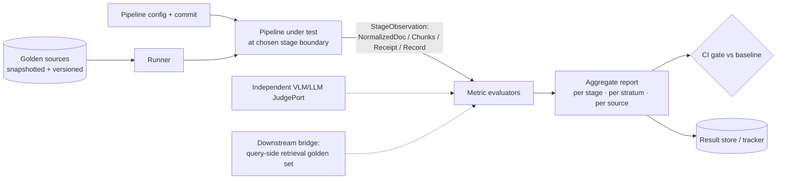
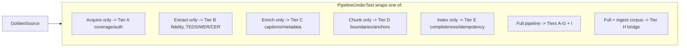

# Evaluation — Ingestion Golden-Set Harness

This specifies how we measure ingestion quality, in detail, at the conceptual level of the rest
of the project. It mirrors the query-side [`EVALUATION.md`](../EVALUATION.md) — same Clean-
Architecture harness, same "evaluate at any port boundary" payoff, same trust discipline — and
adds the fidelity dimensions unique to turning messy sources into clean, citable index entries.
It also defines the **bridge** to the query-side harness: ingestion's ultimate test is whether the
indexed corpus supports retrieval.

Organization:

1. Why ingestion eval is different
2. Principles
3. One-picture overview
4. The golden set (golden *sources*)
5. Metric taxonomy (tiers + the objective-vs-judge axis)
6. The harness as Clean Architecture (ports & entities)
7. The key payoff: evaluate at any stage boundary (and the downstream bridge)
8. Run lifecycle
9. Trustworthy measurement
10. CI / regression gates
11. Experiment tracking & A/B (extractor / captioner / chunker bake-offs)
12. Consolidated alternatives & trade-offs
13. Build order

---

## 1. Why ingestion eval is different

Ingestion sits *upstream of everything*, which changes what evaluation must do:

- **Errors are unrecoverable.** A table mangled at extraction, an image dropped, a transcript
  with high word-error-rate — no reranker or clever prompt downstream can fix what was never
  indexed. So fidelity must be measured *at the point of extraction*, not inferred from final answers.
- **Much of it is objectively checkable.** Unlike answer quality (subjective, judge-reliant),
  large parts of ingestion have ground truth: was every image extracted? does the table match?
  does re-ingestion produce zero new chunks? These are cheap, deterministic, high-signal metrics.
- **The remaining parts need judgment.** Caption quality and markdown faithfulness need a (VLM/LLM)
  judge — but they're a minority, and they're triangulated by objective proxies (e.g.,
  retrievability).
- **The real target is downstream.** Intrinsic fidelity is necessary but not sufficient; the
  decisive question is whether the ingested corpus lets the query side retrieve and cite correctly.
  So the harness must both measure stages intrinsically *and* bridge to query-side retrieval.

---

## 2. Principles

1. **Attribute to a stage.** Every run scores per stage (acquisition, extraction, enrichment,
   chunking, indexing) and per stratum, so a regression points at the responsible component.
2. **Prefer objective anchors.** Lead with deterministic, reference-based checks (counts, hashes,
   edit distance, TEDS, idempotency); use the judge only where no objective reference exists.
3. **Evaluate at stage boundaries.** Because each stage is a port, the harness clips onto any one
   of them with the same machinery — and onto the whole pipeline plus the downstream bridge.
4. **Pin the sources.** Golden *sources* are snapshotted (raw bytes stored), because web pages and
   videos drift; otherwise "regressions" are really source changes.
5. **Independent, calibrated judges.** Markdown-fidelity and caption judges use models distinct
   from the pipeline's captioner/enricher, calibrated against human labels.
6. **The bridge is a first-class metric.** Downstream retrievability of the query-side golden set
   on the freshly ingested corpus is tracked as the integrative score.

---

## 3. One-picture overview



---

## 4. The golden set (golden *sources*)

### 4.1 Anatomy of a `GoldenSource`

Where the query side curates query→answer cases, ingestion curates **source→expected-output**
cases, with the source content snapshotted for stability.

```text
GoldenSource {
  id: string
  version_added: string
  stratum: enum                       # clean_pdf | scanned_pdf | nested_table | image_heavy
                                      # captioned_video | no_caption_video | public_web
                                      # auth_web | duplicate_pair
  difficulty: enum                    # easy | medium | hard

  # Pinned input (so the set is stable)
  source_ref: SourceRef
  snapshot: URI                       # stored raw bytes of the page/PDF/video+captions

  # Expected outputs (references; any subset may be present)
  expected_markdown: string?          # canonical reference body (for fidelity)
  expected_headings: string[]?        # structure reference
  expected_tables: TableRef[]?        # reference cell grids (for TEDS / cell-F1)
  expected_images: { count: int; key_terms: string[][] }?   # extraction completeness + caption probes
  expected_transcript: string?        # for ASR WER
  expected_metadata: { title?; author?; published_at?; language? }
  expected_anchors: AnchorRef[]?      # which page/timestamp/heading each key fact lives at
  expected_chunk_bounds: { min: int; max: int }?            # sane chunk count range
  dedup_partner: source_id?           # for duplicate_pair stratum

  # Bridge to query-side eval
  enables_query_cases: case_id[]?     # query-side golden cases that should pass once this is ingested
}
```

The fields most teams omit and most regret: `snapshot` (stability), `expected_tables`
(tables are where extractors fail hardest), `expected_anchors` (citation resolvability), and
`enables_query_cases` (the downstream bridge).

### 4.2 Snapshotting (source stability)

A live URL or video can change between runs; comparing against it would conflate *pipeline*
regressions with *source* drift. Each `GoldenSource` therefore stores a frozen `snapshot` of the
raw bytes (HTML, PDF, transcript+media), and the harness replays from the snapshot by default. A
separate, occasional "live" mode re-snapshots to detect upstream changes deliberately.

### 4.3 Stratification (coverage)

| Stratum | Probes the stage | Why it's hard |
|---------|------------------|---------------|
| clean_pdf | extraction text/structure | baseline |
| scanned_pdf | OCR path | image-only pages, noise |
| nested_table | table extraction | merged cells, nesting |
| image_heavy | media extraction + triple-index | completeness, caption quality |
| captioned_video | transcript (captions) | timestamp alignment |
| no_caption_video | ASR fallback | WER, segmentation |
| public_web | Firecrawl extraction | boilerplate, JS |
| auth_web | auth resolution + extraction | login, paywall |
| duplicate_pair | dedup | near-dup precision/recall |

Report **per stratum** — a global average hides that, say, nested-table TEDS collapsed.

### 4.4 How to build it (alternatives)

| Source | Strength | Weakness | Use for |
|--------|----------|----------|---------|
| **Hand-built references** | exact, true edge cases | slow | tables, scanned, auth, dedup core |
| **Semi-synthetic** (render known content to PDF/HTML; you own the ground truth) | exact references at scale, no labeling | synthetic look | bulk structure/table/image fidelity |
| **Production-sampled** (real sources, human-verified outputs) | realistic distribution | labeling cost, privacy | distribution realism |

Recommended hybrid: a hand-built hard core, plus **semi-synthetic** sources (you author content,
render to PDF/HTML, so `expected_*` is known by construction — uniquely powerful for tables and
image-extraction), refreshed from production samples. Snapshot everything.

### 4.5 Versioning & governance

Same as the query side: `ingestion_golden@vN`, code-reviewed, recorded in every run; per-source
provenance so an ambiguous reference can be retired; new baselines promoted deliberately.

---

## 5. Metric taxonomy

Two axes again: **the stage** (which component) and **objective vs. judge** (does the metric need a
human/model judgment or is it a deterministic reference check). Each metric is an injectable
`MetricPort`. Lead with objective metrics; reserve judges for caption/markdown quality.

### Tier A — Acquisition & coverage (objective)
- Connector success rate; **auth success rate** (auth_web); transcript source used
  (captions vs. ASR); discovery completeness (did `discover` find all videos/pages/files).

### Tier B — Extraction fidelity (mostly objective) — *the heart of ingestion eval*

| Metric | Stage target | Method |
|--------|--------------|--------|
| Text fidelity | markdown body | CER / WER vs `expected_markdown` (normalized) |
| Structure fidelity | headings | heading-set F1; reading-order rank correlation (Kendall τ) |
| **Table fidelity** | tables | **TEDS** (tree-edit-distance similarity) + cell-content F1 |
| Image extraction recall | media | `extracted / expected.count` (were all images captured?) |
| OCR accuracy | scanned/image text | CER vs reference |
| Transcript accuracy | ASR | **WER** vs `expected_transcript`; timestamp alignment error |

Tables and OCR are where extractor choices (Docling vs. Marker vs. Unstructured) diverge most —
TEDS is the metric that makes that bake-off decidable.

### Tier C — Enrichment quality (judge + objective proxy)
- **Caption quality** — VLM-judge rubric (does the caption describe the image's content and any
  text in it?) *plus* an objective proxy: can the image be retrieved by a query built from its
  `key_terms`? (retrievability beats subjective scoring).
- **Metadata accuracy** — field-level exact/fuzzy match for title/author/language; date correctness.
- **Contextualization correctness** — does the prepended context match the chunk's section (judge
  or heading-overlap), and does it *help* (measured at the bridge, Tier H).

### Tier D — Chunking quality (objective + judge)
- **Boundary integrity** — fraction of chunks that split a sentence or, critically, a **table**
  (lower is better; mid-table splits should be ~0).
- **Anchor correctness** — does each chunk's `anchor` resolve to a location whose content contains
  the chunk? (objective for PDF page/heading; transcript-overlap check for video timestamps).
- **Standalone interpretability** — judge: is the chunk understandable alone? (the thing
  contextualization is meant to improve).
- **Size distribution** — stats vs `expected_chunk_bounds`; flag pathological tiny/huge chunks.

### Tier E — Index integrity (objective, deterministic — cheap & high-value)
- **Completeness / reconciliation** — every chunk present in the stores it should be; counts match
  across `vector_text`, `vector_image`, BM25; no orphans.
- **Triple-index check** — each image chunk appears in BM25 + text vector + image vector.
- **Parity assertion** — ingestion embedder config == query-side config (hard fail otherwise).
- **Idempotency** — re-ingesting an unchanged source yields **exactly zero** new chunks (a binary gate).

### Tier F — Provenance / citation resolvability (objective)
- Sample chunks → follow `anchor` → verify it points to the correct page/timestamp/heading
  containing the chunk's content. A chunk that can't be resolved home is a defect. This is what
  guarantees the query side's citations actually land.

### Tier G — Dedup correctness (objective)
- On `duplicate_pair` strata: precision/recall of near-dup detection (collapse true dupes, keep
  distinct content); verify surviving chunk merges both sources' provenance.

### Tier H — Downstream bridge (the integrative metric)
- Ingest the golden sources, then run the **query-side retrieval golden set** (those cases linked
  via `enables_query_cases`) against the freshly built corpus; report **recall@k / nDCG**. This is
  the decisive ingestion-quality signal — it's where contextualization, chunking, and extraction
  fidelity all cash out. A drop here with stable Tier-B fidelity points at chunking/enrichment;
  a drop with degraded Tier-B points at extraction.

### Tier I — System (objective, from `IngestionRecord`)
- Throughput (docs/min, chunks/min), cost per doc ($ for ASR/VLM/embeddings), per-stage latency,
  failure/quarantine rate, cache hit-rate.

---

## 6. The harness as Clean Architecture

Same shape as the query-side harness; specialized ports for the staged pipeline.

```mermaid
flowchart TB
    subgraph Infra[Composition root]
        CFG[eval config + run manifest] --> CONT[container]
    end
    subgraph App[Application]
        EUC[RunIngestionEvalUseCase] --> EP[(Ports)]
    end
    subgraph Dom[Domain]
        GE[GoldenSource · StageObservation<br/>MetricResult · AggregateReport]
    end
    subgraph Ad[Adapters]
        D1[GoldenSource store: snapshots]
        D2[PipelineUnderTest: full | single stage]
        D3[Metrics: TEDS · WER · F1 · counts · idempotency]
        D4[Judge: VLM caption · LLM markdown-fidelity]
        D5[Bridge: query-side retrieval harness]
        D6[Result store / tracker]
    end
    CONT --> Ad
    Ad -. implements .-> EP
    App --> Dom
```

### 6.1 Ports

```text
interface GoldenSourcePort   { load(version) -> GoldenSource[]; snapshot(id) -> RawAsset[] }
interface PipelineUnderTestPort { run(GoldenSource, boundary) -> StageObservation }  # any stage or full
interface MetricPort         { id; stage; objective: bool
                               score(GoldenSource, StageObservation, judge?, bridge?) -> MetricResult }
interface JudgePort          { judge_caption(image, caption) -> verdict
                               judge_markdown(ref, got) -> verdict }     # independent, calibrated
interface BridgePort         { retrieval_scores(corpus, query_cases) -> {recall@k, ndcg} }  # query-side harness
interface ResultStorePort    { save(EvalRun); baseline(suite) -> EvalRun }
interface RunnerPort         { run_all(sources, put, metrics) -> CaseResult[] }
interface ReportSinkPort     { emit(AggregateReport) }
```

`PipelineUnderTestPort` is the hinge (Section 7); `BridgePort` is the link to the query side.

### 6.2 Entities

```text
StageObservation { boundary: enum; normalized_doc?: NormalizedDocument;
                   chunks?: Chunk[]; receipt?: IndexReceipt; record?: IngestionRecord }
MetricResult     { metric_id; stage; objective; value; passed?; rationale? }
CaseResult       { source_id; stratum; metrics: MetricResult[]; raw: StageObservation }
AggregateReport  { run_id; ingestion_golden_version; pipeline_commit; config_hash;
                   by_stage: map; by_stratum: map; by_metric: {mean, ci}; failures: CaseResult[];
                   bridge: {recall@k, ndcg} }
RunManifest      { pipeline_config; ingestion_golden_version; judge_config; bridge_query_version; repeats; seed }
EvalRun          { manifest; results: CaseResult[]; report: AggregateReport }
```

`RunManifest` pins reproducibility *and* records the query-golden version used at the bridge, so
two ingestion runs are comparable only when both their source set and their bridge set match.

---

## 7. The key payoff: evaluate at any stage boundary

Because each pipeline stage is a port, `PipelineUnderTestPort` can wrap **any boundary**, and the
same harness + golden sources + metrics apply. This is what makes a regression *attributable*.



Practical consequences:

- **Isolate a regression.** Downstream bridge recall drops but Tier-B fidelity is stable → re-run
  the *chunk-only* and *enrich-only* boundaries to find whether chunking or contextualization broke it.
- **Bake off extractors.** Run *extract-only* with Docling vs. Marker on the same golden sources;
  compare TEDS and image-recall directly (Section 11).
- **Prove contextualization earns its tokens.** Run the bridge with contextualization on vs. off;
  if recall@k doesn't move, it's just cost.
- **Cheap fast gates.** Tier-E (counts, idempotency, parity) and Tier-F (anchor resolsolvability)
  are deterministic and fast — run them on every commit; reserve judge-based Tier-C and the
  bridge (Tier-H) for nightly/phase gates.

This is the same insight as the pipeline architecture, applied to measurement: narrow stage ports
make narrow, attributable experiments possible.

---

## 8. Run lifecycle

```mermaid
sequenceDiagram
    participant CI as CI / CLI
    participant C as Composition root
    participant R as Runner
    participant P as PipelineUnderTest
    participant M as Metrics
    participant J as JudgePort
    participant Br as BridgePort (query-side)
    participant St as Result store

    CI->>C: run(manifest: config, ingestion_golden@v, bridge_query@v, repeats)
    C->>R: sources + PUT(boundary) + metrics (injected)
    loop each golden source (x repeats for stochastic stages)
        R->>P: run(source, boundary)  %% replays from snapshot
        P-->>R: StageObservation
        R->>M: score(source, observation)
        M->>J: judge captions / markdown (only where needed)
        J-->>M: verdicts
        M-->>R: MetricResult[]
    end
    opt boundary == full+bridge
        R->>Br: retrieval_scores(ingested corpus, linked query cases)
        Br-->>R: recall@k, ndcg
    end
    R-->>C: CaseResult[] (+ bridge)
    C->>St: save EvalRun; load baseline
    C-->>CI: AggregateReport (per stage/stratum, bridge, vs baseline, failures)
```

Orchestrator sketch:

```text
function run_ingestion_eval(manifest):
  sources = golden.load(manifest.ingestion_golden_version)     # replay from snapshots
  put     = container.build_pipeline(manifest.pipeline_config, manifest.boundary)
  metrics = container.build_metrics(manifest)                  # filtered by boundary's stage
  results = []
  for src in sources:
      for r in 1 .. repeats_for(manifest.boundary):            # repeats only for ASR/VLM/LLM stages
          obs = put.run(src, manifest.boundary)
          ms  = [m.score(src, obs, judge, bridge) for m in metrics if applicable(m, src, obs)]
          results.append(CaseResult(src, ms, obs))
  if manifest.boundary == FULL_PLUS_BRIDGE:
      bridge = bridge_port.retrieval_scores(corpus_of(results), linked_query_cases(sources))
  report  = aggregate(results, bridge)                         # mean+CI, by stage, by stratum
  store.save(EvalRun(manifest, results, report))
  return compare(report, store.baseline(manifest.suite))
```

---

## 9. Trustworthy measurement

- **Snapshots kill drift.** Default to replaying frozen source bytes; live re-snapshotting is a
  separate, deliberate run so source changes never masquerade as pipeline regressions.
- **Objective-first.** The bulk of signal (TEDS, WER, CER, counts, idempotency, anchor resolution)
  is deterministic and needs no judge — run it cheaply and often, with exact pass/fail.
- **Repeats only where stochastic.** Extraction of digital PDFs is deterministic (no repeats
  needed); ASR, VLM captioning, and LLM enrichment are stochastic → run those `repeats` times,
  report mean + CI. Don't pay for repeats on deterministic stages.
- **Calibrated, independent judges.** Caption and markdown-fidelity judges use models distinct from
  the pipeline's captioner/enricher, calibrated against a human-labeled subset (report judge↔human
  κ); low agreement means fix the rubric, not the pipeline.
- **Triangulate judges with proxies.** Pair the subjective caption judge with the objective
  retrievability proxy (can the image be found by its `key_terms`?) so caption quality has a
  ground-truthable backstop.
- **Pin the bridge version.** The query-side golden set used at Tier H is versioned in the manifest;
  a bridge-set change is not comparable to prior runs.

---

## 10. CI / regression gates

- **Tiered cadence.** Per-commit: fast deterministic gates — Tier-E (counts, **idempotency==0 new**,
  parity) and Tier-F (anchor resolvability) — plus Tier-B on a small core. Nightly / phase-gate:
  full Tier-B/C/D, judge metrics, and the Tier-H bridge.
- **Hard binary gates** (fail the build outright): parity mismatch; non-zero new chunks on
  re-ingest; any chunk with an unresolvable anchor; mid-table split rate above a tiny threshold.
- **Baseline-relative thresholds** for graded metrics (TEDS, WER, recall@k), per **stratum** —
  a global average holding while `nested_table` TEDS collapses must still fail.
- **Cost gates.** Tier-I cost-per-doc and latency have their own thresholds; a fidelity win that
  triples ASR/VLM cost is flagged.
- **Per-source diffs** on failure, with the judge's rationale and before/after references, so the
  regression is actionable. Baselines promoted only on reviewed runs.

---

## 11. Experiment tracking & A/B (the bake-offs)

The harness doubles as the decision tool for ingestion's biggest choices. A **run matrix** crosses
configs × golden sources, keyed by `RunManifest`:

```text
configs = [ {extractor: docling}, {extractor: marker}, {extractor: unstructured} ]   # extractor bake-off
# or: {captioner: vlm-a vs vlm-b}, {chunking: structural vs semantic}, {contextualize: on vs off}
for cfg in configs: run_ingestion_eval(manifest.with(cfg))
ResultStore.compare_runs([...]) -> leaderboard   # per stage AND at the bridge
```

This makes the recurring questions evidence-based rather than vibes:

- *Which PDF parser?* → compare TEDS, image-recall, OCR-CER, and bridge recall.
- *Which captioner?* → compare caption-judge + retrievability + bridge recall on image_heavy.
- *Structural vs. semantic chunking?* → compare boundary integrity + bridge recall.
- *Is contextualization worth the tokens?* → bridge recall on vs. off, against the cost gate.

Runs compare only when source set + bridge set + judge config match; the store enforces it.

---

## 12. Consolidated alternatives & trade-offs

| Decision | Options | Default & why |
|----------|---------|---------------|
| Golden inputs | live URLs/videos · **snapshots** | **Snapshots**: stability, no source-drift false positives |
| Reference creation | hand-built · **semi-synthetic** · production-sampled | **Hybrid**; semi-synthetic gives exact table/image ground truth at scale |
| Table metric | cell-F1 · **TEDS** · exact match | **TEDS (+cell-F1)**: structure-aware, the right table metric |
| Transcript metric | exact · **WER** + alignment | **WER + timestamp alignment** |
| Caption metric | judge only · **judge + retrievability proxy** | **Both**: subjective score backed by ground-truthable proxy |
| Judge model | pipeline's own · **independent calibrated** | **Independent**, calibrated to human |
| Determinism | repeat everything · **repeat only stochastic stages** | **Targeted repeats**: deterministic stages run once |
| Integrative signal | intrinsic only · **+ downstream bridge** | **Bridge**: ties ingestion to actual retrievability |
| CI cadence | all gates always · **tiered (fast per-commit, full nightly)** | **Tiered**: cheap deterministic gates frequent, judges/bridge nightly |
| Hard gates | thresholds only · **+ binary (parity/idempotency/anchors)** | **Binary gates** for non-negotiables |
| Result store | files · DB · tracker | **Tracker** if available, files for prototype — behind `ResultStorePort` |

Every row is a config/adapter choice, not a rewrite — same payoff as the pipeline architecture.

---

## 13. Build order

Mirrors the ingestion phases so each eval capability lands with the stage it measures.

| Step | Build | Gates which phase |
|------|-------|-------------------|
| E0 | Harness skeleton: entities + ports + fakes; snapshot-backed `GoldenSourcePort`; console sink | runnable on fakes |
| E1 | Tier-B text/structure fidelity (CER/WER, heading-F1) + Tier-E integrity/idempotency/parity + extract/index boundaries | Phase 1 (PDF→index) |
| E2 | **TEDS** + image-extraction recall + Tier-C caption judge & retrievability proxy | Phase 2 (image triple-index) |
| E3 | Tier-A auth/coverage; web-extraction fidelity on public_web/auth_web strata | Phase 3 (web + auth) |
| E4 | ASR **WER** + timestamp alignment; video chunk/anchor checks | Phase 4 (YouTube) |
| E5 | Tier-D chunking (boundaries, standalone-interpretability) + Tier-G dedup + the **Tier-H bridge** | Phase 5 (enrich + dedup) |
| E6 | Tiered CI gates + cost (Tier-I) + the A/B run matrix (extractor/captioner/chunker bake-offs) | Phases 6–7 (incremental, hardening) |

Build the **snapshot-backed golden sources, Tier-B fidelity, and Tier-E integrity gates in E0–E1**,
before there's much pipeline — they are what prove each later stage improves fidelity rather than
merely adding moving parts, and the **Tier-H bridge** is what proves all that fidelity actually
turns into retrievable, citable answers downstream.
