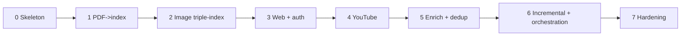

# Implementation Plan (High Level) — Ingestion

This turns the concepts in [`ARCHITECTURE.md`](./ARCHITECTURE.md) into a build plan. High-level
by design: *what to build, in what order, and where it lives* — not line-by-line code. Each phase
ends with something runnable. It mirrors the query-side
[`IMPLEMENTATION.md`](../IMPLEMENTATION.md) and shares its principles, since the two systems share
a domain core.

---

## 1. Guiding implementation principles

1. **Walking skeleton first.** Get one source type flowing end-to-end (acquire → index) with the
   simplest adapter for every port, then improve adapters in place.
2. **Code against ports only.** Application/Domain never import a vendor SDK; enforce with an
   import-linter rule in CI.
3. **One composition root.** All wiring lives in a single container driven by config. New source
   or new tool = new adapter + one config branch.
4. **Fakes from day one.** Every port ships an in-memory fake (fake connector returning a fixed
   doc, echo captioner, in-memory index) so the pipeline runs in tests with zero network.
5. **Share the core with the query side.** `Chunk`, `Metadata`, `Provenance`, and the embedder
   ports are imported from the shared domain package (canonical contract:
   [`../shared/DATA_MODEL.md`](../shared/DATA_MODEL.md)) — not re-declared — so index/query parity is
   structural, not a documentation promise.

---

## 2. Suggested stack (all swappable)

| Concern | Pragmatic default | Why | Swap to |
|---------|-------------------|-----|---------|
| Language | Python (typed) | richest parsing/ASR/LLM ecosystem | TS where the query side is TS |
| Orchestration | a DAG/workflow runner (Prefect/Dagster/Airflow) or a job queue | retries, scheduling, observability | plain async batch for prototype |
| YouTube transcript | captions API → Whisper ASR fallback | cheap-when-present, robust | hosted STT |
| Web fetch | Firecrawl | clean md + JS + auth + crawl | Playwright; readability |
| PDF → markdown | Docling | tables/structure/images, OSS | Marker, Unstructured, LlamaParse, Azure DI |
| OCR | Tesseract | local, free | cloud OCR for accuracy |
| Captioning | a VLM (Claude / GPT-4o) | quality captions w/ context | local LLaVA |
| Embedders | **same as query side** | parity invariant | (must match) |
| Index writers | Qdrant + OpenSearch | mirror query side | pgvector/Milvus; Elasticsearch |
| Blob store | object storage (S3/GCS) | durable md + images | local FS (prototype) |
| Ledger | Postgres | idempotency/lineage/status | any DB/KV |
| Secrets | a vault (cloud secrets mgr) | site creds & API keys | env-injected for prototype |
| Cache | Redis | dedupe expensive ASR/VLM/embed | in-proc LRU (prototype) |
| Telemetry | OpenTelemetry | per-stage spans = eval data | vendor APM |

> A framework (LlamaIndex/Unstructured pipelines) may implement stages, but keep it **behind the
> Application ports** — never let framework types leak into the domain, or you lose swap-ability.

---

## 3. Module / package layout

```
ingestion/
  domain/                 # ingestion-only entities; shared types (Chunk/Metadata/Provenance/
                          # Anchor/Embedding) imported from the shared domain package
                          # (canonical contract: ../shared/DATA_MODEL.md), not redefined
    normalized_document.py  media_asset.py  raw_asset.py  source_ref.py
    embedded_chunk.py  ingestion_record.py

  application/
    ports/                # ARCHITECTURE §4
      source_connector.py  transcript.py  web_fetcher.py  auth_provider.py
      extractor.py  ocr.py  vision_captioner.py  enricher.py  chunker.py
      embedder.py          # re-exported from shared package
      index_writer.py  document_store.py  ledger.py  dedup.py  telemetry.py
    usecases/
      ingest_source.py     # the pipeline orchestrator (ARCHITECTURE §2)
    policies/
      chunking.py  idempotency.py  retry.py  dedup.py
    enrichers/             # EnricherPort implementations
      metadata.py  summarize.py  contextualize.py  pii_redact.py
    prompts/               # versioned, reviewed prompt artifacts for the LLM/VLM enrichers
                           # (caption, contextualize, metadata-extract...) — application-layer,
                           # not buried in adapters; pinned in the eval RunManifest

  adapters/               # only layer importing SDKs
    connectors/{youtube,web_firecrawl,document}.py
    transcript/{captions,whisper}.py
    web/{firecrawl,playwright}.py  auth/{vault_cookie}.py
    extract/{docling,marker,unstructured}.py
    media/{tesseract_ocr,vlm_captioner}.py
    embed/{bge,jina_clip}.py        # thin re-use of shared adapters
    index/{qdrant_writer,opensearch_writer}.py
    store/{object_store}.py  ledger/{postgres}.py  cache/{redis}.py  telemetry/otel.py

  infrastructure/
    container.py          # composition root: config -> adapters -> use case; parity check here
    config.py             # schema + loader (README §9)
    orchestrator.py       # DAG/queue wiring, concurrency, retries, quarantine
    secrets.py            # vault client

tests/
  fakes/  unit/  integration/  fixtures/golden_sources/  eval/
```

The dependency rule is visible: `domain` (shared) ← `application` ports ← `adapters`/`infrastructure`.

---

## 4. Phased build plan

Each phase is shippable and testable on its own; each ends with content actually retrievable by
the query side.

### Phase 0 — Skeleton & contracts
- Define ingestion entities + all port interfaces (signatures only); import shared `Chunk` etc.
- Fakes for every port (fixed-doc connector, echo captioner, in-memory writers, in-memory ledger).
- Composition root + config loader + a CLI `ingest <ref>`; wire the stage DAG on fakes.
- **Exit:** a fake source flows acquire→index end-to-end, fully under test, no network.

### Phase 1 — Document path (PDF → markdown → index)
- `DocumentConnector` + `Extractor` (one real PDF→markdown adapter) producing `NormalizedDocument`
  (text + tables; images extracted but not yet enriched).
- Structural `Chunker`; real text `Embedder` (parity with query side); `VectorIndexWriter` +
  `KeywordIndexWriter`; `DocumentStore`; `Ledger`.
- **Exit:** a real PDF is searchable in text-vector + BM25 stores; query side can retrieve & cite by page.

### Phase 2 — Image triple-indexing
- `VisionCaptioner` (context-aware) + `OcrPort`; `MultimodalEmbedder` (parity).
- Image chunks: caption+OCR → BM25 + text vector; pixels → image vector store.
- **Exit:** an image in a PDF is retrievable by keyword, by semantic text, and by visual query, and cites the image.

### Phase 3 — Web path (Firecrawl + auth)
- `WebFetcher` (Firecrawl) + crawl/discover; `AuthProvider` resolving per-domain cookies from the vault.
- **Exit:** public and **auth-gated** (Medium/Substack) pages ingest to all relevant stores; no-auth pages quarantine cleanly.

### Phase 4 — YouTube path
- `YouTubeConnector` + `TranscriptProvider` (captions → Whisper ASR fallback); timestamp anchors;
  optional keyframe captioning.
- Time-window chunking aligned to transcript segments.
- **Exit:** a video (with or without captions) is searchable and cites back to a timestamp.

### Phase 5 — Enrichment & quality
- Enricher chain: metadata extraction, summaries, **contextualization** (prepend section context
  before embedding), PII redaction. `Dedup` before indexing.
- **Exit:** measurable retrieval lift from contextualization (validated by the eval harness); dupes collapsed.

### Phase 6 — Idempotency, incremental & orchestration
- Content-hash gating in the ledger; deterministic upsert/supersede on re-ingest; quarantine + re-drive.
- Wire the real orchestrator (DAG/queue): bounded concurrency, per-stage retries, scheduling.
- **Exit:** re-running on changed/unchanged sources is safe, cheap, and duplicate-free.

### Phase 7 — Hardening
- Caching of ASR/VLM/embeddings; cost & rate-limit governance; full per-stage telemetry/lineage;
  secrets hygiene; robots/ToS/ACL enforcement.
- **Exit:** production-ready: observable, idempotent, cost-bounded, resilient, compliant.



---

## 5. Config schema (sketch)

Single declarative file selects adapters and tunes policy (mirrors README §9). The container is the
only code that branches on `provider` — and the only place the **parity check** runs.

```yaml
sources:
  youtube:  { transcript: captions_then_asr, asr: { provider: whisper, model: large-v3 }, keyframes: true }
  web:      { provider: firecrawl, mode: crawl, max_pages: 200, respect_robots: true,
              auth: { "medium.com": vault:medium_cookie, "substack.com": vault:substack_cookie } }
  document: { converter: docling, ocr: { provider: tesseract }, extract_images: true }
enrich:
  captioner:     { provider: vlm-claude }
  contextualize: true
  pii_redact:    true
chunking: { strategy: structural, max_tokens: 512, overlap: 64, table: atomic, image: atomic,
            video: { window_s: 45 } }
embedder:
  text:       { provider: bge,  model: bge-large-en }     # MUST equal query side
  multimodal: { provider: jina, model: jina-clip-v2 }     # MUST equal query side
index:
  vector_text:  { provider: qdrant, collection: docs }
  vector_image: { provider: qdrant, collection: imgs }
  keyword:      { provider: opensearch, index: docs }
store:    { provider: object_store, bucket: rag-normalized }
ledger:   { provider: postgres, dsn: ... }
pipeline: { mode: batch, concurrency: 8, idempotency: content_hash, on_failure: quarantine,
            retries: { max: 3, backoff: exponential } }
```

**Enforced invariant:** the container loads the query-side embedder config and aborts if `embedder`
here differs (model + version + pooling).

---

## 6. Testing strategy

| Level | What | How |
|-------|------|-----|
| Unit | chunking policy, idempotency, dedup, anchor mapping | pure functions, no I/O |
| Contract | each adapter satisfies its port | one shared suite run against every adapter incl. fakes |
| Integration | pipeline with **fakes** | deterministic acquire→index on fixed fixtures; asserts stage flow, quarantine, idempotency |
| Golden fixtures | known source → expected NormalizedDocument / chunks | extraction & chunking fidelity (see EVALUATION.md) |
| Idempotency | re-ingest produces zero new chunks | hash gating + deterministic ids |
| Downstream | freshly ingested corpus supports query-side retrieval golden set | bridges to query-side eval |

Build the **golden source fixtures early** (Phase 1) — they are how you prove later phases improve
fidelity rather than just adding stages. Per-stage telemetry feeds the ingestion eval harness, so
wire `TelemetryPort` minimally from Phase 0.

---

## 7. Deployment notes (high level)

- **Ingestion workers** (stateless, scale horizontally) pull sources from a queue and run the DAG.
- **Stateful backends** — vector stores, BM25, blob store, ledger DB, Redis — shared with / adjacent
  to the query side; embedders are the shared dependency.
- **External cost centers** — ASR, VLM captioning, embeddings — run behind caches and rate gates;
  the ledger guarantees at-most-once processing per unchanged unit.
- **Scheduling** — batch backfills + incremental scheduled runs (e.g., recrawl feeds, new videos);
  webhooks/streaming optional for near-real-time sources. Re-crawl cadence follows each source's
  freshness policy, not a global timer.
- **Reindex/migration** — embedder or `schema_version` upgrades run as a versioned blue-green
  backfill from the stored normalized-doc blobs (no re-fetch), evaluated on the golden set before the
  query side cuts over; never an in-place swap (the parity invariant forbids it).
- **Secrets** — site credentials and API keys from the vault, scoped per domain, short-lived.

---

## 8. First week, concretely

1. Define ingestion entities + ports; import the shared `Chunk`/`Metadata`/embedder packages.
2. Implement in-memory fakes for every port.
3. Wire the composition root + `ingest` CLI; prove acquire→index on a fake source.
4. Swap in one real PDF→markdown extractor + text embedder + index writers (Phase 1); ingest a real PDF.
5. Stand up golden source fixtures + an extraction-fidelity check, and confirm the query side can
   retrieve and cite the ingested PDF.

From there, Phases 2→7 are additive: implement a connector/adapter/enricher, register it, re-run
fixtures + the downstream retrieval check. The architecture guarantees later phases never force a
rewrite of the pipeline core.
