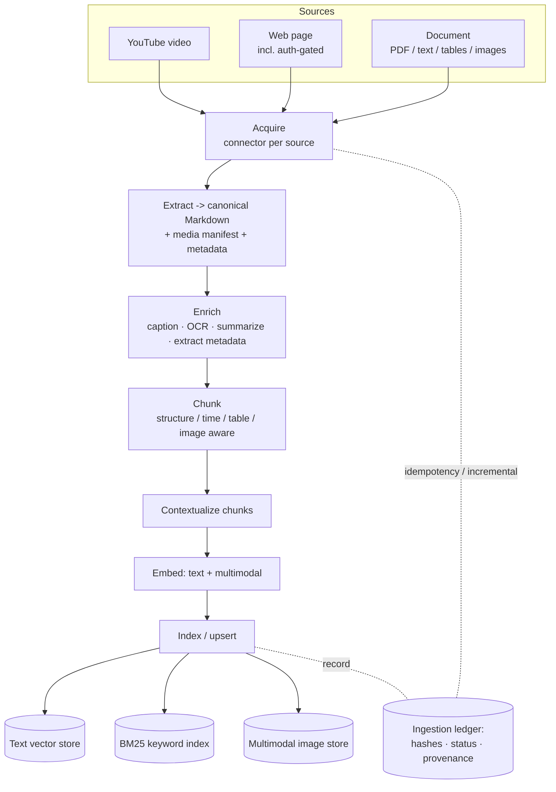
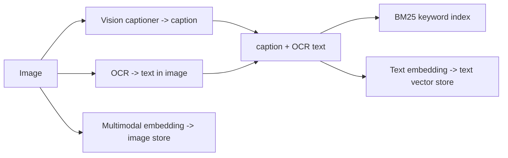

# RAG Ingestion Pipeline

> The producer side of the RAG system. It acquires content from heterogeneous sources —
> **YouTube videos, web pages (including auth-gated sites), and documents (PDF, text, tables,
> images)** — normalizes everything to **canonical Markdown + a media manifest + metadata**,
> then chunks, enriches, embeds, and indexes it into the **three stores the query system
> consumes**: a text-embedding vector store, a BM25 keyword index, and a multimodal image store.

This README is the conceptual entry point. Structural detail is in
[`ARCHITECTURE.md`](./ARCHITECTURE.md); the build plan is in
[`IMPLEMENTATION.md`](./IMPLEMENTATION.md); how we measure ingestion quality is in
[`EVALUATION.md`](./EVALUATION.md). This pipeline feeds the query-side system documented in the
parent folder, and shares its `Chunk` entity, metadata schema, and provenance model.

---

## 1. The problem this solves

Retrieval can only be as good as what was indexed. Ingestion is where most RAG quality is won or
lost, and it is hard precisely because the inputs are heterogeneous and messy:

- **Many source shapes, one index.** A YouTube transcript, a paywalled Substack essay, and a
  scanned PDF with nested tables must all end up as uniformly retrievable, citable units.
- **The hard parts are extraction, not storage.** Parsing tables without mangling them, pulling
  every image out of a PDF, transcribing a video with no captions, getting *clean* markdown from
  a JS-rendered page behind a login — this is where fidelity is lost silently.
- **Images are first-class.** An image is not noise to discard; it is content that must be made
  retrievable through *three* paths (keyword, semantic text, and visual).
- **Provenance must survive.** Every indexed chunk must trace back to an exact location (PDF
  page, video timestamp, document heading, URL) so the query system can cite it.
- **Re-ingestion is normal.** Sources change; ingestion must be idempotent and incremental, not
  a destructive full rebuild.

The design answer: **collapse all sources to one normalized representation as early as possible,
then run a single uniform downstream pipeline** — with every external capability (transcriber,
crawler, parser, captioner, embedder, index) behind an injectable port.

### Assumptions (stated up front)

- The three target stores already exist (this pipeline writes to them; the query system reads).
- The **embedders used here must be identical to the query-side embedders** (same model +
  version + pooling). This parity is an enforced invariant, not a convention — a mismatch
  silently destroys retrieval quality.
- Ingestion runs as an **offline / batch (or scheduled streaming) job**, separate from the live
  query service, sharing only the embedder ports and metadata schema.

---

## 2. Design principles

1. **Normalize early, process uniformly.** All sources converge on one `NormalizedDocument`
   (canonical Markdown + media manifest + metadata + provenance). Everything after that point is
   source-agnostic.
2. **Every source is a connector.** YouTube, web, and document acquisition each implement the
   same `SourceConnector` port. Adding a new source (Slack export, email, audio file) is "register
   one more connector," not a rewrite — the same keystone idea as `RetrieverTool` on the query side.
3. **Ports over implementations.** Transcriber, crawler, PDF-to-markdown converter, vision
   captioner, OCR, embedders, and index writers are all swappable adapters chosen at the
   composition root.
4. **Images are triple-indexed.** Each image yields (a) keyword text → BM25, (b) a text embedding
   of its caption/OCR → text vector store, (c) a multimodal embedding of the pixels → image store.
5. **Provenance is mandatory.** No chunk is indexed without a resolvable back-reference to its
   source location. Citations on the query side depend on it.
6. **Idempotent & incremental.** Content-hash–keyed upserts; only changed sources are reprocessed;
   re-running the pipeline never duplicates.
7. **Fail in isolation.** A source that fails at any stage is quarantined with its error; it does
   not abort the batch.

---

## 3. The mental model in one picture



In words: **acquire → normalize to Markdown → enrich → chunk → contextualize → embed → index**,
with a ledger threading idempotency and provenance through the whole run.

---

## 4. The three source types and their connectors

| Source | Acquire what | Key challenges | Produces |
|--------|--------------|----------------|----------|
| **YouTube** | Transcript (captions, else ASR) + video metadata + optional keyframes | No captions → ASR fallback; speaker turns; **timestamps** | Time-stamped Markdown transcript; thumbnails as images |
| **Web page** | Clean Markdown via Firecrawl | JS rendering; **auth-gated sites** (Medium, Substack, paywalls); crawl scope; rate limits; robots | Markdown body + page metadata + inline images |
| **Document (PDF-centric)** | Text, structure, **tables**, embedded **images** | Scanned/OCR; nested tables; reading order; figures | Markdown (tables as Markdown) + extracted images |

Each connector emits the *same* `NormalizedDocument`, after which the pipeline does not care
where the content came from. The interesting per-source work — transcript fallback logic,
authentication strategy, table/image extraction — is contained inside the connector and its
extractor, behind the port boundary.

### Note on auth-gated sites

Sites like Medium and Substack need authenticated fetches. The pipeline does **not** hard-code
credentials: a per-domain **auth strategy** (stored session cookies, headers, or a login action)
is resolved from a **secrets vault** and handed to the crawler. The system uses stored secrets;
it never improvises credentials. See [`ARCHITECTURE.md` §Acquisition](./ARCHITECTURE.md).

---

## 5. The canonical intermediate representation

The keystone entity. Everything downstream consumes this, nothing downstream knows the source:

```text
NormalizedDocument {
  markdown:   string            # canonical body; tables as Markdown; images as refs
  media:      MediaAsset[]      # each extracted image: bytes/URI + caption + OCR text
  metadata:   Metadata          # title, author, published_at, language, access_level, source_type...
  provenance: Provenance        # source id, connector, content_hash, fetched_at, structural anchors
  anchors:    Anchor[]          # headings (docs), page numbers (PDF), timestamps (video) -> for citation
}
```

This is the contract between "the messy world of sources" and "the clean uniform pipeline." Its
existence is what lets a new source type slot in with zero downstream changes.

---

## 6. How images become retrievable (the triple-index path)

For every image — whether from a PDF, a web page, or a video keyframe:



So an image is findable by keyword (its caption/OCR words), by semantic text query (embedding of
its description), and by visual/cross-modal query (its pixel embedding). The image chunk carries
its `image_ref` so the query system can render and cite the actual picture.

---

## 7. Metadata & provenance

Metadata is not decoration — the query system uses it for **filters** (date, source type,
author, language) and **access control** (per-document ACLs enforced at retrieval). Provenance
is what makes **citation** possible. The pipeline therefore guarantees, for every chunk:

- a stable `doc_id` and `chunk_id`,
- the source identity and a content hash,
- a structural anchor: heading path (docs), page number (PDF), or timestamp (video),
- an `access_level` / ACL tag,
- temporal fields (`published_at`, `fetched_at`) for recency filtering.

A chunk that cannot be traced back to a resolvable location is a defect, caught in evaluation.

---

## 8. Clean Architecture at a glance

```
  Infrastructure / Composition Root   wiring, config, orchestration, secrets, telemetry
    └── Adapters (implement ports)     Firecrawl, Whisper/captions, Docling/Marker,
          └── Application              VLM captioner, OCR, embedders, index writers, blob store
                (use cases + ports)    IngestDocumentUseCase; SourceConnectorPort, ExtractorPort,
                  └── Domain           ChunkerPort, EnricherPort, EmbedderPorts, IndexWriterPorts...
                       (entities)      NormalizedDocument, Chunk, MediaAsset, Provenance, Metadata
  Dependencies point INWARD only. The pipeline imports ports, never adapters.
```

The same dependency rule, ports, and composition-root pattern as the query-side system. The two
systems deliberately **share** the `Chunk` entity, the metadata schema, and the embedder ports —
that shared core is what guarantees index/query compatibility.

---

## 9. Configuration philosophy

One declarative config selects adapters and tunes policy; no code change to retarget:

```yaml
sources:
  youtube:  { transcript: captions_then_asr, asr: { provider: whisper }, keyframes: true }
  web:      { provider: firecrawl, mode: crawl, respect_robots: true,
              auth: { medium: cookie_vault, substack: cookie_vault } }
  document: { converter: docling, ocr: { provider: tesseract }, extract_images: true }
enrich:
  captioner: { provider: vlm-claude }          # or gpt-4o | local-llava
  contextualize: true                          # prepend section context to each chunk
embedder:
  text:       { provider: bge, model: bge-large-en }     # MUST match query side
  multimodal: { provider: jina, model: jina-clip-v2 }    # MUST match query side
chunking:    { strategy: structural, max_tokens: 512, overlap: 64 }
index:
  vector_text:  { provider: qdrant, collection: docs }
  vector_image: { provider: qdrant, collection: imgs }
  keyword:      { provider: opensearch, index: docs }
pipeline:
  mode: batch                                  # batch | streaming
  idempotency: content_hash
  on_failure: quarantine
```

---

## 10. Idempotency & incremental ingestion

Re-running ingestion is safe and cheap. The **ingestion ledger** records, per source and per
chunk, a content hash and status. On re-run: unchanged sources are skipped; changed sources are
reprocessed and their old chunks superseded (upsert by deterministic id); removed sources have
their chunks retired. Near-duplicate content across sources (the same article mirrored on two
sites) is collapsed by a dedup step so the index isn't polluted.

---

## 11. Extending the system

- **New source type** → implement `SourceConnector` (+ an `Extractor`), register it.
- **New parser / transcriber / captioner / OCR / embedder / index** → write an adapter, point
  config at it.
- **New enrichment** → implement `EnricherPort`, add it to the enrichment chain.
- **New chunking strategy** → implement `ChunkerPort`.

---

## 12. Document map

| Document | Audience | Depth |
|----------|----------|-------|
| **README.md** (this) | Anyone landing on the ingestion repo | Conceptual overview |
| [**ARCHITECTURE.md**](./ARCHITECTURE.md) | Engineers building it | Detailed pipeline, ports, stages, alternatives |
| [**IMPLEMENTATION.md**](./IMPLEMENTATION.md) | Implementers planning the build | High-level stack, phases, layout |
| [**EVALUATION.md**](./EVALUATION.md) | Anyone validating ingestion quality | Detailed golden-set harness for ingestion |

---

## 13. Glossary

- **NormalizedDocument** — the canonical Markdown + media + metadata + provenance intermediate
  every source converges on.
- **Triple-indexing** — representing an image in BM25, the text vector store, and the multimodal
  store simultaneously.
- **Contextual retrieval** — prepending a short doc/section context to a chunk before embedding,
  to make it self-explanatory.
- **Provenance / anchor** — the resolvable back-reference (page / timestamp / heading) enabling
  citation.
- **Ingestion ledger** — the record of what's been ingested (hashes, status) enabling idempotent,
  incremental runs.
- **Parity invariant** — ingestion-time embedders must equal query-time embedders.
- **Port / Adapter / Composition Root** — Clean-Architecture interface / implementation / wiring point.
