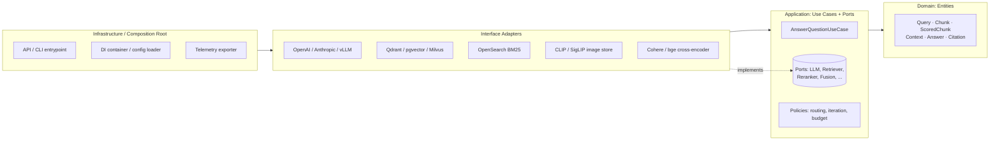
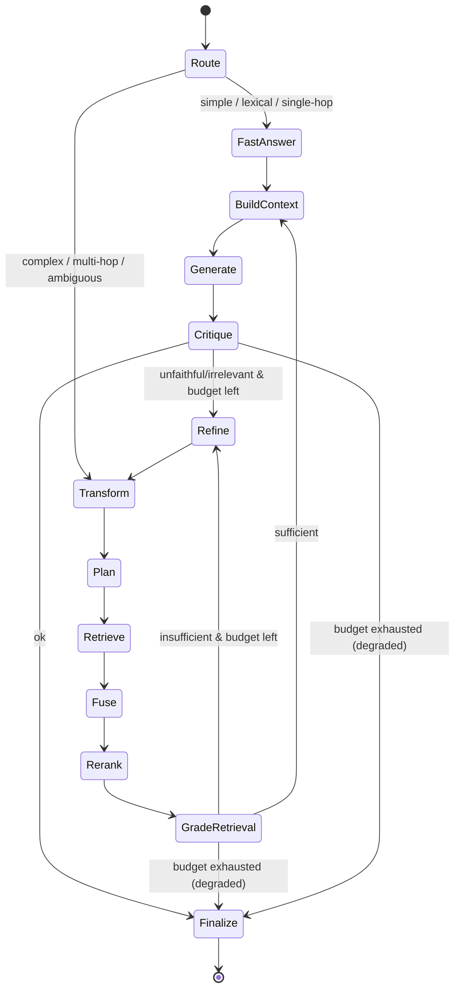
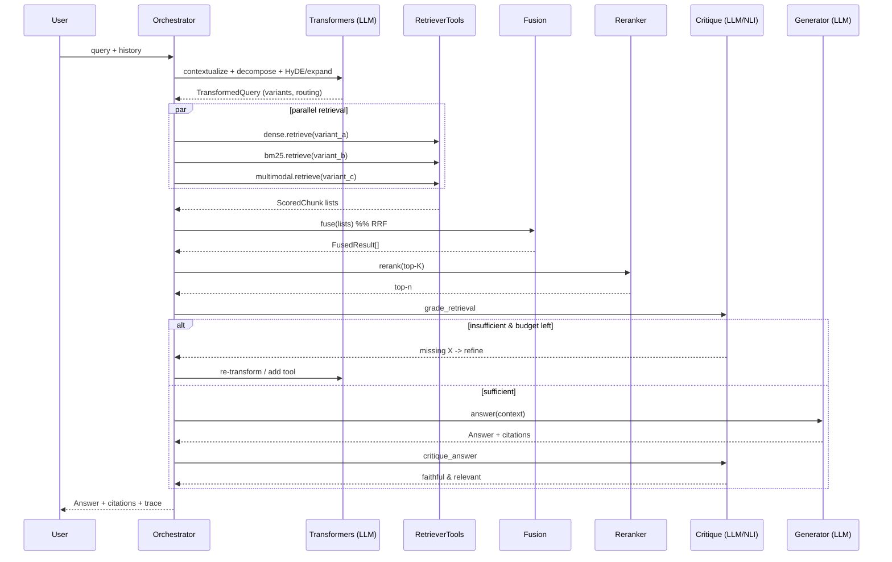

# Architecture

This document specifies the conceptual structure of the agentic RAG system in enough detail
to begin implementation without re-deciding anything fundamental. It is organized as:

1. Layered architecture & the dependency rule
2. The domain model (entities & value objects)
3. The port catalog (interfaces to inject) — each with a signature sketch and alternatives
4. The agent runtime (control flow / state machine)
5. Subsystems: query transformation, retrieval, fusion, reranking, context building, generation, reflection
6. Cross-cutting concerns
7. End-to-end sequence walkthroughs
8. Consolidated alternatives & trade-offs

Pseudocode is intentionally language-neutral and typed. Treat type names as port/entity names,
not as a commitment to any language. See [`IMPLEMENTATION.md`](./IMPLEMENTATION.md) for stack choices.

---

## 1. Layered architecture & the dependency rule

Four concentric layers. **Source dependencies point inward only.** Inner layers know nothing
about outer layers; outer layers depend on inner abstractions.



- **Domain** — pure data and rules. No I/O, no framework, no model SDKs. Stable.
- **Application** — use cases (orchestration) + **ports** (the interfaces outer layers must
  satisfy) + **policies** (routing, stopping, budget). This is where the *agent* lives.
- **Adapters** — translate between the outside world and ports (LLM SDKs, DB clients,
  reranker APIs). Each adapter implements one or more ports.
- **Infrastructure / Composition Root** — the only place that knows concrete types; it reads
  config, builds adapters, and injects them into use cases. Also hosts the API/CLI and telemetry export.

**Why this matters here:** the agent's reasoning loop is the valuable, hard-to-get-right code.
Isolating it from vendor SDKs means you can re-target models and databases, run the core under
test with fakes, and reason about behavior independent of infrastructure churn.

---

## 2. Domain model

Pure entities and value objects. No dependencies. The **shared types** — `Chunk`, `Metadata`,
`Provenance`, `Anchor`, `TextSpan`, `Modality`, `Embedding` — are defined once in the canonical
contract, [`../shared/DATA_MODEL.md`](../shared/DATA_MODEL.md), and imported (not re-declared here);
`Chunk` carries a typed `Metadata` and an `Anchor`, which is what lets citation reason about *where* a
result came from. The types below are the **retrieval-only** entities; they reference the shared types.

```text
# Shared types (canonical defs in ../shared/DATA_MODEL.md):
#   Chunk, Metadata, Provenance, Anchor, TextSpan, Modality, Embedding

# Retrieval-only value objects
RetrieverId        = enum/string  # "dense_text" | "bm25" | "multimodal" | ...
Score              = float        # retriever-local, not comparable across retrievers
MetadataFilter     = structured predicate (field, op, value)   # over Metadata fields

# Core entities
Query {
  raw_text: string
  conversation: Message[]         # prior turns, for contextualization
  filters: MetadataFilter[]       # may be empty; filled by self-query
}

TransformedQuery {
  parent: Query
  variants: QueryVariant[]        # one per technique/sub-query
}
QueryVariant {
  text: string
  intent_tags: string[]           # "lexical" | "semantic" | "visual" | ...
  target_retrievers: RetrieverId[]# planner's routing hint
  hyde_passage: string?           # optional, for dense search
  filters: MetadataFilter[]
}

ScoredChunk {                     # a retrieval candidate WITH provenance
  chunk: Chunk
  retriever: RetrieverId
  raw_score: Score
  rank: int                       # position in that retriever's list
}

FusedResult  { chunk: Chunk; fused_score: float; sources: RetrieverId[] }
RerankedResult { chunk: Chunk; rerank_score: float }

ContextBlock { chunk: Chunk; cite_id: int }   # numbered for citation
Context      { blocks: ContextBlock[]; token_count: int }

Citation { cite_id: int; doc_id: string; chunk_id: string; span: TextSpan? }
           # coarse location is the cited chunk's shared Anchor (page/timestamp/heading);
           # span optionally narrows to a sub-range within the chunk (shared TextSpan)
Answer   { text: string; citations: Citation[]; confidence: float? }

# Verdicts produced by grading/critique
RetrievalGrade { sufficient: bool; reason: string; missing: string[] }
AnswerCritique { faithful: bool; relevant: bool; issues: string[] }

# The full run record (for observability & eval)
QueryTrace { steps: TraceStep[]; tokens: int; latency_ms: int; tool_calls: int }
```

Design notes:

- `ScoredChunk.raw_score` is explicitly **not** comparable across retrievers (BM25 scores and
  cosine similarities live on different scales). Fusion either ignores scores (RRF, uses
  `rank`) or normalizes them — see §5.3.
- Images are represented as `Chunk(modality=IMAGE)` carrying a caption/OCR text *and* an
  `image_ref`. This lets a text generator cite an image by its caption while the UI can render
  the actual image.
- `cite_id` is assigned at context-build time so the generator references stable small integers.

---

## 3. Port catalog

Each port is a narrow interface in the Application layer. Adapters implement them. For each
port: responsibility, signature sketch, and realistic alternatives.

### 3.1 `LLMPort`
**Responsibility:** text generation and structured/JSON generation. Everything LLM-shaped
(rewriting, planning, grading, answering) goes through this one port.

```text
interface LLMPort {
  generate(prompt, opts) -> string
  generate_structured(prompt, schema, opts) -> object   # JSON-mode / function-call
  stream(prompt, opts) -> stream<token>                 # for final answer
}
```
**Alternatives:** OpenAI · Anthropic · local via vLLM/Ollama/TGI · Bedrock.
**Trade-offs:** hosted = best quality, per-token cost, data leaves premises; local = control &
privacy, ops burden, usually lower ceiling. Keep planning/grading on a cheaper model and the
final answer on a stronger one (see `LLMRouter` policy in §4).

### 3.2 `TextEmbedderPort` and `MultimodalEmbedderPort`
**Responsibility:** turn text (and text-or-image) into vectors. Split into two ports because
multimodal needs an image input path and a shared space.

```text
interface TextEmbedderPort        { embed_text(string[]) -> Embedding[] }
interface MultimodalEmbedderPort  { embed_text(string[]) -> Embedding[]
                                    embed_image(URI[])    -> Embedding[] }   # shared space
```
**Alternatives:** text — OpenAI text-embeddings · BGE · E5 · GTE · Jina. multimodal — CLIP ·
OpenCLIP · SigLIP · Jina-CLIP · Cohere multimodal.
**Trade-off / hazard:** the query-time embedder **must** match the ingestion-time embedder
exactly (same model + version + pooling). Enforce this at the composition root via config that
ingestion and query share.

### 3.3 `VectorSearchPort` (dense) and `KeywordSearchPort` (BM25)
**Responsibility:** the two raw retrieval primitives. Multimodal search reuses
`VectorSearchPort` against the image collection.

```text
interface VectorSearchPort {
  search(vector: Embedding, k: int, filters) -> ScoredChunk[]
  collections() -> string[]          # text vs image collections live here
}
interface KeywordSearchPort {
  search(query_text: string, k: int, filters) -> ScoredChunk[]
}
```
**Alternatives:** vector — Qdrant · Weaviate · Milvus · pgvector · FAISS (embedded) ·
Pinecone. keyword — OpenSearch/Elasticsearch · Lucene · Tantivy · `rank_bm25` (in-proc).
**Trade-offs:** managed vector DBs (filters, scale, hybrid built in) vs. pgvector (one fewer
system if you already run Postgres) vs. FAISS (fastest single-node, no metadata filtering).
Some stores (Qdrant, Weaviate, OpenSearch) offer *native hybrid* dense+sparse — see §5.2 for
why we still keep them as separate ports.

### 3.4 `RetrieverTool` (the unifying abstraction)
**Responsibility:** wrap a retrieval primitive into a uniform, agent-callable tool. This is the
keystone of the design: dense, BM25, and multimodal all look identical to the agent.

```text
interface RetrieverTool {
  id: RetrieverId
  describe() -> ToolSpec            # name, when-to-use, input schema (for the planner/LLM)
  retrieve(variant: QueryVariant, k: int) -> ScoredChunk[]
}
```
Concrete tools compose lower ports:
- `DenseTextRetriever` = `TextEmbedderPort` + `VectorSearchPort(text_collection)`
- `Bm25Retriever`      = `KeywordSearchPort`
- `MultimodalRetriever`= `MultimodalEmbedderPort` + `VectorSearchPort(image_collection)`

A `ToolRegistry` holds all tools and exposes their `ToolSpec`s to the planner.
**Why a tool, not just a function:** it lets the planner reason in natural language about which
to use, lets you register new modalities without touching the agent, and gives a uniform place
for per-tool concurrency, caching, and error handling.

### 3.5 `QueryTransformerPort`
**Responsibility:** produce a `TransformedQuery` (variants) from a `Query`. Implementations are
composable (a chain).

```text
interface QueryTransformerPort { transform(Query, ctx) -> TransformedQuery }
```
**Implementations:** `Contextualizer`, `Expander`, `HyDEGenerator`, `Decomposer`,
`StepBack`, `MultiQuery`, `SelfQueryFilterExtractor`, `ModalityRouter`. Most call `LLMPort`.
**Alternatives:** LLM-based (flexible, costs tokens) vs. rule/lexicon-based expansion (cheap,
deterministic, e.g., synonym tables for BM25). The fast path may use only the cheap ones.

### 3.6 `FusionPort`
**Responsibility:** merge several per-retriever ranked lists into one.

```text
interface FusionPort { fuse(lists: ScoredChunk[][], opts) -> FusedResult[] }
```
**Alternatives:** RRF (default; rank-based, robust, no normalization) · weighted score fusion
(needs min-max/z-score normalization; tunable per-retriever weights) · relative-score fusion ·
learned fusion. See §5.3.

### 3.7 `RerankerPort`
**Responsibility:** re-score a candidate set jointly against the query.

```text
interface RerankerPort { rerank(query_text, candidates: Chunk[], top_n) -> RerankedResult[] }
```
**Alternatives:** cross-encoder API (Cohere Rerank) · local cross-encoder (bge-reranker,
mxbai-rerank) · ColBERT late-interaction · LLM listwise reranking · *no reranker* (skip on fast
path). Cross-encoders are accurate but quadratic-ish in length, so they run only on top-K
(e.g., 50→8). See §5.4.

### 3.8 `ContextBuilderPort`
**Responsibility:** turn reranked chunks into a token-budgeted, ordered, de-duplicated,
optionally compressed `Context` with citation ids.

```text
interface ContextBuilderPort { build(RerankedResult[], budget) -> Context }
```
**Sub-strategies (each its own small port if you want them swappable):** dedupe, MMR for
diversity, compression (extractive or LLMLingua-style), ordering (lost-in-the-middle aware).

### 3.9 `AnswerGeneratorPort`
**Responsibility:** produce a grounded `Answer` with citations from a `Context` and the query.
Usually a thin policy over `LLMPort` with a citation-enforcing prompt and structured output.

```text
interface AnswerGeneratorPort { answer(Query, Context) -> Answer }
```

### 3.10 `CritiquePort` (grading & reflection)
**Responsibility:** the quality gates. Two kinds of judgment:

```text
interface CritiquePort {
  grade_retrieval(Query, candidates) -> RetrievalGrade   # sufficient? what's missing?
  critique_answer(Query, Context, Answer) -> AnswerCritique  # faithful? relevant?
}
```
**Alternatives:** LLM-as-judge (flexible) · NLI model for faithfulness (cheaper, focused) ·
heuristic (score thresholds, citation coverage). See §5.6.

### 3.11 Cross-cutting ports
```text
interface CachePort     { get(key)->value?; set(key,value,ttl) }
interface TelemetryPort { record(event); start_span(name)->span }
interface ClockPort     { now() }          # determinism in tests
```

### Port → adapter summary

| Port | Default adapter | Notable alternatives |
|------|-----------------|----------------------|
| LLMPort | OpenAI | Anthropic, vLLM/Ollama (local), Bedrock |
| TextEmbedderPort | BGE-large | OpenAI, E5, Jina, GTE |
| MultimodalEmbedderPort | Jina-CLIP | OpenCLIP, SigLIP, Cohere multimodal |
| VectorSearchPort | Qdrant | Weaviate, Milvus, pgvector, FAISS |
| KeywordSearchPort | OpenSearch | Elasticsearch, Tantivy, rank_bm25 |
| RerankerPort | Cohere Rerank | bge-reranker (local), ColBERT, LLM listwise |
| FusionPort | RRF | weighted, relative-score, learned |
| CritiquePort | LLM-as-judge | NLI faithfulness, heuristics |

---

## 4. The agent runtime (control flow)

The agent is a **bounded state machine** driven by policies, *not* an open-ended autonomous
loop. Bounding it (max iterations, token/tool/latency budgets) is what makes an agentic system
production-safe.



### 4.1 Router policy
Classifies the query to pick a path and an initial tool mix. Signals: query length, presence of
exact identifiers/quotes (→ BM25), question complexity / multi-hop markers (→ decompose),
visual intent (→ multimodal), conversational coreference (→ contextualize first).
**Alternatives:** LLM classifier (one cheap call, flexible) · embedding-similarity to labeled
exemplars (no LLM call) · rules/regex (fastest, brittle). *Adaptive RAG* = this router.

### 4.2 Iteration / stopping policy
Decides whether to refine after a poor grade or critique. Inputs: `RetrievalGrade`/`AnswerCritique`,
iterations so far, remaining budget. Refinement actions it can choose:
- broaden `k` or relax filters,
- add a retriever (e.g., bring in BM25 if dense was thin),
- re-transform with a different technique (e.g., decompose further, step-back),
- escalate (e.g., a web/fallback tool, if registered) — the **Corrective-RAG** move.

### 4.3 Budget policy
Hard ceilings on tokens, tool calls, latency, and iterations. When exhausted, the machine goes
to `Finalize` in a **degraded but honest** mode (answer with caveat, or "insufficient evidence")
rather than looping. This is the single most important guardrail.

### 4.4 LLM routing within the agent
A small policy maps *task → model*: cheap/fast model for rewriting/grading/planning, strong
model for the final answer. Implemented as two `LLMPort` instances injected under named roles
(`llm.utility`, `llm.answer`).

### Orchestrator pseudocode

```text
function answer(query):
  trace.start()
  plan = router.route(query)                       # path + initial tools + techniques
  if plan.path == FAST:
      cands = run_tools(plan.tools, transform_minimal(query))
      ctx   = context_builder.build(rerank(cands), budget)
      ans   = generator.answer(query, ctx)
      return finalize(ans, trace)

  for i in 0 .. budget.max_iterations:
      tq        = transformer_chain.transform(query, plan)      # rewrite/HyDE/decompose...
      plan.tools= planner.select_tools(tq, registry.specs())    # route per variant
      raw       = run_tools_parallel(plan.tools, tq)            # dense/bm25/multimodal
      fused     = fusion.fuse(group_by_retriever(raw))
      ranked    = reranker.rerank(query.raw_text, top(fused, K), top_n)
      grade     = critique.grade_retrieval(query, ranked)
      if grade.sufficient or budget.exhausted(): break
      plan = iteration_policy.refine(plan, grade)               # broaden / add tool / re-transform

  ctx  = context_builder.build(ranked, budget)
  ans  = generator.answer(query, ctx)
  crit = critique.critique_answer(query, ctx, ans)
  if not (crit.faithful and crit.relevant) and budget.left():
      plan = iteration_policy.refine(plan, crit); goto retrieve   # one corrective pass
  return finalize(ans, trace)
```

---

## 5. Subsystems in detail

### 5.1 Query transformation
A **chain** of `QueryTransformerPort`s selected by the router. Order matters: contextualize
first (so later steps see a standalone query), then decompose, then per-variant techniques
(HyDE for dense variants, expansion for BM25 variants), then self-query filter extraction.
Output is a `TransformedQuery` whose variants carry `target_retrievers` so the planner can route.
**Conceptual rule:** *shape the query to the tool.* The same intent becomes a hypothetical
passage for dense search, an expanded keyword set for BM25, and a visual description for multimodal.

### 5.2 Retrieval
Tools run **in parallel** (independent I/O). Each returns `ScoredChunk[]` with `rank`. We keep
dense and BM25 as *separate ports* even when a store offers native hybrid, because: (a) the
agent may want them weighted differently per query, (b) fusion is then explicit and testable,
(c) you can mix vendors (Qdrant for dense, OpenSearch for BM25). Native hybrid remains available
as an *optimization adapter* that implements two ports at once if you choose it.

### 5.3 Fusion
Default **RRF**: `score(d) = Σ_retriever 1 / (k + rank_retriever(d))`, `k≈60`. Rank-based, so it
needs no score normalization and is robust to wildly different score scales — ideal for
dense+BM25+multimodal.
**Weighted score fusion** is the alternative when you have tuned per-retriever trust: normalize
each list (min-max or z-score), then `Σ w_i · norm_score_i`. More powerful, more fragile, needs
calibration. Make it swappable via `FusionPort` so you can A/B them.

### 5.4 Reranking
Applied to the **top-K fused candidates only** (e.g., K=50 → top_n=8). A cross-encoder reads
(query, chunk) jointly and is far more discriminating than the bi-encoder/BM25 first stage. This
"retrieve wide, rerank narrow" pattern is the highest-ROI quality lever in most RAG systems.
For image chunks, rerank on the caption/OCR text (or use a multimodal reranker if registered).
**Alternatives & when to skip:** drop reranking on the fast path or under tight latency budgets;
use ColBERT late-interaction if you want reranking quality closer to first-stage cost.

### 5.5 Context building
Steps: **dedupe** (same chunk surfaced by multiple retrievers) → **diversify** (MMR, to avoid
five near-identical passages) → **compress** (optional: extract only query-relevant sentences,
or LLMLingua-style token pruning) → **order** (place strongest evidence at the head and tail to
counter "lost in the middle") → **number** (assign `cite_id`) → **fit budget** (drop weakest
until under token cap). Output `Context` is the only thing the generator sees.

### 5.6 Generation
`AnswerGeneratorPort` prompts `llm.answer` with: the (possibly decomposed) question, the numbered
context, and explicit instructions to *answer only from context* and *cite `cite_id`s*. Use
structured output to return `{text, citations[]}` so citations are machine-checkable. Stream the
text for UX. If decomposition was used, generate per sub-answer then synthesize.

### 5.7 Reflection / corrective loop
Two gates via `CritiquePort`:
- **Retrieval grade** (before generating): is the evidence sufficient? what's missing? → drives
  refinement (Corrective-RAG / Self-RAG style).
- **Answer critique** (after generating): is every claim grounded in a cited block; does it
  answer the question? → at most one corrective re-retrieval, then finalize honestly.
Both are bounded by the budget policy. Faithfulness can use LLM-as-judge or a cheaper NLI model
that checks entailment of each sentence against its cited blocks.

---

## 6. Cross-cutting concerns

- **Caching (`CachePort`).** Cache embeddings (by text hash + model id), retrieval results (by
  variant + filters + k), rerank scores, and LLM transformation outputs. Massive cost/latency win.
- **Concurrency.** Tools and query variants fan out concurrently; gather with a deadline tied to
  the latency budget. Slow/failed tools degrade gracefully (partial results, logged).
- **Error handling & fallbacks.** Each adapter wraps vendor errors into domain errors with a
  retry/backoff policy. If a retriever is down, the agent continues with the rest and notes the
  gap in the trace; if the answer LLM fails, fall back to the utility LLM.
- **Determinism for tests.** `ClockPort`, fixed seeds, and fake adapters let the entire agent run
  offline and reproducibly.
- **Observability (`TelemetryPort`).** Every step emits a span with inputs/outputs hashes,
  scores, latency, and token counts, assembled into a `QueryTrace`. This *is* the eval dataset.
- **Security/privacy.** Metadata filters can enforce per-user document ACLs at retrieval time
  (push filters into the stores, never filter after generation). PII redaction is a context-build
  sub-step. Local LLM/embedder adapters exist for data-residency requirements.

---

## 7. End-to-end sequence walkthroughs

### 7.1 Deliberate path (complex, multi-hop)



### 7.2 Fast path (exact lookup)
`Route → BM25.retrieve → (optional rerank) → build context → answer → return.` One LLM call (the
answer), sub-second target. No transformation chain, no grading loop.

---

## 8. Consolidated alternatives & trade-offs

| Decision | Options | Default & why |
|----------|---------|---------------|
| Control style | Static pipeline · ReAct agent · Plan-and-execute · Adaptive (router) | **Adaptive**: cheap path for easy queries, agent for hard ones |
| Hybrid combination | Native DB hybrid · explicit fusion of separate ports | **Explicit fusion**: vendor-independent, per-query weighting, testable |
| Fusion algorithm | RRF · weighted · relative-score · learned | **RRF**: robust, no calibration |
| Reranking | none · cross-encoder · ColBERT · LLM listwise | **Cross-encoder on top-K**: best quality/cost ratio |
| Query improvement | rules · LLM rewrite/HyDE/decompose · both | **Both, router-selected**: cheap default, LLM when it pays off |
| Correction | none · CRAG · Self-RAG | **Bounded CRAG-style**: grade + at most N refinements |
| Faithfulness check | LLM-judge · NLI · heuristic | **LLM-judge default, NLI for scale** |
| Context compression | none · extractive · LLMLingua | **Off by default, enable under token pressure** |
| LLM placement | one model · role-routed | **Role-routed**: utility model cheap, answer model strong |
| Vector store | Qdrant · pgvector · Milvus · FAISS · Weaviate | Pick per ops reality; **all behind `VectorSearchPort`** |

The architectural payoff: every row above is a config/adapter choice, not a code rewrite,
because the agent depends only on the ports in §3.
