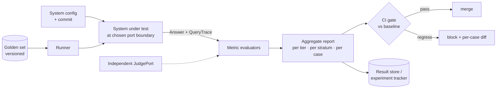
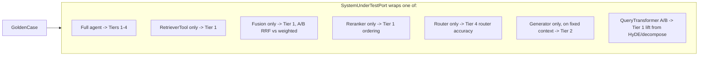
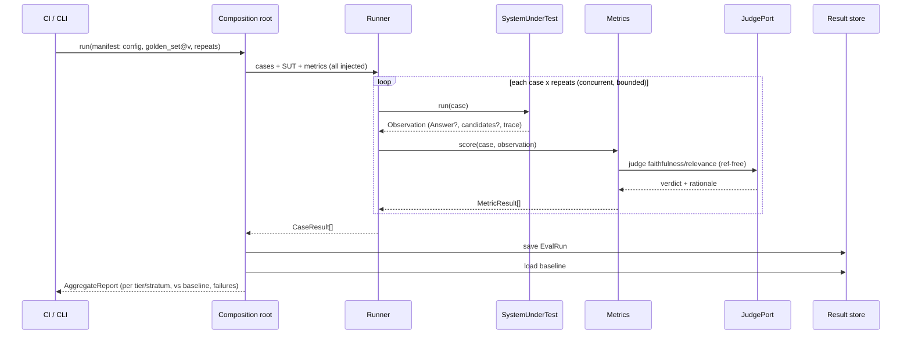

# Evaluation: The Golden-Set Harness

This document specifies the evaluation harness for the agentic RAG system at the same
conceptual level as [`ARCHITECTURE.md`](./ARCHITECTURE.md): conceptual first, but structured so
it maps 1:1 onto code. It reuses that system's vocabulary — ports, the composition root, the
three-tier eval split (retrieval / generation / system), `QueryTrace`, `RetrieverTool`,
`CritiquePort` — and adds the agentic-specific layer that ordinary RAG eval omits.

Organization:

1. Why agentic-RAG eval is different
2. Principles
3. One-picture overview
4. The golden set (the dataset)
5. Metric taxonomy (four tiers + the reference axis)
6. The harness as Clean Architecture (ports & entities)
7. The key payoff: evaluate at any port boundary
8. Run lifecycle
9. Trustworthy measurement (non-determinism & judge reliability)
10. CI / regression gates
11. Experiment tracking & A/B
12. Consolidated alternatives & trade-offs
13. Build order

---

## 1. Why agentic-RAG eval is different

Vanilla RAG eval asks "given retrieved context, is the answer good?" An *agentic* system adds
moving parts that each fail independently and that a single end-to-end score cannot diagnose:

- The **router** picks a path and a tool mix — it can be wrong before any retrieval happens.
- **Query transformers** (HyDE, decompose, expand) can help *or hurt* retrieval.
- **Fusion** and **reranking** reorder candidates — each is a separate quality lever.
- The **correction loop** may fail to trigger when retrieval is weak, or loop wastefully when it
  isn't.
- The system may **hallucinate instead of abstaining** on out-of-corpus questions.
- Cost and latency are **variable per query** (iterations, tool calls), not fixed.

So the harness must (a) score the *whole* system, (b) **attribute** failures to components, and
(c) judge the *trajectory* (the decisions), not just the final text.

---

## 2. Principles

1. **Attribution over a single number.** Every run produces per-tier, per-stratum, per-case
   scores so a regression points at a component, not just "quality went down."
2. **Evaluate at port boundaries.** Because the system is all ports, the harness can target any
   one of them — retriever alone, reranker alone, or the full agent — with the same machinery.
3. **The trace is the evidence.** Tier-3/4 metrics are computed from the `QueryTrace` the system
   already emits; the harness adds no instrumentation to the system under test.
4. **The judge is independent.** LLM-as-judge uses a *different* (ideally stronger) model than
   the system, behind its own `JudgePort`, and is itself calibrated against human labels.
5. **Measure uncertainty.** LLM steps are stochastic; report means with confidence intervals
   over repeated runs, never a lone point estimate.
6. **The golden set is a versioned asset.** It is curated, stratified, governed, and pinned to a
   version id recorded in every run.

---

## 3. One-picture overview



---

## 4. The golden set (the dataset)

### 4.1 Anatomy of a `GoldenCase`

A case carries everything any metric might need, plus the *expected agentic behavior*.

```text
GoldenCase {
  id: string
  version_added: string

  # Input
  query: string
  conversation: Message[]            # for contextualization cases

  # Retrieval ground truth (Tier 1)
  relevant_chunk_ids: {id, grade}[]  # graded relevance for nDCG
  required_filters: MetadataFilter[] # for self-query cases

  # Generation ground truth (Tier 2)
  reference_answer: string?          # gold answer; null for unanswerable cases
  must_include: string[]             # key facts the answer must contain
  must_not_include: string[]         # forbidden claims (e.g., known distractors)
  expected_citations: chunk_id[]
  answerable: bool                   # false => correct behavior is abstention

  # Agentic ground truth (Tier 4)
  stratum: enum                      # lexical | semantic | multihop | visual | unanswerable | adversarial
  expected_path: enum?               # fast | deliberate     (router target)
  expected_tools: RetrieverId[]?     # tool-selection target
  expects_correction: bool?          # weak first-pass that grading should catch

  # Bookkeeping
  source: enum                       # manual | synthetic | production-mined
  difficulty: enum                   # easy | medium | hard
}
```

The crucial, often-missing fields: `answerable=false` cases (the correct output is "I don't
have enough evidence"), and the Tier-4 targets that let us score *decisions*, not just outputs.

### 4.2 Stratification (coverage)

The set is balanced across strata so each capability has signal. Minimum strata:

| Stratum | Probes | Example |
|---------|--------|---------|
| lexical | BM25 path, exact identifiers | "clause 7.3.1", "error E-4012" |
| semantic | dense retrieval, paraphrase | "trade-offs of approach X" |
| multi-hop | decomposition, multi-pass | "compare the two designs the report proposes" |
| visual | multimodal tool, image citation | "show the pipeline diagram" |
| unanswerable | abstention, no hallucination | question whose answer isn't in corpus |
| adversarial | robustness, prompt-injection in docs | leading/ambiguous queries |
| conversational | contextualization | "does *it* support *that*?" after prior turns |

Report metrics **per stratum** — a global average hides that, say, multimodal recall collapsed.

### 4.3 How to build it (alternatives)

| Source | Strength | Weakness | Use for |
|--------|----------|----------|---------|
| **Manual curation** | highest quality, true edge cases | slow, small | the hard/adversarial/unanswerable core |
| **LLM-synthetic** (generate Q + reference from chunks) | scalable, cheap | leakage, easy bias, needs filtering | bulk semantic/lexical coverage |
| **Production-mined** (real queries + mined traces, human-labeled) | realistic distribution | labeling cost, privacy | distribution realism, regression catch |

Recommended: a **hybrid** — a small hand-built hard core, bulked out by filtered synthetic
cases, refreshed periodically from production logs. Synthetic generation should itself be
adapter-pluggable (a `CaseGeneratorPort`) and every synthetic case should pass a human or
judge spot-check before entering the set.

### 4.4 Versioning & governance

The golden set is code-reviewed and **versioned** (`golden_set@v3`). Every run records the
version id. Changing the set is a deliberate, reviewed act (you cannot compare runs across
incompatible set versions). Track per-case provenance so a flaky/ambiguous case can be retired.

---

## 5. Metric taxonomy

Two orthogonal axes. **The tier** (which component) and **the reference axis** (does the metric
need a gold answer).

- **Reference-based** metrics compare to `reference_answer` / `relevant_chunk_ids`
  (objective, but needs labels).
- **Reference-free** metrics judge internal consistency — answer vs. retrieved context, answer
  vs. query (no labels needed, but rely on a judge).

Each metric is an injectable `MetricPort` (Section 6), so the suite is configurable.

### Tier 1 — Retrieval (needs `relevant_chunk_ids`)

| Metric | Question it answers |
|--------|--------------------|
| Recall@k | Did we retrieve the relevant chunks at all? |
| Precision@k | How much of what we retrieved is relevant? |
| MRR | How high is the first relevant chunk? |
| nDCG@k | Are graded-relevant chunks ranked well? |
| Context recall | Does the final context contain what's needed to answer? |
| Context precision | Is the final context free of noise? |

Tier 1 is where fusion (RRF vs weighted) and reranking improvements show up.

### Tier 2 — Generation

| Metric | Ref? | Question |
|--------|------|----------|
| Faithfulness / groundedness | free | Is every claim supported by the cited context? |
| Answer relevance | free | Does the answer actually address the query? |
| Answer correctness | based | Does it match the reference (`must_include`/`must_not_include` + semantic similarity)? |
| Citation precision | based | Do cited chunks actually support their claims? |
| Citation recall | based | Do all claims that need a citation have one? |
| **Abstention correctness** | based | On `answerable=false` cases, did it abstain instead of hallucinate? |

Faithfulness is computed by decomposing the answer into atomic claims and checking each is
entailed by its cited blocks — via the `JudgePort` (LLM-judge) or a cheaper NLI model.

### Tier 3 — System (from `QueryTrace`)

End-to-end latency, token cost (and $ cost), tool-call count, iteration count, cache hit-rate,
path taken. These gate production viability and are tracked for cost regressions.

### Tier 4 — Agentic / trajectory (the differentiator)

| Metric | Question | Ground truth |
|--------|----------|--------------|
| Router accuracy | fast vs. deliberate chosen correctly? | `expected_path` |
| Tool-selection F1 | right retrievers engaged? | `expected_tools` |
| Correction efficacy | when first-pass was weak, did grading catch it *and* did refinement fix it? | `expects_correction` + before/after Tier-1 |
| Efficiency (quality-per-cost) | quality achieved per token / per iteration | Tier-2 ÷ Tier-3 |
| Loop discipline | did it stop at the right time (no needless iterations, no premature stop)? | iterations vs. grade outcomes |

Tier 4 reads the decision steps in the `QueryTrace`; it does not require new instrumentation.

---

## 6. The harness as Clean Architecture

The harness obeys the same dependency rule as the system: a pure domain, an application core of
use cases + ports, and adapters chosen at a composition root.

```mermaid
flowchart TB
    subgraph Infra[Composition root]
        CFG[eval config + run manifest] --> CONT[container]
    end
    subgraph App[Application]
        EUC[RunEvaluationUseCase] --> EP[(Ports)]
    end
    subgraph Dom[Domain]
        GE[GoldenCase · CaseResult<br/>MetricResult · AggregateReport]
    end
    subgraph Ad[Adapters]
        D1[Dataset: file / DB / HF]
        D2[SUT: full agent | single port]
        D3[Metrics: ragas-style | NLI | lexical]
        D4[Judge: strong LLM | human-in-loop]
        D5[Store: tracker | flat files]
    end
    CONT --> Ad
    Ad -. implements .-> EP
    App --> Dom
```

### 6.1 Ports

```text
interface DatasetPort        { load(version) -> GoldenCase[];  strata() -> map }
interface SystemUnderTestPort{ run(GoldenCase) -> Observation } # Observation = {Answer?, candidates?, QueryTrace}
interface MetricPort         { id; tier; needs_reference: bool
                               score(GoldenCase, Observation, judge?) -> MetricResult }
interface JudgePort          { judge(rubric, inputs) -> verdict+rationale } # independent model
interface ResultStorePort    { save(EvalRun); load(run_id) -> EvalRun;  baseline(suite) -> EvalRun }
interface RunnerPort         { run_all(cases, sut, metrics) -> CaseResult[] } # concurrency + retries
interface ReportSinkPort     { emit(AggregateReport) }            # console / markdown / dashboard
# optional, for dataset growth:
interface CaseGeneratorPort  { generate(chunks, n) -> GoldenCase[] }
```

The `SystemUnderTestPort` is the hinge — see Section 7.

### 6.2 Entities

```text
Observation     { answer: Answer?; candidates: RerankedResult[]?; trace: QueryTrace }
MetricResult    { metric_id; tier; value: float; passed: bool?; rationale: string? }
CaseResult      { case_id; stratum; metrics: MetricResult[]; raw: Observation }
AggregateReport { run_id; golden_set_version; system_commit; config_hash;
                  by_tier: map; by_stratum: map; by_metric: {mean, ci}; failures: CaseResult[] }
RunManifest     { system_config; golden_set_version; judge_config; repeats; seed }   # full reproducibility
EvalRun         { manifest; results: CaseResult[]; report: AggregateReport }
```

`RunManifest` makes any run reproducible and comparable: it pins *what was tested, against which
data, judged how*.

---

## 7. The key payoff: evaluate at any port boundary

Because both systems are built on ports, `SystemUnderTestPort` can wrap **any layer** of the
RAG system, and the *same* harness, golden set, and metrics apply. This converts the architecture
into testability.



Practical consequences:

- **Isolate a regression.** If end-to-end faithfulness drops, re-run the *generator-only* SUT on
  fixed context to tell "bad retrieval" from "bad generation."
- **A/B a single decision.** Swap RRF→weighted at the fusion port, hold everything else, measure
  Tier-1 delta only.
- **Prove a transformer earns its tokens.** Run the retriever SUT with and without HyDE; if
  Tier-1 doesn't move, HyDE is just cost.
- **No mocking gymnastics.** The fakes that already exist for testing double as fixed, deterministic
  inputs (e.g., a fixed-context generator eval).

This is the same insight as the system's architecture, applied to measurement: *narrow ports
make narrow, attributable experiments possible.*

---

## 8. Run lifecycle



Orchestrator sketch:

```text
function run_evaluation(manifest):
  cases   = dataset.load(manifest.golden_set_version)
  sut     = container.build_sut(manifest.system_config)     # any port boundary
  metrics = container.build_metrics(manifest)               # filtered by SUT tier capability
  results = []
  for case in cases:
      for r in 1 .. manifest.repeats:                        # stochasticity
          obs = sut.run(case)
          ms  = [m.score(case, obs, judge) for m in metrics if applicable(m, case, obs)]
          results.append(CaseResult(case, ms, obs))
  report  = aggregate(results)                               # mean + CI, by tier, by stratum
  store.save(EvalRun(manifest, results, report))
  return compare(report, store.baseline(manifest.suite))     # for the CI gate
```

`applicable(...)` skips reference-based metrics on `answerable=false` cases (except abstention),
and skips Tier-2/4 when the SUT is a retriever-only boundary.

---

## 9. Trustworthy measurement

The two failure modes of LLM-based eval are *stochasticity* and *judge bias*. Both are handled
as first-class concerns, not afterthoughts.

- **Repeat & report intervals.** Run each case `repeats` times (e.g., 3–5); report mean and a
  confidence interval. A 1-point move inside the CI is noise, not a regression.
- **Pin determinism where possible.** Temperature 0 for grading/judging; fixed seeds; the
  `ClockPort` fake; cached embeddings. Reserve stochastic repeats for the genuinely
  non-deterministic answer step.
- **Independent, calibrated judge.** The `JudgePort` model differs from the system's answer
  model. Calibrate it against a human-labeled subset (report judge↔human agreement, e.g.,
  Cohen's κ); if agreement is low, the judge rubric — not the system — is the bug.
- **Prefer pairwise for subjective dimensions.** "Is A better than B?" is more reliable from an
  LLM judge than an absolute 1–5 score; use it for A/B comparisons.
- **Mix in cheaper objective metrics** (NLI entailment for faithfulness, embedding similarity +
  `must_include` checks for correctness) to triangulate the LLM judge rather than trusting it alone.
- **Keep a human-in-the-loop sink.** A `ReportSink` mode that surfaces low-agreement / borderline
  cases for human review, feeding corrections back into golden-set governance.

---

## 10. CI / regression gates

The harness is the gate at every phase boundary from [`IMPLEMENTATION.md`](./IMPLEMENTATION.md).

- **Baseline-relative thresholds.** Fail the build if any tier mean drops more than a configured
  margin below the stored baseline (accounting for the CI), or if any *stratum* regresses even
  if the global mean holds.
- **Cost gates too.** A change that improves faithfulness by 1% but doubles tokens/latency should
  be flagged — Tier-3 has its own thresholds.
- **Per-case diff on failure.** The report names exactly which cases regressed, with their
  before/after metrics and the judge's rationale, so the diff is actionable.
- **Promote baselines deliberately.** A new baseline is set only on an approved, reviewed run
  (same governance as the golden set).

---

## 11. Experiment tracking & A/B

The harness doubles as an experimentation tool. A **run matrix** crosses configs × golden set:

```text
configs = [ {fusion: rrf}, {fusion: weighted} ]            # or reranker on/off, model A/B, k sweeps
for cfg in configs: run_evaluation(manifest.with(cfg))
ResultStore.compare_runs([...]) -> leaderboard
```

Every run is keyed by its `RunManifest` (config hash + golden-set version + judge config), so
results are comparable only when those match — the store enforces this. A `ReportSink` can emit a
leaderboard ranking configs per tier, making "should we ship weighted fusion?" an evidence-based
call rather than a vibe.

---

## 12. Consolidated alternatives & trade-offs

| Decision | Options | Default & why |
|----------|---------|---------------|
| Metric framework | RAGAS-style · DeepEval · TruLens · ARES · custom | **Custom behind `MetricPort`**, borrowing RAGAS metric definitions — keeps metrics swappable & versionable |
| Faithfulness scorer | LLM-judge · NLI model · heuristic citation-coverage | **LLM-judge default, NLI for scale**, triangulated |
| Correctness scorer | exact/F1 · embedding similarity · LLM-judge · `must_include` | **`must_include` + semantic similarity**; lexical (BLEU/ROUGE) avoided as too weak |
| Judge model | same as system · stronger separate · human | **Stronger separate, calibrated to human** |
| Dataset source | manual · synthetic · production-mined | **Hybrid**: hand-built hard core + filtered synthetic + periodic prod refresh |
| Scoring scale | absolute (1–5) · pairwise | **Pairwise for A/B**, absolute for trend tracking |
| Execution | sync · async batch · distributed | **Async batch with bounded concurrency**; distributed only if the set is large |
| SUT boundary | full agent only · any port | **Any port** — attribution is the whole point |
| Result store | flat files · DB · experiment tracker | **Tracker if available**, files for a prototype — behind `ResultStorePort` |

Every row is a config/adapter choice, not a rewrite — same payoff as the system architecture.

---

## 13. Build order

Mirrors the system phases so eval lands *before* the capability it measures.

| Step | Build | Unblocks |
|------|-------|----------|
| E0 | Domain entities + ports + fakes; flat-file `DatasetPort` & `ResultStorePort`; console `ReportSink` | a runnable harness on fakes |
| E1 | Tier-1 metrics (recall@k, nDCG, MRR) + retriever-boundary SUT | Phase 1–2 (dense, hybrid+RRF) gates |
| E2 | Tier-2 ref-based (correctness, citation) + the **hard-core + unanswerable** golden cases | Phase 1 generation, abstention |
| E3 | `JudgePort` + ref-free metrics (faithfulness, relevance) + judge↔human calibration | Phase 3 rerank/context quality |
| E4 | Tier-3 metrics from `QueryTrace`; cost gates | Phase 3–7 viability |
| E5 | Tier-4 trajectory metrics (router, tool-F1, correction efficacy) | Phase 6 agentic loop |
| E6 | Run matrix / A-B + CI baseline gates; synthetic `CaseGeneratorPort` to scale the set | continuous regression defense |

Build the **golden-set hard core and Tier-1 harness in E0–E1**, before there's much system to
measure — it is what proves each later phase actually helped rather than merely adding parts.
