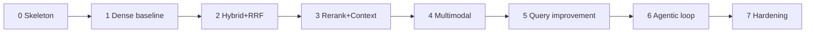

# Implementation Plan (High Level)

This document turns the concepts in [`ARCHITECTURE.md`](./ARCHITECTURE.md) into a build plan.
It is deliberately high-level: it tells you *what to build, in what order, and where it lives* —
not line-by-line code. Each phase ends with something runnable.

---

## 1. Guiding implementation principles

1. **Walking skeleton first.** Get an end-to-end query→answer path working with the *simplest*
   adapter for every port, then improve adapters in place. Never build a layer in isolation.
2. **Code against ports only.** No file in the Application/Domain layers may import a vendor SDK.
   Enforce with an import-linter / dependency-check rule in CI.
3. **One composition root.** All concrete wiring lives in a single `bootstrap`/`container`
   module driven by config. Adding a vendor = new adapter + one config branch.
4. **Fakes from day one.** Every port ships with an in-memory fake so the agent runs in tests
   with zero network.

---

## 2. Suggested stack (all swappable)

| Concern | Pragmatic default | Why | Swap to |
|---------|-------------------|-----|---------|
| Language | Python (typed) or TypeScript | richest RAG/LLM ecosystem | either; ports are language-neutral |
| API | FastAPI / ASGI (or Fastify) | async fan-out, streaming | gRPC for service mesh |
| DI | constructor injection + a small container | explicit, testable | a DI framework if preferred |
| Vector DB | Qdrant | filters + payload + hybrid, easy local | pgvector, Milvus, Weaviate, FAISS |
| BM25 | OpenSearch | mature, filters, scale | Tantivy, `rank_bm25` for a prototype |
| Text embeddings | BGE / E5 (self-host) or OpenAI | quality vs. cost | Jina, GTE |
| Multimodal | Jina-CLIP / SigLIP | shared text-image space | OpenCLIP, Cohere multimodal |
| Reranker | Cohere Rerank or bge-reranker (local) | big quality jump | ColBERT, LLM listwise |
| LLM | hosted (answer) + small model (utility) | role routing | vLLM/Ollama local |
| Cache | Redis | embeddings/results/LLM calls | in-proc LRU for prototype |
| Telemetry | OpenTelemetry + a trace store | spans = eval data | vendor APM, LangSmith-style tracer |
| Eval | RAGAS-style metrics + a golden set | attributable quality | custom harness |

> Frameworks (LangGraph, LlamaIndex, Haystack) can implement the agent loop, but keep them
> **behind the Application layer** as an orchestration adapter — do not let framework types
> leak into your domain, or you lose the swap-ability that motivated this design.

---

## 3. Module / package layout

```
src/
  domain/                 # pure entities & value objects (ARCHITECTURE §2). No imports out.
    query.py  result.py  context.py  answer.py  verdicts.py  trace.py
    # shared types (Chunk, Metadata, Provenance, Anchor, TextSpan, Modality, Embedding) are
    # IMPORTED from the shared domain package (../shared/DATA_MODEL.md), not redefined here

  application/
    ports/                # the interfaces (ARCHITECTURE §3)
      llm.py  embedder.py  search.py  retriever_tool.py  reranker.py
      fusion.py  context_builder.py  generator.py  critique.py  cache.py  telemetry.py
      guardrail.py  feedback.py     # output-safety gate; user-feedback sink (ARCHITECTURE §3.11)
    usecases/
      answer_question.py  # the orchestrator / agent runtime (ARCHITECTURE §4)
    policies/
      router.py  iteration.py  budget.py  llm_router.py
    transformers/         # QueryTransformerPort implementations
      contextualize.py  expand.py  hyde.py  decompose.py  step_back.py
      multi_query.py  self_query.py  modality_router.py
    prompts/              # versioned, reviewed prompt artifacts (rewrite/HyDE/decompose/grade/
                          # critique/generate) — application-layer, pinned in the eval RunManifest
    services/             # fusion impls, context-build sub-strategies (MMR, compress, order)

  adapters/               # implement ports; only layer that imports SDKs
    llm/{openai,anthropic,vllm}.py
    embedder/{bge,openai,jina_clip}.py
    vectorstore/{qdrant,pgvector,faiss}.py
    keyword/{opensearch,rank_bm25}.py
    reranker/{cohere,bge_reranker}.py
    cache/{redis,inmemory}.py
    telemetry/otel.py
    retrievers/{dense,bm25,multimodal}.py   # RetrieverTool implementations (compose lower ports)

  infrastructure/
    container.py          # composition root: config -> concrete adapters -> usecases
    config.py             # schema + loader (ARCHITECTURE §8 / README §8)
    api.py                # HTTP/streaming entrypoint
    ingestion/            # parse -> chunk -> embed -> index (offline; shares embedder ports)

tests/
  fakes/                  # in-memory adapter for every port
  unit/  integration/  eval/  fixtures/golden_set/
```

The dependency rule is visible in the tree: `domain` imports nothing; `application` imports
`domain`; `adapters` and `infrastructure` import `application` ports.

---

## 4. Phased build plan

Each phase is shippable and testable on its own.

### Phase 0 — Skeleton & contracts
- Define all **domain entities** and **port interfaces** (signatures only).
- Write **fake adapters** for every port (in-memory store, echo LLM, identity reranker).
- Stand up the **composition root** + config loader + a single `/answer` endpoint.
- **Exit:** a query returns a (dummy) answer end-to-end, fully under test, no network.

### Phase 1 — Single-retriever baseline
- Implement `DenseTextRetriever` (`TextEmbedderPort` + `VectorSearchPort`) with one real vector
  DB, plus a minimal ingestion script to populate it.
- Real `AnswerGeneratorPort` over a real `LLMPort` with citation-enforcing structured output.
- **Exit:** real dense RAG with citations. This is your quality floor and regression baseline.

### Phase 2 — Hybrid retrieval + fusion
- Add `Bm25Retriever` (`KeywordSearchPort`) and the `ToolRegistry`.
- Implement `FusionPort` with **RRF**; run dense + BM25 in parallel and fuse.
- **Exit:** hybrid retrieval measurably beats Phase 1 on the golden set (recall@k, nDCG).

### Phase 3 — Reranking
- Add `RerankerPort` (cross-encoder) applied to top-K fused candidates.
- Implement `ContextBuilderPort`: dedupe → MMR → order → number → fit budget.
- **Exit:** context precision and answer faithfulness improve; latency budget still met.

### Phase 4 — Multimodal
- Add `MultimodalEmbedderPort` + `MultimodalRetriever` against the image collection.
- Extend ingestion to embed images (+ captions/OCR for citation).
- Add `ModalityRouter` transformer to bias visual queries.
- **Exit:** image-answerable queries succeed and cite the right image.

### Phase 5 — Query improvement
- Implement the transformer chain: `Contextualizer`, `Expander`, `HyDE`, `Decomposer`,
  `SelfQueryFilterExtractor`, `MultiQuery`. Wire role-routed `LLMPort` (utility vs. answer).
- **Exit:** ambiguous / multi-hop / lexical queries each improve on the golden set.

### Phase 6 — Agentic control & correction
- Implement `Router`, `IterationPolicy`, `BudgetPolicy`, and `CritiquePort`
  (`grade_retrieval`, `critique_answer`). Assemble the bounded state machine.
- **Exit:** weak-retrieval queries trigger bounded refinement; budgets cap cost/latency; the
  fast path serves easy queries cheaply.

### Phase 7 — Hardening
- Caching across embeddings/retrieval/rerank/LLM; concurrency with deadlines; graceful
  degradation; full `QueryTrace` telemetry; ACL filters; PII redaction sub-step.
- **Exit:** production-ready: observable, bounded, resilient, secure.



---

## 5. Config schema (sketch)

Single declarative file selects adapters and tunes policy (mirrors README §8). The container
reads it and is the only code that branches on `provider`.

```yaml
llm:
  answer:  { provider: openai, model: gpt-4.1 }
  utility: { provider: openai, model: gpt-4.1-mini }   # rewriting/grading/planning
embedder:   { provider: bge, model: bge-large-en, dim: 1024 }
multimodal: { provider: jina, model: jina-clip-v2 }
vector_db:  { provider: qdrant, url: ..., text_collection: docs, image_collection: imgs }
keyword:    { provider: opensearch, url: ..., index: docs }
reranker:   { provider: cohere, model: rerank-3, top_n: 8 }
fusion:     { strategy: rrf, k: 60 }
context:    { max_tokens: 6000, mmr_lambda: 0.5, compress: false }
agent:
  mode: adaptive
  retrieval_k: 50
  max_iterations: 3
  budget: { max_tokens: 60000, max_tool_calls: 12, max_latency_ms: 15000 }
cache:     { provider: redis, ttl_s: 86400 }
telemetry: { provider: otel, endpoint: ... }
```

**Invariant to enforce in the container:** the embedder config used at query time must equal the
one recorded with the index at ingestion time — fail fast on mismatch.

---

## 6. Testing & evaluation strategy

| Level | What | How |
|-------|------|-----|
| Unit | entities, policies, fusion math, context builder | pure functions, no I/O |
| Contract | each adapter satisfies its port | one shared test suite run against every adapter (incl. the fake) |
| Integration | orchestrator with **fakes** | deterministic full-loop runs, asserts control flow & budgets |
| Retrieval eval | recall@k, nDCG, MRR, context precision/recall | golden query→relevant-chunk set |
| Generation eval | faithfulness, answer relevance, citation correctness | RAGAS-style, LLM-judge + spot human review |
| System | latency, token cost, tool/iteration counts | from `QueryTrace`; track per-phase regressions |

Build the **golden set early** (Phase 1) and re-run it at every phase gate — it is how you prove
each phase actually helped rather than just adding moving parts. The telemetry trace is the
data source for all system-level metrics, so wire `TelemetryPort` minimally even in Phase 0.

---

## 7. Deployment notes (high level)

- **Query service** (stateless, scales horizontally): API + agent + adapter clients.
- **Stateful backends**: vector DB, BM25 store, Redis — run/managed separately.
- **Ingestion** runs as an offline/batch job sharing the embedder ports and config with the
  query service (guarantees index/query model parity).
- **Model serving**: hosted APIs need only keys; self-hosted (vLLM, local rerankers, CLIP) run
  as separate GPU services behind the same ports.
- **Scaling levers**: cache hit-rate first, then rerank `top_n`, then `retrieval_k`, then the
  agent's `max_iterations`. The budget policy is the runtime throttle.

---

## 8. First week, concretely

1. Write the domain entities and all port interfaces (Phase 0 contracts).
2. Implement in-memory fakes for every port.
3. Wire the composition root + `/answer` endpoint; prove the loop end-to-end on fakes.
4. Swap in one real vector DB + embedder + LLM (Phase 1) and ingest a small corpus.
5. Stand up the golden set and baseline metrics.

From there, Phases 2→7 are additive: each is "implement one or two adapters/policies, register,
re-run the golden set." The architecture guarantees none of these later phases force a rewrite
of the agent core.
