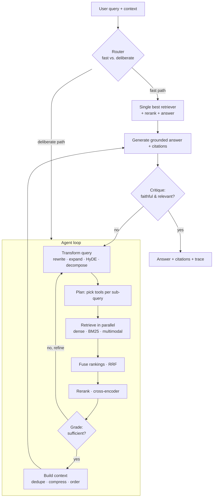

# Agentic RAG over Heterogeneous Retrievers

> A query-adaptive, agentic Retrieval-Augmented Generation system that orchestrates
> **dense text embeddings**, a **BM25 lexical index**, and **multimodal image embeddings**
> behind a single, uniform tool abstraction — built on Clean Architecture so that every
> moving part (LLM, vector DB, reranker, fusion strategy, embedder) is an injectable port.

This README is the conceptual entry point. It explains *what* the system is, *why* it is
shaped this way, and *how the pieces relate*. Deep structural detail lives in
[`ARCHITECTURE.md`](./ARCHITECTURE.md); a concrete build plan lives in
[`IMPLEMENTATION.md`](./IMPLEMENTATION.md).

---

## 1. The problem this solves

Classic "embed → top-k → stuff into prompt" RAG breaks down in real corpora because:

- **A single retriever is never enough.** Dense embeddings miss exact identifiers, rare
  entities, codes, and numbers. BM25 misses paraphrase and conceptual matches. Neither
  understands images, charts, or screenshots.
- **The user's query is rarely retrieval-ready.** It may be conversational, underspecified,
  multi-hop, or full of coreference ("does *it* support *that*?").
- **One static pipeline can't serve every query.** A keyword lookup ("error code E-4012")
  and a synthesis question ("compare the two architectures the report proposes") deserve
  different strategies.
- **Retrieval can simply fail**, and a naive pipeline answers anyway — confidently and wrong.

This system treats retrieval as an **agentic, adaptive process**: a controller reasons about
the query, *improves* it, *chooses and combines* retrieval tools, *judges* whether what came
back is good enough, and only then answers — with citations and a groundedness check.

### Assumptions (stated up front)

- Three retrieval backends already exist and are populated: (a) a **text-embedding vector
  store**, (b) a **BM25 keyword index**, (c) a **multimodal (image) embedding store** with a
  shared text↔image space (CLIP/SigLIP-style).
- Documents have already been ingested and chunked. Ingestion is described conceptually
  (Section 6) but the live system here is the **query/answer path**.
- We want a design that is *conceptual first* but maps 1:1 onto code modules without rework.

---

## 2. Design principles

1. **Ports over implementations.** The core depends only on interfaces. OpenAI vs. a local
   model, Qdrant vs. pgvector, Cohere vs. a local cross-encoder — all are swappable adapters
   chosen at the composition root.
2. **Every retriever is a tool.** Dense, BM25, and multimodal search each implement the same
   `RetrieverTool` port. Adding a fourth modality (e.g., a knowledge-graph or SQL retriever)
   is "register one more tool," not a rewrite.
3. **Adaptive, not monolithic.** The system supports a spectrum from a cheap deterministic
   *fast path* to a fully agentic *deliberate path*; a router decides which a given query gets.
4. **Fail loudly, recover gracefully.** Poor retrieval is detected and corrected (re-query,
   broaden, escalate) rather than silently passed to the generator.
5. **Grounded by construction.** Generation must cite retrieved evidence; a faithfulness gate
   checks the answer against its sources before returning.
6. **Everything is observable.** Each query produces a structured trace (decisions, tool calls,
   scores, latencies, token costs) for debugging and evaluation.

---

## 3. The mental model in one picture



The same picture, in words: **understand → improve → plan → retrieve broadly → fuse → rerank →
judge → (loop if weak) → assemble → generate → verify → return.**

---

## 4. The three retrieval tools

| Tool | Strength | Weakness | Best for |
|------|----------|----------|----------|
| **Dense text** (bi-encoder) | Semantic / paraphrase matching | Exact terms, rare entities, numbers | "Explain the trade-offs of X" |
| **BM25** (lexical) | Exact terms, IDs, codes, jargon | Vocabulary mismatch, no semantics | "Find clause 7.3.1", "error E-4012" |
| **Multimodal** (CLIP-style) | Text→image, image→image | Coarse, weak on fine text-in-image | "Show the diagram of the pipeline" |

The agent rarely picks one. The default is **hybrid**: run several in parallel and fuse. The
*interesting* agentic decisions are (a) *which* tools to weight up for a given query, (b) *how*
to phrase the query differently for each (BM25 likes expanded keywords; dense likes a
hypothetical answer; multimodal likes a visual description), and (c) *whether* to add a tool
on a second pass when the first results look thin.

---

## 5. Query-improvement techniques (the "make the query better" layer)

These are composable transformers; the router/planner selects which apply.

- **Rewrite / contextualize** — resolve coreference and make the query standalone (critical in
  multi-turn chat).
- **Expansion** — add synonyms and related terms; disproportionately helps BM25.
- **HyDE** (Hypothetical Document Embeddings) — generate a plausible answer, embed *that*, and
  search dense with it; closes the question↔passage style gap.
- **Decomposition** — split a multi-hop question into sub-queries answered independently, then
  recombined.
- **Step-back** — generate a more general question to pull in background/context.
- **Multi-query / RAG-Fusion** — generate N paraphrases, retrieve for each, fuse with RRF.
- **Self-query / metadata extraction** — pull filters out of natural language ("papers after
  2020" → `date > 2020-01-01`) and push them into the retrievers as hard constraints.
- **Modality routing** — detect when a query is really visual and bias toward the multimodal tool.

See [`ARCHITECTURE.md` §Query Transformation](./ARCHITECTURE.md) for how these are sequenced
and which run on the fast vs. deliberate path.

---

## 6. Ingestion (context only)

Although the live system is the query path, it assumes an ingestion pipeline produced the
indices. That pipeline is documented in full in the [ingestion docs](../ingestion/README.md);
conceptually: **parse → chunk (with overlap and structure awareness) → enrich
(titles, summaries, metadata) → embed (text + image) → index (vector store + BM25 + image
store)**. Keeping ingestion behind the same embedder/store ports — and on the same shared domain
contract, [`../shared/DATA_MODEL.md`](../shared/DATA_MODEL.md) — means the *exact* models and types
used to index are guaranteed identical to those used at query time (a common source of silent
quality loss).

---

## 7. Clean Architecture at a glance

```
        ┌───────────────────────────────────────────────┐
        │  Infrastructure / Composition Root             │  wiring, config, API, DI
        │  ┌─────────────────────────────────────────┐  │
        │  │  Adapters (implement ports)              │  │  OpenAI, Qdrant, Cohere,
        │  │  ┌───────────────────────────────────┐  │  │  OpenSearch(BM25), CLIP...
        │  │  │  Application (use cases + ports)  │  │  │  AnswerQuestionUseCase,
        │  │  │  ┌─────────────────────────────┐  │  │  │  LLMPort, RerankerPort...
        │  │  │  │  Domain (entities)          │  │  │  │  Query, Chunk, Answer,
        │  │  │  │  pure, no dependencies      │  │  │  │  Citation, ScoredChunk...
        │  │  │  └─────────────────────────────┘  │  │  │
        │  │  └───────────────────────────────────┘  │  │
        │  └─────────────────────────────────────────┘  │
        └───────────────────────────────────────────────┘
        Dependencies point INWARD only. The agent imports ports, never adapters.
```

The agent runtime lives in **Application** and speaks only to ports: `LLMPort`,
`RetrieverTool`, `RerankerPort`, `FusionPort`, `QueryTransformerPort`, `ContextBuilderPort`,
`CritiquePort`. The **Composition Root** reads config and injects concrete adapters. Swapping
your vector DB is a one-line change there; the agent code never notices.

Full port catalog, signatures, and per-port alternatives: [`ARCHITECTURE.md`](./ARCHITECTURE.md).
The domain types this system shares with ingestion (`Chunk`, `Metadata`, `Provenance`, the embedder
ports) are defined canonically in [`../shared/DATA_MODEL.md`](../shared/DATA_MODEL.md) — imported by
both systems, re-declared by neither.

---

## 8. Configuration philosophy

A single declarative config selects adapters and tunes policy — no code change to retarget:

```yaml
llm:        { provider: openai,  model: gpt-4.1 }           # or anthropic | local-vllm
embedder:   { provider: bge,     model: bge-large-en }       # text
multimodal: { provider: jina,    model: jina-clip-v2 }
vector_db:  { provider: qdrant,  url: ... }                  # or pgvector | weaviate | milvus
keyword:    { provider: opensearch, index: docs }            # BM25
reranker:   { provider: cohere,  model: rerank-3 }           # or local bge-reranker
fusion:     { strategy: rrf, k: 60 }                         # or weighted
agent:
  mode: adaptive            # fast | deliberate | adaptive
  max_iterations: 3
  budget: { max_tokens: 60000, max_tool_calls: 12, max_latency_ms: 15000 }
```

---

## 9. What "good" looks like (evaluation)

Quality is split so failures are attributable:

- **Retrieval:** recall@k, nDCG, MRR, context precision/recall.
- **Generation:** faithfulness/groundedness, answer relevance, citation correctness.
- **System:** end-to-end latency, token cost, tool-call count, iteration count.

The agent emits the trace these metrics need on every query. See
[`IMPLEMENTATION.md` §Testing & Evaluation](./IMPLEMENTATION.md).

---

## 10. Extending the system

- **New retrieval modality** → implement `RetrieverTool`, register it. (graph, SQL, web.)
- **New LLM / vector DB / reranker** → write an adapter, point config at it.
- **New query technique** → implement `QueryTransformerPort`, add to the transform chain.
- **New stopping/iteration rule** → implement an `IterationPolicy`.

---

## 11. Document map

| Document | Audience | Depth |
|----------|----------|-------|
| **README.md** (this) | Anyone landing on the repo | Conceptual overview |
| [**ARCHITECTURE.md**](./ARCHITECTURE.md) | Engineers building it | Detailed structure, ports, control flow, alternatives |
| [**IMPLEMENTATION.md**](./IMPLEMENTATION.md) | Implementers planning the build | High-level stack, phases, module layout |

---

## 12. Glossary

- **RRF** — Reciprocal Rank Fusion; combines rankings by rank position, no score normalization.
- **HyDE** — Hypothetical Document Embeddings; search with an embedded fake answer.
- **Cross-encoder** — a reranker that scores (query, passage) jointly; accurate but slower.
- **MMR** — Maximal Marginal Relevance; balances relevance against redundancy.
- **CRAG / Self-RAG** — corrective / self-reflective RAG patterns that grade and retry retrieval.
- **Port / Adapter** — Clean-Architecture interface / its concrete implementation.
- **Composition Root** — the single place where concrete adapters are wired into the core.
